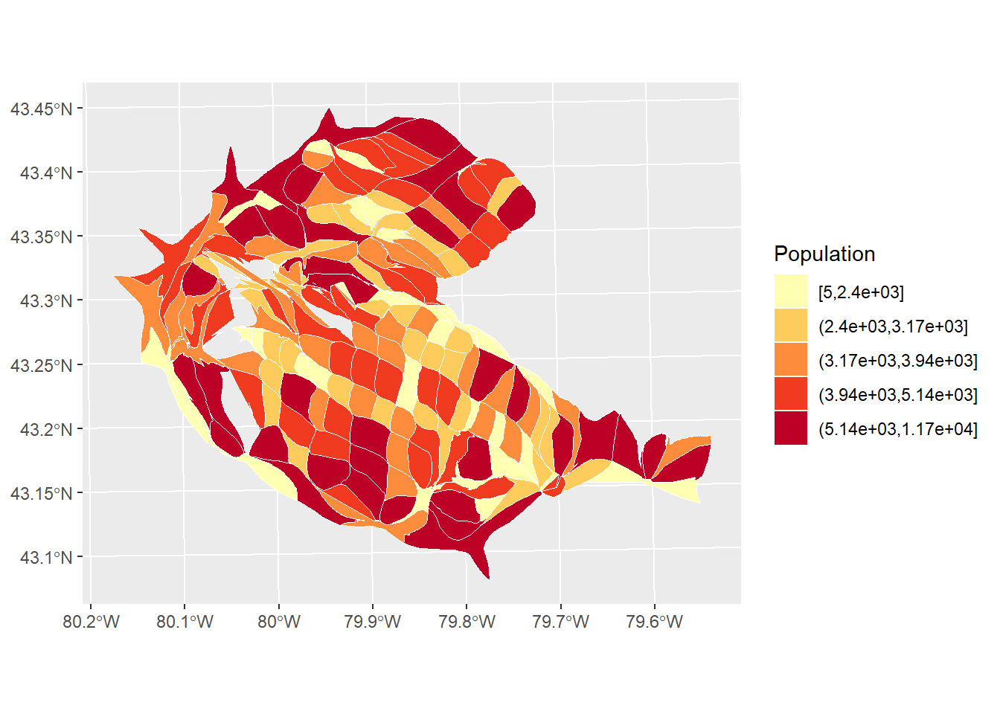

# Area Data I

*NOTE*: You can download the source files for this book from [here](https://github.com/paezha/Spatial-Statistics-Course). The source files are in the format of R Notebooks. Notebooks are pretty neat, because the allow you execute code within the notebook, so that you can work interactively with the notes. 

If you wish to work interactively with this chapter you will need the following:

* An `R` markdown notebook version of this document (the source file).

* A package called `geog4ga3`.

## Learning Objectives

In last few practices/sessions, you learned about spatial point patterns. The next few sessions will concentrate on _area data_.

In this practice, you will learn:

1. A formal definition of area data.
2. Processes and area data.
3. Visualizing area data: Choropleth maps.
4. Visualizing area data: Cartograms.

## Suggested Readings

- Bailey TC and Gatrell AC [-@Bailey1995] Interactive Spatial Data Analysis, Chapter 7. Longman: Essex.
- Bivand RS, Pebesma E, and Gomez-Rubio V [-@Bivand2008] Applied Spatial Data Analysis with R, Chapter 9. Springer: New York.
- Brunsdon C and Comber L [-@Brunsdon2015R] An Introduction to R for Spatial Analysis and Mapping, Chapter 7. Sage: Los Angeles.
- O'Sullivan D and Unwin D [-@Osullivan2010] Geographic Information Analysis, 2nd Edition, Chapter 7. John Wiley & Sons: New Jersey.

## Preliminaries

As usual, it is good practice to clear the working space to make sure that you do not have extraneous items there when you begin your work. The command in R to clear the workspace is `rm` (for "remove"), followed by a list of items to be removed. To clear the workspace from _all_ objects, do the following:

```r
rm(list = ls())
```

Note that `ls()` lists all objects currently on the worspace.

Load the libraries you will use in this activity:

```r
library(tidyverse)
library(sf)
library(plotly)
library(cartogram)
library(gridExtra)
library(geog4ga3)
```

```
## Warning: replacing previous import 'plotly::filter' by 'stats::filter' when
## loading 'geog4ga3'
```

```
## Warning: replacing previous import 'dplyr::lag' by 'stats::lag' when loading
## 'geog4ga3'
```

Read the data used in this chapter.

```r
data("Hamilton_CT")
```

The data are an object of class `sf` that includes the spatial information for the census tracts in the Hamilton Census Metropolitan Area in Canada and a series of demographic variables from the 2011 Census of Canada.

You can quickly verify the contents of the dataframe by means of `summary`:

```r
summary(Hamilton_CT)
```

```
##        ID               AREA             TRACT             POPULATION   
##  Min.   : 919807   Min.   :  0.3154   Length:188         Min.   :    5  
##  1st Qu.: 927964   1st Qu.:  0.8552   Class :character   1st Qu.: 2639  
##  Median : 948130   Median :  1.4157   Mode  :character   Median : 3595  
##  Mean   : 948710   Mean   :  7.4578                      Mean   : 3835  
##  3rd Qu.: 959722   3rd Qu.:  2.7775                      3rd Qu.: 4692  
##  Max.   :1115750   Max.   :138.4466                      Max.   :11675  
##   POP_DENSITY         AGE_LESS_20      AGE_20_TO_24    AGE_25_TO_29  
##  Min.   :    2.591   Min.   :   0.0   Min.   :  0.0   Min.   :  0.0  
##  1st Qu.: 1438.007   1st Qu.: 528.8   1st Qu.:168.8   1st Qu.:135.0  
##  Median : 2689.737   Median : 750.0   Median :225.0   Median :215.0  
##  Mean   : 2853.078   Mean   : 899.3   Mean   :253.9   Mean   :232.8  
##  3rd Qu.: 3783.889   3rd Qu.:1110.0   3rd Qu.:311.2   3rd Qu.:296.2  
##  Max.   :14234.286   Max.   :3285.0   Max.   :835.0   Max.   :915.0  
##   AGE_30_TO_34     AGE_35_TO_39     AGE_40_TO_44     AGE_45_TO_49  
##  Min.   :   0.0   Min.   :   0.0   Min.   :   0.0   Min.   :  0.0  
##  1st Qu.: 135.0   1st Qu.: 145.0   1st Qu.: 170.0   1st Qu.:203.8  
##  Median : 195.0   Median : 200.0   Median : 230.0   Median :282.5  
##  Mean   : 228.2   Mean   : 239.6   Mean   : 268.7   Mean   :310.6  
##  3rd Qu.: 281.2   3rd Qu.: 280.0   3rd Qu.: 325.0   3rd Qu.:385.0  
##  Max.   :1320.0   Max.   :1200.0   Max.   :1105.0   Max.   :880.0  
##   AGE_50_TO_54    AGE_55_TO_59    AGE_60_TO_64  AGE_65_TO_69    AGE_70_TO_74  
##  Min.   :  0.0   Min.   :  0.0   Min.   :  0   Min.   :  0.0   Min.   :  0.0  
##  1st Qu.:203.8   1st Qu.:175.0   1st Qu.:140   1st Qu.:115.0   1st Qu.: 90.0  
##  Median :280.0   Median :240.0   Median :220   Median :157.5   Median :130.0  
##  Mean   :300.3   Mean   :257.7   Mean   :229   Mean   :174.2   Mean   :139.7  
##  3rd Qu.:375.0   3rd Qu.:325.0   3rd Qu.:295   3rd Qu.:221.2   3rd Qu.:180.0  
##  Max.   :740.0   Max.   :625.0   Max.   :540   Max.   :625.0   Max.   :540.0  
##   AGE_75_TO_79     AGE_80_TO_84     AGE_MORE_85              geometry  
##  Min.   :  0.00   Min.   :  0.00   Min.   :  0.00   POLYGON      :188  
##  1st Qu.: 68.75   1st Qu.: 50.00   1st Qu.: 35.00   epsg:26917   :  0  
##  Median :100.00   Median : 77.50   Median : 70.00   +proj=utm ...:  0  
##  Mean   :118.32   Mean   : 95.05   Mean   : 87.71                      
##  3rd Qu.:160.00   3rd Qu.:120.00   3rd Qu.:105.00                      
##  Max.   :575.00   Max.   :420.00   Max.   :400.00
```

## Area Data

Every phenomena can be measured at a location (ask yourself, what exists outside of space?).

In point pattern analysis, the _unit of support_ is the point, and the source of randomness is the location itself. Many other forms of data are also collected at points. For instance, when the census collects information on population, at its most basic, the information can be georeferenced to an address, that is, a point.

In numerous applications, however, data are not reported at their fundamental unit of support, but rather are aggregated to some other geometry, for instance an area. This is done for several reasons, including the privacy and confidentiality of the data. Instead of reporting individual-level information, the information is reported for zoning systems that often are devised without consideration to any underlying social, natural, or economic processes.

Census data, for example, are reported at different levels of geography. In Canada, the smallest publicly available geography is called a _Dissemination Area_ or [DA](http://www12.statcan.gc.ca/census-recensement/2011/ref/dict/geo021-eng.cfm). A DA in Canada contains a population between 400 and 700 persons. Thus, instead of reporting that one person (or more) are located at a point (i.e., an address), the census reports the population for the DA. Other data are aggregated in similar ways (income, residential status, etc.)

At the highest level of aggregation, national level statistics are reported, such as Gross Domestic Product, or GDP. Economic production is not evenly distributed across space; however, the national GDP does not distinguish regional variations in this process.

Ideally, a data analyst would work with data in its most fundamental support. This is not alway possible, and therefore many techniques have been developed to work with data that have been agregated to zones.

When working with areas, it is less practical to identify the area with the coordinates (as we did with points). After all, areas will be composed of lines and reporting all the relevant coordinates is impractical. Sometimes the geometric centroids of the areas are used instead.

More commonly, areas are assigned an index or unique identifier, so that a region will typically consist of a set of $n$ areas as follows:
$$
R = A_1 \cup A_2 \cup A_3 \cup ...\cup A_n.
$$

The above is read as "the Region R is the union of Areas 1 to n".

Regions can have a set of $k$ attributes or variables associated with them, for instance:
$$
\textbf{X}_i=[x_{i1}, x_{i2}, x_{i3},...,x_{ik}]
$$

These attributes will typically be counts (e.g., number of people in a DA), or some summary measure of the underlying data (e.g., mean commute time).

## Processes and Area Data

Imagine that data on income by household were collected as follows:

```r
# Here, we are creating a dataframe with three columns, coordinates x and y in space to indicate the locations of households, and their income.
df <- data.frame(x = c(0.3, 0.4, 0.5, 0.6, 0.7), y = c(0.1, 0.4, 0.2, 0.5, 0.3), Income = c(30000, 30000, 100000, 100000, 100000))
```

Households are geocoded as points with coordinates `x` and `y`, whereas income is in dollars.

Plot the income as points (hover over the points to see the attributes):

```r
# The `ggplot()` function is used to create a plot. The function `geom_point()` adds points to the plot, using the values of coordinates x and y, and coloring by Income. Higher income households appear to be on the East regions of the area.

p <- ggplot(data = df, aes(x = x, y = y, color = Income)) + 
  geom_point(shape = 17, size = 5) +
  coord_fixed()
ggplotly(p)
```

<!--html_preserve--><div id="htmlwidget-e6f377503444fbc7e83a" style="width:672px;height:480px;" class="plotly html-widget"></div>
<script type="application/json" data-for="htmlwidget-e6f377503444fbc7e83a">{"x":{"data":[{"x":[0.3,0.4,0.5,0.6,0.7],"y":[0.1,0.4,0.2,0.5,0.3],"text":["x: 0.3<br />y: 0.1<br />Income: 3e+04","x: 0.4<br />y: 0.4<br />Income: 3e+04","x: 0.5<br />y: 0.2<br />Income: 1e+05","x: 0.6<br />y: 0.5<br />Income: 1e+05","x: 0.7<br />y: 0.3<br />Income: 1e+05"],"type":"scatter","mode":"markers","marker":{"autocolorscale":false,"color":["rgba(19,43,67,1)","rgba(19,43,67,1)","rgba(86,177,247,1)","rgba(86,177,247,1)","rgba(86,177,247,1)"],"opacity":1,"size":18.8976377952756,"symbol":"triangle-up","line":{"width":1.88976377952756,"color":["rgba(19,43,67,1)","rgba(19,43,67,1)","rgba(86,177,247,1)","rgba(86,177,247,1)","rgba(86,177,247,1)"]}},"hoveron":"points","showlegend":false,"xaxis":"x","yaxis":"y","hoverinfo":"text","frame":null},{"x":[0.3],"y":[0.1],"name":"99_e9765c039626dad7c38c6064d4e6b189","type":"scatter","mode":"markers","opacity":0,"hoverinfo":"skip","showlegend":false,"marker":{"color":[0,1],"colorscale":[[0,"#132B43"],[0.0526315789473684,"#16314B"],[0.105263157894737,"#193754"],[0.157894736842105,"#1D3E5C"],[0.210526315789474,"#204465"],[0.263157894736842,"#234B6E"],[0.31578947368421,"#275277"],[0.368421052631579,"#2A5980"],[0.421052631578947,"#2E608A"],[0.473684210526316,"#316793"],[0.526315789473684,"#356E9D"],[0.578947368421053,"#3875A6"],[0.631578947368421,"#3C7CB0"],[0.684210526315789,"#3F83BA"],[0.736842105263158,"#438BC4"],[0.789473684210526,"#4792CE"],[0.842105263157895,"#4B9AD8"],[0.894736842105263,"#4EA2E2"],[0.947368421052632,"#52A9ED"],[1,"#56B1F7"]],"colorbar":{"bgcolor":"rgba(255,255,255,1)","bordercolor":"transparent","borderwidth":1.88976377952756,"thickness":23.04,"title":"Income","titlefont":{"color":"rgba(0,0,0,1)","family":"","size":14.6118721461187},"tickmode":"array","ticktext":["4e+04","6e+04","8e+04","1e+05"],"tickvals":[0.142857142857143,0.428571428571429,0.714285714285714,1],"tickfont":{"color":"rgba(0,0,0,1)","family":"","size":11.689497716895},"ticklen":2,"len":0.5}},"xaxis":"x","yaxis":"y","frame":null}],"layout":{"margin":{"t":26.2283105022831,"r":7.30593607305936,"b":40.1826484018265,"l":43.1050228310502},"plot_bgcolor":"rgba(235,235,235,1)","paper_bgcolor":"rgba(255,255,255,1)","font":{"color":"rgba(0,0,0,1)","family":"","size":14.6118721461187},"xaxis":{"domain":[0,1],"automargin":true,"type":"linear","autorange":false,"range":[0.28,0.72],"tickmode":"array","ticktext":["0.3","0.4","0.5","0.6","0.7"],"tickvals":[0.3,0.4,0.5,0.6,0.7],"categoryorder":"array","categoryarray":["0.3","0.4","0.5","0.6","0.7"],"nticks":null,"ticks":"outside","tickcolor":"rgba(51,51,51,1)","ticklen":3.65296803652968,"tickwidth":0.66417600664176,"showticklabels":true,"tickfont":{"color":"rgba(77,77,77,1)","family":"","size":11.689497716895},"tickangle":-0,"showline":false,"linecolor":null,"linewidth":0,"showgrid":true,"gridcolor":"rgba(255,255,255,1)","gridwidth":0.66417600664176,"zeroline":false,"anchor":"y","title":{"text":"x","font":{"color":"rgba(0,0,0,1)","family":"","size":14.6118721461187}},"scaleanchor":"y","scaleratio":1,"hoverformat":".2f"},"yaxis":{"domain":[0,1],"automargin":true,"type":"linear","autorange":false,"range":[0.08,0.52],"tickmode":"array","ticktext":["0.1","0.2","0.3","0.4","0.5"],"tickvals":[0.1,0.2,0.3,0.4,0.5],"categoryorder":"array","categoryarray":["0.1","0.2","0.3","0.4","0.5"],"nticks":null,"ticks":"outside","tickcolor":"rgba(51,51,51,1)","ticklen":3.65296803652968,"tickwidth":0.66417600664176,"showticklabels":true,"tickfont":{"color":"rgba(77,77,77,1)","family":"","size":11.689497716895},"tickangle":-0,"showline":false,"linecolor":null,"linewidth":0,"showgrid":true,"gridcolor":"rgba(255,255,255,1)","gridwidth":0.66417600664176,"zeroline":false,"anchor":"x","title":{"text":"y","font":{"color":"rgba(0,0,0,1)","family":"","size":14.6118721461187}},"scaleanchor":"x","scaleratio":1,"hoverformat":".2f"},"shapes":[{"type":"rect","fillcolor":null,"line":{"color":null,"width":0,"linetype":[]},"yref":"paper","xref":"paper","x0":0,"x1":1,"y0":0,"y1":1}],"showlegend":false,"legend":{"bgcolor":"rgba(255,255,255,1)","bordercolor":"transparent","borderwidth":1.88976377952756,"font":{"color":"rgba(0,0,0,1)","family":"","size":11.689497716895}},"hovermode":"closest","barmode":"relative"},"config":{"doubleClick":"reset","showSendToCloud":false},"source":"A","attrs":{"252052a517ab":{"x":{},"y":{},"colour":{},"type":"scatter"}},"cur_data":"252052a517ab","visdat":{"252052a517ab":["function (y) ","x"]},"highlight":{"on":"plotly_click","persistent":false,"dynamic":false,"selectize":false,"opacityDim":0.2,"selected":{"opacity":1},"debounce":0},"shinyEvents":["plotly_hover","plotly_click","plotly_selected","plotly_relayout","plotly_brushed","plotly_brushing","plotly_clickannotation","plotly_doubleclick","plotly_deselect","plotly_afterplot","plotly_sunburstclick"],"base_url":"https://plot.ly"},"evals":[],"jsHooks":[]}</script><!--/html_preserve-->

The underlying process is one of income sorting, with lower incomes to the west, and higher incomes to the east. This could be due to a geographical feature of the landscape (for instance, an escarpment), or the distribution of the housing stock (with a neighborhood that has more expensive houses). These are examples of a variable that responds to a common environmental factor. As an alternative, people may display a preference towards being near others that are similar to them (this is called homophily). When this happens, the variable responds to itself in space.

The quality of similarity or disimilarity between neighboring observations of the same variable in space is called _spatial autocorrelation_. You will learn more about this later on.

Another reason why variables reported for areas could display similarities in space is as an consequence of the zoning system.

Suppose for a moment that the data above can only be reported at the zonal level, perhaps because of privacy and confidentiality concerns. Thanks to the great talent of the designers of the zoning system (or a felicitous coincidence!), the zoning system is such that it is consistent with the underlying process of sorting. The zones, therefore, are as follows:

```r
# Here, we create a new dataframe with the coordinates necessary to define two zones. The zones are rectangles, so we need to define four corners for each. "Zone_ID" only has 2 values because there are only two zones in the analysis. 

zones1 <- data.frame(x1=c(0.2, 0.45), x2=c(0.45, 0.80), y1=c(0.0, 0.0), y2=c(0.6, 0.6), Zone_ID = c('1','2'))
```

If you add these zones to the plot:

```r
# Similar to the plot above, but adding the zones with `geom_rect()` for plotting rectangles.
p <- ggplot() + 
  geom_rect(data = zones1, mapping = aes(xmin = x1, xmax = x2, ymin = y1, ymax = y2, fill = Zone_ID), alpha = 0.3) + 
  geom_point(data = df, aes(x = x, y = y, color = Income), shape = 17, size = 5) +
  coord_fixed()
ggplotly(p)
```

<!--html_preserve--><div id="htmlwidget-56e69141fb4b1b94c4d9" style="width:672px;height:480px;" class="plotly html-widget"></div>
<script type="application/json" data-for="htmlwidget-56e69141fb4b1b94c4d9">{"x":{"data":[{"x":[0.2,0.2,0.45,0.45,0.2],"y":[0,0.6,0.6,0,0],"text":"Zone_ID: 1","type":"scatter","mode":"lines","line":{"width":1.88976377952756,"color":"transparent","dash":"solid"},"fill":"toself","fillcolor":"rgba(248,118,109,0.3)","hoveron":"fills","name":"1","legendgroup":"1","showlegend":true,"xaxis":"x","yaxis":"y","hoverinfo":"text","frame":null},{"x":[0.45,0.45,0.8,0.8,0.45],"y":[0,0.6,0.6,0,0],"text":"Zone_ID: 2","type":"scatter","mode":"lines","line":{"width":1.88976377952756,"color":"transparent","dash":"solid"},"fill":"toself","fillcolor":"rgba(0,191,196,0.3)","hoveron":"fills","name":"2","legendgroup":"2","showlegend":true,"xaxis":"x","yaxis":"y","hoverinfo":"text","frame":null},{"x":[0.3,0.4,0.5,0.6,0.7],"y":[0.1,0.4,0.2,0.5,0.3],"text":["x: 0.3<br />y: 0.1<br />Income: 3e+04","x: 0.4<br />y: 0.4<br />Income: 3e+04","x: 0.5<br />y: 0.2<br />Income: 1e+05","x: 0.6<br />y: 0.5<br />Income: 1e+05","x: 0.7<br />y: 0.3<br />Income: 1e+05"],"type":"scatter","mode":"markers","marker":{"autocolorscale":false,"color":["rgba(19,43,67,1)","rgba(19,43,67,1)","rgba(86,177,247,1)","rgba(86,177,247,1)","rgba(86,177,247,1)"],"opacity":1,"size":18.8976377952756,"symbol":"triangle-up","line":{"width":1.88976377952756,"color":["rgba(19,43,67,1)","rgba(19,43,67,1)","rgba(86,177,247,1)","rgba(86,177,247,1)","rgba(86,177,247,1)"]}},"hoveron":"points","showlegend":false,"xaxis":"x","yaxis":"y","hoverinfo":"text","frame":null},{"x":[0.2],"y":[0],"name":"99_e9765c039626dad7c38c6064d4e6b189","type":"scatter","mode":"markers","opacity":0,"hoverinfo":"skip","showlegend":false,"marker":{"color":[0,1],"colorscale":[[0,"#132B43"],[0.0526315789473684,"#16314B"],[0.105263157894737,"#193754"],[0.157894736842105,"#1D3E5C"],[0.210526315789474,"#204465"],[0.263157894736842,"#234B6E"],[0.31578947368421,"#275277"],[0.368421052631579,"#2A5980"],[0.421052631578947,"#2E608A"],[0.473684210526316,"#316793"],[0.526315789473684,"#356E9D"],[0.578947368421053,"#3875A6"],[0.631578947368421,"#3C7CB0"],[0.684210526315789,"#3F83BA"],[0.736842105263158,"#438BC4"],[0.789473684210526,"#4792CE"],[0.842105263157895,"#4B9AD8"],[0.894736842105263,"#4EA2E2"],[0.947368421052632,"#52A9ED"],[1,"#56B1F7"]],"colorbar":{"bgcolor":"rgba(255,255,255,1)","bordercolor":"transparent","borderwidth":1.88976377952756,"thickness":23.04,"title":"Income","titlefont":{"color":"rgba(0,0,0,1)","family":"","size":14.6118721461187},"tickmode":"array","ticktext":["4e+04","6e+04","8e+04","1e+05"],"tickvals":[0.142857142857143,0.428571428571429,0.714285714285714,1],"tickfont":{"color":"rgba(0,0,0,1)","family":"","size":11.689497716895},"ticklen":2,"len":0.5,"yanchor":"top","y":1}},"xaxis":"x","yaxis":"y","frame":null}],"layout":{"margin":{"t":26.2283105022831,"r":7.30593607305936,"b":40.1826484018265,"l":43.1050228310502},"plot_bgcolor":"rgba(235,235,235,1)","paper_bgcolor":"rgba(255,255,255,1)","font":{"color":"rgba(0,0,0,1)","family":"","size":14.6118721461187},"xaxis":{"domain":[0,1],"automargin":true,"type":"linear","autorange":false,"range":[0.17,0.83],"tickmode":"array","ticktext":["0.2","0.4","0.6","0.8"],"tickvals":[0.2,0.4,0.6,0.8],"categoryorder":"array","categoryarray":["0.2","0.4","0.6","0.8"],"nticks":null,"ticks":"outside","tickcolor":"rgba(51,51,51,1)","ticklen":3.65296803652968,"tickwidth":0.66417600664176,"showticklabels":true,"tickfont":{"color":"rgba(77,77,77,1)","family":"","size":11.689497716895},"tickangle":-0,"showline":false,"linecolor":null,"linewidth":0,"showgrid":true,"gridcolor":"rgba(255,255,255,1)","gridwidth":0.66417600664176,"zeroline":false,"anchor":"y","title":{"text":"x","font":{"color":"rgba(0,0,0,1)","family":"","size":14.6118721461187}},"scaleanchor":"y","scaleratio":1,"hoverformat":".2f"},"yaxis":{"domain":[0,1],"automargin":true,"type":"linear","autorange":false,"range":[-0.03,0.63],"tickmode":"array","ticktext":["0.0","0.2","0.4","0.6"],"tickvals":[0,0.2,0.4,0.6],"categoryorder":"array","categoryarray":["0.0","0.2","0.4","0.6"],"nticks":null,"ticks":"outside","tickcolor":"rgba(51,51,51,1)","ticklen":3.65296803652968,"tickwidth":0.66417600664176,"showticklabels":true,"tickfont":{"color":"rgba(77,77,77,1)","family":"","size":11.689497716895},"tickangle":-0,"showline":false,"linecolor":null,"linewidth":0,"showgrid":true,"gridcolor":"rgba(255,255,255,1)","gridwidth":0.66417600664176,"zeroline":false,"anchor":"x","title":{"text":"y","font":{"color":"rgba(0,0,0,1)","family":"","size":14.6118721461187}},"scaleanchor":"x","scaleratio":1,"hoverformat":".2f"},"shapes":[{"type":"rect","fillcolor":null,"line":{"color":null,"width":0,"linetype":[]},"yref":"paper","xref":"paper","x0":0,"x1":1,"y0":0,"y1":1}],"showlegend":true,"legend":{"bgcolor":"rgba(255,255,255,1)","bordercolor":"transparent","borderwidth":1.88976377952756,"font":{"color":"rgba(0,0,0,1)","family":"","size":11.689497716895},"y":0.46751968503937,"yanchor":"top"},"annotations":[{"text":"Zone_ID","x":1.02,"y":0.5,"showarrow":false,"ax":0,"ay":0,"font":{"color":"rgba(0,0,0,1)","family":"","size":14.6118721461187},"xref":"paper","yref":"paper","textangle":-0,"xanchor":"left","yanchor":"bottom","legendTitle":true}],"hovermode":"closest","barmode":"relative"},"config":{"doubleClick":"reset","showSendToCloud":false},"source":"A","attrs":{"2520479f747a":{"xmin":{},"xmax":{},"ymin":{},"ymax":{},"fill":{},"type":"scatter"},"25205a5437b5":{"x":{},"y":{},"colour":{}}},"cur_data":"2520479f747a","visdat":{"2520479f747a":["function (y) ","x"],"25205a5437b5":["function (y) ","x"]},"highlight":{"on":"plotly_click","persistent":false,"dynamic":false,"selectize":false,"opacityDim":0.2,"selected":{"opacity":1},"debounce":0},"shinyEvents":["plotly_hover","plotly_click","plotly_selected","plotly_relayout","plotly_brushed","plotly_brushing","plotly_clickannotation","plotly_doubleclick","plotly_deselect","plotly_afterplot","plotly_sunburstclick"],"base_url":"https://plot.ly"},"evals":[],"jsHooks":[]}</script><!--/html_preserve-->

What is the mean income in zone 1? What is the mean income in zone 2? Not only are the summary measures of income highly representative of the observations they describe, the two zones are also highly distinct.

Imagine now that for whatever reason (lack of prior knowledge of the process, convenience for data collection, etc.) the zones instead are as follows:

```r
# Note how the values have changed for x1 and x2. This reveals that the zones have shifted and are no longer the same as the plot above. 

zones2 <- data.frame(x1=c(0.2, 0.55), x2=c(0.55, 0.80), y1=c(0.0, 0.0), y2=c(0.6, 0.6), Zone_ID = c('1','2'))
```

If you plot these zones:

```r
p <- ggplot() + 
  geom_rect(data = zones2, mapping = aes(xmin = x1, xmax = x2, ymin = y1, ymax = y2, fill = Zone_ID), alpha = 0.3) + 
  geom_point(data = df, aes(x = x, y = y, color = Income), shape = 17, size = 5) +
  coord_fixed()
ggplotly(p)
```

<!--html_preserve--><div id="htmlwidget-856a5ba14b7b67a123b1" style="width:672px;height:480px;" class="plotly html-widget"></div>
<script type="application/json" data-for="htmlwidget-856a5ba14b7b67a123b1">{"x":{"data":[{"x":[0.2,0.2,0.55,0.55,0.2],"y":[0,0.6,0.6,0,0],"text":"Zone_ID: 1","type":"scatter","mode":"lines","line":{"width":1.88976377952756,"color":"transparent","dash":"solid"},"fill":"toself","fillcolor":"rgba(248,118,109,0.3)","hoveron":"fills","name":"1","legendgroup":"1","showlegend":true,"xaxis":"x","yaxis":"y","hoverinfo":"text","frame":null},{"x":[0.55,0.55,0.8,0.8,0.55],"y":[0,0.6,0.6,0,0],"text":"Zone_ID: 2","type":"scatter","mode":"lines","line":{"width":1.88976377952756,"color":"transparent","dash":"solid"},"fill":"toself","fillcolor":"rgba(0,191,196,0.3)","hoveron":"fills","name":"2","legendgroup":"2","showlegend":true,"xaxis":"x","yaxis":"y","hoverinfo":"text","frame":null},{"x":[0.3,0.4,0.5,0.6,0.7],"y":[0.1,0.4,0.2,0.5,0.3],"text":["x: 0.3<br />y: 0.1<br />Income: 3e+04","x: 0.4<br />y: 0.4<br />Income: 3e+04","x: 0.5<br />y: 0.2<br />Income: 1e+05","x: 0.6<br />y: 0.5<br />Income: 1e+05","x: 0.7<br />y: 0.3<br />Income: 1e+05"],"type":"scatter","mode":"markers","marker":{"autocolorscale":false,"color":["rgba(19,43,67,1)","rgba(19,43,67,1)","rgba(86,177,247,1)","rgba(86,177,247,1)","rgba(86,177,247,1)"],"opacity":1,"size":18.8976377952756,"symbol":"triangle-up","line":{"width":1.88976377952756,"color":["rgba(19,43,67,1)","rgba(19,43,67,1)","rgba(86,177,247,1)","rgba(86,177,247,1)","rgba(86,177,247,1)"]}},"hoveron":"points","showlegend":false,"xaxis":"x","yaxis":"y","hoverinfo":"text","frame":null},{"x":[0.2],"y":[0],"name":"99_e9765c039626dad7c38c6064d4e6b189","type":"scatter","mode":"markers","opacity":0,"hoverinfo":"skip","showlegend":false,"marker":{"color":[0,1],"colorscale":[[0,"#132B43"],[0.0526315789473684,"#16314B"],[0.105263157894737,"#193754"],[0.157894736842105,"#1D3E5C"],[0.210526315789474,"#204465"],[0.263157894736842,"#234B6E"],[0.31578947368421,"#275277"],[0.368421052631579,"#2A5980"],[0.421052631578947,"#2E608A"],[0.473684210526316,"#316793"],[0.526315789473684,"#356E9D"],[0.578947368421053,"#3875A6"],[0.631578947368421,"#3C7CB0"],[0.684210526315789,"#3F83BA"],[0.736842105263158,"#438BC4"],[0.789473684210526,"#4792CE"],[0.842105263157895,"#4B9AD8"],[0.894736842105263,"#4EA2E2"],[0.947368421052632,"#52A9ED"],[1,"#56B1F7"]],"colorbar":{"bgcolor":"rgba(255,255,255,1)","bordercolor":"transparent","borderwidth":1.88976377952756,"thickness":23.04,"title":"Income","titlefont":{"color":"rgba(0,0,0,1)","family":"","size":14.6118721461187},"tickmode":"array","ticktext":["4e+04","6e+04","8e+04","1e+05"],"tickvals":[0.142857142857143,0.428571428571429,0.714285714285714,1],"tickfont":{"color":"rgba(0,0,0,1)","family":"","size":11.689497716895},"ticklen":2,"len":0.5,"yanchor":"top","y":1}},"xaxis":"x","yaxis":"y","frame":null}],"layout":{"margin":{"t":26.2283105022831,"r":7.30593607305936,"b":40.1826484018265,"l":43.1050228310502},"plot_bgcolor":"rgba(235,235,235,1)","paper_bgcolor":"rgba(255,255,255,1)","font":{"color":"rgba(0,0,0,1)","family":"","size":14.6118721461187},"xaxis":{"domain":[0,1],"automargin":true,"type":"linear","autorange":false,"range":[0.17,0.83],"tickmode":"array","ticktext":["0.2","0.4","0.6","0.8"],"tickvals":[0.2,0.4,0.6,0.8],"categoryorder":"array","categoryarray":["0.2","0.4","0.6","0.8"],"nticks":null,"ticks":"outside","tickcolor":"rgba(51,51,51,1)","ticklen":3.65296803652968,"tickwidth":0.66417600664176,"showticklabels":true,"tickfont":{"color":"rgba(77,77,77,1)","family":"","size":11.689497716895},"tickangle":-0,"showline":false,"linecolor":null,"linewidth":0,"showgrid":true,"gridcolor":"rgba(255,255,255,1)","gridwidth":0.66417600664176,"zeroline":false,"anchor":"y","title":{"text":"x","font":{"color":"rgba(0,0,0,1)","family":"","size":14.6118721461187}},"scaleanchor":"y","scaleratio":1,"hoverformat":".2f"},"yaxis":{"domain":[0,1],"automargin":true,"type":"linear","autorange":false,"range":[-0.03,0.63],"tickmode":"array","ticktext":["0.0","0.2","0.4","0.6"],"tickvals":[0,0.2,0.4,0.6],"categoryorder":"array","categoryarray":["0.0","0.2","0.4","0.6"],"nticks":null,"ticks":"outside","tickcolor":"rgba(51,51,51,1)","ticklen":3.65296803652968,"tickwidth":0.66417600664176,"showticklabels":true,"tickfont":{"color":"rgba(77,77,77,1)","family":"","size":11.689497716895},"tickangle":-0,"showline":false,"linecolor":null,"linewidth":0,"showgrid":true,"gridcolor":"rgba(255,255,255,1)","gridwidth":0.66417600664176,"zeroline":false,"anchor":"x","title":{"text":"y","font":{"color":"rgba(0,0,0,1)","family":"","size":14.6118721461187}},"scaleanchor":"x","scaleratio":1,"hoverformat":".2f"},"shapes":[{"type":"rect","fillcolor":null,"line":{"color":null,"width":0,"linetype":[]},"yref":"paper","xref":"paper","x0":0,"x1":1,"y0":0,"y1":1}],"showlegend":true,"legend":{"bgcolor":"rgba(255,255,255,1)","bordercolor":"transparent","borderwidth":1.88976377952756,"font":{"color":"rgba(0,0,0,1)","family":"","size":11.689497716895},"y":0.46751968503937,"yanchor":"top"},"annotations":[{"text":"Zone_ID","x":1.02,"y":0.5,"showarrow":false,"ax":0,"ay":0,"font":{"color":"rgba(0,0,0,1)","family":"","size":14.6118721461187},"xref":"paper","yref":"paper","textangle":-0,"xanchor":"left","yanchor":"bottom","legendTitle":true}],"hovermode":"closest","barmode":"relative"},"config":{"doubleClick":"reset","showSendToCloud":false},"source":"A","attrs":{"25201e8e655d":{"xmin":{},"xmax":{},"ymin":{},"ymax":{},"fill":{},"type":"scatter"},"252071ae32f9":{"x":{},"y":{},"colour":{}}},"cur_data":"25201e8e655d","visdat":{"25201e8e655d":["function (y) ","x"],"252071ae32f9":["function (y) ","x"]},"highlight":{"on":"plotly_click","persistent":false,"dynamic":false,"selectize":false,"opacityDim":0.2,"selected":{"opacity":1},"debounce":0},"shinyEvents":["plotly_hover","plotly_click","plotly_selected","plotly_relayout","plotly_brushed","plotly_brushing","plotly_clickannotation","plotly_doubleclick","plotly_deselect","plotly_afterplot","plotly_sunburstclick"],"base_url":"https://plot.ly"},"evals":[],"jsHooks":[]}</script><!--/html_preserve-->

What is now the mean income of zone 1? What is the mean income of zone 2? The observations have not changed, and the generating spatial process remains the same. However, as you can see, the summary measures for the two zones are more similar in this case than they were when the zones more closely captured the underlying process.

## Visualizing Area Data: Choropleth Maps

The very first step when working with spatial area data, perhaps, is to visualize the data.

Commonly, area data are visualized by means of choropleth maps. A choropleth map is a map of the polygons that form the areas in the region, each colored in a way to represent the value of an underlying variable. 

Lets use `ggplot2` to create a choropleth map of population in Hamilton. Notice that the fill color for the polygons is given by cutting the values of `POPULATION` in five equal segments. In other words, the colors represent zones in the bottom 20% of population, zones in the next 20%, and so on, so that the darkest zones are those with populations so large as to be in the top 20% of the population distribution:

```r
# Geographical information can also be plotted using `ggplot2` when it is in the form of simple features or `sf`. Here, we create a plot with function `ggplot()`. We also have available the census tracts for Hamilton in an `sf` dataframe. To plot the distribution of the population in five equal segments (or quintiles), we apply the function `cut_number()` to the variable `POPULATION` from the `Hamilton_CT` census tract dataframe. The aesthetic value for `fill` will color the zones according to the population quintiles.  

ggplot(Hamilton_CT) + 
  geom_sf(aes(fill = cut_number(Hamilton_CT$POPULATION, 5)), color = NA, size = 0.1) +
  scale_fill_brewer(palette = "YlOrRd") +
  coord_sf() +
  labs(fill = "Population")
```


Inspect the map above. Would you say that the distribution of population is random, or not random? If not random, what do you think might be an underlying process for the distribution of population?

Often, creating a choropleth map using the absolute value of a variable can be somewhat misleading. As illustrated by the map of population by census tract in Hamilton, the zones with the largest population are also often large zones. Many process are confounded by the size of the zones: quite simply, in larger areas often there is more of, well, almost anything, compared with smaller areas. For this reason, it is often more informative when creating a choropleth map to use a variable that is a rate. Rates are quantities that are measured with respect to something. For instance population measured by area, or population density, is a rate:

```r
# Note how the `cut_number()` is applied to population density rather than population like the figure above. This gives a more different, and perhaps more informative, of the distribution of population, by measuring population against area.

pop_den.map <- ggplot(Hamilton_CT) + 
  geom_sf(aes(fill = cut_number(Hamilton_CT$POP_DENSITY, 5)), color = "white", size = 0.1) +
  scale_fill_brewer(palette = "YlOrRd") +
  labs(fill = "Pop Density")
pop_den.map
```


It can be seen now that the population density is higher in the more central parts of Hamilton, Burlington, Dundas, etc. Does the map look random? If not, what might be an underlying process that explains the variations in population density in a city like Hamilton?

Other times, it is appropriate to standardize instead of by area, by what might be called the _population at risk_. For instance, imagine that we wanted to explore the distribution of the population of older adults (say, 65 and older). In this case, if instead of normalizing by area, we used the total population instead, would remove the "size" effect, giving a rate:

```r
#The "HAMILTON_CT" dataframe portions ages by category. For this choropleth map, we sum all age categories over 65, and then divide by total population. This measures the population of older adults against total population, to give a proportion (the rate out of a total). 

ggplot(Hamilton_CT) + 
  geom_sf(aes(fill = cut_number((Hamilton_CT$AGE_65_TO_69 +
                                   Hamilton_CT$AGE_70_TO_74 +
                                   Hamilton_CT$AGE_75_TO_79 +
                                   Hamilton_CT$AGE_80_TO_84 +
                                   Hamilton_CT$AGE_MORE_85) / Hamilton_CT$POPULATION, 5)),
          color = NA, 
          size = 0.1) +
  scale_fill_brewer(palette = "YlOrRd") +
  labs(fill = "Prop Age 65+")
```


Do you notice a pattern in the distribution of seniors in the Hamilton, CMA?

There are a few things to keep in mind when creating choropleth maps.

First, what classification scheme to use, with how many classes, and what colors? 

The examples above were all created using a classification scheme based on the _quintiles_ of the distribution. As noted above, these are obtained by dividing the sample into 5 equal parts to give bottom 20%, etc., of observations. The quintiles are a particular form of a statistical summary measure known as _quantiles_. Another example of a quantile is the _median_, which is the value obtained when the sample is divided in two equal sized parts. Other classification schemes may include the mean, standard deviations, and so on. Essentially, a classification scheme defines a way to divide the sample for representation in a choropleth map.

In terms of how many classes to use, often there is little point in using more than six or seven classes, because the human eye cannot distinguish color differences at a much higher resolution.

The colors are a matter of style and preference, but there are coloring schemes that are colorblind safe (see [here](http://colorbrewer2.org/#type=sequential&scheme=BuGn&n=3)). Also, for communication purposes, there are conventions that assign values or meanings to colors. Maps showing results of elections often use the colors of political parties: this is such a widespread convention that it would be thoroughly confusing if the colors were reversed, more so than if just the colors were exchanged for others. Red is often associated with heat, concentration, or sometimes bad, whereas green is associated with good. [Here is an interesting discussion of use of colors in visualization](https://blog.datawrapper.de/colors/).

Secondly, when the zoning system is irregular (as opposed to, say, a raster, which is composed of pixels, regular tiles of consistent size), large zones can easily become dominant. In effect, much detail in the maps above is lost for small zones, whereas large zones, especially if similarly colored, may mislead the eye as to their relative frequency.

Another mapping technique, the cartogram, is meant to reduce the issues with small-large zones.

## Visualizing Area Data: Cartograms

A cartogram is a map where the size of the zones is adjusted so that instead of being the surface area, it is proportional to some other variable of interest.

We will illustrate the idea behind the cartogram here.

In the maps that we created above, the zones are faithful to their geographical properties (subject to distortions due to geographical projection). Unfortunately, this feature of the maps obscured the relevance of some of the smaller zones. A cartogram can be weighted by another variable, say for instance, the population. In this way, the size of the zones will depend on the total population.

Cartograms are implemented in `R` in the package `cartogram`.

```r
# The function `cartogram_cont()` constructs a continuous area cartogram. Here, a cartogram is created for census tracts of the city of Hamilton, but the size of the zones will be weighted by the variable `POPULATION`.
CT_pop_cartogram <- cartogram_cont(Hamilton_CT, weight = "POPULATION")
```

```
## Mean size error for iteration 1: 5.93989832705674
```

```
## Mean size error for iteration 2: 4.5514055520835
```

```
## Mean size error for iteration 3: 7.74856106866916
```

```
## Mean size error for iteration 4: 7.49510294164283
```

```
## Mean size error for iteration 5: 5.12121781701006
```

```
## Mean size error for iteration 6: 3.45188989405368
```

```
## Mean size error for iteration 7: 2.66683855570118
```

```
## Mean size error for iteration 8: 2.23950467189881
```

```
## Mean size error for iteration 9: 1.93816581350794
```

```
## Mean size error for iteration 10: 1.78377894897916
```

```
## Mean size error for iteration 11: 1.62985317085302
```

```
## Mean size error for iteration 12: 1.50983288572639
```

```
## Mean size error for iteration 13: 1.60808238152904
```

```
## Mean size error for iteration 14: 6.67220825006972
```

```
## Mean size error for iteration 15: 8.78821301683394
```

Plotting the cartogram:

```r
#We are using "ggplot" to create a cartogram for populations by census tact in Hamilton. Census tracts with a larger value are distorted to visually represent their population size. The number "5" after calling the population variable states that there will be 5 categories dividing population quantities.
ggplot(CT_pop_cartogram) + 
  geom_sf(aes(fill = cut_number(Hamilton_CT$POPULATION, 5)), color = "white", size = 0.1) +
  scale_fill_brewer(palette = "YlOrRd") +
  labs(fill = "Population")
```



Notice how the size of the zones has been adjusted.

The cartogram can be combined with coloring schemes, as in choropleth maps:

```r
CT_popden_cartogram <- cartogram(Hamilton_CT, weight = "POP_DENSITY")
```

```
## 
## Please use cartogram_cont() instead of cartogram().
```

```
## Mean size error for iteration 1: 29.0384287070147
```

```
## Mean size error for iteration 2: 26.6652279985395
```

```
## Mean size error for iteration 3: 24.8111000080233
```

```
## Mean size error for iteration 4: 23.2716548947531
```

```
## Mean size error for iteration 5: 21.928598879704
```

```
## Mean size error for iteration 6: 20.7113138849207
```

```
## Mean size error for iteration 7: 19.576698518681
```

```
## Mean size error for iteration 8: 18.4983401508171
```

```
## Mean size error for iteration 9: 17.460238779898
```

```
## Mean size error for iteration 10: 16.453534698246
```

```
## Mean size error for iteration 11: 15.4732800316789
```

```
## Mean size error for iteration 12: 14.5184813061204
```

```
## Mean size error for iteration 13: 13.5901475440423
```

```
## Mean size error for iteration 14: 12.6911089325245
```

```
## Mean size error for iteration 15: 11.8246511070686
```

Plot the cartogram:

```r
pop_den.cartogram <- ggplot(CT_popden_cartogram) + 
  geom_sf(aes(fill = cut_number(Hamilton_CT$POP_DENSITY, 5)),color = "white", size = 0.1) +
  scale_fill_brewer(palette = "YlOrRd") +
  labs(fill = "Pop Density")
pop_den.cartogram
```


By combining a cartogram with choropleth mapping, it becomes easier to appreciate the way high population density is concentrated in the central parts of Hamilton, Burlington, etc.

```r
grid.arrange(pop_den.map, pop_den.cartogram, nrow = 2)
```


This concludes this chapter.
