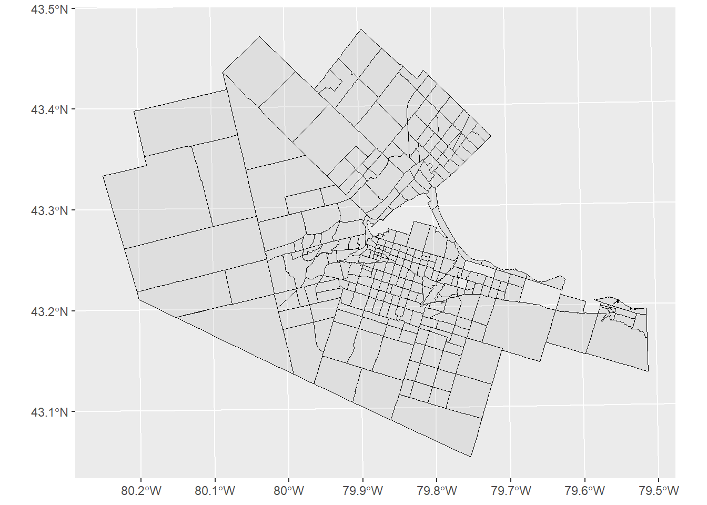

# Activity 1: Statistical Maps I

Remember, you can download the source file for this activity from [here](https://github.com/paezha/Spatial-Statistics-Course).

## Housekeeping Questions

Answer the following questions:

1. What are the office hours of your instructor this term?

2. How are assignments graded?

3. What is the policy for late assignments in this course?

## Learning Objectives

In this activity you will:

1. Discuss statistical maps and what makes them interesting.

## Preliminaries

In the practice that preceded this activity, you used `ggmap` to create a proportional symbol map, a mapping technique used in spatial statistics for visualization of geocoded event information. As well, you implemented a simple technique called kernel analysis to the map to explore the distribution of events in the case of the cholera outbreak of Soho in London in 1854. Geocoded events are often called _point patterns_, so with the cholera data you were working with a point pattern.

In this activity, we will map another type of spatial data, called _areal data_. Areas are often administrative or political jurisdictions.

For this activity you will need the following:

* An R markdown notebook version of this document (the source file).

* A package called `geog4ga3`.

It is good practice to clear the working space to make sure that you do not have extraneous items there when you begin your work. The command in R to clear the workspace is `rm` (for "remove"), followed by a list of items to be removed. To clear the workspace from _all_ objects, do the following:

```r
rm(list = ls())
```

Note that `ls()` lists all objects currently on the worspace.

Load the libraries you will use in this activity:

```r
library(tidyverse)
```

```
## -- Attaching packages ---------------------------------------------------------------- tidyverse 1.2.1 --
```

```
## v ggplot2 3.1.0     v purrr   0.2.5
## v tibble  1.4.2     v dplyr   0.7.8
## v tidyr   0.8.2     v stringr 1.3.1
## v readr   1.2.1     v forcats 0.3.0
```

```
## -- Conflicts ------------------------------------------------------------------- tidyverse_conflicts() --
## x dplyr::filter() masks stats::filter()
## x dplyr::lag()    masks stats::lag()
```

```r
library(geog4ga3)
```

## Creating a simple thematic map

If you successfully loaded package `geog4ga3` a dataset `HamiltonDAs` should be available for analysis:

```r
data(HamiltonDAs)
```

You can examine the contents of the dataset by means of `head` (which will show the top rows):

```r
head(HamiltonDAs)
```

```
##        long      lat order  hole piece  group GTA06      VAR1      VAR2
## 1 -79.86997 43.29277     1 FALSE     1 4050.1  4050 0.3788377 0.3418337
## 2 -79.86904 43.29339     2 FALSE     1 4050.1  4050 0.3788377 0.3418337
## 3 -79.86803 43.29426     3 FALSE     1 4050.1  4050 0.3788377 0.3418337
## 4 -79.86699 43.29532     4 FALSE     1 4050.1  4050 0.3788377 0.3418337
## 5 -79.86666 43.29565     5 FALSE     1 4050.1  4050 0.3788377 0.3418337
## 6 -79.86586 43.29637     6 FALSE     1 4050.1  4050 0.3788377 0.3418337
##        VAR3      VAR4      VAR5
## 1 0.3450731 0.3057122 0.3622016
## 2 0.3450731 0.3057122 0.3622016
## 3 0.3450731 0.3057122 0.3622016
## 4 0.3450731 0.3057122 0.3622016
## 5 0.3450731 0.3057122 0.3622016
## 6 0.3450731 0.3057122 0.3622016
```

Or obtain the summary statistics by means of `summary`:

```r
summary(HamiltonDAs)
```

```
##       long             lat            order          hole        
##  Min.   :-80.25   Min.   :43.05   Min.   :    1   Mode :logical  
##  1st Qu.:-79.90   1st Qu.:43.21   1st Qu.: 2949   FALSE:11784    
##  Median :-79.85   Median :43.25   Median : 5896   TRUE :8        
##  Mean   :-79.83   Mean   :43.26   Mean   : 5896                  
##  3rd Qu.:-79.79   3rd Qu.:43.29   3rd Qu.: 8844                  
##  Max.   :-79.51   Max.   :43.48   Max.   :11792                  
##                                                                  
##  piece         group          GTA06                VAR1       
##  1:11772   4050.1 :  266   Length:11792       Min.   :0.0000  
##  2:   16   4052.1 :  239   Class :character   1st Qu.:0.3244  
##  3:    4   6007.1 :  239   Mode  :character   Median :0.4750  
##            5211.1 :  226                      Mean   :0.4793  
##            5191.1 :  191                      3rd Qu.:0.6594  
##            6018.1 :  148                      Max.   :1.0000  
##            (Other):10483                                      
##       VAR2             VAR3             VAR4             VAR5       
##  Min.   :0.0000   Min.   :0.0000   Min.   :0.0000   Min.   :0.0000  
##  1st Qu.:0.3782   1st Qu.:0.3523   1st Qu.:0.3327   1st Qu.:0.3529  
##  Median :0.4930   Median :0.5116   Median :0.4924   Median :0.4583  
##  Mean   :0.4901   Mean   :0.5162   Mean   :0.4919   Mean   :0.4708  
##  3rd Qu.:0.5812   3rd Qu.:0.6664   3rd Qu.:0.6313   3rd Qu.:0.5594  
##  Max.   :1.0000   Max.   :1.0000   Max.   :1.0000   Max.   :1.0000  
## 
```

The dataframe includes all _Dissemination Areas_ (or DAs for short) for the Hamilton Census Metropolitan Arean in Canada. DAs are a type of geography used by the Census of Canada, in fact the smallest geography that is publicly available.

To create a siple map we can use `ggplot2`, which previously we used to map points. Now, the geom for polygons can be used for areas. To create such a map, we layer a geom object of type polygon on a `ggplot2` object. For instance, to plot the DAs:

```r
#head(HamiltonDAs)
ggplot() + 
  geom_polygon(data = HamiltonDAs, aes(x = long, y = lat, group = group), color = "black", alpha = .3, size = .3)
```


We selected color "black" for the polygons, with a transparency alpha = 0.3 (alpha = 0 is completely transparent, alpha = 1 is completely opaque, try it!), and line size 0.3.

This map only shows the DAs, which is nice. However, as you saw in the summary of the dataframe above, in addition to the geometric information, a set of (generic) variables is also included, called VAR1, VAR2,..., VAR5.

Thematic maps can be created using these variables. The next chunk of code plots the DAs and adds info. The `fill` argument is used to select a variable to color the polygons. The function `cut_number` is used to classify the values of the variable in 5 groups of equal size (notice that the lines of the polygons are still black). The `scale_fill_brewer` function can be used to select different _palettes_ or coloring schemes):

```r
ggplot() +
  geom_polygon(data = HamiltonDAs, aes(x = long, y = lat, group = group, fill = cut_number(VAR5, 5)), color = "black", alpha = 1, size = .3) +
  scale_fill_brewer(palette = "Reds")
```



Now you have seen how to create a thematic map with polygons (areal data), you are ready for the following activity.

## Activity

1. Create thematic maps for variables VAR1 through VAR5 in the dataframe `HamiltonDAs`. Remember that you can introduce new chunks of code.

2. Imagine that these maps were found, and for some reason the variables were not labeled. They may represent income, or population density, or something else. Which of the five maps you just created is more interesting? Rank the five maps from most to least interesting. Explain the reasons for your ranking.
