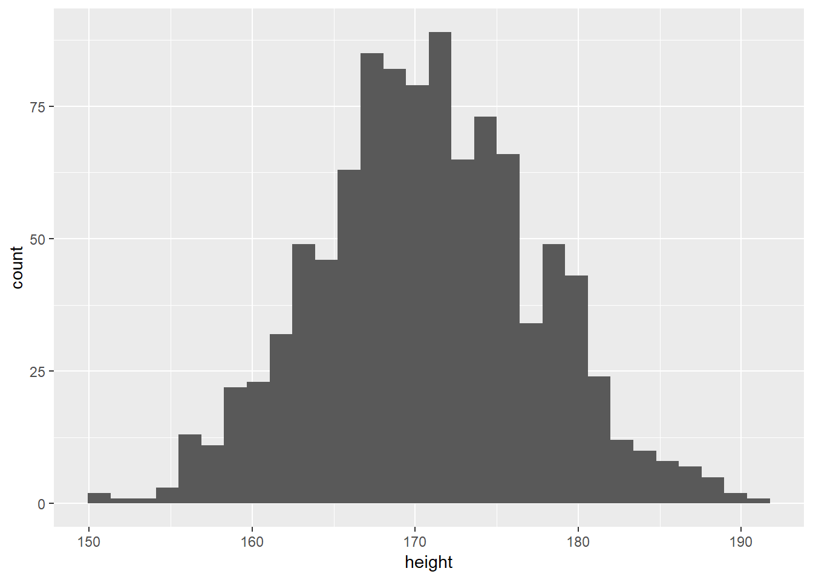
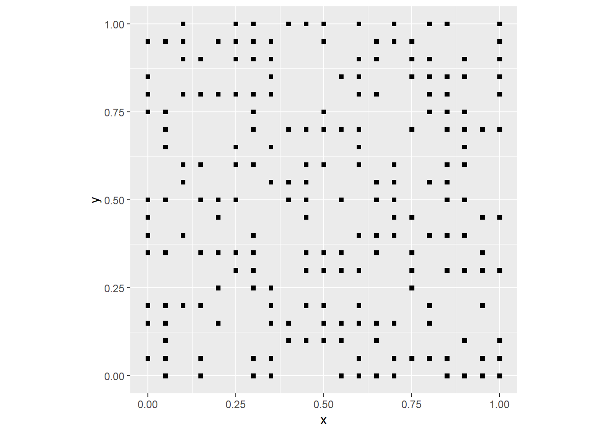
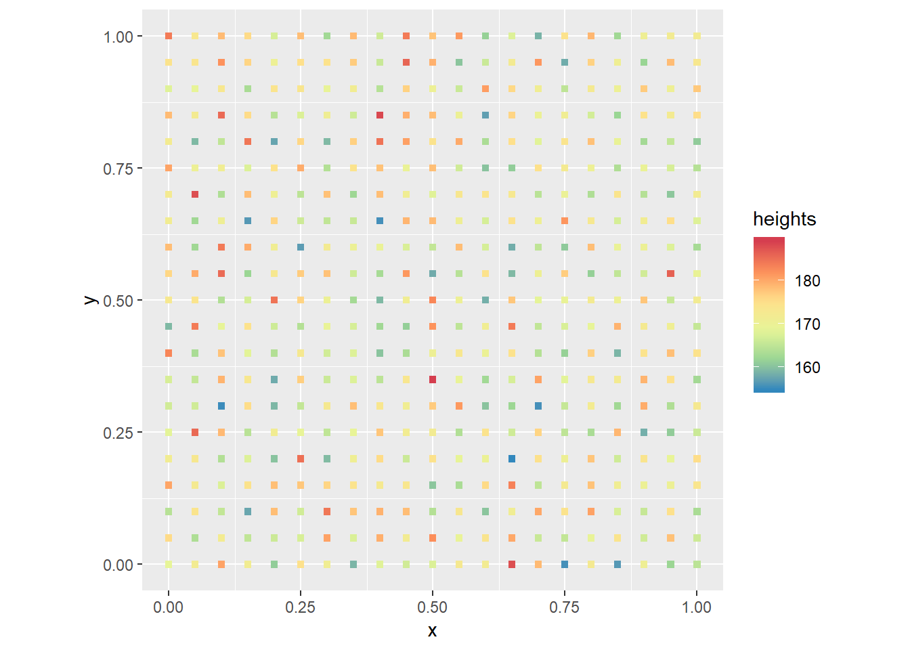
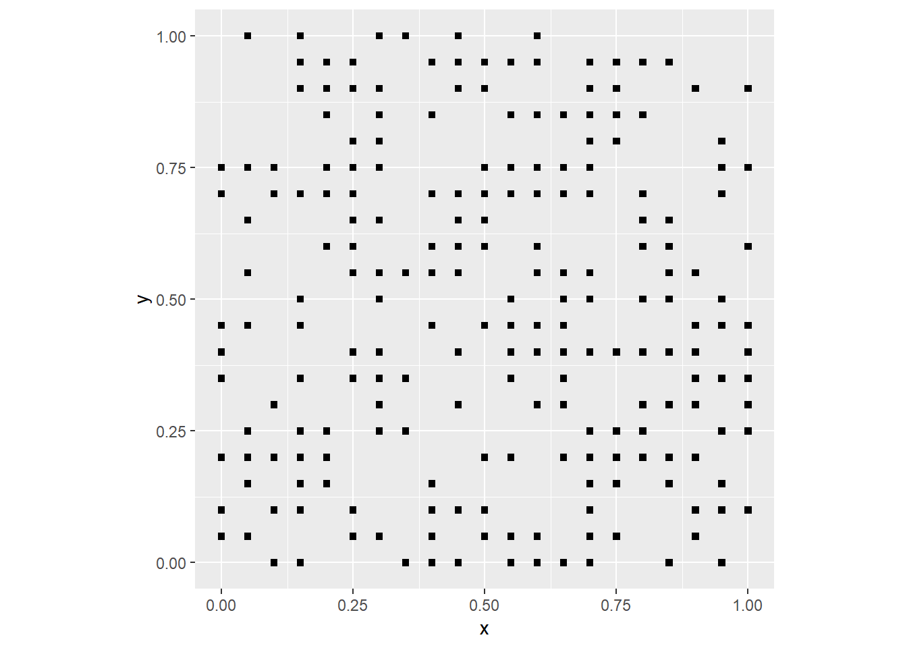
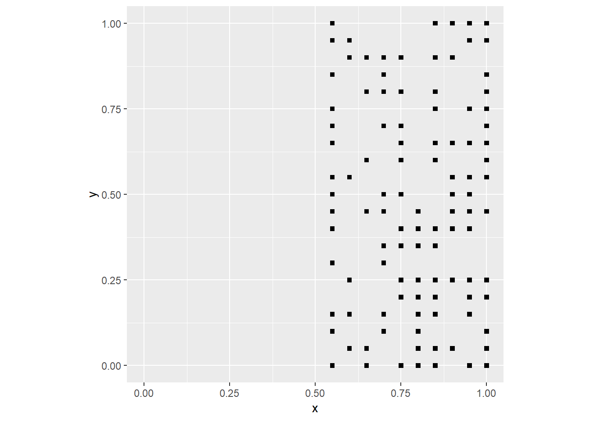
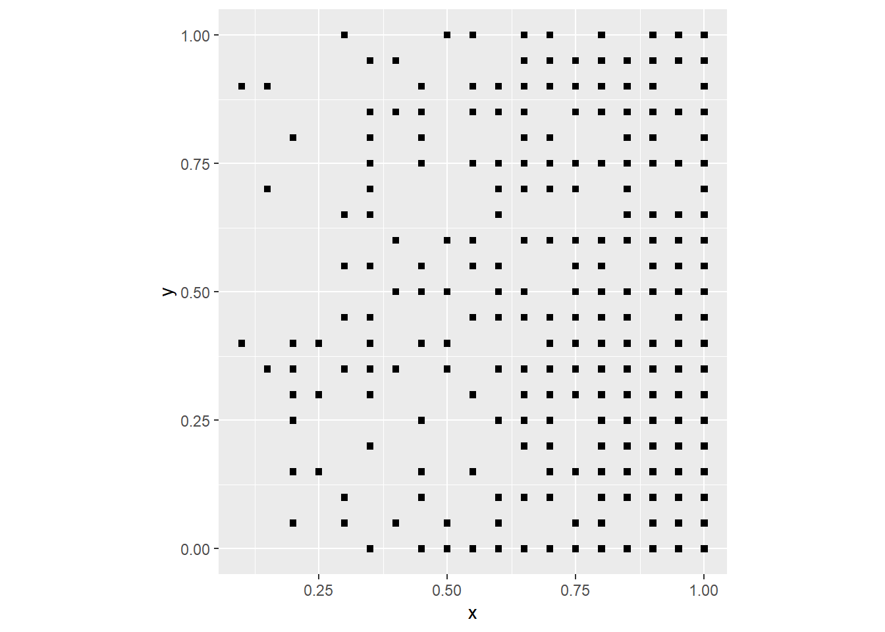
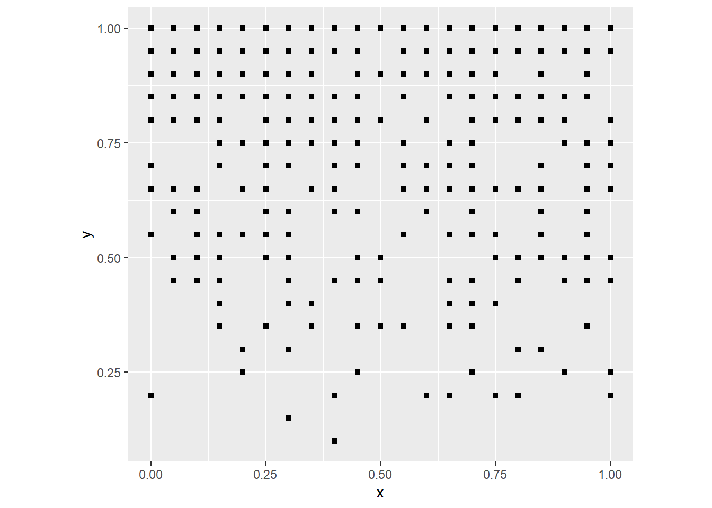
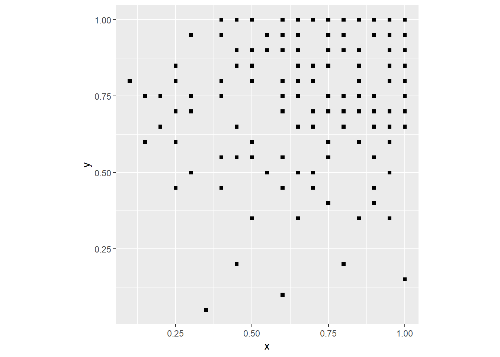
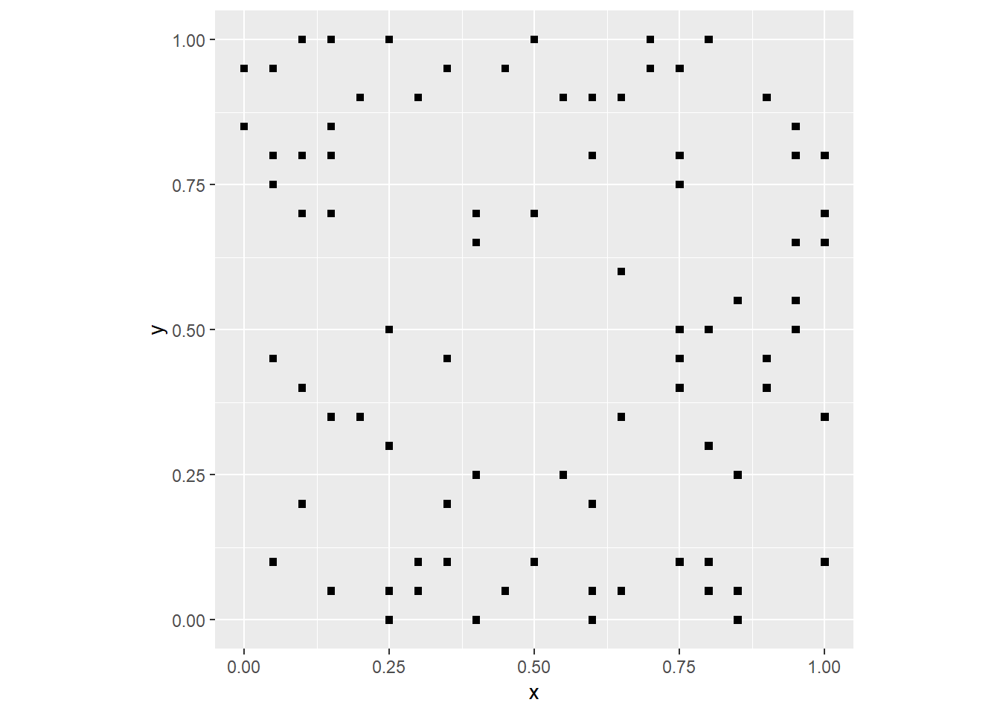
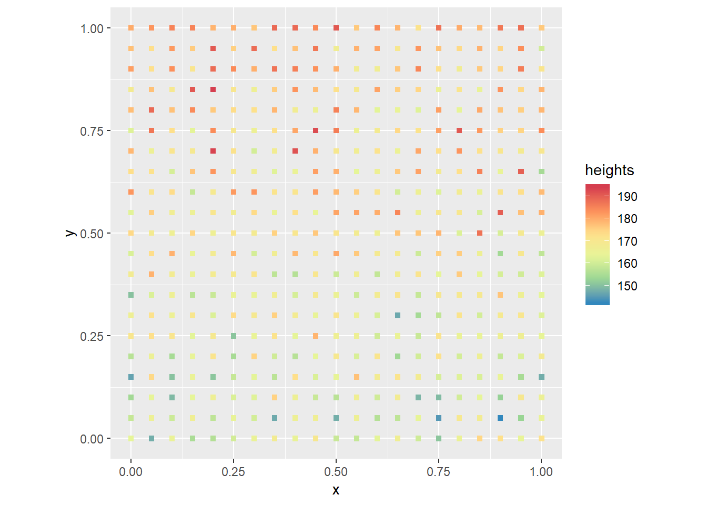

# Maps as Processes: Null Landscapes, Spatial Processes, and Statistical Maps

*NOTE*: You can download the source files for this book from [here](https://github.com/paezha/Spatial-Statistics-Course). The source files are in the format of R Notebooks. Notebooks are pretty neat, because the allow you execute code within the notebook, so that you can work interactively with the notes. 

In last practice your learning objectives were:

1. How to obtain a descriptive summary of a dataframe.
2. Factors and how to use them.
3. How to subset a dataframe.
4. Pipe operators and how to use them.
5. How to improve your maps.

Please review the previous practices if you need a refresher on these concepts.

If you wish to work interactively with this chapter you will need the following:

* An R markdown notebook version of this document (the source file).

## Learning Objectives

In this reading, you will learn:

1. How to generate random numbers with different properties.
2. About Null Landscapes.
3. About stochastic processes.
4. How to create new columns in a dataframe using a formula.
5. How to simulate a spatial process.

## Suggested Reading

O'Sullivan D and Unwin D (2010) Geographic Information Analysis, 2nd Edition, Chapters 4. John Wiley & Sons: New Jersey.

## Preliminaries

As usual, it is good practice to clear the working space to make sure that you do not have extraneous items there when you begin your work. The command in R to clear the workspace is `rm` (for "remove"), followed by a list of items to be removed. To clear the workspace from _all_ objects, do the following:

```r
rm(list = ls())
```

Note that `ls()` lists all objects currently on the worspace.

Load the libraries you will use in this activity:

```r
library(tidyverse)
```

```
## -- Attaching packages ---------------------------------------------------------------- tidyverse 1.2.1 --
```

```
## v ggplot2 3.1.0     v purrr   0.2.5
## v tibble  1.4.2     v dplyr   0.7.8
## v tidyr   0.8.2     v stringr 1.3.1
## v readr   1.2.1     v forcats 0.3.0
```

```
## -- Conflicts ------------------------------------------------------------------- tidyverse_conflicts() --
## x dplyr::filter() masks stats::filter()
## x dplyr::lag()    masks stats::lag()
```

## Random Numbers

Colloquially, we understand _random_ as something that happens in an unpredictable way. The same word in statistics has a precise meaning, as the outcome of a process that cannot be predicted with certainty.

The question whether random processes exist is philosophically interesting. In the early stages of the invention of science, there was much optimism that humans could one day understand every aspect of the universe. This notion is well illustrated by Laplace's Demon, a hypothetical entity that could predict the state of the universe in the future based on an all-encompassing knowledge of the state of the universe at any past point in time (see [here](https://en.wikipedia.org/wiki/Laplace%27s_demon)).

There are two important limitations to this perspective. First, there is the assumption that the mechanisms of operation of phenomena are well understood (in the case of Laplace's Demon, it was somewhat naively assumed that classical Newtonian mechanics were sufficient). And secondly, the assumption that all relevant information is available to the observer.

In reality, there are many processes that are not fully understood. Furthermore, there are often constraints in terms of how much information (and how accurately) can be collected with respect to any given phenomenon.

A process can be deterministic. However, When limited knowledge/limited information prevent us from being able to make certain predictions, we assume that the process is random.

It is important to note that "random" does not mean that just _any_ outcome is possible. For instance, if you flip a coin, there are only two possible outcomes. If you roll a dice, there are only six possible outcomes. The concentration of a pollutant cannot be negative. The height of a human adult cannot be zero or 10 meters. And so on.

Over time, many formulas have been devised to describe different types of random processes.  A _random probability distribution function_ describes the probability of observing different outcomes.

For instance, a formula for processes similar to coin flips was discovered by Bernoulli in 1713 (see [here](https://link.springer.com/referenceworkentry/10.1007%2F978-0-387-32833-1_34)).

The following function reports a random binomial variable. The number of observations `n` is how many random numbers we require. The `size` is the number of trials. For instance, if the experiment was flipping a coin, it would be how many times we get heads in `size` flips. The probability of success `prob` is the probability of getting heads in any given toss. Execute the chunk repeatedly to see what happens. 

```r
rbinom(n = 1, size = 1, prob = 0.5)
```

```
## [1] 1
```

If you tried this "experiment" repeatedly, you would find that "heads" (1s) and "tails" (0s) appear each about 50% of the time. A way to implement this is to increase `n`- think of this as recruiting more people to do coin flips at the same time:

```r
n <- 1000 # Number of people tossing the coin one time.
coin_flips <- rbinom(n = n, size = 1, prob = 0.5)
sum(coin_flips)/n
```

```
## [1] 0.496
```

What happens if you change the `size` to 0, and why?

The binomial function is an example of a _discrete_ probability distribution function, because it can take only one of a discrete (limited) number of values (0 and 1). 

Other random probability distribution functions are for _continuous_ variables, variables that can take any value within a predefined range. The most famous of this distributions is the _normal distribution_, which you may know also as the _bell curve_, which is attributed to Gauss (see [here](https://link.springer.com/referenceworkentry/10.1007/978-0-387-32833-1_285)).

This distribution is defined by a centering paramater (its mean) and a spread parameter (its standard deviation). In the normal distribution, 68% of values are within one standard deviation from the mean, 95% of values are within two standard deviations from the mean, and 99.7% of values are within three standard deviations from the mean.

The following function reports a value taken at random from a normal distribution with `mean` zero and standard deviation `sd` of one. Execute this chunk repeatedly to see what happens:

```r
rnorm(1, mean = 0, sd = 1)
```

```
## [1] -1.937254
```

Let's say that the average height of Canadian men is 170.7 cm and the standard deviation is 7 cm. The heigh of a random person in this population would be:

```r
rnorm(1, mean = 170.7, sd = 7)
```

```
## [1] 168.6509
```

And the distribution of heights of `n` men in this population would be:

```r
n <- 1000
height <- rnorm(n, mean = 170.7, sd = 7)
height <- data.frame(height)
ggplot(data = height, aes(x = height)) + geom_histogram()
```

```
## `stat_bin()` using `bins = 30`. Pick better value with `binwidth`.
```



Men shorter than 150 cm would be extremely rare, as well as men taller than 190 cm.

## Null Landscapes

So what have random variables have to do with maps?

Random variables can be used to generate purely random maps. These are called _null landscapes_ or _neutral landscapes_ in spatial ecology [@With1997use] ([Paper is available to download](http://www.jstor.org/stable/pdf/3546007.pdf)). 

The concept of null landscapes is quite useful, because they provide a benchmark to compare statistical maps. Let's see how to generate a null landscape of events.

Suppose that there is a landscape with coordinates in the unit square, that is divided in very small discrete units of land. Each of these units of land can be the location of an event. For example, a tree might be present; or a case of a disease.

Let's first create a landscape. For this, we will use the `expand.grid` function to find all combinations of two sets of coordinates in the unit interval, using small partitions:

```r
coords <- expand.grid(x = seq(from = 0, to = 1, by = 0.05),
                      y = seq(from = 0, to = 1, by = 0.05))
```

Now, let's generate a binomial random variable to go with these coordinates. 

```r
events <- rbinom(n = nrow(coords), size = 1, prob = 0.5)
```

We will collect the coordinates and the random variable in a dataframe for plotting:

```r
null_pattern <- data.frame(coords, events)
```

This is our null landscape:

```r
ggplot() + 
  geom_point(data = subset(null_pattern, events == 1), aes(x = x, y = y), shape = 15) +
  coord_fixed()
```



By changing the probability `prob` in the function `rbinom` you can make the event more or less frequent. If you are working with the notebook version of this document you can try changing the parameters!

A continuous random variable can be used to generate a landscape with a null trend. For instance, imagine that a group of individuals are asked to stand in formation, and that they arrange themselves purely at random. What would a map of their heights look like?

```r
heights <- rnorm(n = nrow(coords), mean = 170.7, sd = 7)
```

Collecting in a dataframe for plotting:

```r
null_trend <- data.frame(coords, heights)
```

One possible map of heights when the individuals stand in formation at random would look like:

```r
ggplot() + 
  geom_point(data = null_trend, aes(x = x, y = y, color = heights), shape = 15) +
  scale_color_distiller(palette = "Spectral") +
  coord_fixed()
```



These are only two of many possible techniques to generate null landscapes. We will discuss other later in the course.

## Stochastic processes

Some processes are _random_, such as the ones used above to create _null landscapes_. These processes take values with some probability, but cannot be predicted with any certainty.

Let's illustrate using again a unit square:

```r
coords <- expand.grid(x = seq(from = 0, to = 1, by = 0.05), y = seq(from = 0, to = 1, by = 0.05))
```

Here is an example of a random pattern of events:

```r
events <- rbinom(n = nrow(coords), size = 1, prob = 0.5)
null_pattern <- data.frame(coords, events)
ggplot() + 
  geom_point(data = subset(null_pattern, events == 1), aes(x = x, y = y), shape = 15) +
  coord_fixed()
```



A _systematic_ or _deterministic_ process is one that contains no elements of randomness, and can therefore be predicted with complete certainty. For instance (note the use of `xlim` to set the extent of x axis in the plot):

```r
deterministic_point_pattern <- coords
deterministic_point_pattern <- mutate(deterministic_point_pattern, events = round(x))
ggplot() + 
  geom_point(data = subset(deterministic_point_pattern, events == 1), aes(x = x, y = y), shape = 15) +
  xlim(0, 1) +
  coord_fixed()
```


In the process above, I used the function `round()` and the coordinate `x`. The function gives a value of one for all points with x > 0.5, and a value of zero to all points with x <= 0.5. The pattern is fully deterministic: if I know the value of the x coordinate I can predict whether an event will be present.

A _stochastic process_, on the other hand, is a process that is neither fully random or deterministic, but rather a combination of the two. Let's illustrate:

```r
stochastic_point_pattern <- coords
stochastic_point_pattern <- 
  mutate(stochastic_point_pattern, 
         events = round(x) - round(x) * rbinom(n = nrow(coords), size = 1, prob = 0.5))
ggplot() + 
  geom_point(data = subset(stochastic_point_pattern, events == 1), aes(x = x, y = y), shape = 15) +
  xlim(0, 1) +
  coord_fixed()
```



The process above has a deterministic component (the probability of an event is zero if x <= 0.5), and a random component (the probability of a coordinate being an event is 0.5 when x > 0.5).

## Simulating Spatial Processes

Null landscapes are interesting as a benchmark. More interesting are landscapes that emerge as the outcome of a non-random process- either a systematic/deterministic or stochastic process. Here we will see how to introduce a systematic element into a null landscape to simulate spatial processes.

Let's begin with the point pattern, using the same landscape that we used above. We will first copy the coordinates of the landscape to a new dataframe, that we will call `pattern1`:

```r
pattern1 <- coords
```

Next, we will use the function `mutate` from the `dplyr` package that is part of the `tidyverse`. This function adds a column to a data frame that could be calculated using a formula. For instance, we will now make the probability `prob` of the random binomial number generator a function of the coordinates:

```r
pattern1 <- mutate(pattern1, events = rbinom(n = nrow(pattern1), size = 1, prob = (x)))
```

Plot this pattern:

```r
ggplot() + 
  geom_point(data = subset(pattern1, events == 1), aes(x = x, y = y), shape = 15) +
  coord_fixed()
```



Since the probability of a "success" in the binomial experiment is proportional to the value of x (the coordinate of the event), now the events are clustered to the right of the plot. The underlying process in this case can be described in simple terms as "the probability of an event increases in the east direction", possibly as a result of wind conditions, soil fertility, or other environmental factors that follow a trend.

Let's see what happens when we make this probability a function of the y coordinate:

```r
pattern1 <- mutate(pattern1, events = rbinom(n = nrow(pattern1), size = 1, prob = (y)))
ggplot() + 
  geom_point(data = subset(pattern1, events == 1), aes(x = x, y = y), shape = 15) +
  coord_fixed()
```



Since the probability of a "success" in the binomial experiment is proportional to the value of y (the coordinate of the event), now the events are clustered to the top. The probability could be the interaction of the two coordinates:

```r
pattern1 <- mutate(pattern1, events = rbinom(n = nrow(pattern1), size = 1, prob = (x * y)))
ggplot() + 
  geom_point(data = subset(pattern1, events == 1), aes(x = x, y = y), shape = 15) +
  coord_fixed()
```



Which of course means that the events cluster on the top-right corner.

A somewhat more sophisticated example could make the probability a function of distance from the center of the region:

```r
pattern1 <- coords
pattern1 <- mutate(pattern1, 
                   distance = sqrt((0.5 - x)^2 + (0.5 - y)^2), 
                   events = rbinom(n = nrow(pattern1), size = 1, prob = 1 - exp(-0.5 * distance)))
```

Don't worry too much about the formula that I selected to generate this process; we will see different tools to describe a spatial process. In this particular example, I selected a function that makes the probability increase with distance from the center of the region.

Plot this pattern:

```r
ggplot() + 
  geom_point(data = subset(pattern1, events == 1), aes(x = x, y = y), shape = 15) +
  coord_fixed()
```



As you would expect, there are few events near the center, and the number of events tends to increase away from the center.

To conclude this practice, let's revisit the example of the people standing in formation, but now their sorting is not random, since taller people tend to stand towards the back. We can simulate this by making the height a function of position.

First, we copy the coordinates to a new dataframe for our trend experiment:

```r
trend1 <- coords
```

Again we use `mutate` to add a column to a data frame that could be calculated using a formula. For instance, we will now make the probability `prob` of the random binomial number generator a function of the coordinates:

```r
trend1 <- mutate(trend1, heights = 160 + 20 * y  + rnorm(n = nrow(pattern1), mean = 0, sd = 7))
```

If people have a preference for standing next to people about their same height, and shorter people have a preference for standing near the front, this is a possible map of heights in the formation:

```r
ggplot() + 
  geom_point(data = trend1, aes(x = x, y = y, color = heights), shape = 15) +
  scale_color_distiller(palette = "Spectral") +
  coord_fixed()
```



As expected, shorter people are towards the "front" (bottom of the plot) and taller people towards the back. It is not a uniform process, since there is still some randomness, but a trend can be clearly appreciated.

## Processes and Patterns

O'Sullivan and Unwin [-@Osullivan2010] make an important distinction between processes and patterns. A process is like a recipe, a sequence of events or steps, that leads to an outcome, that is, a pattern.

You can think of the simulation procedures above as having two components: the process is the formula, function, or algorithm used to simulate a pattern. For instance, a random process could be based on the binomial distribution, whereas a stochastic process would have in addition to a random component some deterministic elements. The pattern is the outcome of the process. In the case of spatial processes, the outcome is typically a statistical map. 

The procedures in the preceding sections illustrate just a few different ways to simulate spatial processes with the aim of generating statistical maps that display spatial patterns. There are in fact many more ways to simulate spatial processes, and articles [e.g., @Geyer1994simulation] - and even books [e.g., @Moller2003statistical] - have been written on this topic! Simulation is a very valuable tool in spatial statistics, as we shall see in later chapters. 

It is important to note, however, that in the vast majority of cases we do not actually know the process; that is precisely what we wish to infer. Understanding process generation in a statistical sense, as well as null landscapes, is a useful tool that can help us to infer processes in applications with empirical (as opposed to simulated) data. In this sense, spatial statistics is often a tool used to make decisions about spatial patterns: are they random? And, if they are not random, can we infer the underlying process?

Please visit [app](link) to explore different examples of spatial processes. Notice that some _look_ more random and some _look_ more systematic. At which point do you think a pattern ceases being random?
