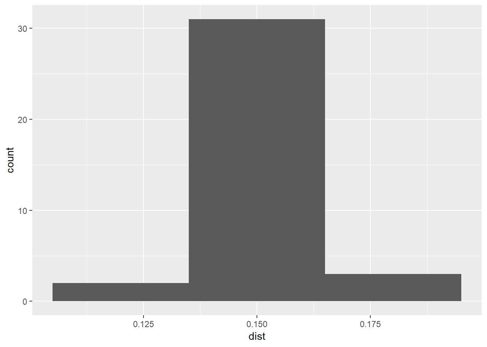
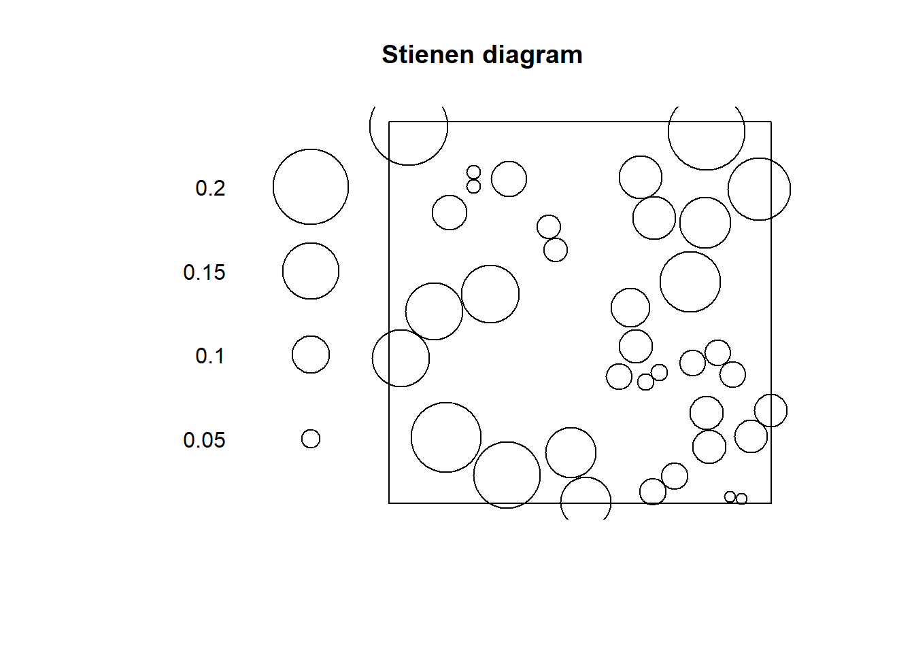
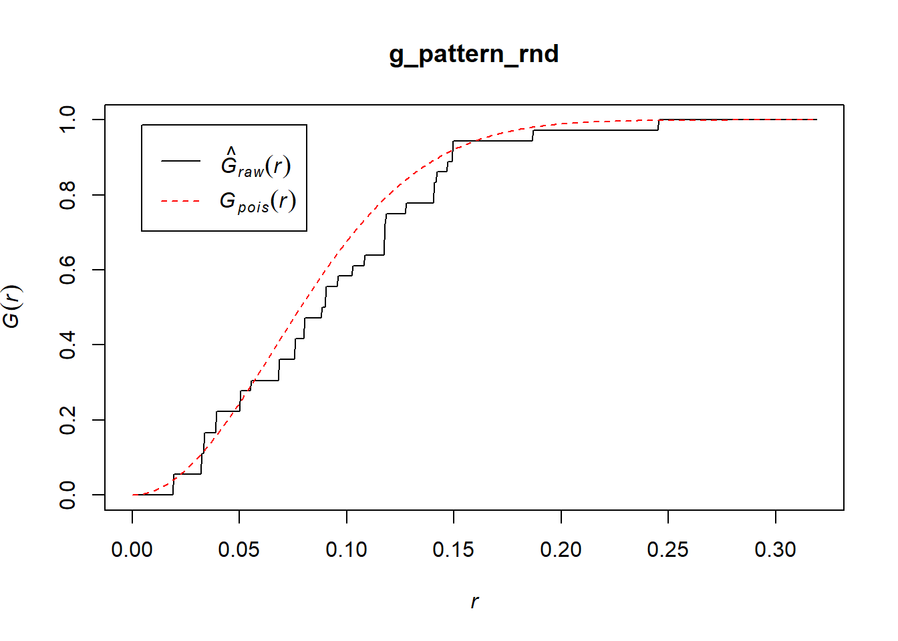
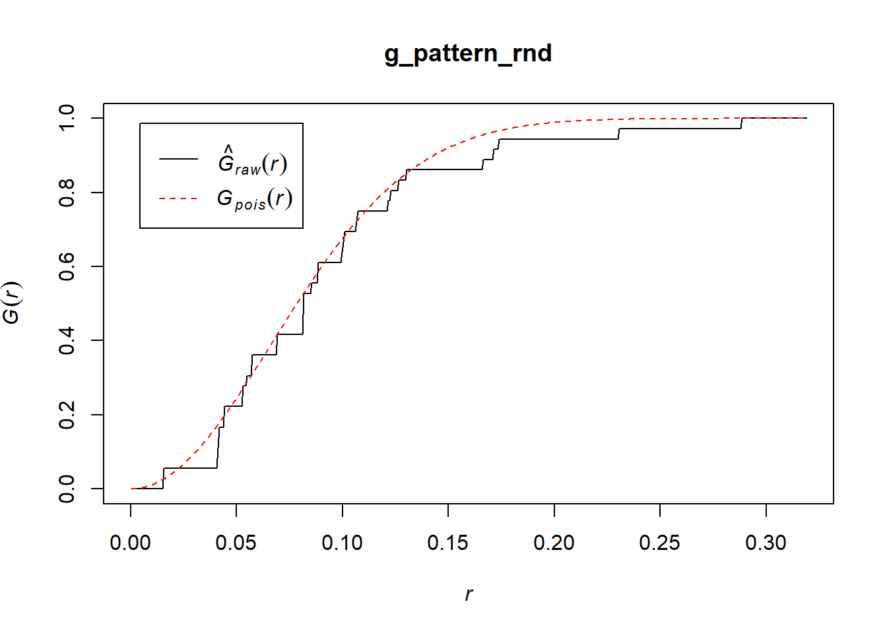

# Point Pattern Analysis III

*NOTE*: You can download the source files for this book from [here](https://github.com/paezha/Spatial-Statistics-Course). The source files are in the format of R Notebooks. Notebooks are pretty neat, because the allow you execute code within the notebook, so that you can work interactively with the notes. 

In the last practice/session your learning objectives included:

1. The intuition behind the quadrat-based test of independence.
2. The concept of kernel density.
3. The limitations of density-based analysis
4. More ways to work with `ppp` objects.

If you wish to work interactively with this chapter you will need the following:

* An R markdown notebook version of this document (the source file).

* A package called `geog4ga3`.

## Learning objectives

In this practice, you will learn:

1. About clustered and dispersed (or regular) patterns.
2. The concept of nearest neighbors.
3. About distance-based methods for point pattern analysis.
4. About the G-function for the analysis of event-to-event nearest neighbor distances.

## Suggested reading

O'Sullivan D and Unwin D (2010) Geographic Information Analysis, 2nd Edition, Chapter 5. John Wiley & Sons: New Jersey.

## Preliminaries

As usual, it is good practice to clear the working space to make sure that you do not have extraneous items there when you begin your work. The command in R to clear the workspace is `rm` (for "remove"), followed by a list of items to be removed. To clear the workspace from _all_ objects, do the following:

```r
rm(list = ls())
```

Note that `ls()` lists all objects currently on the worspace.

Load the libraries you will use in this activity:

```r
library(tidyverse)
```

```
## -- Attaching packages ---------------------------------------------------------------- tidyverse 1.2.1 --
```

```
## v ggplot2 3.1.0     v purrr   0.2.5
## v tibble  1.4.2     v dplyr   0.7.8
## v tidyr   0.8.2     v stringr 1.3.1
## v readr   1.2.1     v forcats 0.3.0
```

```
## -- Conflicts ------------------------------------------------------------------- tidyverse_conflicts() --
## x dplyr::filter() masks stats::filter()
## x dplyr::lag()    masks stats::lag()
```

```r
library(spatstat)
```

```
## Loading required package: spatstat.data
```

```
## Loading required package: nlme
```

```
## 
## Attaching package: 'nlme'
```

```
## The following object is masked from 'package:dplyr':
## 
##     collapse
```

```
## Loading required package: rpart
```

```
## 
## spatstat 1.57-1       (nickname: 'Cartoon Physics') 
## For an introduction to spatstat, type 'beginner'
```

```r
library(geog4ga3)
```

Load the datasets that you will use for this practice:

```r
data("pp0_df")
```

Examine the contents of this dataframe:

```r
summary(pp0_df)
```

```
##        x                y                 marks   
##  Min.   :0.0456   Min.   :0.03409   Pattern 1:36  
##  1st Qu.:0.2251   1st Qu.:0.22963   Pattern 2:36  
##  Median :0.4282   Median :0.43363                 
##  Mean   :0.4916   Mean   :0.47952                 
##  3rd Qu.:0.7812   3rd Qu.:0.77562                 
##  Max.   :0.9564   Max.   :0.94492
```

As you can see, this dataframe includes two point patterns, labeled "Pattern 1" and "Pattern 2", and each consists of $n=36$ events. The range of the coordinates suggests a window as follows:

```r
W <- owin(c(0,1), c(0,1))
```

Given window object `W`, it is possible to transform the dataframe into a `ppp` object: 

```r
pp0.ppp <- as.ppp(pp0_df, W = W)
```

## Motivation

Quadrats and kernel density are examples of density-based analysis. These techniques are useful to help you understand the large scale variation of a distribution of events, but as previously discussed, may sometimes be less informative by not taking into account _small scale_ variations in the locations of the events.

For this reason, the following two patterns, despite being very different, give identical number of counts per quadrat:

```r
plot(split(pp0.ppp))
```


```r
plot(quadratcount(split(pp0.ppp), nx = 3, ny = 3))
```


The two patterns above have similar _density_, However, "Pattern 1" displays _clustering_, a situation characterized by events generally being in close proximity to others. "Pattern 2", on the other hand, displays _dispersion_ or _regularity_, a situation where points tend to be located at fairly regular distances from each other.

With some fiddling of the parameters, quadrats can be coaxed to tease out the variations in density, for instance:

```r
plot(quadratcount(split(pp0.ppp), nx = 9, ny = 9))
```


As a visualization technique, this gives a better sense of the variations in density. However, as noted previously, the quality of the test deteriorates when there are many quadrats with small counts.

As an alternative, kernel density can be used to visualize the smoothed estimate of the density:

```r
plot(density(split(pp0.ppp), sigma = 0.075))
```


However, even when we can visualize the variations in density, we cannot, from the kernel estimate alone, tell if high/low values exceed those of a null landscape --- in other words, we lack at the moment a way to test the hypothesis that the density is higher than what would be expected from a null landscape.

In this practice you will learn about a family of techniques that instead of measuring the density, explore patterns by means of distance distributions.

## Nearest neighbors

Let us begin by introducing the concept of a nearest neighbor.

The nearest neighbor of a location is the event that is closest to said location given some metric. This metric is usually Euclidian distance on the plane, that is, distance as measured using a straight line between the location and the event. In principle, the metric can be selected according to the characteristics of a dataset: this could be Euclidean distance, great circle distance, or network distance, for events on networks, for instance (see Figure \ref{fig:distance-metrics}).

<div class="figure">

<p class="caption">(\#fig:unnamed-chunk-10)\label{fig:distance-metrics}Figure 12.1 Examples of distance metrics</p>
</div>

In this way, the nearest neighbor is the event j with the shortest separation from location i:
$$
\text{Event }j\text{ is the nearest neighbor of location }i\text{ if: }d_{ij}\le d_{ik} \forall k 
$$

Ties are relatively rare in most realistic point patterns (even in regular patterns), and may not have a big impact on the analysis.

The package `spatstat` includes functions to calculate Euclidean distances. Three functions are relevant:

* `pairdist()`: returns the pairwise distance between all pairs of events i and j.

* `nndist()`: returns a vector of distances from events to to their corresponding nearest neighbors; these distances are obtained by sorting the pairwise distances, and selecting the minimum value for each event.

* `distmap()`: returns a pixel image with the distance from each pixel to the nearest event; in effect this is a map of the distances between empty spaces and their corresponding nearest events.

With these functions we can calculate, for instance, the following distances:

```r
pp0_nn1 <- nndist(split(pp0.ppp)$"Pattern 1")
```

Let us explore the distribution of these distances by means of a histogram:

```r
ggplot() + geom_histogram(data = data.frame(dist = pp0_nn1), aes(dist), binwidth = 0.03)
```



Notice how most events have a nearest neighbor at a relatively short distance (<0.05).

Compare to the distribution of distances in "Pattern 2" of `pp0.ppp`:

```r
pp0_nn2 <- nndist(split(pp0.ppp)$"Pattern 2")
ggplot() + geom_histogram(data = data.frame(dist = pp0_nn2), aes(dist), binwidth = 0.03)
```


In this case, most events have a nearest neighbot at a distance of approximately 0.15.

Another useful tool is a _Stienen diagram_. A Steinen diagram is essentially a proportional symbol plot of the events with symbols of size proportional to the distance to their nearest neighbor. For example, for "Pattern 1" in `pp0.ppp` (Notice the use of %mark% to add an attribute to the `ppp` object; the attribute is the distance to the nearest neighbor):

```r
plot(split(pp0.ppp)$"Pattern 1" %mark% (pp0_nn1), markscale = 1, main = "Stienen diagram")
```


In this diagram, the largest circle is not very large: even events that are relatively isolated are not a long distance away from their nearest neighbor. This fits the definition of clustering as situation where events are close to other events.

Compare to "Pattern 2":

```r
plot(split(pp0.ppp)$"Pattern 2" %mark% (pp0_nn2), markscale = 1, main = "Stienen diagram")
```


Notice how all circles are very similar in size: this fits the definition of dispersion, where events are more or less equally distant from their nearest neighbors.

Lets use the function `runifpoint` from the `spatstat` package to generate a null landscape:

```r
rand_ppp <- runifpoint(36)
```

If we plot the Stienen diagram for this point pattern:

```r
rand_nn <- nndist(rand_ppp)
plot(rand_ppp %mark% (rand_nn), markscale = 1, main = "Stienen diagram")
```



In a null landscape, the distribution of the size of the symbols would tend to be random!

The concept of nearest neighbors is useful to define a family of techniques that are based on the distribution of distances to nearest neighbors. Three such techniques are introduced here.

## G-function

As you have seen above, the distribution of distances to nearest neighbors presents distinctive characteristics for different types of patterns.

What is needed is a convenient way to summarize the distribution of distances to nearest neighbors. A way to do so is by means of a plot of the _cumulative distribution function_. A cumulative distribution is simply the proportion of events that are have a nearest neighbor at a distance less than some value x. When the value of x is very small, no events have a nearest neighbor at $d_{ij}<x$. When x is very large all events have a nearest neighbor at $d_{ij}<x$. The cumulative distribution thus depends on the value of x.

Imagine for instance the following hypothetical distribution of distances of ten events to their nearest neighbors (the first event's nearest neighbor is at a distance of 1, the second event's nearest neighbor is at 2, the third's at 0.5, and so on):

```r
nnd <- c(1, 2, 0.5, 2.5, 1.7, 4, 3.5, 1.2, 2.3, 2.8)
```

When x = 0, zero events have a nearest neighbor. When x = 1, two events have nearest neighbor at dist <= 1. When x = 2, five events have a nearest neighbor at dist <= 2. When x = 3, eight events have a nearest neighbor at dist <= x. When x = 4, ten out of ten events have a nearest neighbor at dist <= 4.

We can plot these numbers of events as a proportion:

```r
df <- data.frame(x = c(0, 1, 2, 3, 4), proportion = c(0, 3/10, 5/10, 8/10, 10/10))
ggplot() + geom_line(data = df, aes(x = x, y = proportion))
```


The cumulative distribution function of distances from event to nearest neighbor is called a _G-function_.

This function is defined as follows, with $d_{ik}$ as the distance from the event at i to its nearest neighbor:
$$
\hat{G}(x)=\frac{(d_{ik}\le x, \forall i)}{n}
$$

This function (with a hat, because it is estimated from the data), can be used to explore the spatial point pattern. When doing so, it is useful to know that the theoretical value of G (assuming a null landscape generated by a _Poisson_ distribution) is as follows:
$$
G_{pois}(x) = 1 - exp(-\lambda \pi x^2).
$$

When the empirical $\hat{G}(x)$ is greater than the theoretical function, this suggests that the events tend to be _closer_ than expected, compared to the null landscape. On the contrary, when the empirical function is less than the theoretical function, this would suggest a dispersed pattern.

The G-function is implemented in `spatstat` as `Gest` (for G estimated):

```r
g_pattern1 <- Gest(split(pp0.ppp)$"Pattern 1", correction = "none")
```

(For the moment ignore the argument "correction"; we will discuss corrections later on.)

The `plot` function can be used to visualize the estimated G (with r = x): 

```r
plot(g_pattern1)
```


In the plot above, the empirical function is the solid black line, and the theoretical is the dashed red line.

If you examine these functions, you will see that about 50% of events have a nearest neighbor at a distance of less than approximately 0.04. In the null landscape, in contrast, only about 16% of events have a nearest neighbor at less than 0.04:

```r
plot(g_pattern1)
lines(x = c(0.04, 0.04), y = c(-0.1, 0.5), lty = "dotted")
lines(x = c(-0.1, 0.04), y = c(0.5, 0.5), lty = "dotted")
lines(x = c(-0.1, 0.04), y = c(0.16, 0.16), lty = "dotted", col = "red")
```


What this suggests is that in the actual landscape events tend to be much closer to other events in comparison the null landscape, and would therefore be suggestive of clustering.

Compare to "Pattern 2":

```r
g_pattern2 <- Gest(split(pp0.ppp)$"Pattern 2", correction = "none")
plot(g_pattern2)
```



Now the empirical function is below the one for the null landscape. Notice too that all events have a nearest neighbor in a limited range of distances, between 0.14 and 0.18. This is indicative of a dispersed, or regular pattern.

And the random pattern that you created before:

```r
g_pattern_rnd <- Gest(rand_ppp, correction = "none")
plot(g_pattern_rnd)
```



In this case, the empirical function more closely resembles the theoretical function for the null landscape.

By considering the distribution of distances to nearest neighbors, you can generate additional information on a point pattern to complement the density-based analysis of the preceding chapters.
