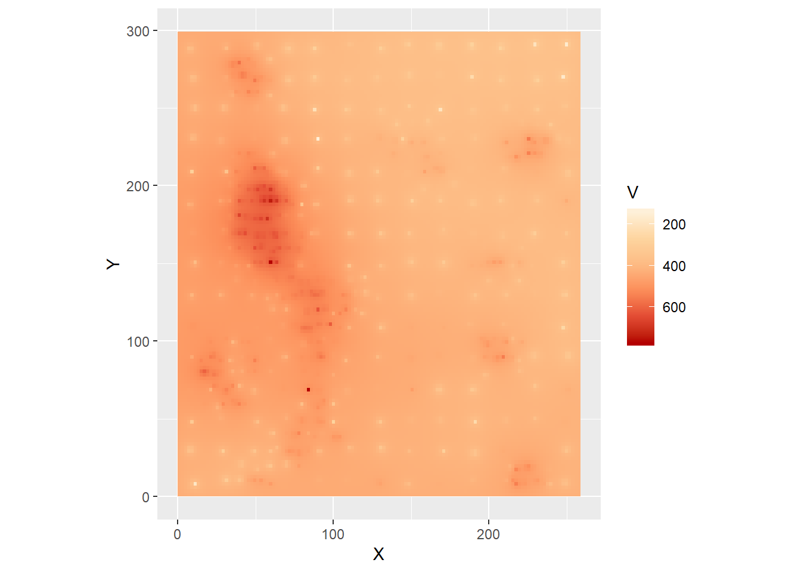
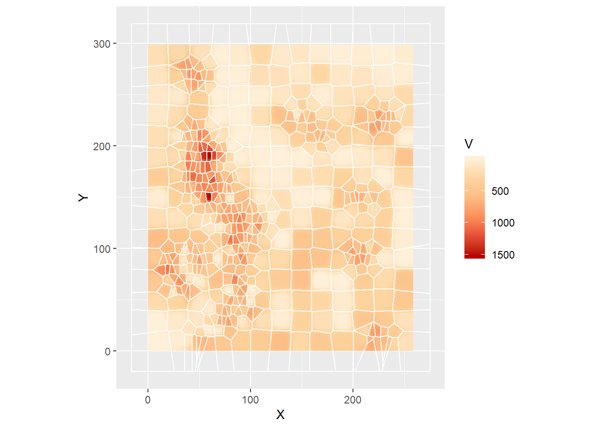
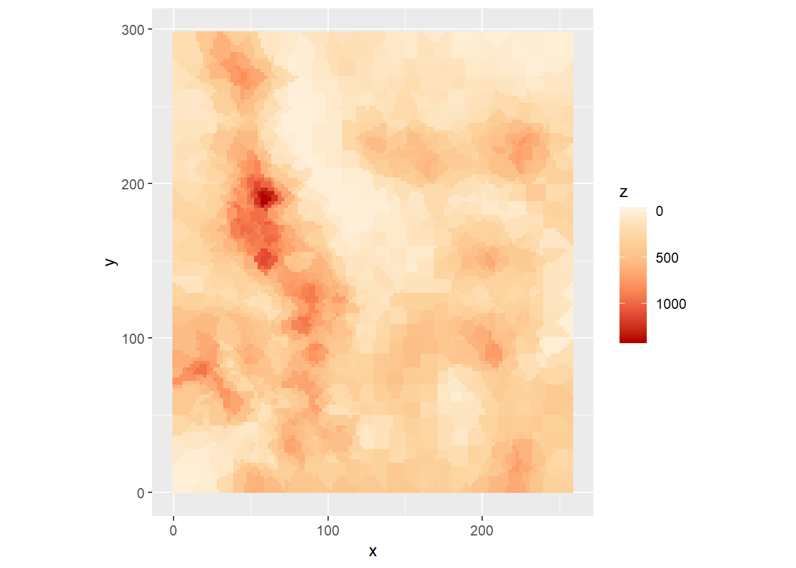

# Spatially Continuous Data I {#spatially-continuous-data-i}

*NOTE*: You can download the source files for this book from [here](https://github.com/paezha/Spatial-Statistics-Course). The source files are in the format of R Notebooks. Notebooks are pretty neat, because the allow you execute code within the notebook, so that you can work interactively with the notes.

Previously, you learned about the analysis of area data. Starting with this practice, you will be introduced to another type of spatial data: continuous data, also called fields. 

If you wish to work interactively with this chapter you will need the following:

* An R markdown notebook version of this document (the source file).

* A package called `geog4ga3`.

You will also use two custom functions that are included in the package `geog4ga3` as follows:

1. point2voronoi(sp)

This is a function to obtain Voronoi polygons based on a set of points. It takes an argument `sp` (a `SpatialPointsDataFrame`) and calculates a set of Voronoi polygons. The value (output) of the function is a `SpatialPolygonsDataFrame` with the polygons.

2. kpointmeans(source_xy, z, target_xy, k, latlong)

This is a function to calculate k-point means. It takes a set of source coordinates (`source_xy`), that is, the coordinates of observations to be used for interpolation; a variable `z` to interpolate; a set of target coordinates (`target_xy`), the points to interpolate `z`; the number of nearest neighbors `k`; and a logical value to indicate whether the coordinates are latitude-longitude (the default is `FALSE`).

## Learning objectives

In this practice, you will learn:

1. About spatially continuous data/fields.
2. Exploratory visualization.
3. The purpose of spatial interpolation.
4. The use of tile-based approaches.
5. Inverse distance weighting.
6. K-point means.

## Suggested readings

- Bailey TC and Gatrell AC [-@Bailey1995] Interactive Spatial Data Analysis, Chapters 5 and 6. Longman: Essex.
- Bivand RS, Pebesma E, and Gomez-Rubio V [-@Bivand2008] Applied Spatial Data Analysis with R, Chapter 8. Springer: New York.
- Brunsdon C and Comber L [-@Brunsdon2015R] An Introduction to R for Spatial Analysis and Mapping, Chapter 6, Sections 6.7 and 6.8. Sage: Los Angeles.
- Isaaks EH and Srivastava RM  [-@Isaaks1989applied] An Introduction to Applied Geostatistics, **CHAPTERS**. Oxford University Press: Oxford.
- O'Sullivan D and Unwin D [-@Osullivan2010] Geographic Information Analysis, 2nd Edition, Chapters 9 and 10. John Wiley & Sons: New Jersey.

## Preliminaries

As usual, it is good practice to clear the working space to make sure that you do not have extraneous items there when you begin your work. The command in R to clear the workspace is `rm` (for "remove"), followed by a list of items to be removed. To clear the workspace from _all_ objects, do the following:

```r
rm(list = ls())
```

Note that `ls()` lists all objects currently on the worspace.

Load the libraries you will use in this activity:

```r
library(tidyverse)
```

```
## -- Attaching packages ----------------------------------------------------------------- tidyverse 1.2.1 --
```

```
## v ggplot2 3.1.0     v purrr   0.2.5
## v tibble  2.0.1     v dplyr   0.7.8
## v tidyr   0.8.2     v stringr 1.3.1
## v readr   1.3.1     v forcats 0.3.0
```

```
## -- Conflicts -------------------------------------------------------------------- tidyverse_conflicts() --
## x dplyr::filter() masks stats::filter()
## x dplyr::lag()    masks stats::lag()
```

```r
library(spdep)
```

```
## Loading required package: sp
```

```
## Loading required package: Matrix
```

```
## 
## Attaching package: 'Matrix'
```

```
## The following object is masked from 'package:tidyr':
## 
##     expand
```

```
## Loading required package: spData
```

```
## To access larger datasets in this package, install the spDataLarge
## package with: `install.packages('spDataLarge',
## repos='https://nowosad.github.io/drat/', type='source')`
```

```r
library(plotly)
```

```
## 
## Attaching package: 'plotly'
```

```
## The following object is masked from 'package:ggplot2':
## 
##     last_plot
```

```
## The following object is masked from 'package:stats':
## 
##     filter
```

```
## The following object is masked from 'package:graphics':
## 
##     layout
```

```r
library(deldir)
```

```
## deldir 0.1-16
```

```r
library(spatstat)
```

```
## Loading required package: spatstat.data
```

```
## Loading required package: nlme
```

```
## 
## Attaching package: 'nlme'
```

```
## The following object is masked from 'package:dplyr':
## 
##     collapse
```

```
## Loading required package: rpart
```

```
## 
## spatstat 1.58-2       (nickname: 'Not Even Wrong') 
## For an introduction to spatstat, type 'beginner'
```

```r
library(geog4ga3)
```

Begin by loading the data you will need for this Chapter:

```r
data("Walker_Lake")
```

You can verify the contents of the dataframe:

```r
summary(Walker_Lake)
```

```
##       ID                  X               Y               V         
##  Length:470         Min.   :  8.0   Min.   :  8.0   Min.   :   0.0  
##  Class :character   1st Qu.: 51.0   1st Qu.: 80.0   1st Qu.: 182.0  
##  Mode  :character   Median : 89.0   Median :139.5   Median : 425.2  
##                     Mean   :111.1   Mean   :141.3   Mean   : 435.4  
##                     3rd Qu.:170.0   3rd Qu.:208.0   3rd Qu.: 644.4  
##                     Max.   :251.0   Max.   :291.0   Max.   :1528.1  
##                                                                     
##        U           T      
##  Min.   :   0.00   1: 45  
##  1st Qu.:  83.95   2:425  
##  Median : 335.00          
##  Mean   : 613.27          
##  3rd Qu.: 883.20          
##  Max.   :5190.10          
##  NA's   :195
```

This dataframe includes a sample of of geocoded observations with false coordinates `X` and `Y`, of two quantitative variables `V`, `U`, and a factor variable `T`. The variables are generic, but you can think of them as measurements of pollutants. The Walker Lake dataset originally was used for teaching geostatistics in Isaaks and Srivastava's [-@Isaaks1989applied] book [An Introduction to Geostatistics](https://books.google.ca/books?id=vC2dcXFLI3YC&dq=introduction+to+applied+geostatistics+isaaks+and+srivastava&hl=en&sa=X&ved=0ahUKEwiKg6_iyrXZAhUjp1kKHd_jAVcQ6AEIKTAA).

## Spatially continuous (field) data

Previously we have discussed two types of data that are of interest in spatial analysis: points and events, and areas.

The last section of the course will deal with a third type of data that finds numerous applications in many fields.

Let us recall that we have discussed to different _units of support_. The unit of support is the type of spatial object that is used for the analysis.

In the case of point pattern analysis, the unit of support is the point. Depending on the scale of the analysis, the point could be anything from the centroid of cells, the location of trees, the addresses of businesses, or the centers of cities at a much larger scale. Obviously, none of these objects are actual points (the point is a theoretical object). However, points are a reasonable representation for events when their size is minuscule compared to the area of the region under analysis. The most basic attribute of an event is whether its present (e.g., is there a tree at this location?) Other attributes are conditional on that one.

In the case of areas, the unit of support is a zone. Data in this type of analysis may or not be generated by a discontinuous process, but once it has been cast in the form of statistics for areas, it will usually involve discontinuities at the edges of the areas.

An important difference between point pattern analysis and analysis of data in areas is the source of the randomness.

In the case of point pattern analysis, the coordinates of the event are assumed to be the outcome of a random process. In area data, the locations of the data are exogenously given, and the source of randomness instead is in the values of the attributes.

This brings us to spatially continuous data.

Superficially, spatially continuous data looks like points. This is because of how a field is measured at discrete locations. The underlying process, however, is not discrete, and a field can in principle be measured at any location. Examples include temperature and elevation. Temperature is measured at discrete locations, but the phenomenon itself is extensive. Same thing with elevation. 

The source of randomness in the case of fields is the inherent uncertainty of the outcome of the process at locations where it was not measured. Therefore, an essential task is to predict values at unmeasured locations (interpolate), and to assess the degree of uncertainty of those predictions.

The study of continuous data has been heavily influenced by the work in mining of South African engineer D.G. Krige, who sought to estimate the distribution of minerals based on a sample of boreholes. Since then, the study of fields has found applications in remote sensing, real estate appraisal, environmental science, hydrogeology, and many other fields.

We will define a mixed spatial process that depends on the coordinates $u_i$ and $v_i$, in addition to a vector of covariates $\bf{x}_i$:
$$
z_i = f(u_i, v_i, \bf{x}_i) + \epsilon_i
$$
where $i$ is an arbitrary location in the region, and $\epsilon_i$ is the difference between the smooth description of the process and the value of the field.

More simply, a field could be the outcome of a purely spatial process as follows:
$$
z_i = f(u_i, v_i) + \epsilon_i
$$

The value of a field is known in the locations where it is measured. In locations where the field was not measured (lets call these locations $p$), there will be some uncertainty that stems from our limited knowledge of the underlying process. As a consequence, there will be a random term associated with any prediction of the value of the field:
$$
\hat{z}_p = \hat{f}(u_p, v_p) + \hat{\epsilon}_p
$$
We use the hat notation to indicate that these are estimates of the true values.

A key task in the analysis of fields is to determine a suitable function for making predictions $\hat{z}_p$ and to estimate the uncertainty as well.

In this and upcoming sessions you will learn about methods to achieve this task. 

## Exploratory visualization

We will begin with some exploratory visualizations. The methods are very similar to those used for marked point patterns. You can use dot or proportional symbol maps. Lets create a proportional symbol map of the variable `V` in the Walker Lake dataset (with alpha = 0.5 for some transparency to mitigate the overplotting):

```r
ps1 <- ggplot(data = Walker_Lake, aes (x = X, y = Y, color = V, size = V)) +
  geom_point(alpha = 0.5) + 
  scale_color_distiller(palette = "OrRd", trans = "reverse") +
  coord_equal()
ps1
```


The proportional symbols indicate the location where a measurement was made. There is no randomness in these locations, as they were selected by design. In particular, notice how a regular grid seems to have been used for sampling, and then there was further infill sampling at those places where the field appeared to vary more.

Imagine that the observations are of a contaminant. The task could be to calculate the total amount of the contaminant over the region. This would require you to obtain estimates of the contaminant in all the region, not just those places where measurements were made. If, as is typically the case, making more observations is expensive, other approaches must be adopted.

Before proceeding, it is worthwhile noting that the package `plotly` can be used to enhance exploratory analysis by allowing user interactivity. Below is the same plot as before, but now as an interactive 3D scatterplot:

```r
plot_ly(data = Walker_Lake, x = ~X, y = ~Y, z = ~V,
         marker = list(color = ~V, colorscale = c("Orange", "Red"), 
                       showscale = TRUE)) %>% 
  add_markers()
```

<!--html_preserve--><div id="htmlwidget-c853860a1845a6fbc572" style="width:672px;height:480px;" class="plotly html-widget"></div>
<script type="application/json" data-for="htmlwidget-c853860a1845a6fbc572">{"x":{"visdat":{"591843163ec5":["function () ","plotlyVisDat"]},"cur_data":"591843163ec5","attrs":{"591843163ec5":{"x":{},"y":{},"z":{},"marker":{"color":{},"colorscale":["Orange","Red"],"showscale":true},"alpha_stroke":1,"sizes":[10,100],"spans":[1,20],"type":"scatter3d","mode":"markers","inherit":true}},"layout":{"margin":{"b":40,"l":60,"t":25,"r":10},"scene":{"xaxis":{"title":"X"},"yaxis":{"title":"Y"},"zaxis":{"title":"V"}},"hovermode":"closest","showlegend":false},"source":"A","config":{"cloud":false},"data":[{"x":[11,8,9,8,9,10,9,11,10,8,9,10,11,10,8,31,29,28,31,28,30,28,28,30,28,31,28,30,31,31,49,49,51,49,50,51,48,49,51,48,50,49,51,50,51,71,71,70,68,69,68,68,69,69,70,69,69,68,71,71,91,91,90,91,91,91,89,88,89,89,90,90,88,88,88,109,111,108,109,108,110,109,110,111,111,110,109,109,109,111,130,131,130,128,129,131,129,131,131,129,128,130,131,128,131,148,149,150,151,150,150,150,150,149,151,148,150,149,149,148,168,171,169,168,168,171,168,171,171,169,170,170,169,168,168,190,191,191,190,190,188,191,189,190,190,188,191,190,189,189,211,209,211,210,209,210,211,208,209,208,210,211,211,208,208,231,231,230,230,229,229,230,228,229,231,231,229,231,231,230,249,250,249,251,251,248,249,248,250,250,251,251,249,248,250,40,21,28,29,41,18,39,18,41,21,31,41,21,60,40,51,59,41,59,51,50,59,60,60,38,50,50,61,39,61,38,61,39,49,58,39,60,40,51,60,40,58,38,50,61,39,59,41,49,51,59,39,59,38,78,60,70,70,78,61,78,80,58,71,70,79,80,61,79,71,78,80,69,79,80,70,81,100,80,90,88,100,80,101,101,79,90,100,81,100,80,91,101,81,98,81,90,100,98,90,99,121,111,108,120,119,158,140,150,151,161,141,160,139,178,159,169,170,180,178,158,219,198,211,208,221,199,220,198,220,200,208,210,221,198,219,200,239,218,229,239,218,238,218,231,230,240,221,239,218,35,24,34,23,54,46,55,45,53,46,55,43,55,44,55,46,54,43,73,64,75,64,73,64,75,63,73,64,93,86,93,84,93,86,96,85,93,86,114,106,155,145,174,166,215,205,215,204,236,223,236,226,35,24,36,26,16,43,15,46,36,54,46,54,43,65,33,36,53,44,65,34,33,55,46,63,34,65,35,46,36,35,53,46,45,35,35,84,84,75,73,63,84,76,84,86,73,76,94,85,104,93,75,94,85,104,75,95,83,94,103,114,104,196,215,204,196,195,216,225,214,245,233,226,213],"y":[8,30,48,68,90,110,129,150,170,188,209,231,250,269,288,11,29,51,68,88,110,130,150,171,190,209,229,250,269,289,11,29,48,68,88,109,129,151,168,190,211,231,250,268,290,9,29,51,70,90,110,128,148,169,191,208,229,250,268,288,11,29,49,68,91,111,130,149,170,188,211,230,249,269,288,11,31,49,68,88,109,129,148,169,191,208,230,249,268,291,9,31,48,70,90,109,128,148,169,191,209,231,248,269,288,8,29,49,69,89,109,129,151,169,190,208,228,251,271,291,8,29,49,69,91,109,131,150,171,191,210,230,249,271,290,11,28,48,69,89,111,129,149,169,189,210,231,248,270,290,11,30,49,70,90,111,130,151,168,191,211,228,250,268,289,10,28,50,71,91,110,131,148,169,191,208,228,249,268,291,9,30,48,69,91,109,130,150,169,190,208,229,251,270,291,71,69,80,59,81,80,60,60,90,90,101,100,100,8,11,18,20,21,90,101,81,101,81,151,148,160,138,158,160,139,140,170,170,179,179,181,191,190,198,198,200,208,209,221,220,221,268,271,278,260,281,279,258,260,28,29,41,21,41,41,20,131,128,140,121,138,119,121,149,160,159,168,181,181,188,198,200,48,49,58,39,60,59,38,68,70,79,78,81,91,89,99,100,98,111,108,120,118,130,140,138,131,140,121,141,118,228,229,241,218,241,240,218,220,211,209,221,198,218,201,198,88,90,100,80,99,98,81,78,150,150,159,140,160,161,139,139,8,8,19,18,18,229,228,239,221,239,241,220,218,71,71,88,91,10,11,89,89,150,148,168,170,191,191,211,211,269,271,29,31,129,129,149,151,171,168,188,191,48,48,70,69,90,89,111,108,131,131,131,130,229,230,208,211,89,89,148,151,9,9,229,230,80,79,61,58,80,60,88,99,99,80,81,161,161,160,160,170,179,180,181,180,191,199,198,201,201,210,208,220,219,271,258,260,281,278,259,30,41,40,141,140,138,159,161,169,199,51,61,60,38,41,90,101,100,109,110,121,119,140,139,120,118,91,101,101,101,149,11,19,19,231,220,221,218],"z":[0,0,224.4,434.4,412.1,587.2,192.3,31.3,388.5,174.6,187.8,82.1,81.1,124.3,188,28.7,78.1,292.1,895.2,702.6,490.3,136.1,335,277,206.1,24.5,198.1,60.3,312.6,240.9,653.3,96.4,105,37.8,820.8,450.7,190.4,773.3,971.9,762.4,968.3,394.7,343,863.8,159.6,445.8,673.3,252.6,537.5,0,329.1,646.3,616.2,761.3,918,97.4,0,0,0,2.4,368.3,91.6,654.7,645.5,907.2,826.3,975.3,551.1,155.5,10.7,0,0,0,12.1,62.2,399.6,176.6,402,260.6,192,237.6,702,38.5,22.1,2.7,17.9,174.2,12.9,187.8,268.8,572.5,29.1,75.2,399.9,243.1,0,244.7,185.2,26,0,100.3,530.3,107.4,159.3,70.7,260.2,326,332.7,531.3,547.2,482.7,84.1,4.7,180.6,0,342.4,602.3,209.1,79.4,104.1,446,189.9,280.4,0,499.3,457.3,341.2,0,208.3,99.7,636.6,173.1,17,283.1,30.9,348.5,22.4,59.1,0,326,325.1,114.7,481.6,324.1,10.9,332.9,184.4,146.6,92,2.5,358.1,473.3,308.8,406.8,812.1,339.7,223.9,673.5,141,61.8,258.3,590.3,166.9,125.2,29.3,617.6,425.9,295.7,224.9,31.7,377.4,333.3,351,0,137.6,451.2,639.5,119.9,27.2,2.1,167.7,147.8,442.7,487.7,0,28.2,0,18.3,266.3,502.3,0,240.9,234.4,22.4,45.6,76.2,284.3,606.8,772.7,269.5,1036.7,783.8,519.4,414.9,601.4,579.2,601.4,594.6,550.1,99.4,233.6,14.4,115.9,506.2,502.4,608,363.9,385.6,1521.1,340.9,879.1,413.4,868.9,657.4,477,268.5,806.4,914.4,811.5,1113.6,1008,1528.1,970.9,1109,1203.9,641.3,720.6,665.3,543.3,101.1,615.9,543.1,868.8,583,670.7,148.8,798,194.9,635.2,781.6,238.6,472,58.1,600.3,64.9,505.9,801.6,158.8,606.3,30.7,730.1,421.2,104.8,44.1,801.1,742,689.1,424.6,184.3,245.2,630,0,48.7,757.4,739.8,520.7,0,0,730.5,383.1,508.8,573.3,372.4,585.8,397.2,614.5,734.9,599.3,181.2,744.8,1022.3,899.3,363.7,513.2,648.8,645.4,13,190.3,893,104.7,150.4,558.4,558,318.5,394.3,141.9,112.5,580.4,535.9,398.2,517.3,427.2,367.6,374.7,144.8,169.8,235.1,611.7,746.4,436.6,540.9,801,272.1,204.1,543.9,606.2,356,440.9,301.8,369.4,166.8,230.9,240.3,737.1,518.6,390.7,797.4,602.6,430.8,354.1,602.4,172.6,324.8,420.1,763.5,687.8,735.8,86.9,817,637.9,512.3,423.4,569.6,858,234,876,1082.8,1392.6,646.6,889.7,509.2,613.1,767.8,649.4,235.4,782.8,227.3,722.9,974.5,512.2,1215.8,687.1,1259.9,684.5,471.9,512.1,963.9,874,582.4,553.2,937.3,883.6,879,268.4,651.5,386.4,33.2,339.2,600.3,595.2,809.6,293.3,697.3,515.9,613.2,665.3,813.6,174.8,891.8,699.6,39.5,915.6,584,610,566.8,38.1,483,542.6,959.3,631.9,928.3,431,672.3,1003.4,876.4,734.1,366,296.5,1069.2,804.3,731.1,318.1,238.6,428.9,737.4,429.1,597.4,442.6,765.2,605.5,795.9,235,562,411.4,696.7,790.9,696.5,687.3,597.5,437.4,317.4,470.7,498.7,778.7,523.3,617.1,395.3,518.9,383.7,704.1,562.3,655.3,823.6,847.7,607.5,491.2,319.5,594,433.5,209.6,533.8,592.4,478.7,660.2,832.2,242.5,161.2,626,800.1,482.6],"marker":{"color":[0,0,224.4,434.4,412.1,587.2,192.3,31.3,388.5,174.6,187.8,82.1,81.1,124.3,188,28.7,78.1,292.1,895.2,702.6,490.3,136.1,335,277,206.1,24.5,198.1,60.3,312.6,240.9,653.3,96.4,105,37.8,820.8,450.7,190.4,773.3,971.9,762.4,968.3,394.7,343,863.8,159.6,445.8,673.3,252.6,537.5,0,329.1,646.3,616.2,761.3,918,97.4,0,0,0,2.4,368.3,91.6,654.7,645.5,907.2,826.3,975.3,551.1,155.5,10.7,0,0,0,12.1,62.2,399.6,176.6,402,260.6,192,237.6,702,38.5,22.1,2.7,17.9,174.2,12.9,187.8,268.8,572.5,29.1,75.2,399.9,243.1,0,244.7,185.2,26,0,100.3,530.3,107.4,159.3,70.7,260.2,326,332.7,531.3,547.2,482.7,84.1,4.7,180.6,0,342.4,602.3,209.1,79.4,104.1,446,189.9,280.4,0,499.3,457.3,341.2,0,208.3,99.7,636.6,173.1,17,283.1,30.9,348.5,22.4,59.1,0,326,325.1,114.7,481.6,324.1,10.9,332.9,184.4,146.6,92,2.5,358.1,473.3,308.8,406.8,812.1,339.7,223.9,673.5,141,61.8,258.3,590.3,166.9,125.2,29.3,617.6,425.9,295.7,224.9,31.7,377.4,333.3,351,0,137.6,451.2,639.5,119.9,27.2,2.1,167.7,147.8,442.7,487.7,0,28.2,0,18.3,266.3,502.3,0,240.9,234.4,22.4,45.6,76.2,284.3,606.8,772.7,269.5,1036.7,783.8,519.4,414.9,601.4,579.2,601.4,594.6,550.1,99.4,233.6,14.4,115.9,506.2,502.4,608,363.9,385.6,1521.1,340.9,879.1,413.4,868.9,657.4,477,268.5,806.4,914.4,811.5,1113.6,1008,1528.1,970.9,1109,1203.9,641.3,720.6,665.3,543.3,101.1,615.9,543.1,868.8,583,670.7,148.8,798,194.9,635.2,781.6,238.6,472,58.1,600.3,64.9,505.9,801.6,158.8,606.3,30.7,730.1,421.2,104.8,44.1,801.1,742,689.1,424.6,184.3,245.2,630,0,48.7,757.4,739.8,520.7,0,0,730.5,383.1,508.8,573.3,372.4,585.8,397.2,614.5,734.9,599.3,181.2,744.8,1022.3,899.3,363.7,513.2,648.8,645.4,13,190.3,893,104.7,150.4,558.4,558,318.5,394.3,141.9,112.5,580.4,535.9,398.2,517.3,427.2,367.6,374.7,144.8,169.8,235.1,611.7,746.4,436.6,540.9,801,272.1,204.1,543.9,606.2,356,440.9,301.8,369.4,166.8,230.9,240.3,737.1,518.6,390.7,797.4,602.6,430.8,354.1,602.4,172.6,324.8,420.1,763.5,687.8,735.8,86.9,817,637.9,512.3,423.4,569.6,858,234,876,1082.8,1392.6,646.6,889.7,509.2,613.1,767.8,649.4,235.4,782.8,227.3,722.9,974.5,512.2,1215.8,687.1,1259.9,684.5,471.9,512.1,963.9,874,582.4,553.2,937.3,883.6,879,268.4,651.5,386.4,33.2,339.2,600.3,595.2,809.6,293.3,697.3,515.9,613.2,665.3,813.6,174.8,891.8,699.6,39.5,915.6,584,610,566.8,38.1,483,542.6,959.3,631.9,928.3,431,672.3,1003.4,876.4,734.1,366,296.5,1069.2,804.3,731.1,318.1,238.6,428.9,737.4,429.1,597.4,442.6,765.2,605.5,795.9,235,562,411.4,696.7,790.9,696.5,687.3,597.5,437.4,317.4,470.7,498.7,778.7,523.3,617.1,395.3,518.9,383.7,704.1,562.3,655.3,823.6,847.7,607.5,491.2,319.5,594,433.5,209.6,533.8,592.4,478.7,660.2,832.2,242.5,161.2,626,800.1,482.6],"colorscale":["Orange","Red"],"showscale":true,"line":{"color":"rgba(31,119,180,1)"}},"type":"scatter3d","mode":"markers","error_y":{"color":"rgba(31,119,180,1)"},"error_x":{"color":"rgba(31,119,180,1)"},"line":{"color":"rgba(31,119,180,1)"},"frame":null}],"highlight":{"on":"plotly_click","persistent":false,"dynamic":false,"selectize":false,"opacityDim":0.2,"selected":{"opacity":1},"debounce":0},"shinyEvents":["plotly_hover","plotly_click","plotly_selected","plotly_relayout","plotly_brushed","plotly_brushing","plotly_clickannotation","plotly_doubleclick","plotly_deselect","plotly_afterplot"],"base_url":"https://plot.ly"},"evals":[],"jsHooks":[]}</script><!--/html_preserve-->

## Tile-based methods

Tile-based methods take a set of points and convert them into a tesselation. 

A widely used algorithm to do this is called Voronoi polygons, after Georgy Voronoi, the mathematician that discovered it. Voronoi polygons are created as follows:

1. Given a set of generating points $p_g$ with coordinates $(u_g, u_g)$ (for $g = 1,...,n$) and values of a variable $z_{p_g}$:

```r
uv_coords <- data.frame(u = c(0.7, 5.2, 3.3, 1.3, 5.4), v = c(0.5, 1.8, 2.3, 4.8, 5.5))
p <- ggplot(data = uv_coords, aes(x = u, y = v)) + geom_point(size = 2) + coord_equal() +
  xlim(c(0,6)) + ylim(c(0,6))
p
```


2. Each point is connected by means of straight lines to its two nearest neighbors to create a triangulation:

```r
l2n <- data.frame(u = c(0.7, 5.2, 5.2, 3.3, 1.3, 1.3, 5.4), 
                  uend = c(3.3, 3.3, 5.4, 5.4, 0.7, 3.3, 1.3), 
                  v = c(0.5, 1.8, 1.8, 2.3, 4.8, 4.8, 5.5),
                  vend = c(2.3, 2.3, 5.5, 5.5, 0.5, 2.3, 4.8))
p <- p + geom_segment(data = l2n, aes(x = u, xend = uend, y = v, yend = vend), color = "gray")
p
```


3. The perpendicular bisectors of each triangle are found and extended, until they intersect. The resulting tesselation is a set of Voronoi polygons:

```r
uv_coords.sp <- SpatialPointsDataFrame(coords = cbind(x = uv_coords$u, y = uv_coords$v), uv_coords)
vor <- points2voronoi(uv_coords.sp)
vor.t <- fortify(vor)
p + geom_polygon(data = vor.t, aes(x = long, y = lat, group = group),
                 color = "black", fill = NA)
```


Voronoi polygons have the property that any point $p_i$ inside the polygon with generating point $p_g$ in it, is closer to $p_g$ than to any other generating point $p_k$ on the plane. For this reason, Voronoi polygons are used to obtain areas of influence, among other applications.

There are other ways of obtaining Voronoi polygons, as Figure 1 below illustrates. Voronoi polygons in the figure are created by radial growth. The basic concept is the same, but implemented in a different way: find every point that is closest to $p_g$. When two circles touch, they become the boundary between all points that are closer to $p_g$ and $p_k$ respectively. Continue growing until the plane is fully covered.


Voronoi polygons can be obtained in `R` as follows (using the sample dataset).

First, if the object with the coordinates is not a `SpatialPointsDataFrame` (for instance, it could be a `ppp` object of the `spatstat` package), convert the points to a `SpatialPointsDataFrame`:

```r
Walker_Lake.sp <- SpatialPointsDataFrame(coords = cbind(X = Walker_Lake$X, 
                                                     Y = Walker_Lake$Y), 
                                      data = Walker_Lake)
```

Use the function provided to obtain the voronoi polygons based on the `SpatialPointsDataFrame` (note that the coordinates must be in the @data):

```r
Walker_Lake.voronoi <- points2voronoi(Walker_Lake.sp)
```

```
## Warning: Setting row names on a tibble is deprecated.
```

The value (output) of the function is a `SpatialPolygonsDataFrame` that can be plotted directly, or better yet, converted to a tidy table for plotting using `ggplot2`:

```r
Walker_Lake.voronoi.t <- fortify(Walker_Lake.voronoi)
```

```
## Regions defined for each Polygons
```

```r
Walker_Lake.voronoi.t <- rename(Walker_Lake.voronoi.t, ID = id)
Walker_Lake.voronoi.t <- left_join(Walker_Lake.voronoi.t, Walker_Lake, by = "ID")
```

The value of $z$ for a tile is the same as the value of the variable for its corresponding generating point, or $z_{p_g}$. This is the plot for the current example:

```r
vor.plot <- ggplot(data = Walker_Lake.voronoi.t, aes(x = long, y = lat, group = group,
                                         fill = V)) +
  geom_polygon(color = "white") +
  scale_fill_distiller(palette = "OrRd", trans = "reverse") +
  coord_equal()
ggplotly(vor.plot)   # Uncomment this line for the interactive version of the plot
```

<!--html_preserve--><div id="htmlwidget-4025f42b0823190621bd" style="width:672px;height:480px;" class="plotly html-widget"></div>
<script type="application/json" data-for="htmlwidget-4025f42b0823190621bd">{"x":{"data":[{"x":[62,62,60.125,57.5,57.5,62,62],"y":[194.5,185.75,184.8125,185.25,194.5,194.5,194.5],"text":"V: -1528.1","type":"scatter","mode":"lines","line":{"width":1.88976377952756,"color":"rgba(255,255,255,1)","dash":"solid"},"fill":"toself","fillcolor":"rgba(179,0,0,1)","hoveron":"fills","showlegend":false,"xaxis":"x","yaxis":"y","hoverinfo":"text","frame":null},{"x":[62,62,59.3,57.323529,55.833333,62,62],"y":[154.285714,145.636364,144.9,144.735294,155.166667,154.285714,154.285714],"text":"V: -1521.1","type":"scatter","mode":"lines","line":{"width":1.88976377952756,"color":"rgba(255,255,255,1)","dash":"solid"},"fill":"toself","fillcolor":"rgba(180,3,1,1)","hoveron":"fills","showlegend":false,"xaxis":"x","yaxis":"y","hoverinfo":"text","frame":null},{"x":[57.5,57.5,55.5,52.243902,51.084906,53.875,56.8,57.5,57.5],"y":[194.5,185.25,184.75,185.292683,193.40566,195,195,194.5,194.5],"text":"V: -1392.6","type":"scatter","mode":"lines","line":{"width":1.88976377952756,"color":"rgba(255,255,255,1)","dash":"solid"},"fill":"toself","fillcolor":"rgba(200,42,24,1)","hoveron":"fills","showlegend":false,"xaxis":"x","yaxis":"y","hoverinfo":"text","frame":null},{"x":[67,67,62,62,64.863636,65.067164,67,67],"y":[194.5,186.25,185.75,194.5,196.136364,196.156716,194.5,194.5],"text":"V: -1259.9","type":"scatter","mode":"lines","line":{"width":1.88976377952756,"color":"rgba(255,255,255,1)","dash":"solid"},"fill":"toself","fillcolor":"rgba(221,68,45,1)","hoveron":"fills","showlegend":false,"xaxis":"x","yaxis":"y","hoverinfo":"text","frame":null},{"x":[65.357143,66.64,60.888889,59.236842,59,59,65.357143,65.357143],"y":[172.357143,164.66,163.222222,163.552632,163.857143,166,172.357143,172.357143],"text":"V: -1215.8","type":"scatter","mode":"lines","line":{"width":1.88976377952756,"color":"rgba(255,255,255,1)","dash":"solid"},"fill":"toself","fillcolor":"rgba(228,76,52,1)","hoveron":"fills","showlegend":false,"xaxis":"x","yaxis":"y","hoverinfo":"text","frame":null},{"x":[58.333333,64.863636,62,57.5,56.8,58.333333,58.333333],"y":[202.666667,196.136364,194.5,194.5,195,202.666667,202.666667],"text":"V: -1203.9","type":"scatter","mode":"lines","line":{"width":1.88976377952756,"color":"rgba(255,255,255,1)","dash":"solid"},"fill":"toself","fillcolor":"rgba(229,79,53,1)","hoveron":"fills","showlegend":false,"xaxis":"x","yaxis":"y","hoverinfo":"text","frame":null},{"x":[60.125,62.76087,56.5,55.5,55.5,57.5,60.125,60.125],"y":[184.8125,175.586957,173.5,173.772727,184.75,185.25,184.8125,184.8125],"text":"V: -1113.6","type":"scatter","mode":"lines","line":{"width":1.88976377952756,"color":"rgba(255,255,255,1)","dash":"solid"},"fill":"toself","fillcolor":"rgba(236,100,64,1)","hoveron":"fills","showlegend":false,"xaxis":"x","yaxis":"y","hoverinfo":"text","frame":null},{"x":[51.481132,53.875,51.084906,48.5,48.5,51.481132,51.481132],"y":[204.575472,195,193.40566,194.375,204.346154,204.575472,204.575472],"text":"V: -1109.0","type":"scatter","mode":"lines","line":{"width":1.88976377952756,"color":"rgba(255,255,255,1)","dash":"solid"},"fill":"toself","fillcolor":"rgba(237,101,65,1)","hoveron":"fills","showlegend":false,"xaxis":"x","yaxis":"y","hoverinfo":"text","frame":null},{"x":[48.035714,46.125,41,41,45.558824,48.035714,48.035714],"y":[173.142857,165.5,165.5,175.25,174.794118,173.142857,173.142857],"text":"V: -1082.8","type":"scatter","mode":"lines","line":{"width":1.88976377952756,"color":"rgba(255,255,255,1)","dash":"solid"},"fill":"toself","fillcolor":"rgba(239,106,68,1)","hoveron":"fills","showlegend":false,"xaxis":"x","yaxis":"y","hoverinfo":"text","frame":null},{"x":[58.333333,56.8,53.875,51.481132,52.277778,58.272727,58.333333,58.333333],"y":[202.666667,195,195,204.575472,204.907407,202.909091,202.666667,202.666667],"text":"V: -1069.2","type":"scatter","mode":"lines","line":{"width":1.88976377952756,"color":"rgba(255,255,255,1)","dash":"solid"},"fill":"toself","fillcolor":"rgba(240,109,70,1)","hoveron":"fills","showlegend":false,"xaxis":"x","yaxis":"y","hoverinfo":"text","frame":null},{"x":[21.801587,20.25,19.5,17,17,19.314815,21.801587,21.801587],"y":[84.309524,75,74.5,73.818182,84.1875,85.055556,84.309524,84.309524],"text":"V: -1036.7","type":"scatter","mode":"lines","line":{"width":1.88976377952756,"color":"rgba(255,255,255,1)","dash":"solid"},"fill":"toself","fillcolor":"rgba(243,116,74,1)","hoveron":"fills","showlegend":false,"xaxis":"x","yaxis":"y","hoverinfo":"text","frame":null},{"x":[83,83,81,76,79.46875,81.5,83,83],"y":[113.318182,104,103,103,113.40625,113.590909,113.318182,113.318182],"text":"V: -1022.3","type":"scatter","mode":"lines","line":{"width":1.88976377952756,"color":"rgba(255,255,255,1)","dash":"solid"},"fill":"toself","fillcolor":"rgba(244,119,76,1)","hoveron":"fills","showlegend":false,"xaxis":"x","yaxis":"y","hoverinfo":"text","frame":null},{"x":[42.434783,40.5,37.5,35.464286,35.84375,42.434783,42.434783],"y":[185.173913,175.5,175.5,185.678571,185.90625,185.173913,185.173913],"text":"V: -1008.0","type":"scatter","mode":"lines","line":{"width":1.88976377952756,"color":"rgba(255,255,255,1)","dash":"solid"},"fill":"toself","fillcolor":"rgba(245,122,77,1)","hoveron":"fills","showlegend":false,"xaxis":"x","yaxis":"y","hoverinfo":"text","frame":null},{"x":[55.5,55.5,53,51,51,52.243902,55.5,55.5],"y":[184.75,173.772727,173.318182,173.681818,184.727273,185.292683,184.75,184.75],"text":"V: -1003.4","type":"scatter","mode":"lines","line":{"width":1.88976377952756,"color":"rgba(255,255,255,1)","dash":"solid"},"fill":"toself","fillcolor":"rgba(245,123,78,1)","hoveron":"fills","showlegend":false,"xaxis":"x","yaxis":"y","hoverinfo":"text","frame":null},{"x":[89.884615,92.214286,91.558824,85.767606,85.576923,89.016129,89.884615,89.884615],"y":[134.961538,125.642857,125.205882,124.626761,124.730769,135.048387,134.961538,134.961538],"text":"V:  -975.3","type":"scatter","mode":"lines","line":{"width":1.88976377952756,"color":"rgba(255,255,255,1)","dash":"solid"},"fill":"toself","fillcolor":"rgba(248,129,81,1)","hoveron":"fills","showlegend":false,"xaxis":"x","yaxis":"y","hoverinfo":"text","frame":null},{"x":[69.272727,64.068966,62,62,64.764706,68,69.272727,69.272727],"y":[154.121212,145.448276,145.636364,154.285714,155.470588,155.111111,154.121212,154.121212],"text":"V:  -974.5","type":"scatter","mode":"lines","line":{"width":1.88976377952756,"color":"rgba(255,255,255,1)","dash":"solid"},"fill":"toself","fillcolor":"rgba(248,129,82,1)","hoveron":"fills","showlegend":false,"xaxis":"x","yaxis":"y","hoverinfo":"text","frame":null},{"x":[53,53,51.145161,47.061404,46.125,48.035714,51,53,53],"y":[173.318182,164.714286,163.919355,164.429825,165.5,173.142857,173.681818,173.318182,173.318182],"text":"V:  -971.9","type":"scatter","mode":"lines","line":{"width":1.88976377952756,"color":"rgba(255,255,255,1)","dash":"solid"},"fill":"toself","fillcolor":"rgba(248,130,82,1)","hoveron":"fills","showlegend":false,"xaxis":"x","yaxis":"y","hoverinfo":"text","frame":null},{"x":[40.875,43.25,42.434783,35.84375,37.142857,40.875,40.875],"y":[195,185.5,185.173913,185.90625,195,195,195],"text":"V:  -970.9","type":"scatter","mode":"lines","line":{"width":1.88976377952756,"color":"rgba(255,255,255,1)","dash":"solid"},"fill":"toself","fillcolor":"rgba(248,130,82,1)","hoveron":"fills","showlegend":false,"xaxis":"x","yaxis":"y","hoverinfo":"text","frame":null},{"x":[52.5,52.5,52.277778,51.481132,48.5,48,48,49.125,52.5,52.5],"y":[216,205.5,204.907407,204.575472,204.346154,204.5,215.5,216,216,216],"text":"V:  -968.3","type":"scatter","mode":"lines","line":{"width":1.88976377952756,"color":"rgba(255,255,255,1)","dash":"solid"},"fill":"toself","fillcolor":"rgba(248,131,82,1)","hoveron":"fills","showlegend":false,"xaxis":"x","yaxis":"y","hoverinfo":"text","frame":null},{"x":[88.125,86.967742,81.565217,80.518519,82.605263,84.5,88.071429,88.125,88.125],"y":[72.875,64.774194,64.173913,64.592593,75.026316,75.5,73.357143,72.875,72.875],"text":"V:  -963.9","type":"scatter","mode":"lines","line":{"width":1.88976377952756,"color":"rgba(255,255,255,1)","dash":"solid"},"fill":"toself","fillcolor":"rgba(248,131,83,1)","hoveron":"fills","showlegend":false,"xaxis":"x","yaxis":"y","hoverinfo":"text","frame":null},{"x":[59.236842,55.7,53.244186,51.145161,53,59,59.236842,59.236842],"y":[163.552632,155.3,155.523256,163.919355,164.714286,163.857143,163.552632,163.552632],"text":"V:  -959.3","type":"scatter","mode":"lines","line":{"width":1.88976377952756,"color":"rgba(255,255,255,1)","dash":"solid"},"fill":"toself","fillcolor":"rgba(249,132,84,1)","hoveron":"fills","showlegend":false,"xaxis":"x","yaxis":"y","hoverinfo":"text","frame":null},{"x":[85.833333,90.108696,89.5,88.75,83,83,85.833333,85.833333],"y":[113.833333,105.282609,104.5,104,104,113.318182,113.833333,113.833333],"text":"V:  -937.3","type":"scatter","mode":"lines","line":{"width":1.88976377952756,"color":"rgba(255,255,255,1)","dash":"solid"},"fill":"toself","fillcolor":"rgba(250,137,86,1)","hoveron":"fills","showlegend":false,"xaxis":"x","yaxis":"y","hoverinfo":"text","frame":null},{"x":[68,68,64.764706,60.888889,66.64,68,68],"y":[164.055556,155.111111,155.470588,163.222222,164.66,164.055556,164.055556],"text":"V:  -928.3","type":"scatter","mode":"lines","line":{"width":1.88976377952756,"color":"rgba(255,255,255,1)","dash":"solid"},"fill":"toself","fillcolor":"rgba(251,139,88,1)","hoveron":"fills","showlegend":false,"xaxis":"x","yaxis":"y","hoverinfo":"text","frame":null},{"x":[75.5,68.136364,67,67,72.833333,75.5,75.5],"y":[193.5,186.136364,186.25,194.5,194.5,193.5,193.5],"text":"V:  -918.0","type":"scatter","mode":"lines","line":{"width":1.88976377952756,"color":"rgba(255,255,255,1)","dash":"solid"},"fill":"toself","fillcolor":"rgba(252,141,89,1)","hoveron":"fills","showlegend":false,"xaxis":"x","yaxis":"y","hoverinfo":"text","frame":null},{"x":[17,17,14.189189,4.207317,10.108696,17,17],"y":[84.1875,73.818182,72.540541,79.195122,83.326087,84.1875,84.1875],"text":"V:  -915.6","type":"scatter","mode":"lines","line":{"width":1.88976377952756,"color":"rgba(255,255,255,1)","dash":"solid"},"fill":"toself","fillcolor":"rgba(252,141,89,1)","hoveron":"fills","showlegend":false,"xaxis":"x","yaxis":"y","hoverinfo":"text","frame":null},{"x":[41,41,39.875,37.5,37.5,40.5,41,41],"y":[175.25,165.5,165,165,175.5,175.5,175.25,175.25],"text":"V:  -914.4","type":"scatter","mode":"lines","line":{"width":1.88976377952756,"color":"rgba(255,255,255,1)","dash":"solid"},"fill":"toself","fillcolor":"rgba(252,141,89,1)","hoveron":"fills","showlegend":false,"xaxis":"x","yaxis":"y","hoverinfo":"text","frame":null},{"x":[94.25,89.944444,86.657895,87.25,94.25,94.25],"y":[95,86.388889,94.605263,95,95,95],"text":"V:  -907.2","type":"scatter","mode":"lines","line":{"width":1.88976377952756,"color":"rgba(255,255,255,1)","dash":"solid"},"fill":"toself","fillcolor":"rgba(252,143,90,1)","hoveron":"fills","showlegend":false,"xaxis":"x","yaxis":"y","hoverinfo":"text","frame":null},{"x":[91.558824,93.434783,87.125,85.767606,91.558824,91.558824],"y":[125.205882,115.826087,115.125,124.626761,125.205882,125.205882],"text":"V:  -899.3","type":"scatter","mode":"lines","line":{"width":1.88976377952756,"color":"rgba(255,255,255,1)","dash":"solid"},"fill":"toself","fillcolor":"rgba(252,144,91,1)","hoveron":"fills","showlegend":false,"xaxis":"x","yaxis":"y","hoverinfo":"text","frame":null},{"x":[29.605263,35.616279,31.601695,25.597826,25.673913,29.42,29.605263,29.605263],"y":[74.026316,66.011628,63.144068,64.478261,65.23913,73.98,74.026316,74.026316],"text":"V:  -895.2","type":"scatter","mode":"lines","line":{"width":1.88976377952756,"color":"rgba(255,255,255,1)","dash":"solid"},"fill":"toself","fillcolor":"rgba(252,144,92,1)","hoveron":"fills","showlegend":false,"xaxis":"x","yaxis":"y","hoverinfo":"text","frame":null},{"x":[111.683673,110.114286,109.333333,102.285714,106.1,111.683673,111.683673],"y":[124.602041,115.185714,115.055556,124.452381,125.3,124.602041,124.602041],"text":"V:  -893.0","type":"scatter","mode":"lines","line":{"width":1.88976377952756,"color":"rgba(255,255,255,1)","dash":"solid"},"fill":"toself","fillcolor":"rgba(252,145,92,1)","hoveron":"fills","showlegend":false,"xaxis":"x","yaxis":"y","hoverinfo":"text","frame":null},{"x":[24.875,27.125,20.25,21.801587,23.274648,24.875,24.875],"y":[84,75,75,84.309524,84.711268,84,84],"text":"V:  -891.8","type":"scatter","mode":"lines","line":{"width":1.88976377952756,"color":"rgba(255,255,255,1)","dash":"solid"},"fill":"toself","fillcolor":"rgba(252,145,92,1)","hoveron":"fills","showlegend":false,"xaxis":"x","yaxis":"y","hoverinfo":"text","frame":null},{"x":[60.277778,52.5,52.5,55.214286,60.34375,60.277778,60.277778],"y":[213.277778,205.5,216,217.357143,213.9375,213.277778,213.277778],"text":"V:  -889.7","type":"scatter","mode":"lines","line":{"width":1.88976377952756,"color":"rgba(255,255,255,1)","dash":"solid"},"fill":"toself","fillcolor":"rgba(252,145,93,1)","hoveron":"fills","showlegend":false,"xaxis":"x","yaxis":"y","hoverinfo":"text","frame":null},{"x":[96.256098,94.625,92.214286,89.884615,92,95.031915,96.256098,96.256098],"y":[134.280488,126.125,125.642857,134.961538,135.666667,135.329787,134.280488,134.280488],"text":"V:  -883.6","type":"scatter","mode":"lines","line":{"width":1.88976377952756,"color":"rgba(255,255,255,1)","dash":"solid"},"fill":"toself","fillcolor":"rgba(252,146,94,1)","hoveron":"fills","showlegend":false,"xaxis":"x","yaxis":"y","hoverinfo":"text","frame":null},{"x":[51.145161,53.244186,52.175676,45.84375,47.061404,51.145161,51.145161],"y":[163.919355,155.523256,155.202703,155.90625,164.429825,163.919355,163.919355],"text":"V:  -879.1","type":"scatter","mode":"lines","line":{"width":1.88976377952756,"color":"rgba(255,255,255,1)","dash":"solid"},"fill":"toself","fillcolor":"rgba(252,147,94,1)","hoveron":"fills","showlegend":false,"xaxis":"x","yaxis":"y","hoverinfo":"text","frame":null},{"x":[89.016129,85.576923,83,83,88.195652,89.016129,89.016129],"y":[135.048387,124.730769,125.375,133.928571,135.413043,135.048387,135.048387],"text":"V:  -879.0","type":"scatter","mode":"lines","line":{"width":1.88976377952756,"color":"rgba(255,255,255,1)","dash":"solid"},"fill":"toself","fillcolor":"rgba(252,147,94,1)","hoveron":"fills","showlegend":false,"xaxis":"x","yaxis":"y","hoverinfo":"text","frame":null},{"x":[47.481481,45.558824,41,40.5,42.434783,43.25,44.75,47.481481,47.481481],"y":[184.407407,174.794118,175.25,175.5,185.173913,185.5,185.5,184.407407,184.407407],"text":"V:  -876.4","type":"scatter","mode":"lines","line":{"width":1.88976377952756,"color":"rgba(255,255,255,1)","dash":"solid"},"fill":"toself","fillcolor":"rgba(252,147,95,1)","hoveron":"fills","showlegend":false,"xaxis":"x","yaxis":"y","hoverinfo":"text","frame":null},{"x":[56.5,59,59,53,53,55.5,56.5,56.5],"y":[173.5,166,163.857143,164.714286,173.318182,173.772727,173.5,173.5],"text":"V:  -876.0","type":"scatter","mode":"lines","line":{"width":1.88976377952756,"color":"rgba(255,255,255,1)","dash":"solid"},"fill":"toself","fillcolor":"rgba(252,147,95,1)","hoveron":"fills","showlegend":false,"xaxis":"x","yaxis":"y","hoverinfo":"text","frame":null},{"x":[95.815789,97.357143,95.49115,90.162162,89.944444,94.25,95.629032,95.815789,95.815789],"y":[95.289474,84.5,83.411504,84.864865,86.388889,95,95.306452,95.289474,95.289474],"text":"V:  -874.0","type":"scatter","mode":"lines","line":{"width":1.88976377952756,"color":"rgba(255,255,255,1)","dash":"solid"},"fill":"toself","fillcolor":"rgba(253,148,95,1)","hoveron":"fills","showlegend":false,"xaxis":"x","yaxis":"y","hoverinfo":"text","frame":null},{"x":[60.888889,64.764706,62,55.833333,55.7,59.236842,60.888889,60.888889],"y":[163.222222,155.470588,154.285714,155.166667,155.3,163.552632,163.222222,163.222222],"text":"V:  -868.9","type":"scatter","mode":"lines","line":{"width":1.88976377952756,"color":"rgba(255,255,255,1)","dash":"solid"},"fill":"toself","fillcolor":"rgba(253,148,96,1)","hoveron":"fills","showlegend":false,"xaxis":"x","yaxis":"y","hoverinfo":"text","frame":null},{"x":[42,42,38,38,42,42],"y":[275.5,264.818182,265.909091,274.5,275.5,275.5],"text":"V:  -868.8","type":"scatter","mode":"lines","line":{"width":1.88976377952756,"color":"rgba(255,255,255,1)","dash":"solid"},"fill":"toself","fillcolor":"rgba(253,148,96,1)","hoveron":"fills","showlegend":false,"xaxis":"x","yaxis":"y","hoverinfo":"text","frame":null},{"x":[50.841463,53.045455,48.5,44.823529,47.932836,50.841463,50.841463],"y":[273.134146,264.318182,263.75,265.588235,272.843284,273.134146,273.134146],"text":"V:  -863.8","type":"scatter","mode":"lines","line":{"width":1.88976377952756,"color":"rgba(255,255,255,1)","dash":"solid"},"fill":"toself","fillcolor":"rgba(253,149,96,1)","hoveron":"fills","showlegend":false,"xaxis":"x","yaxis":"y","hoverinfo":"text","frame":null},{"x":[55.833333,57.323529,55.081395,50.884615,50.1,52.175676,53.244186,55.7,55.833333,55.833333],"y":[155.166667,144.735294,143.104651,144.153846,146.9,155.202703,155.523256,155.3,155.166667,155.166667],"text":"V:  -858.0","type":"scatter","mode":"lines","line":{"width":1.88976377952756,"color":"rgba(255,255,255,1)","dash":"solid"},"fill":"toself","fillcolor":"rgba(253,150,97,1)","hoveron":"fills","showlegend":false,"xaxis":"x","yaxis":"y","hoverinfo":"text","frame":null},{"x":[85.767606,87.125,85.833333,83,81.5,81.5,83,85.576923,85.767606,85.767606],"y":[124.626761,115.125,113.833333,113.318182,113.590909,125,125.375,124.730769,124.626761,124.626761],"text":"V:  -847.7","type":"scatter","mode":"lines","line":{"width":1.88976377952756,"color":"rgba(255,255,255,1)","dash":"solid"},"fill":"toself","fillcolor":"rgba(253,152,99,1)","hoveron":"fills","showlegend":false,"xaxis":"x","yaxis":"y","hoverinfo":"text","frame":null},{"x":[227,227,226.5,222.088235,220.026316,227,227],"y":[24.166667,13.833333,13.5,14.382353,28.815789,24.166667,24.166667],"text":"V:  -832.2","type":"scatter","mode":"lines","line":{"width":1.88976377952756,"color":"rgba(255,255,255,1)","dash":"solid"},"fill":"toself","fillcolor":"rgba(253,154,101,1)","hoveron":"fills","showlegend":false,"xaxis":"x","yaxis":"y","hoverinfo":"text","frame":null},{"x":[93.5,93.5,90.108696,85.833333,87.125,93.434783,93.5,93.5],"y":[115.8,106.3,105.282609,113.833333,115.125,115.826087,115.8,115.8],"text":"V:  -826.3","type":"scatter","mode":"lines","line":{"width":1.88976377952756,"color":"rgba(255,255,255,1)","dash":"solid"},"fill":"toself","fillcolor":"rgba(253,155,102,1)","hoveron":"fills","showlegend":false,"xaxis":"x","yaxis":"y","hoverinfo":"text","frame":null},{"x":[100.333333,95.393617,93.5,93.434783,91.558824,92.214286,94.625,100.333333,100.333333],"y":[124.222222,115.989362,115.8,115.826087,125.205882,125.642857,126.125,124.222222,124.222222],"text":"V:  -823.6","type":"scatter","mode":"lines","line":{"width":1.88976377952756,"color":"rgba(255,255,255,1)","dash":"solid"},"fill":"toself","fillcolor":"rgba(253,155,102,1)","hoveron":"fills","showlegend":false,"xaxis":"x","yaxis":"y","hoverinfo":"text","frame":null},{"x":[51.3125,53.272727,53,48,46.833333,48.539216,50.706349,51.3125,51.3125],"y":[94.4375,84.636364,84.5,84.5,85.166667,93.696078,94.484127,94.4375,94.4375],"text":"V:  -820.8","type":"scatter","mode":"lines","line":{"width":1.88976377952756,"color":"rgba(255,255,255,1)","dash":"solid"},"fill":"toself","fillcolor":"rgba(253,156,102,1)","hoveron":"fills","showlegend":false,"xaxis":"x","yaxis":"y","hoverinfo":"text","frame":null},{"x":[28.621622,23.863636,19.75,26.402174,28.621622,28.621622],"y":[94.702703,86.772727,95,96.478261,94.702703,94.702703],"text":"V:  -817.0","type":"scatter","mode":"lines","line":{"width":1.88976377952756,"color":"rgba(255,255,255,1)","dash":"solid"},"fill":"toself","fillcolor":"rgba(253,156,103,1)","hoveron":"fills","showlegend":false,"xaxis":"x","yaxis":"y","hoverinfo":"text","frame":null},{"x":[230.445946,225.166667,222.875,220.693878,225.26,230.445946,230.445946],"y":[233.418919,225.5,225.5,234.22449,236.3,233.418919,233.418919],"text":"V:  -813.6","type":"scatter","mode":"lines","line":{"width":1.88976377952756,"color":"rgba(255,255,255,1)","dash":"solid"},"fill":"toself","fillcolor":"rgba(253,157,103,1)","hoveron":"fills","showlegend":false,"xaxis":"x","yaxis":"y","hoverinfo":"text","frame":null},{"x":[212.822581,211.204918,208.115385,205.602041,206.805556,212.822581,212.822581],"y":[94.435484,84.729508,85.038462,95.091837,95.638889,94.435484,94.435484],"text":"V:  -812.1","type":"scatter","mode":"lines","line":{"width":1.88976377952756,"color":"rgba(255,255,255,1)","dash":"solid"},"fill":"toself","fillcolor":"rgba(253,157,104,1)","hoveron":"fills","showlegend":false,"xaxis":"x","yaxis":"y","hoverinfo":"text","frame":null},{"x":[51,51,48.035714,45.558824,47.481481,51,51],"y":[184.727273,173.681818,173.142857,174.794118,184.407407,184.727273,184.727273],"text":"V:  -811.5","type":"scatter","mode":"lines","line":{"width":1.88976377952756,"color":"rgba(255,255,255,1)","dash":"solid"},"fill":"toself","fillcolor":"rgba(253,157,104,1)","hoveron":"fills","showlegend":false,"xaxis":"x","yaxis":"y","hoverinfo":"text","frame":null},{"x":[205.602041,208.115385,202.1875,200.714286,202.078947,204.214286,205.602041,205.602041],"y":[95.091837,85.038462,83.0625,84,93.552632,94.97619,95.091837,95.091837],"text":"V:  -809.6","type":"scatter","mode":"lines","line":{"width":1.88976377952756,"color":"rgba(255,255,255,1)","dash":"solid"},"fill":"toself","fillcolor":"rgba(253,158,104,1)","hoveron":"fills","showlegend":false,"xaxis":"x","yaxis":"y","hoverinfo":"text","frame":null},{"x":[65.630435,65.357143,59,56.5,62.76087,65.630435,65.630435],"y":[174.543478,172.357143,166,173.5,175.586957,174.543478,174.543478],"text":"V:  -806.4","type":"scatter","mode":"lines","line":{"width":1.88976377952756,"color":"rgba(255,255,255,1)","dash":"solid"},"fill":"toself","fillcolor":"rgba(253,158,104,1)","hoveron":"fills","showlegend":false,"xaxis":"x","yaxis":"y","hoverinfo":"text","frame":null},{"x":[48.5,48.5,46.866667,41.804348,44.833333,48,48.5,48.5],"y":[204.346154,194.375,193.966667,195.413043,204.5,204.5,204.346154,204.346154],"text":"V:  -804.3","type":"scatter","mode":"lines","line":{"width":1.88976377952756,"color":"rgba(255,255,255,1)","dash":"solid"},"fill":"toself","fillcolor":"rgba(253,158,105,1)","hoveron":"fills","showlegend":false,"xaxis":"x","yaxis":"y","hoverinfo":"text","frame":null},{"x":[83,83,81.5,79.5,75.905405,81.5,83,83],"y":[133.928571,125.375,125,125,133.986486,134.785714,133.928571,133.928571],"text":"V:  -801.6","type":"scatter","mode":"lines","line":{"width":1.88976377952756,"color":"rgba(255,255,255,1)","dash":"solid"},"fill":"toself","fillcolor":"rgba(253,159,105,1)","hoveron":"fills","showlegend":false,"xaxis":"x","yaxis":"y","hoverinfo":"text","frame":null},{"x":[74.584746,72.518868,69.608696,69.272727,68,68,73.568966,74.584746,74.584746],"y":[164.923729,154.59434,154.065217,154.121212,155.111111,164.055556,165.293103,164.923729,164.923729],"text":"V:  -801.1","type":"scatter","mode":"lines","line":{"width":1.88976377952756,"color":"rgba(255,255,255,1)","dash":"solid"},"fill":"toself","fillcolor":"rgba(253,159,105,1)","hoveron":"fills","showlegend":false,"xaxis":"x","yaxis":"y","hoverinfo":"text","frame":null},{"x":[200,204.214286,202.078947,198.735294,194,200,200],"y":[102,94.97619,93.552632,93.970588,96,102,102],"text":"V:  -801.0","type":"scatter","mode":"lines","line":{"width":1.88976377952756,"color":"rgba(255,255,255,1)","dash":"solid"},"fill":"toself","fillcolor":"rgba(253,159,105,1)","hoveron":"fills","showlegend":false,"xaxis":"x","yaxis":"y","hoverinfo":"text","frame":null},{"x":[228,228,224.457983,220.6875,222.875,225.166667,228,228],"y":[224.285714,214.307692,212.945378,223,225.5,225.5,224.285714,224.285714],"text":"V:  -800.1","type":"scatter","mode":"lines","line":{"width":1.88976377952756,"color":"rgba(255,255,255,1)","dash":"solid"},"fill":"toself","fillcolor":"rgba(253,159,105,1)","hoveron":"fills","showlegend":false,"xaxis":"x","yaxis":"y","hoverinfo":"text","frame":null},{"x":[39.473684,43.285714,42,38,35.520833,39.473684,39.473684],"y":[287.578947,276.142857,275.5,274.5,284.416667,287.578947,287.578947],"text":"V:  -798.0","type":"scatter","mode":"lines","line":{"width":1.88976377952756,"color":"rgba(255,255,255,1)","dash":"solid"},"fill":"toself","fillcolor":"rgba(253,159,106,1)","hoveron":"fills","showlegend":false,"xaxis":"x","yaxis":"y","hoverinfo":"text","frame":null},{"x":[220.026316,222.088235,220.5,215.133333,218.269231,219.987805,220.026316,220.026316],"y":[28.815789,14.382353,13.5,15.033333,27.576923,28.865854,28.815789,28.815789],"text":"V:  -797.4","type":"scatter","mode":"lines","line":{"width":1.88976377952756,"color":"rgba(255,255,255,1)","dash":"solid"},"fill":"toself","fillcolor":"rgba(253,159,106,1)","hoveron":"fills","showlegend":false,"xaxis":"x","yaxis":"y","hoverinfo":"text","frame":null},{"x":[35.520833,38,30.75,20.625,35.520833,35.520833],"y":[284.416667,274.5,274.5,279,284.416667,284.416667],"text":"V:  -795.9","type":"scatter","mode":"lines","line":{"width":1.88976377952756,"color":"rgba(255,255,255,1)","dash":"solid"},"fill":"toself","fillcolor":"rgba(253,160,106,1)","hoveron":"fills","showlegend":false,"xaxis":"x","yaxis":"y","hoverinfo":"text","frame":null},{"x":[78,74.25,70.222222,71.875,76,78,78],"y":[143.5,136,144.055556,145,145,143.5,143.5],"text":"V:  -790.9","type":"scatter","mode":"lines","line":{"width":1.88976377952756,"color":"rgba(255,255,255,1)","dash":"solid"},"fill":"toself","fillcolor":"rgba(253,160,107,1)","hoveron":"fills","showlegend":false,"xaxis":"x","yaxis":"y","hoverinfo":"text","frame":null},{"x":[41,41,39.35,35.157895,39.176471,41,41],"y":[65.363636,50,48.35,53.473684,65.529412,65.363636,65.363636],"text":"V:  -783.8","type":"scatter","mode":"lines","line":{"width":1.88976377952756,"color":"rgba(255,255,255,1)","dash":"solid"},"fill":"toself","fillcolor":"rgba(253,161,108,1)","hoveron":"fills","showlegend":false,"xaxis":"x","yaxis":"y","hoverinfo":"text","frame":null},{"x":[75.905405,79.5,75.611111,71.95098,70.759259,73.9625,75.905405,75.905405],"y":[133.986486,125,123.055556,125.343137,133.685185,134.85,133.986486,133.986486],"text":"V:  -782.8","type":"scatter","mode":"lines","line":{"width":1.88976377952756,"color":"rgba(255,255,255,1)","dash":"solid"},"fill":"toself","fillcolor":"rgba(253,162,108,1)","hoveron":"fills","showlegend":false,"xaxis":"x","yaxis":"y","hoverinfo":"text","frame":null},{"x":[79.166667,82.666667,74.6,76.605263,78.5,79.166667,79.166667],"y":[34.5,24,24,34.026316,34.5,34.5,34.5],"text":"V:  -781.6","type":"scatter","mode":"lines","line":{"width":1.88976377952756,"color":"rgba(255,255,255,1)","dash":"solid"},"fill":"toself","fillcolor":"rgba(253,162,108,1)","hoveron":"fills","showlegend":false,"xaxis":"x","yaxis":"y","hoverinfo":"text","frame":null},{"x":[97.642857,95.968354,95.887755,89.283784,95.3,96.2,97.642857,97.642857],"y":[64.357143,54.310127,54.316327,63.121622,65.7,65.8,64.357143,64.357143],"text":"V:  -778.7","type":"scatter","mode":"lines","line":{"width":1.88976377952756,"color":"rgba(255,255,255,1)","dash":"solid"},"fill":"toself","fillcolor":"rgba(253,162,108,1)","hoveron":"fills","showlegend":false,"xaxis":"x","yaxis":"y","hoverinfo":"text","frame":null},{"x":[52.175676,50.1,42.875,45.84375,52.175676,52.175676],"y":[155.202703,146.9,154.125,155.90625,155.202703,155.202703],"text":"V:  -773.3","type":"scatter","mode":"lines","line":{"width":1.88976377952756,"color":"rgba(255,255,255,1)","dash":"solid"},"fill":"toself","fillcolor":"rgba(253,163,109,1)","hoveron":"fills","showlegend":false,"xaxis":"x","yaxis":"y","hoverinfo":"text","frame":null},{"x":[31.601695,34.12963,28.673913,25.526316,25.597826,31.601695,31.601695],"y":[63.144068,54.296296,54.978261,64.421053,64.478261,63.144068,63.144068],"text":"V:  -772.7","type":"scatter","mode":"lines","line":{"width":1.88976377952756,"color":"rgba(255,255,255,1)","dash":"solid"},"fill":"toself","fillcolor":"rgba(253,163,109,1)","hoveron":"fills","showlegend":false,"xaxis":"x","yaxis":"y","hoverinfo":"text","frame":null},{"x":[47.932836,44.823529,42,42,43.285714,44.326087,47.932836,47.932836],"y":[272.843284,265.588235,264.818182,275.5,276.142857,275.934783,272.843284,272.843284],"text":"V:  -767.8","type":"scatter","mode":"lines","line":{"width":1.88976377952756,"color":"rgba(255,255,255,1)","dash":"solid"},"fill":"toself","fillcolor":"rgba(253,164,110,1)","hoveron":"fills","showlegend":false,"xaxis":"x","yaxis":"y","hoverinfo":"text","frame":null},{"x":[48.5,48.5,48.333333,42,42,44.823529,48.5,48.5],"y":[263.75,255.5,254.916667,251.75,264.818182,265.588235,263.75,263.75],"text":"V:  -765.2","type":"scatter","mode":"lines","line":{"width":1.88976377952756,"color":"rgba(255,255,255,1)","dash":"solid"},"fill":"toself","fillcolor":"rgba(253,164,110,1)","hoveron":"fills","showlegend":false,"xaxis":"x","yaxis":"y","hoverinfo":"text","frame":null},{"x":[220.6875,224.457983,220.201754,215.5,215.5,220.6875,220.6875],"y":[223,212.945378,207.412281,212.785714,223,223,223],"text":"V:  -763.5","type":"scatter","mode":"lines","line":{"width":1.88976377952756,"color":"rgba(255,255,255,1)","dash":"solid"},"fill":"toself","fillcolor":"rgba(253,164,110,1)","hoveron":"fills","showlegend":false,"xaxis":"x","yaxis":"y","hoverinfo":"text","frame":null},{"x":[51.084906,52.243902,51,47.481481,44.75,46.866667,48.5,51.084906,51.084906],"y":[193.40566,185.292683,184.727273,184.407407,185.5,193.966667,194.375,193.40566,193.40566],"text":"V:  -762.4","type":"scatter","mode":"lines","line":{"width":1.88976377952756,"color":"rgba(255,255,255,1)","dash":"solid"},"fill":"toself","fillcolor":"rgba(253,165,111,1)","hoveron":"fills","showlegend":false,"xaxis":"x","yaxis":"y","hoverinfo":"text","frame":null},{"x":[70.333333,73.568966,68,66.64,65.357143,65.630435,67,70.333333,70.333333],"y":[175,165.293103,164.055556,164.66,172.357143,174.543478,175,175,175],"text":"V:  -761.3","type":"scatter","mode":"lines","line":{"width":1.88976377952756,"color":"rgba(255,255,255,1)","dash":"solid"},"fill":"toself","fillcolor":"rgba(253,165,111,1)","hoveron":"fills","showlegend":false,"xaxis":"x","yaxis":"y","hoverinfo":"text","frame":null},{"x":[83.894366,82.454545,81,75.888889,80,83.6,83.894366,83.894366],"y":[53.866197,45.227273,44.5,45.777778,54,54,53.866197,53.866197],"text":"V:  -757.4","type":"scatter","mode":"lines","line":{"width":1.88976377952756,"color":"rgba(255,255,255,1)","dash":"solid"},"fill":"toself","fillcolor":"rgba(253,165,111,1)","hoveron":"fills","showlegend":false,"xaxis":"x","yaxis":"y","hoverinfo":"text","frame":null},{"x":[211.722222,214.375,212.822581,206.805556,208.184211,211.722222,211.722222],"y":[105.611111,95,94.435484,95.638889,105.289474,105.611111,105.611111],"text":"V:  -746.4","type":"scatter","mode":"lines","line":{"width":1.88976377952756,"color":"rgba(255,255,255,1)","dash":"solid"},"fill":"toself","fillcolor":"rgba(253,167,113,1)","hoveron":"fills","showlegend":false,"xaxis":"x","yaxis":"y","hoverinfo":"text","frame":null},{"x":[102.166667,99.5,98.162162,97,97,102,102.166667,102.166667],"y":[113.5,105.5,105.135135,105.6,115.071429,113.642857,113.5,113.5],"text":"V:  -744.8","type":"scatter","mode":"lines","line":{"width":1.88976377952756,"color":"rgba(255,255,255,1)","dash":"solid"},"fill":"toself","fillcolor":"rgba(253,167,113,1)","hoveron":"fills","showlegend":false,"xaxis":"x","yaxis":"y","hoverinfo":"text","frame":null},{"x":[79.9,82.854839,77,77,79.9,79.9],"y":[163.3,154.435484,153.85,163.944444,163.3,163.3],"text":"V:  -742.0","type":"scatter","mode":"lines","line":{"width":1.88976377952756,"color":"rgba(255,255,255,1)","dash":"solid"},"fill":"toself","fillcolor":"rgba(253,168,113,1)","hoveron":"fills","showlegend":false,"xaxis":"x","yaxis":"y","hoverinfo":"text","frame":null},{"x":[89.283784,95.887755,93.166667,86.75,85.5,89.153846,89.283784,89.283784],"y":[63.121622,54.316327,53.5,53.5,54,63.134615,63.121622,63.121622],"text":"V:  -739.8","type":"scatter","mode":"lines","line":{"width":1.88976377952756,"color":"rgba(255,255,255,1)","dash":"solid"},"fill":"toself","fillcolor":"rgba(253,168,114,1)","hoveron":"fills","showlegend":false,"xaxis":"x","yaxis":"y","hoverinfo":"text","frame":null},{"x":[46.695122,49.125,48,41.785714,43.375,46.695122,46.695122],"y":[225.719512,216,215.5,215.5,226.625,225.719512,225.719512],"text":"V:  -737.4","type":"scatter","mode":"lines","line":{"width":1.88976377952756,"color":"rgba(255,255,255,1)","dash":"solid"},"fill":"toself","fillcolor":"rgba(253,168,114,1)","hoveron":"fills","showlegend":false,"xaxis":"x","yaxis":"y","hoverinfo":"text","frame":null},{"x":[219.911765,226.26,201.728571,213.5,219.911765,219.911765],"y":[11.441176,-20.3,-20.3,7.166667,11.441176,11.441176],"text":"V:  -737.1","type":"scatter","mode":"lines","line":{"width":1.88976377952756,"color":"rgba(255,255,255,1)","dash":"solid"},"fill":"toself","fillcolor":"rgba(253,168,114,1)","hoveron":"fills","showlegend":false,"xaxis":"x","yaxis":"y","hoverinfo":"text","frame":null},{"x":[29.42,25.673913,19.5,20.25,27.125,29.42,29.42],"y":[73.98,65.23913,74.5,75,75,73.98,73.98],"text":"V:  -735.8","type":"scatter","mode":"lines","line":{"width":1.88976377952756,"color":"rgba(255,255,255,1)","dash":"solid"},"fill":"toself","fillcolor":"rgba(253,169,114,1)","hoveron":"fills","showlegend":false,"xaxis":"x","yaxis":"y","hoverinfo":"text","frame":null},{"x":[89.5,95.629032,94.25,87.25,88.75,89.5,89.5],"y":[104.5,95.306452,95,95,104,104.5,104.5],"text":"V:  -734.9","type":"scatter","mode":"lines","line":{"width":1.88976377952756,"color":"rgba(255,255,255,1)","dash":"solid"},"fill":"toself","fillcolor":"rgba(253,169,114,1)","hoveron":"fills","showlegend":false,"xaxis":"x","yaxis":"y","hoverinfo":"text","frame":null},{"x":[67,67,65.630435,62.76087,60.125,62,67,67],"y":[186.25,175,174.543478,175.586957,184.8125,185.75,186.25,186.25],"text":"V:  -734.1","type":"scatter","mode":"lines","line":{"width":1.88976377952756,"color":"rgba(255,255,255,1)","dash":"solid"},"fill":"toself","fillcolor":"rgba(253,169,115,1)","hoveron":"fills","showlegend":false,"xaxis":"x","yaxis":"y","hoverinfo":"text","frame":null},{"x":[67.932836,65.067164,64.863636,58.333333,58.272727,62.398305,65.125,67.932836,67.932836],"y":[202.843284,196.156716,196.136364,202.666667,202.909091,205.855932,205.25,202.843284,202.843284],"text":"V:  -731.1","type":"scatter","mode":"lines","line":{"width":1.88976377952756,"color":"rgba(255,255,255,1)","dash":"solid"},"fill":"toself","fillcolor":"rgba(253,169,115,1)","hoveron":"fills","showlegend":false,"xaxis":"x","yaxis":"y","hoverinfo":"text","frame":null},{"x":[102.5,102.5,101.23125,95.117647,98.227273,102.5,102.5],"y":[43.2,29.5,27.6875,34.480392,42.772727,43.2,43.2],"text":"V:  -730.5","type":"scatter","mode":"lines","line":{"width":1.88976377952756,"color":"rgba(255,255,255,1)","dash":"solid"},"fill":"toself","fillcolor":"rgba(253,169,115,1)","hoveron":"fills","showlegend":false,"xaxis":"x","yaxis":"y","hoverinfo":"text","frame":null},{"x":[81.5,81.5,75.905405,73.9625,74.25,78,81.5,81.5],"y":[143.5,134.785714,133.986486,134.85,136,143.5,143.5,143.5],"text":"V:  -730.1","type":"scatter","mode":"lines","line":{"width":1.88976377952756,"color":"rgba(255,255,255,1)","dash":"solid"},"fill":"toself","fillcolor":"rgba(253,169,115,1)","hoveron":"fills","showlegend":false,"xaxis":"x","yaxis":"y","hoverinfo":"text","frame":null},{"x":[76,76,71.875,69.608696,72.518868,76,76],"y":[153.55,145,145,154.065217,154.59434,153.55,153.55],"text":"V:  -722.9","type":"scatter","mode":"lines","line":{"width":1.88976377952756,"color":"rgba(255,255,255,1)","dash":"solid"},"fill":"toself","fillcolor":"rgba(253,171,116,1)","hoveron":"fills","showlegend":false,"xaxis":"x","yaxis":"y","hoverinfo":"text","frame":null},{"x":[60.277778,62.398305,58.272727,52.277778,52.5,60.277778,60.277778],"y":[213.277778,205.855932,202.909091,204.907407,205.5,213.277778,213.277778],"text":"V:  -720.6","type":"scatter","mode":"lines","line":{"width":1.88976377952756,"color":"rgba(255,255,255,1)","dash":"solid"},"fill":"toself","fillcolor":"rgba(253,171,116,1)","hoveron":"fills","showlegend":false,"xaxis":"x","yaxis":"y","hoverinfo":"text","frame":null},{"x":[88.75,87.25,86.657895,85.26087,81,83,88.75,88.75],"y":[104,95,94.605263,94.478261,103,104,104,104],"text":"V:  -704.1","type":"scatter","mode":"lines","line":{"width":1.88976377952756,"color":"rgba(255,255,255,1)","dash":"solid"},"fill":"toself","fillcolor":"rgba(253,173,119,1)","hoveron":"fills","showlegend":false,"xaxis":"x","yaxis":"y","hoverinfo":"text","frame":null},{"x":[31,31,24.875,23.274648,23.863636,28.621622,31,31],"y":[94.153846,84,84,84.711268,86.772727,94.702703,94.153846,94.153846],"text":"V:  -702.6","type":"scatter","mode":"lines","line":{"width":1.88976377952756,"color":"rgba(255,255,255,1)","dash":"solid"},"fill":"toself","fillcolor":"rgba(253,174,119,1)","hoveron":"fills","showlegend":false,"xaxis":"x","yaxis":"y","hoverinfo":"text","frame":null},{"x":[109.676471,113.3,111.683673,106.1,109.214286,109.676471,109.676471],"y":[134.558824,125.5,124.602041,125.3,134.642857,134.558824,134.558824],"text":"V:  -702.0","type":"scatter","mode":"lines","line":{"width":1.88976377952756,"color":"rgba(255,255,255,1)","dash":"solid"},"fill":"toself","fillcolor":"rgba(253,174,119,1)","hoveron":"fills","showlegend":false,"xaxis":"x","yaxis":"y","hoverinfo":"text","frame":null},{"x":[39.176471,35.157895,34.12963,31.601695,35.616279,37.5,39.176471,39.176471],"y":[65.529412,53.473684,54.296296,63.144068,66.011628,66.2,65.529412,65.529412],"text":"V:  -699.6","type":"scatter","mode":"lines","line":{"width":1.88976377952756,"color":"rgba(255,255,255,1)","dash":"solid"},"fill":"toself","fillcolor":"rgba(253,174,119,1)","hoveron":"fills","showlegend":false,"xaxis":"x","yaxis":"y","hoverinfo":"text","frame":null},{"x":[206,206,204.534483,203.5,200.673913,202.363636,206,206],"y":[155,144.954545,144.155172,144.5,155.804348,156.818182,155,155],"text":"V:  -697.3","type":"scatter","mode":"lines","line":{"width":1.88976377952756,"color":"rgba(255,255,255,1)","dash":"solid"},"fill":"toself","fillcolor":"rgba(253,174,120,1)","hoveron":"fills","showlegend":false,"xaxis":"x","yaxis":"y","hoverinfo":"text","frame":null},{"x":[74.8125,78.5,76.605263,72,71.415254,73.535714,74.8125,74.8125],"y":[45.5625,34.5,34.026316,34.863636,35.076271,45.678571,45.5625,45.5625],"text":"V:  -696.7","type":"scatter","mode":"lines","line":{"width":1.88976377952756,"color":"rgba(255,255,255,1)","dash":"solid"},"fill":"toself","fillcolor":"rgba(253,174,120,1)","hoveron":"fills","showlegend":false,"xaxis":"x","yaxis":"y","hoverinfo":"text","frame":null},{"x":[67,67,64.456522,59.3,62,64.068966,67,67],"y":[143.25,134.818182,134.586957,144.9,145.636364,145.448276,143.25,143.25],"text":"V:  -696.5","type":"scatter","mode":"lines","line":{"width":1.88976377952756,"color":"rgba(255,255,255,1)","dash":"solid"},"fill":"toself","fillcolor":"rgba(253,174,120,1)","hoveron":"fills","showlegend":false,"xaxis":"x","yaxis":"y","hoverinfo":"text","frame":null},{"x":[81.968354,83.521739,79.9,77,74.763158,80.548387,81.968354,81.968354],"y":[174.689873,165.369565,163.3,163.944444,164.938596,174.580645,174.689873,174.689873],"text":"V:  -689.1","type":"scatter","mode":"lines","line":{"width":1.88976377952756,"color":"rgba(255,255,255,1)","dash":"solid"},"fill":"toself","fillcolor":"rgba(253,176,121,1)","hoveron":"fills","showlegend":false,"xaxis":"x","yaxis":"y","hoverinfo":"text","frame":null},{"x":[37.5,37.5,35.616279,29.605263,31.5,37.5,37.5],"y":[75.5,66.2,66.011628,74.026316,75.5,75.5,75.5],"text":"V:  -687.8","type":"scatter","mode":"lines","line":{"width":1.88976377952756,"color":"rgba(255,255,255,1)","dash":"solid"},"fill":"toself","fillcolor":"rgba(253,176,121,1)","hoveron":"fills","showlegend":false,"xaxis":"x","yaxis":"y","hoverinfo":"text","frame":null},{"x":[85.431034,88.195652,83,81.5,81.5,83.5,85.431034,85.431034],"y":[143.706897,135.413043,133.928571,134.785714,143.5,144.409091,143.706897,143.706897],"text":"V:  -687.3","type":"scatter","mode":"lines","line":{"width":1.88976377952756,"color":"rgba(255,255,255,1)","dash":"solid"},"fill":"toself","fillcolor":"rgba(253,176,121,1)","hoveron":"fills","showlegend":false,"xaxis":"x","yaxis":"y","hoverinfo":"text","frame":null},{"x":[76.5,76.5,74,68.136364,75.5,76.5,76.5],"y":[193.5,184.928571,182.785714,186.136364,193.5,193.5,193.5],"text":"V:  -687.1","type":"scatter","mode":"lines","line":{"width":1.88976377952756,"color":"rgba(255,255,255,1)","dash":"solid"},"fill":"toself","fillcolor":"rgba(253,176,121,1)","hoveron":"fills","showlegend":false,"xaxis":"x","yaxis":"y","hoverinfo":"text","frame":null},{"x":[96.5,96.5,90.166667,93.166667,95.887755,95.968354,96.5,96.5],"y":[54,44.5,44.5,53.5,54.316327,54.310127,54,54],"text":"V:  -684.5","type":"scatter","mode":"lines","line":{"width":1.88976377952756,"color":"rgba(255,255,255,1)","dash":"solid"},"fill":"toself","fillcolor":"rgba(253,176,122,1)","hoveron":"fills","showlegend":false,"xaxis":"x","yaxis":"y","hoverinfo":"text","frame":null},{"x":[213.857143,209.852113,206,206,213.857143,213.857143],"y":[155,145.65493,144.954545,155,155,155],"text":"V:  -673.5","type":"scatter","mode":"lines","line":{"width":1.88976377952756,"color":"rgba(255,255,255,1)","dash":"solid"},"fill":"toself","fillcolor":"rgba(253,178,123,1)","hoveron":"fills","showlegend":false,"xaxis":"x","yaxis":"y","hoverinfo":"text","frame":null},{"x":[72,72,66.224138,68.890244,71.415254,72,72],"y":[34.863636,24.8125,25.534483,34.865854,35.076271,34.863636,34.863636],"text":"V:  -673.3","type":"scatter","mode":"lines","line":{"width":1.88976377952756,"color":"rgba(255,255,255,1)","dash":"solid"},"fill":"toself","fillcolor":"rgba(253,178,123,1)","hoveron":"fills","showlegend":false,"xaxis":"x","yaxis":"y","hoverinfo":"text","frame":null},{"x":[37.5,37.5,36,32.198413,33.706897,37.5,37.5],"y":[175.5,165,164.55,165.690476,174.741379,175.5,175.5],"text":"V:  -672.3","type":"scatter","mode":"lines","line":{"width":1.88976377952756,"color":"rgba(255,255,255,1)","dash":"solid"},"fill":"toself","fillcolor":"rgba(253,178,123,1)","hoveron":"fills","showlegend":false,"xaxis":"x","yaxis":"y","hoverinfo":"text","frame":null},{"x":[56,48.5,48.5,53.045455,55.5,56,56],"y":[263,255.5,263.75,264.318182,263.5,263,263],"text":"V:  -670.7","type":"scatter","mode":"lines","line":{"width":1.88976377952756,"color":"rgba(255,255,255,1)","dash":"solid"},"fill":"toself","fillcolor":"rgba(253,178,124,1)","hoveron":"fills","showlegend":false,"xaxis":"x","yaxis":"y","hoverinfo":"text","frame":null},{"x":[40.809524,43.144737,37.913793,34.8125,40.809524,40.809524,null,237,237,236,233,231.833333,235.5,237,237],"y":[214.761905,205.421053,204.258621,213.5625,214.761905,214.761905,null,234.4,224.333333,224,225,233.166667,235,234.4,234.4],"text":"V:  -665.3","type":"scatter","mode":"lines","line":{"width":1.88976377952756,"color":"rgba(255,255,255,1)","dash":"solid"},"fill":"toself","fillcolor":"rgba(253,179,124,1)","hoveron":"fills","showlegend":false,"xaxis":"x","yaxis":"y","hoverinfo":"text","frame":null},{"x":[220.5,219.911765,213.5,213.5,215.133333,220.5,220.5],"y":[13.5,11.441176,7.166667,14.625,15.033333,13.5,13.5],"text":"V:  -660.2","type":"scatter","mode":"lines","line":{"width":1.88976377952756,"color":"rgba(255,255,255,1)","dash":"solid"},"fill":"toself","fillcolor":"rgba(253,180,125,1)","hoveron":"fills","showlegend":false,"xaxis":"x","yaxis":"y","hoverinfo":"text","frame":null},{"x":[39.875,42.609091,42,36,36,37.5,39.875,39.875],"y":[165,154.063636,153.708333,154.208333,164.55,165,165,165],"text":"V:  -657.4","type":"scatter","mode":"lines","line":{"width":1.88976377952756,"color":"rgba(255,255,255,1)","dash":"solid"},"fill":"toself","fillcolor":"rgba(253,180,125,1)","hoveron":"fills","showlegend":false,"xaxis":"x","yaxis":"y","hoverinfo":"text","frame":null},{"x":[79.46875,76,71.5,71.5,74.26,79.46875,79.46875],"y":[113.40625,103,100.75,115.045455,116.3,113.40625,113.40625],"text":"V:  -655.3","type":"scatter","mode":"lines","line":{"width":1.88976377952756,"color":"rgba(255,255,255,1)","dash":"solid"},"fill":"toself","fillcolor":"rgba(253,181,126,1)","hoveron":"fills","showlegend":false,"xaxis":"x","yaxis":"y","hoverinfo":"text","frame":null},{"x":[93.166667,90.166667,89.1,86.75,93.166667,93.166667],"y":[53.5,44.5,44.1,53.5,53.5,53.5],"text":"V:  -654.7","type":"scatter","mode":"lines","line":{"width":1.88976377952756,"color":"rgba(255,255,255,1)","dash":"solid"},"fill":"toself","fillcolor":"rgba(253,181,126,1)","hoveron":"fills","showlegend":false,"xaxis":"x","yaxis":"y","hoverinfo":"text","frame":null},{"x":[52.175676,47.5,47.5,52.175676,52.175676],"y":[13.878378,-9.5,15.214286,13.878378,13.878378],"text":"V:  -653.3","type":"scatter","mode":"lines","line":{"width":1.88976377952756,"color":"rgba(255,255,255,1)","dash":"solid"},"fill":"toself","fillcolor":"rgba(253,181,126,1)","hoveron":"fills","showlegend":false,"xaxis":"x","yaxis":"y","hoverinfo":"text","frame":null},{"x":[109.214286,106.1,102.285714,102,102,102.192308,107.5,109.214286,109.214286],"y":[134.642857,125.3,124.452381,124.5,133.5625,133.730769,135.5,134.642857,134.642857],"text":"V:  -651.5","type":"scatter","mode":"lines","line":{"width":1.88976377952756,"color":"rgba(255,255,255,1)","dash":"solid"},"fill":"toself","fillcolor":"rgba(253,181,126,1)","hoveron":"fills","showlegend":false,"xaxis":"x","yaxis":"y","hoverinfo":"text","frame":null},{"x":[76.605263,74.6,74.425373,72,72,76.605263,76.605263],"y":[34.026316,24,23.902985,24.8125,34.863636,34.026316,34.026316],"text":"V:  -649.4","type":"scatter","mode":"lines","line":{"width":1.88976377952756,"color":"rgba(255,255,255,1)","dash":"solid"},"fill":"toself","fillcolor":"rgba(253,181,127,1)","hoveron":"fills","showlegend":false,"xaxis":"x","yaxis":"y","hoverinfo":"text","frame":null},{"x":[92,92,89.884615,89.016129,88.195652,85.431034,92,92],"y":[145.166667,135.666667,134.961538,135.048387,135.413043,143.706897,145.166667,145.166667],"text":"V:  -648.8","type":"scatter","mode":"lines","line":{"width":1.88976377952756,"color":"rgba(255,255,255,1)","dash":"solid"},"fill":"toself","fillcolor":"rgba(253,181,127,1)","hoveron":"fills","showlegend":false,"xaxis":"x","yaxis":"y","hoverinfo":"text","frame":null},{"x":[46.866667,44.75,43.25,40.875,41.804348,46.866667,46.866667],"y":[193.966667,185.5,185.5,195,195.413043,193.966667,193.966667],"text":"V:  -646.6","type":"scatter","mode":"lines","line":{"width":1.88976377952756,"color":"rgba(255,255,255,1)","dash":"solid"},"fill":"toself","fillcolor":"rgba(253,182,127,1)","hoveron":"fills","showlegend":false,"xaxis":"x","yaxis":"y","hoverinfo":"text","frame":null},{"x":[70.759259,71.95098,65.5,64.9,67.5,70.759259,70.759259],"y":[133.685185,125.343137,123.5,124.1,134.5,133.685185,133.685185],"text":"V:  -646.3","type":"scatter","mode":"lines","line":{"width":1.88976377952756,"color":"rgba(255,255,255,1)","dash":"solid"},"fill":"toself","fillcolor":"rgba(253,182,127,1)","hoveron":"fills","showlegend":false,"xaxis":"x","yaxis":"y","hoverinfo":"text","frame":null},{"x":[88.125,95.3,89.283784,89.153846,86.967742,88.125,88.125],"y":[72.875,65.7,63.121622,63.134615,64.774194,72.875,72.875],"text":"V:  -645.5","type":"scatter","mode":"lines","line":{"width":1.88976377952756,"color":"rgba(255,255,255,1)","dash":"solid"},"fill":"toself","fillcolor":"rgba(253,182,127,1)","hoveron":"fills","showlegend":false,"xaxis":"x","yaxis":"y","hoverinfo":"text","frame":null},{"x":[99.192308,102.192308,102,96.256098,95.031915,99.192308,99.192308],"y":[145.730769,133.730769,133.5625,134.280488,135.329787,145.730769,145.730769],"text":"V:  -645.4","type":"scatter","mode":"lines","line":{"width":1.88976377952756,"color":"rgba(255,255,255,1)","dash":"solid"},"fill":"toself","fillcolor":"rgba(253,182,127,1)","hoveron":"fills","showlegend":false,"xaxis":"x","yaxis":"y","hoverinfo":"text","frame":null},{"x":[44.833333,41.804348,40.875,37.142857,36.204918,37.593023,37.913793,43.144737,44.833333,44.833333],"y":[204.5,195.413043,195,195,195.729508,204.05814,204.258621,205.421053,204.5,204.5],"text":"V:  -641.3","type":"scatter","mode":"lines","line":{"width":1.88976377952756,"color":"rgba(255,255,255,1)","dash":"solid"},"fill":"toself","fillcolor":"rgba(253,183,128,1)","hoveron":"fills","showlegend":false,"xaxis":"x","yaxis":"y","hoverinfo":"text","frame":null},{"x":[231.833333,233,228,225.166667,230.445946,231.833333,231.833333],"y":[233.166667,225,224.285714,225.5,233.418919,233.166667,233.166667],"text":"V:  -639.5","type":"scatter","mode":"lines","line":{"width":1.88976377952756,"color":"rgba(255,255,255,1)","dash":"solid"},"fill":"toself","fillcolor":"rgba(253,183,128,1)","hoveron":"fills","showlegend":false,"xaxis":"x","yaxis":"y","hoverinfo":"text","frame":null},{"x":[58.642857,47.233333,46.15,47.5,52.175676,55.928571,58.642857,58.642857],"y":[13.928571,-20.3,-20.3,-9.5,13.878378,15.285714,13.928571,13.928571],"text":"V:  -637.9","type":"scatter","mode":"lines","line":{"width":1.88976377952756,"color":"rgba(255,255,255,1)","dash":"solid"},"fill":"toself","fillcolor":"rgba(253,183,128,1)","hoveron":"fills","showlegend":false,"xaxis":"x","yaxis":"y","hoverinfo":"text","frame":null},{"x":[173.75,169.5,166.375,169.244186,173.331461,173.75,173.75],"y":[212.5,204,204,215.476744,215.848315,212.5,212.5],"text":"V:  -636.6","type":"scatter","mode":"lines","line":{"width":1.88976377952756,"color":"rgba(255,255,255,1)","dash":"solid"},"fill":"toself","fillcolor":"rgba(253,183,128,1)","hoveron":"fills","showlegend":false,"xaxis":"x","yaxis":"y","hoverinfo":"text","frame":null},{"x":[42,42,40.5,39.454545,34.764706,35.4,38,42,42],"y":[264.818182,251.75,249.8,250.636364,264.705882,265.2,265.909091,264.818182,264.818182],"text":"V:  -635.2","type":"scatter","mode":"lines","line":{"width":1.88976377952756,"color":"rgba(255,255,255,1)","dash":"solid"},"fill":"toself","fillcolor":"rgba(253,183,129,1)","hoveron":"fills","showlegend":false,"xaxis":"x","yaxis":"y","hoverinfo":"text","frame":null},{"x":[47.061404,45.84375,42.875,42.609091,39.875,41,46.125,47.061404,47.061404],"y":[164.429825,155.90625,154.125,154.063636,165,165.5,165.5,164.429825,164.429825],"text":"V:  -631.9","type":"scatter","mode":"lines","line":{"width":1.88976377952756,"color":"rgba(255,255,255,1)","dash":"solid"},"fill":"toself","fillcolor":"rgba(253,184,129,1)","hoveron":"fills","showlegend":false,"xaxis":"x","yaxis":"y","hoverinfo":"text","frame":null},{"x":[69.983871,72.833333,67,65.067164,67.932836,69.983871,69.983871],"y":[203.048387,194.5,194.5,196.156716,202.843284,203.048387,203.048387],"text":"V:  -630.0","type":"scatter","mode":"lines","line":{"width":1.88976377952756,"color":"rgba(255,255,255,1)","dash":"solid"},"fill":"toself","fillcolor":"rgba(253,184,129,1)","hoveron":"fills","showlegend":false,"xaxis":"x","yaxis":"y","hoverinfo":"text","frame":null},{"x":[236,236,229.473684,233,236,236],"y":[224,213.333333,214.421053,225,224,224],"text":"V:  -626.0","type":"scatter","mode":"lines","line":{"width":1.88976377952756,"color":"rgba(255,255,255,1)","dash":"solid"},"fill":"toself","fillcolor":"rgba(253,185,130,1)","hoveron":"fills","showlegend":false,"xaxis":"x","yaxis":"y","hoverinfo":"text","frame":null},{"x":[234.5,229.5,226.5,227,233.681818,234.5,234.5],"y":[14.5,-10.5,13.5,13.833333,15.318182,14.5,14.5],"text":"V:  -617.6","type":"scatter","mode":"lines","line":{"width":1.88976377952756,"color":"rgba(255,255,255,1)","dash":"solid"},"fill":"toself","fillcolor":"rgba(253,186,131,1)","hoveron":"fills","showlegend":false,"xaxis":"x","yaxis":"y","hoverinfo":"text","frame":null},{"x":[113.7,102.5,102.5,104.559524,113.7,113.7],"y":[40.7,29.5,43.2,44.02381,40.7,40.7],"text":"V:  -617.1","type":"scatter","mode":"lines","line":{"width":1.88976377952756,"color":"rgba(255,255,255,1)","dash":"solid"},"fill":"toself","fillcolor":"rgba(253,186,131,1)","hoveron":"fills","showlegend":false,"xaxis":"x","yaxis":"y","hoverinfo":"text","frame":null},{"x":[69.608696,71.875,70.222222,67,64.068966,69.272727,69.608696,69.608696],"y":[154.065217,145,144.055556,143.25,145.448276,154.121212,154.065217,154.065217],"text":"V:  -616.2","type":"scatter","mode":"lines","line":{"width":1.88976377952756,"color":"rgba(255,255,255,1)","dash":"solid"},"fill":"toself","fillcolor":"rgba(253,186,131,1)","hoveron":"fills","showlegend":false,"xaxis":"x","yaxis":"y","hoverinfo":"text","frame":null},{"x":[43.375,41.785714,40.909091,33.847826,38.342105,43.375,43.375],"y":[226.625,215.5,214.886364,225.478261,231.657895,226.625,226.625],"text":"V:  -615.9","type":"scatter","mode":"lines","line":{"width":1.88976377952756,"color":"rgba(255,255,255,1)","dash":"solid"},"fill":"toself","fillcolor":"rgba(253,186,131,1)","hoveron":"fills","showlegend":false,"xaxis":"x","yaxis":"y","hoverinfo":"text","frame":null},{"x":[83,83,76.5,78.347826,83,83],"y":[93.222222,85.3125,84.5,93.73913,93.222222,93.222222],"text":"V:  -614.5","type":"scatter","mode":"lines","line":{"width":1.88976377952756,"color":"rgba(255,255,255,1)","dash":"solid"},"fill":"toself","fillcolor":"rgba(253,187,132,1)","hoveron":"fills","showlegend":false,"xaxis":"x","yaxis":"y","hoverinfo":"text","frame":null},{"x":[226.5,229.5,229.5,229.2,226.26,219.911765,220.5,222.088235,226.5,226.5],"y":[13.5,-10.5,-15.5,-20.3,-20.3,11.441176,13.5,14.382353,13.5,13.5],"text":"V:  -613.2","type":"scatter","mode":"lines","line":{"width":1.88976377952756,"color":"rgba(255,255,255,1)","dash":"solid"},"fill":"toself","fillcolor":"rgba(253,187,132,1)","hoveron":"fills","showlegend":false,"xaxis":"x","yaxis":"y","hoverinfo":"text","frame":null},{"x":[57.7,55.5,53.045455,50.841463,55.185714,57.7,57.7],"y":[274.5,263.5,264.318182,273.134146,275.547619,274.5,274.5],"text":"V:  -613.1","type":"scatter","mode":"lines","line":{"width":1.88976377952756,"color":"rgba(255,255,255,1)","dash":"solid"},"fill":"toself","fillcolor":"rgba(253,187,132,1)","hoveron":"fills","showlegend":false,"xaxis":"x","yaxis":"y","hoverinfo":"text","frame":null},{"x":[202.078947,200.714286,194.6875,194.5,198.735294,202.078947,202.078947],"y":[93.552632,84,84,85.5,93.970588,93.552632,93.552632],"text":"V:  -611.7","type":"scatter","mode":"lines","line":{"width":1.88976377952756,"color":"rgba(255,255,255,1)","dash":"solid"},"fill":"toself","fillcolor":"rgba(253,187,132,1)","hoveron":"fills","showlegend":false,"xaxis":"x","yaxis":"y","hoverinfo":"text","frame":null},{"x":[16,19.314815,17,10.108696,14.285714,16,16],"y":[95,85.055556,84.1875,83.326087,95.857143,95,95],"text":"V:  -610.0","type":"scatter","mode":"lines","line":{"width":1.88976377952756,"color":"rgba(255,255,255,1)","dash":"solid"},"fill":"toself","fillcolor":"rgba(253,187,132,1)","hoveron":"fills","showlegend":false,"xaxis":"x","yaxis":"y","hoverinfo":"text","frame":null},{"x":[53,50.481132,48,48,53,53],"y":[84.5,74.424528,74.615385,84.5,84.5,84.5],"text":"V:  -608.0","type":"scatter","mode":"lines","line":{"width":1.88976377952756,"color":"rgba(255,255,255,1)","dash":"solid"},"fill":"toself","fillcolor":"rgba(253,187,132,1)","hoveron":"fills","showlegend":false,"xaxis":"x","yaxis":"y","hoverinfo":"text","frame":null},{"x":[99.192308,95.031915,92,92,99.0625,99.545455,99.192308,99.192308],"y":[145.730769,135.329787,135.666667,145.166667,149.875,148.909091,145.730769,145.730769],"text":"V:  -607.5","type":"scatter","mode":"lines","line":{"width":1.88976377952756,"color":"rgba(255,255,255,1)","dash":"solid"},"fill":"toself","fillcolor":"rgba(253,187,132,1)","hoveron":"fills","showlegend":false,"xaxis":"x","yaxis":"y","hoverinfo":"text","frame":null},{"x":[31.5,31.5,29.605263,29.42,27.125,24.875,31,31.5,31.5],"y":[83.625,75.5,74.026316,73.98,75,84,84,83.625,83.625],"text":"V:  -606.8","type":"scatter","mode":"lines","line":{"width":1.88976377952756,"color":"rgba(255,255,255,1)","dash":"solid"},"fill":"toself","fillcolor":"rgba(253,187,132,1)","hoveron":"fills","showlegend":false,"xaxis":"x","yaxis":"y","hoverinfo":"text","frame":null},{"x":[70.222222,74.25,73.9625,70.759259,67.5,67,67,70.222222,70.222222],"y":[144.055556,136,134.85,133.685185,134.5,134.818182,143.25,144.055556,144.055556],"text":"V:  -606.3","type":"scatter","mode":"lines","line":{"width":1.88976377952756,"color":"rgba(255,255,255,1)","dash":"solid"},"fill":"toself","fillcolor":"rgba(253,187,132,1)","hoveron":"fills","showlegend":false,"xaxis":"x","yaxis":"y","hoverinfo":"text","frame":null},{"x":[200.673913,203.5,198.5,196.394737,200.673913,200.673913],"y":[155.804348,144.5,144.5,155.026316,155.804348,155.804348],"text":"V:  -606.2","type":"scatter","mode":"lines","line":{"width":1.88976377952756,"color":"rgba(255,255,255,1)","dash":"solid"},"fill":"toself","fillcolor":"rgba(253,187,132,1)","hoveron":"fills","showlegend":false,"xaxis":"x","yaxis":"y","hoverinfo":"text","frame":null},{"x":[50.333333,44.326087,43.285714,39.473684,40.965517,50.333333,50.333333],"y":[283.944444,275.934783,276.142857,287.578947,290.189655,283.944444,283.944444],"text":"V:  -605.5","type":"scatter","mode":"lines","line":{"width":1.88976377952756,"color":"rgba(255,255,255,1)","dash":"solid"},"fill":"toself","fillcolor":"rgba(253,187,132,1)","hoveron":"fills","showlegend":false,"xaxis":"x","yaxis":"y","hoverinfo":"text","frame":null},{"x":[240.439394,242.930769,237,237,240.439394,240.439394],"y":[233.712121,224.992308,224.333333,234.4,233.712121,233.712121],"text":"V:  -602.6","type":"scatter","mode":"lines","line":{"width":1.88976377952756,"color":"rgba(255,255,255,1)","dash":"solid"},"fill":"toself","fillcolor":"rgba(253,188,133,1)","hoveron":"fills","showlegend":false,"xaxis":"x","yaxis":"y","hoverinfo":"text","frame":null},{"x":[233,229.473684,228,228,233,233],"y":[225,214.421053,214.307692,224.285714,225,225],"text":"V:  -602.4","type":"scatter","mode":"lines","line":{"width":1.88976377952756,"color":"rgba(255,255,255,1)","dash":"solid"},"fill":"toself","fillcolor":"rgba(253,188,133,1)","hoveron":"fills","showlegend":false,"xaxis":"x","yaxis":"y","hoverinfo":"text","frame":null},{"x":[151.3,153.539216,145.584746,145.145161,149.7,151.3,151.3],"y":[234.5,223.303922,222.508475,223.112903,234.5,234.5,234.5],"text":"V:  -602.3","type":"scatter","mode":"lines","line":{"width":1.88976377952756,"color":"rgba(255,255,255,1)","dash":"solid"},"fill":"toself","fillcolor":"rgba(253,188,133,1)","hoveron":"fills","showlegend":false,"xaxis":"x","yaxis":"y","hoverinfo":"text","frame":null},{"x":[19.75,23.863636,23.274648,21.801587,19.314815,16,19.75,19.75,null,44.772727,42.6,39.4,37.057377,40.550251,44.772727,44.772727],"y":[95,86.772727,84.711268,84.309524,85.055556,95,95,95,null,105.863636,95,95,106.713115,110.555276,105.863636,105.863636],"text":"V:  -601.4","type":"scatter","mode":"lines","line":{"width":1.88976377952756,"color":"rgba(255,255,255,1)","dash":"solid"},"fill":"toself","fillcolor":"rgba(253,188,133,1)","hoveron":"fills","showlegend":false,"xaxis":"x","yaxis":"y","hoverinfo":"text","frame":null},{"x":[81,81,79.166667,78.5,74.8125,75.888889,81,81,null,169.244186,166.375,164.388889,161.565574,165.462963,169.244186,169.244186],"y":[44.5,35.5,34.5,34.5,45.5625,45.777778,44.5,44.5,null,215.476744,204,203.388889,213.270492,216.611111,215.476744,215.476744],"text":"V:  -600.3","type":"scatter","mode":"lines","line":{"width":1.88976377952756,"color":"rgba(255,255,255,1)","dash":"solid"},"fill":"toself","fillcolor":"rgba(253,188,133,1)","hoveron":"fills","showlegend":false,"xaxis":"x","yaxis":"y","hoverinfo":"text","frame":null},{"x":[107,111.763158,106.02,96.84375,98.162162,99.5,107,107],"y":[103,98.236842,94.886667,95.90625,105.135135,105.5,103,103],"text":"V:  -599.3","type":"scatter","mode":"lines","line":{"width":1.88976377952756,"color":"rgba(255,255,255,1)","dash":"solid"},"fill":"toself","fillcolor":"rgba(253,188,133,1)","hoveron":"fills","showlegend":false,"xaxis":"x","yaxis":"y","hoverinfo":"text","frame":null},{"x":[77,77,76,72.518868,74.584746,74.763158,77,77],"y":[163.944444,153.85,153.55,154.59434,164.923729,164.938596,163.944444,163.944444],"text":"V:  -597.5","type":"scatter","mode":"lines","line":{"width":1.88976377952756,"color":"rgba(255,255,255,1)","dash":"solid"},"fill":"toself","fillcolor":"rgba(253,188,133,1)","hoveron":"fills","showlegend":false,"xaxis":"x","yaxis":"y","hoverinfo":"text","frame":null},{"x":[38,38,35.4,30.75,38,38],"y":[274.5,265.909091,265.2,274.5,274.5,274.5],"text":"V:  -597.4","type":"scatter","mode":"lines","line":{"width":1.88976377952756,"color":"rgba(255,255,255,1)","dash":"solid"},"fill":"toself","fillcolor":"rgba(253,188,133,1)","hoveron":"fills","showlegend":false,"xaxis":"x","yaxis":"y","hoverinfo":"text","frame":null},{"x":[218.326087,215.87037,213.816832,211.204918,212.822581,214.375,216.333333,218.326087,218.326087],"y":[93.804348,83.981481,82.69802,84.729508,94.435484,95,95,93.804348,93.804348],"text":"V:  -595.2","type":"scatter","mode":"lines","line":{"width":1.88976377952756,"color":"rgba(255,255,255,1)","dash":"solid"},"fill":"toself","fillcolor":"rgba(253,188,133,1)","hoveron":"fills","showlegend":false,"xaxis":"x","yaxis":"y","hoverinfo":"text","frame":null},{"x":[25.554945,26.402174,19.75,16,14.285714,10.891304,20,25.554945,25.554945],"y":[104.950549,96.478261,95,95,95.857143,99.930435,109.95,104.950549,104.950549],"text":"V:  -594.6","type":"scatter","mode":"lines","line":{"width":1.88976377952756,"color":"rgba(255,255,255,1)","dash":"solid"},"fill":"toself","fillcolor":"rgba(253,188,133,1)","hoveron":"fills","showlegend":false,"xaxis":"x","yaxis":"y","hoverinfo":"text","frame":null},{"x":[102.285714,109.333333,107,102.166667,102,102,102.285714,102.285714],"y":[124.452381,115.055556,113.5,113.5,113.642857,124.5,124.452381,124.452381],"text":"V:  -594.0","type":"scatter","mode":"lines","line":{"width":1.88976377952756,"color":"rgba(255,255,255,1)","dash":"solid"},"fill":"toself","fillcolor":"rgba(253,188,133,1)","hoveron":"fills","showlegend":false,"xaxis":"x","yaxis":"y","hoverinfo":"text","frame":null},{"x":[200,200,194,191,183.923077,199,200,200],"y":[110.2,102,96,96,99.538462,111.6,110.2,110.2],"text":"V:  -592.4","type":"scatter","mode":"lines","line":{"width":1.88976377952756,"color":"rgba(255,255,255,1)","dash":"solid"},"fill":"toself","fillcolor":"rgba(253,189,134,1)","hoveron":"fills","showlegend":false,"xaxis":"x","yaxis":"y","hoverinfo":"text","frame":null},{"x":[214.5,214.5,199.654639,202.425,210.15,214.5,214.5],"y":[235.653846,223.5,220.530928,239,239,235.653846,235.653846],"text":"V:  -590.3","type":"scatter","mode":"lines","line":{"width":1.88976377952756,"color":"rgba(255,255,255,1)","dash":"solid"},"fill":"toself","fillcolor":"rgba(253,189,134,1)","hoveron":"fills","showlegend":false,"xaxis":"x","yaxis":"y","hoverinfo":"text","frame":null},{"x":[20,20,10.891304,-16.3,-16.3,19,20,20],"y":[119.1,109.95,99.930435,101.29,118.142105,120,119.1,119.1],"text":"V:  -587.2","type":"scatter","mode":"lines","line":{"width":1.88976377952756,"color":"rgba(255,255,255,1)","dash":"solid"},"fill":"toself","fillcolor":"rgba(253,189,134,1)","hoveron":"fills","showlegend":false,"xaxis":"x","yaxis":"y","hoverinfo":"text","frame":null},{"x":[86.231707,84.5,82.605263,73.5,70.789157,72,76.5,83,86.231707,86.231707],"y":[83.292683,75.5,75.026316,76.681818,79.885542,81.5,84.5,85.3125,83.292683,83.292683],"text":"V:  -585.8","type":"scatter","mode":"lines","line":{"width":1.88976377952756,"color":"rgba(255,255,255,1)","dash":"solid"},"fill":"toself","fillcolor":"rgba(253,189,134,1)","hoveron":"fills","showlegend":false,"xaxis":"x","yaxis":"y","hoverinfo":"text","frame":null},{"x":[43.333333,53.529412,41,41,43.333333,43.333333],"y":[66,58.352941,50,65.363636,66,66],"text":"V:  -584.0","type":"scatter","mode":"lines","line":{"width":1.88976377952756,"color":"rgba(255,255,255,1)","dash":"solid"},"fill":"toself","fillcolor":"rgba(253,189,134,1)","hoveron":"fills","showlegend":false,"xaxis":"x","yaxis":"y","hoverinfo":"text","frame":null},{"x":[52.789474,55.185714,50.841463,47.932836,44.326087,50.333333,52.789474,52.789474],"y":[283.535088,275.547619,273.134146,272.843284,275.934783,283.944444,283.535088,283.535088],"text":"V:  -583.0","type":"scatter","mode":"lines","line":{"width":1.88976377952756,"color":"rgba(255,255,255,1)","dash":"solid"},"fill":"toself","fillcolor":"rgba(253,189,134,1)","hoveron":"fills","showlegend":false,"xaxis":"x","yaxis":"y","hoverinfo":"text","frame":null},{"x":[86.657895,89.944444,90.162162,86.231707,83,83,85.26087,86.657895,86.657895],"y":[94.605263,86.388889,84.864865,83.292683,85.3125,93.222222,94.478261,94.605263,94.605263],"text":"V:  -582.4","type":"scatter","mode":"lines","line":{"width":1.88976377952756,"color":"rgba(255,255,255,1)","dash":"solid"},"fill":"toself","fillcolor":"rgba(253,189,134,1)","hoveron":"fills","showlegend":false,"xaxis":"x","yaxis":"y","hoverinfo":"text","frame":null},{"x":[163.0625,165.462963,161.565574,155.5,155.5,163.0625,163.0625],"y":[223.8125,216.611111,213.270492,213.944444,222.3,223.8125,223.8125],"text":"V:  -580.4","type":"scatter","mode":"lines","line":{"width":1.88976377952756,"color":"rgba(255,255,255,1)","dash":"solid"},"fill":"toself","fillcolor":"rgba(253,190,135,1)","hoveron":"fills","showlegend":false,"xaxis":"x","yaxis":"y","hoverinfo":"text","frame":null},{"x":[35.94186,31.177966,31,28.621622,26.402174,25.554945,35.94186,35.94186],"y":[106.104651,94.194915,94.153846,94.702703,96.478261,104.950549,106.104651,106.104651],"text":"V:  -579.2","type":"scatter","mode":"lines","line":{"width":1.88976377952756,"color":"rgba(255,255,255,1)","dash":"solid"},"fill":"toself","fillcolor":"rgba(253,190,135,1)","hoveron":"fills","showlegend":false,"xaxis":"x","yaxis":"y","hoverinfo":"text","frame":null},{"x":[95.49115,94.706897,88.071429,84.5,86.231707,90.162162,95.49115,95.49115],"y":[83.411504,75.568966,73.357143,75.5,83.292683,84.864865,83.411504,83.411504],"text":"V:  -573.3","type":"scatter","mode":"lines","line":{"width":1.88976377952756,"color":"rgba(255,255,255,1)","dash":"solid"},"fill":"toself","fillcolor":"rgba(253,190,135,1)","hoveron":"fills","showlegend":false,"xaxis":"x","yaxis":"y","hoverinfo":"text","frame":null},{"x":[139.579156,137.4,116.614286,120.448113,121,138.846734,139.579156,139.579156],"y":[18.924802,-20.3,-20.3,19.955189,20.431818,19.620603,18.924802,18.924802],"text":"V:  -572.5","type":"scatter","mode":"lines","line":{"width":1.88976377952756,"color":"rgba(255,255,255,1)","dash":"solid"},"fill":"toself","fillcolor":"rgba(253,190,135,1)","hoveron":"fills","showlegend":false,"xaxis":"x","yaxis":"y","hoverinfo":"text","frame":null},{"x":[48.539216,46.833333,43.5,42,44.158537,48.539216,48.539216],"y":[93.696078,85.166667,84.75,85.5,94.134146,93.696078,93.696078],"text":"V:  -569.6","type":"scatter","mode":"lines","line":{"width":1.88976377952756,"color":"rgba(255,255,255,1)","dash":"solid"},"fill":"toself","fillcolor":"rgba(253,190,136,1)","hoveron":"fills","showlegend":false,"xaxis":"x","yaxis":"y","hoverinfo":"text","frame":null},{"x":[46.5,50.706349,48.539216,44.158537,42.6,44.772727,46.5,46.5],"y":[105,94.484127,93.696078,94.134146,95,105.863636,105,105],"text":"V:  -566.8","type":"scatter","mode":"lines","line":{"width":1.88976377952756,"color":"rgba(255,255,255,1)","dash":"solid"},"fill":"toself","fillcolor":"rgba(253,191,136,1)","hoveron":"fills","showlegend":false,"xaxis":"x","yaxis":"y","hoverinfo":"text","frame":null},{"x":[107,107,99.5,102.166667,107,107],"y":[113.5,103,105.5,113.5,113.5,113.5],"text":"V:  -562.3","type":"scatter","mode":"lines","line":{"width":1.88976377952756,"color":"rgba(255,255,255,1)","dash":"solid"},"fill":"toself","fillcolor":"rgba(253,191,136,1)","hoveron":"fills","showlegend":false,"xaxis":"x","yaxis":"y","hoverinfo":"text","frame":null},{"x":[88.08209,86.394737,82.666667,79.166667,81,83.75,88.08209,88.08209],"y":[33.574627,21.763158,24,34.5,35.5,35.5,33.574627,33.574627],"text":"V:  -562.0","type":"scatter","mode":"lines","line":{"width":1.88976377952756,"color":"rgba(255,255,255,1)","dash":"solid"},"fill":"toself","fillcolor":"rgba(253,191,136,1)","hoveron":"fills","showlegend":false,"xaxis":"x","yaxis":"y","hoverinfo":"text","frame":null},{"x":[163.226667,164.490566,163.0625,155.5,154.635135,158.571429,163.226667,163.226667],"y":[233.64,226.056604,223.8125,222.3,222.905405,234.714286,233.64,233.64],"text":"V:  -558.4","type":"scatter","mode":"lines","line":{"width":1.88976377952756,"color":"rgba(255,255,255,1)","dash":"solid"},"fill":"toself","fillcolor":"rgba(253,191,136,1)","hoveron":"fills","showlegend":false,"xaxis":"x","yaxis":"y","hoverinfo":"text","frame":null},{"x":[141.518519,143.590909,134.021739,135.982143,141.518519,141.518519],"y":[234.407407,224.045455,225.108696,234.910714,234.407407,234.407407],"text":"V:  -558.0","type":"scatter","mode":"lines","line":{"width":1.88976377952756,"color":"rgba(255,255,255,1)","dash":"solid"},"fill":"toself","fillcolor":"rgba(253,191,136,1)","hoveron":"fills","showlegend":false,"xaxis":"x","yaxis":"y","hoverinfo":"text","frame":null},{"x":[97,97,93.5,93.5,95.393617,97,97],"y":[115.071429,105.6,106.3,115.8,115.989362,115.071429,115.071429],"text":"V:  -553.2","type":"scatter","mode":"lines","line":{"width":1.88976377952756,"color":"rgba(255,255,255,1)","dash":"solid"},"fill":"toself","fillcolor":"rgba(253,192,137,1)","hoveron":"fills","showlegend":false,"xaxis":"x","yaxis":"y","hoverinfo":"text","frame":null},{"x":[99.476242,99.0625,92,85.431034,83.5,83.5,98.125,99.476242,99.476242],"y":[158.977322,149.875,145.166667,143.706897,144.409091,154.166667,159.041667,158.977322,158.977322],"text":"V:  -551.1","type":"scatter","mode":"lines","line":{"width":1.88976377952756,"color":"rgba(255,255,255,1)","dash":"solid"},"fill":"toself","fillcolor":"rgba(253,192,137,1)","hoveron":"fills","showlegend":false,"xaxis":"x","yaxis":"y","hoverinfo":"text","frame":null},{"x":[64.958647,68.118182,47.233333,58.642857,64.958647,64.958647],"y":[14.454887,-20.3,-20.3,13.928571,14.454887,14.454887],"text":"V:  -550.1","type":"scatter","mode":"lines","line":{"width":1.88976377952756,"color":"rgba(255,255,255,1)","dash":"solid"},"fill":"toself","fillcolor":"rgba(253,192,137,1)","hoveron":"fills","showlegend":false,"xaxis":"x","yaxis":"y","hoverinfo":"text","frame":null},{"x":[158,160.111111,159.5,139.889978,139.022565,139.926434,140.5,158,158],"y":[99,80,79.45,78.469499,79.473872,98.455112,99,99,99],"text":"V:  -547.2","type":"scatter","mode":"lines","line":{"width":1.88976377952756,"color":"rgba(255,255,255,1)","dash":"solid"},"fill":"toself","fillcolor":"rgba(253,192,137,1)","hoveron":"fills","showlegend":false,"xaxis":"x","yaxis":"y","hoverinfo":"text","frame":null},{"x":[225.378049,222.8,219.292453,214.875,225.378049,225.378049],"y":[154.512195,144.2,144.518868,155.5625,154.512195,154.512195],"text":"V:  -543.9","type":"scatter","mode":"lines","line":{"width":1.88976377952756,"color":"rgba(255,255,255,1)","dash":"solid"},"fill":"toself","fillcolor":"rgba(253,193,138,1)","hoveron":"fills","showlegend":false,"xaxis":"x","yaxis":"y","hoverinfo":"text","frame":null},{"x":[56.059633,55.214286,52.5,49.125,46.695122,56.059633,56.059633],"y":[226.655963,217.357143,216,216,225.719512,226.655963,226.655963],"text":"V:  -543.3","type":"scatter","mode":"lines","line":{"width":1.88976377952756,"color":"rgba(255,255,255,1)","dash":"solid"},"fill":"toself","fillcolor":"rgba(253,193,138,1)","hoveron":"fills","showlegend":false,"xaxis":"x","yaxis":"y","hoverinfo":"text","frame":null},{"x":[65,65,56,55.5,57.7,65,65],"y":[274.5,263,263,263.5,274.5,274.5,274.5],"text":"V:  -543.1","type":"scatter","mode":"lines","line":{"width":1.88976377952756,"color":"rgba(255,255,255,1)","dash":"solid"},"fill":"toself","fillcolor":"rgba(253,193,138,1)","hoveron":"fills","showlegend":false,"xaxis":"x","yaxis":"y","hoverinfo":"text","frame":null},{"x":[48,48,46.055556,43.5,43.5,46.833333,48,48],"y":[84.5,74.615385,74.166667,75.7,84.75,85.166667,84.5,84.5],"text":"V:  -542.6","type":"scatter","mode":"lines","line":{"width":1.88976377952756,"color":"rgba(255,255,255,1)","dash":"solid"},"fill":"toself","fillcolor":"rgba(253,193,138,1)","hoveron":"fills","showlegend":false,"xaxis":"x","yaxis":"y","hoverinfo":"text","frame":null},{"x":[230.5,222.961538,218.326087,216.333333,220.573171,230.5,230.5],"y":[100.5,92.961538,93.804348,95,107.719512,100.5,100.5],"text":"V:  -540.9","type":"scatter","mode":"lines","line":{"width":1.88976377952756,"color":"rgba(255,255,255,1)","dash":"solid"},"fill":"toself","fillcolor":"rgba(253,193,138,1)","hoveron":"fills","showlegend":false,"xaxis":"x","yaxis":"y","hoverinfo":"text","frame":null},{"x":[73.5,73.5,70.475728,59.5,58.270642,58.5,70.078947,70.789157,73.5,73.5],"y":[76.681818,63.954545,60.65534,59.5,71.178899,71.5,79.921053,79.885542,76.681818,76.681818],"text":"V:  -537.5","type":"scatter","mode":"lines","line":{"width":1.88976377952756,"color":"rgba(255,255,255,1)","dash":"solid"},"fill":"toself","fillcolor":"rgba(253,193,138,1)","hoveron":"fills","showlegend":false,"xaxis":"x","yaxis":"y","hoverinfo":"text","frame":null},{"x":[145.584746,144.261905,138.071429,127.9,134.021739,143.590909,145.145161,145.584746,145.584746],"y":[222.508475,214.571429,209.928571,220.1,225.108696,224.045455,223.112903,222.508475,222.508475],"text":"V:  -535.9","type":"scatter","mode":"lines","line":{"width":1.88976377952756,"color":"rgba(255,255,255,1)","dash":"solid"},"fill":"toself","fillcolor":"rgba(253,193,138,1)","hoveron":"fills","showlegend":false,"xaxis":"x","yaxis":"y","hoverinfo":"text","frame":null},{"x":[208.184211,206.805556,205.602041,204.214286,200,200,208.184211,208.184211],"y":[105.289474,95.638889,95.091837,94.97619,102,110.2,105.289474,105.289474],"text":"V:  -533.8","type":"scatter","mode":"lines","line":{"width":1.88976377952756,"color":"rgba(255,255,255,1)","dash":"solid"},"fill":"toself","fillcolor":"rgba(253,193,139,1)","hoveron":"fills","showlegend":false,"xaxis":"x","yaxis":"y","hoverinfo":"text","frame":null},{"x":[159.5,159.5,139.447368,139.083333,139.889978,159.5,159.5],"y":[79.45,58.55,59.552632,59.916667,78.469499,79.45,79.45],"text":"V:  -531.3","type":"scatter","mode":"lines","line":{"width":1.88976377952756,"color":"rgba(255,255,255,1)","dash":"solid"},"fill":"toself","fillcolor":"rgba(253,194,139,1)","hoveron":"fills","showlegend":false,"xaxis":"x","yaxis":"y","hoverinfo":"text","frame":null},{"x":[135.982143,134.021739,127.9,119.96087,119.071429,119.62,132.314607,135.982143,135.982143],"y":[234.910714,225.108696,220.1,220.821739,239.5,240.14,239.393258,234.910714,234.910714],"text":"V:  -530.3","type":"scatter","mode":"lines","line":{"width":1.88976377952756,"color":"rgba(255,255,255,1)","dash":"solid"},"fill":"toself","fillcolor":"rgba(253,194,139,1)","hoveron":"fills","showlegend":false,"xaxis":"x","yaxis":"y","hoverinfo":"text","frame":null},{"x":[89.153846,85.5,83.894366,83.6,81.565217,86.967742,89.153846,89.153846],"y":[63.134615,54,53.866197,54,64.173913,64.774194,63.134615,63.134615],"text":"V:  -523.3","type":"scatter","mode":"lines","line":{"width":1.88976377952756,"color":"rgba(255,255,255,1)","dash":"solid"},"fill":"toself","fillcolor":"rgba(253,194,139,1)","hoveron":"fills","showlegend":false,"xaxis":"x","yaxis":"y","hoverinfo":"text","frame":null},{"x":[88.928571,92.535714,88.08209,83.75,87.84375,88.928571,88.928571],"y":[43.928571,34.910714,33.574627,35.5,43.6875,43.928571,43.928571],"text":"V:  -520.7","type":"scatter","mode":"lines","line":{"width":1.88976377952756,"color":"rgba(255,255,255,1)","dash":"solid"},"fill":"toself","fillcolor":"rgba(253,194,140,1)","hoveron":"fills","showlegend":false,"xaxis":"x","yaxis":"y","hoverinfo":"text","frame":null},{"x":[23.076923,20.403846,18.365672,8.1875,14.684211,23.076923,23.076923],"y":[63.307692,52.615385,50.350746,57.984375,66.105263,63.307692,63.307692],"text":"V:  -519.4","type":"scatter","mode":"lines","line":{"width":1.88976377952756,"color":"rgba(255,255,255,1)","dash":"solid"},"fill":"toself","fillcolor":"rgba(253,195,140,1)","hoveron":"fills","showlegend":false,"xaxis":"x","yaxis":"y","hoverinfo":"text","frame":null},{"x":[78.347826,76.5,72,72,78.347826,78.347826],"y":[93.73913,84.5,81.5,98.5,93.73913,93.73913],"text":"V:  -518.9","type":"scatter","mode":"lines","line":{"width":1.88976377952756,"color":"rgba(255,255,255,1)","dash":"solid"},"fill":"toself","fillcolor":"rgba(253,195,140,1)","hoveron":"fills","showlegend":false,"xaxis":"x","yaxis":"y","hoverinfo":"text","frame":null},{"x":[234.402174,233.681818,227,227,234.402174,234.402174],"y":[22.521739,15.318182,13.833333,24.166667,22.521739,22.521739],"text":"V:  -518.6","type":"scatter","mode":"lines","line":{"width":1.88976377952756,"color":"rgba(255,255,255,1)","dash":"solid"},"fill":"toself","fillcolor":"rgba(253,195,140,1)","hoveron":"fills","showlegend":false,"xaxis":"x","yaxis":"y","hoverinfo":"text","frame":null},{"x":[161.565574,164.388889,164,153.916667,153.191589,155.5,161.565574,161.565574],"y":[213.270492,203.388889,203,203.916667,211.892523,213.944444,213.270492,213.270492],"text":"V:  -517.3","type":"scatter","mode":"lines","line":{"width":1.88976377952756,"color":"rgba(255,255,255,1)","dash":"solid"},"fill":"toself","fillcolor":"rgba(253,195,140,1)","hoveron":"fills","showlegend":false,"xaxis":"x","yaxis":"y","hoverinfo":"text","frame":null},{"x":[239,229.5,229.5,234.5,239,239],"y":[13,-15.5,-10.5,14.5,13,13],"text":"V:  -515.9","type":"scatter","mode":"lines","line":{"width":1.88976377952756,"color":"rgba(255,255,255,1)","dash":"solid"},"fill":"toself","fillcolor":"rgba(253,195,140,1)","hoveron":"fills","showlegend":false,"xaxis":"x","yaxis":"y","hoverinfo":"text","frame":null},{"x":[102,102,100.333333,94.625,96.256098,102,102],"y":[133.5625,124.5,124.222222,126.125,134.280488,133.5625,133.5625],"text":"V:  -513.2","type":"scatter","mode":"lines","line":{"width":1.88976377952756,"color":"rgba(255,255,255,1)","dash":"solid"},"fill":"toself","fillcolor":"rgba(253,195,140,1)","hoveron":"fills","showlegend":false,"xaxis":"x","yaxis":"y","hoverinfo":"text","frame":null},{"x":[47.5,47.5,46.15,43,43,45.205882,47.5,47.5],"y":[15.214286,-9.5,-20.3,-20.3,15.75,16.852941,15.214286,15.214286],"text":"V:  -512.3","type":"scatter","mode":"lines","line":{"width":1.88976377952756,"color":"rgba(255,255,255,1)","dash":"solid"},"fill":"toself","fillcolor":"rgba(253,195,140,1)","hoveron":"fills","showlegend":false,"xaxis":"x","yaxis":"y","hoverinfo":"text","frame":null},{"x":[80.548387,74.763158,74.584746,73.568966,70.333333,74,80.548387,80.548387],"y":[174.580645,164.938596,164.923729,165.293103,175,177.2,174.580645,174.580645],"text":"V:  -512.2","type":"scatter","mode":"lines","line":{"width":1.88976377952756,"color":"rgba(255,255,255,1)","dash":"solid"},"fill":"toself","fillcolor":"rgba(253,195,140,1)","hoveron":"fills","showlegend":false,"xaxis":"x","yaxis":"y","hoverinfo":"text","frame":null},{"x":[97.935897,96.2,95.3,88.125,88.071429,94.706897,97.935897,97.935897],"y":[72.74359,65.8,65.7,72.875,73.357143,75.568966,72.74359,72.74359],"text":"V:  -512.1","type":"scatter","mode":"lines","line":{"width":1.88976377952756,"color":"rgba(255,255,255,1)","dash":"solid"},"fill":"toself","fillcolor":"rgba(253,195,140,1)","hoveron":"fills","showlegend":false,"xaxis":"x","yaxis":"y","hoverinfo":"text","frame":null},{"x":[48,48,44.833333,43.144737,40.809524,40.909091,41.785714,48,48],"y":[215.5,204.5,204.5,205.421053,214.761905,214.886364,215.5,215.5,215.5],"text":"V:  -509.2","type":"scatter","mode":"lines","line":{"width":1.88976377952756,"color":"rgba(255,255,255,1)","dash":"solid"},"fill":"toself","fillcolor":"rgba(253,195,141,1)","hoveron":"fills","showlegend":false,"xaxis":"x","yaxis":"y","hoverinfo":"text","frame":null},{"x":[82.605263,80.518519,73.5,73.5,82.605263,82.605263],"y":[75.026316,64.592593,63.954545,76.681818,75.026316,75.026316],"text":"V:  -508.8","type":"scatter","mode":"lines","line":{"width":1.88976377952756,"color":"rgba(255,255,255,1)","dash":"solid"},"fill":"toself","fillcolor":"rgba(253,195,141,1)","hoveron":"fills","showlegend":false,"xaxis":"x","yaxis":"y","hoverinfo":"text","frame":null},{"x":[64,64,58.040541,55.5,64,64],"y":[95.5,86,85.337838,95.5,95.5,95.5],"text":"V:  -506.2","type":"scatter","mode":"lines","line":{"width":1.88976377952756,"color":"rgba(255,255,255,1)","dash":"solid"},"fill":"toself","fillcolor":"rgba(253,196,141,1)","hoveron":"fills","showlegend":false,"xaxis":"x","yaxis":"y","hoverinfo":"text","frame":null},{"x":[87.615385,80.961165,73.342105,74.425373,74.6,82.666667,86.394737,87.615385,87.615385],"y":[20,10.38835,15.236842,23.902985,24,24,21.763158,20,20],"text":"V:  -505.9","type":"scatter","mode":"lines","line":{"width":1.88976377952756,"color":"rgba(255,255,255,1)","dash":"solid"},"fill":"toself","fillcolor":"rgba(253,196,141,1)","hoveron":"fills","showlegend":false,"xaxis":"x","yaxis":"y","hoverinfo":"text","frame":null},{"x":[55,55,51.3125,50.706349,46.5,55,55],"y":[105,95.666667,94.4375,94.484127,105,105,105],"text":"V:  -502.4","type":"scatter","mode":"lines","line":{"width":1.88976377952756,"color":"rgba(255,255,255,1)","dash":"solid"},"fill":"toself","fillcolor":"rgba(253,196,141,1)","hoveron":"fills","showlegend":false,"xaxis":"x","yaxis":"y","hoverinfo":"text","frame":null},{"x":[275.3,275.3,239.921053,240.973684,241,275.3,275.3],"y":[197.622222,179.5,179.5,199.5,199.527778,197.622222,197.622222],"text":"V:  -502.3","type":"scatter","mode":"lines","line":{"width":1.88976377952756,"color":"rgba(255,255,255,1)","dash":"solid"},"fill":"toself","fillcolor":"rgba(253,196,141,1)","hoveron":"fills","showlegend":false,"xaxis":"x","yaxis":"y","hoverinfo":"text","frame":null},{"x":[179.753731,178.090909,160.111111,158,160.5,179.753731,179.753731],"y":[98.291045,80,80,99,101.5,98.291045,98.291045],"text":"V:  -499.3","type":"scatter","mode":"lines","line":{"width":1.88976377952756,"color":"rgba(255,255,255,1)","dash":"solid"},"fill":"toself","fillcolor":"rgba(253,196,141,1)","hoveron":"fills","showlegend":false,"xaxis":"x","yaxis":"y","hoverinfo":"text","frame":null},{"x":[80,75.888889,74.8125,73.535714,73,73,80,80],"y":[54,45.777778,45.5625,45.678571,46,57.5,54,54],"text":"V:  -498.7","type":"scatter","mode":"lines","line":{"width":1.88976377952756,"color":"rgba(255,255,255,1)","dash":"solid"},"fill":"toself","fillcolor":"rgba(253,196,142,1)","hoveron":"fills","showlegend":false,"xaxis":"x","yaxis":"y","hoverinfo":"text","frame":null},{"x":[106.5,107.5,102.192308,99.192308,99.545455,106.5,106.5],"y":[143.5,135.5,133.730769,145.730769,148.909091,143.5,143.5],"text":"V:  -491.2","type":"scatter","mode":"lines","line":{"width":1.88976377952756,"color":"rgba(255,255,255,1)","dash":"solid"},"fill":"toself","fillcolor":"rgba(253,197,142,1)","hoveron":"fills","showlegend":false,"xaxis":"x","yaxis":"y","hoverinfo":"text","frame":null},{"x":[40.890887,40.550251,37.057377,35.94186,25.554945,20,20,37.567839,40.890887,40.890887],"y":[117.708633,110.555276,106.713115,106.104651,104.950549,109.95,119.1,120.856784,117.708633,117.708633],"text":"V:  -490.3","type":"scatter","mode":"lines","line":{"width":1.88976377952756,"color":"rgba(255,255,255,1)","dash":"solid"},"fill":"toself","fillcolor":"rgba(253,197,142,1)","hoveron":"fills","showlegend":false,"xaxis":"x","yaxis":"y","hoverinfo":"text","frame":null},{"x":[275.3,275.3,240.594293,239.595238,241.452381,275.3,275.3],"y":[80,56.090476,59.395782,60.5,80,80,80],"text":"V:  -487.7","type":"scatter","mode":"lines","line":{"width":1.88976377952756,"color":"rgba(255,255,255,1)","dash":"solid"},"fill":"toself","fillcolor":"rgba(253,197,142,1)","hoveron":"fills","showlegend":false,"xaxis":"x","yaxis":"y","hoverinfo":"text","frame":null},{"x":[56.367925,58.5,58.270642,50.481132,53,53.272727,56.367925,56.367925],"y":[84.292453,71.5,71.178899,74.424528,84.5,84.636364,84.292453,84.292453],"text":"V:  -483.0","type":"scatter","mode":"lines","line":{"width":1.88976377952756,"color":"rgba(255,255,255,1)","dash":"solid"},"fill":"toself","fillcolor":"rgba(253,198,143,1)","hoveron":"fills","showlegend":false,"xaxis":"x","yaxis":"y","hoverinfo":"text","frame":null},{"x":[160.5,160.5,158,140.5,140.5,160.222222,160.5,160.5],"y":[118.772727,101.5,99,99,119,119,118.772727,118.772727],"text":"V:  -482.7","type":"scatter","mode":"lines","line":{"width":1.88976377952756,"color":"rgba(255,255,255,1)","dash":"solid"},"fill":"toself","fillcolor":"rgba(253,198,143,1)","hoveron":"fills","showlegend":false,"xaxis":"x","yaxis":"y","hoverinfo":"text","frame":null},{"x":[215.5,215.5,199.204663,199.654639,214.5,215.5,215.5],"y":[223,212.785714,219.76943,220.530928,223.5,223,223],"text":"V:  -482.6","type":"scatter","mode":"lines","line":{"width":1.88976377952756,"color":"rgba(255,255,255,1)","dash":"solid"},"fill":"toself","fillcolor":"rgba(253,198,143,1)","hoveron":"fills","showlegend":false,"xaxis":"x","yaxis":"y","hoverinfo":"text","frame":null},{"x":[192,192,189.95,180.197368,179.413043,180.552632,188.071429,192,192],"y":[156.125,141.25,138.995,138.019737,138.934783,159.447368,159.071429,156.125,156.125],"text":"V:  -481.6","type":"scatter","mode":"lines","line":{"width":1.88976377952756,"color":"rgba(255,255,255,1)","dash":"solid"},"fill":"toself","fillcolor":"rgba(253,198,143,1)","hoveron":"fills","showlegend":false,"xaxis":"x","yaxis":"y","hoverinfo":"text","frame":null},{"x":[196.394737,198.5,192,192,196.394737,196.394737],"y":[155.026316,144.5,141.25,156.125,155.026316,155.026316],"text":"V:  -478.7","type":"scatter","mode":"lines","line":{"width":1.88976377952756,"color":"rgba(255,255,255,1)","dash":"solid"},"fill":"toself","fillcolor":"rgba(253,198,143,1)","hoveron":"fills","showlegend":false,"xaxis":"x","yaxis":"y","hoverinfo":"text","frame":null},{"x":[59.3,64.456522,60.198413,55.864407,55.081395,57.323529,59.3,59.3],"y":[144.9,134.586957,133.309524,134.491525,143.104651,144.735294,144.9,144.9],"text":"V:  -477.0","type":"scatter","mode":"lines","line":{"width":1.88976377952756,"color":"rgba(255,255,255,1)","dash":"solid"},"fill":"toself","fillcolor":"rgba(253,198,143,1)","hoveron":"fills","showlegend":false,"xaxis":"x","yaxis":"y","hoverinfo":"text","frame":null},{"x":[220.850711,219.987805,218.269231,201.028846,199,201.404762,220.850711,220.850711],"y":[38.35782,28.865854,27.576923,19.740385,38,40.404762,38.35782,38.35782],"text":"V:  -473.3","type":"scatter","mode":"lines","line":{"width":1.88976377952756,"color":"rgba(255,255,255,1)","dash":"solid"},"fill":"toself","fillcolor":"rgba(253,198,144,1)","hoveron":"fills","showlegend":false,"xaxis":"x","yaxis":"y","hoverinfo":"text","frame":null},{"x":[73.535714,71.415254,68.890244,65.5,65.5,73,73.535714,73.535714],"y":[45.678571,35.076271,34.865854,36.9,46,46,45.678571,45.678571],"text":"V:  -472.0","type":"scatter","mode":"lines","line":{"width":1.88976377952756,"color":"rgba(255,255,255,1)","dash":"solid"},"fill":"toself","fillcolor":"rgba(253,198,144,1)","hoveron":"fills","showlegend":false,"xaxis":"x","yaxis":"y","hoverinfo":"text","frame":null},{"x":[86.75,89.1,88.928571,87.84375,82.454545,83.894366,85.5,86.75,86.75],"y":[53.5,44.1,43.928571,43.6875,45.227273,53.866197,54,53.5,53.5],"text":"V:  -471.9","type":"scatter","mode":"lines","line":{"width":1.88976377952756,"color":"rgba(255,255,255,1)","dash":"solid"},"fill":"toself","fillcolor":"rgba(253,198,144,1)","hoveron":"fills","showlegend":false,"xaxis":"x","yaxis":"y","hoverinfo":"text","frame":null},{"x":[76.210526,77.657895,76.5,75.5,72.833333,69.983871,76.210526,76.210526],"y":[205.815789,194.236842,193.5,193.5,194.5,203.048387,205.815789,205.815789],"text":"V:  -470.7","type":"scatter","mode":"lines","line":{"width":1.88976377952756,"color":"rgba(255,255,255,1)","dash":"solid"},"fill":"toself","fillcolor":"rgba(253,199,144,1)","hoveron":"fills","showlegend":false,"xaxis":"x","yaxis":"y","hoverinfo":"text","frame":null},{"x":[178.184211,180.76455,179.753731,160.5,160.5,178.184211,178.184211],"y":[121.184211,99.251323,98.291045,101.5,118.772727,121.184211,121.184211],"text":"V:  -457.3","type":"scatter","mode":"lines","line":{"width":1.88976377952756,"color":"rgba(255,255,255,1)","dash":"solid"},"fill":"toself","fillcolor":"rgba(253,200,145,1)","hoveron":"fills","showlegend":false,"xaxis":"x","yaxis":"y","hoverinfo":"text","frame":null},{"x":[241,241,240.973684,219.5,219.140845,220.201754,224.457983,228,229.473684,236,241,241],"y":[210,199.527778,199.5,199.5,199.985915,207.412281,212.945378,214.307692,214.421053,213.333333,210,210],"text":"V:  -451.2","type":"scatter","mode":"lines","line":{"width":1.88976377952756,"color":"rgba(255,255,255,1)","dash":"solid"},"fill":"toself","fillcolor":"rgba(253,200,146,1)","hoveron":"fills","showlegend":false,"xaxis":"x","yaxis":"y","hoverinfo":"text","frame":null},{"x":[59.340206,59.5,55,46.5,44.772727,40.550251,40.890887,50.940678,59.340206,59.340206],"y":[112.216495,109.5,105,105,105.863636,110.555276,117.708633,119.216102,112.216495,112.216495],"text":"V:  -450.7","type":"scatter","mode":"lines","line":{"width":1.88976377952756,"color":"rgba(255,255,255,1)","dash":"solid"},"fill":"toself","fillcolor":"rgba(253,200,146,1)","hoveron":"fills","showlegend":false,"xaxis":"x","yaxis":"y","hoverinfo":"text","frame":null},{"x":[177.937086,183.063636,158,158,160,177.937086,177.937086],"y":[17.294702,-20.3,-20.3,18.047619,19.857143,17.294702,17.294702],"text":"V:  -446.0","type":"scatter","mode":"lines","line":{"width":1.88976377952756,"color":"rgba(255,255,255,1)","dash":"solid"},"fill":"toself","fillcolor":"rgba(253,201,146,1)","hoveron":"fills","showlegend":false,"xaxis":"x","yaxis":"y","hoverinfo":"text","frame":null},{"x":[80.961165,84.03,68.118182,64.958647,65.041353,73.342105,80.961165,80.961165],"y":[10.38835,-20.3,-20.3,14.454887,14.545113,15.236842,10.38835,10.38835],"text":"V:  -445.8","type":"scatter","mode":"lines","line":{"width":1.88976377952756,"color":"rgba(255,255,255,1)","dash":"solid"},"fill":"toself","fillcolor":"rgba(253,201,146,1)","hoveron":"fills","showlegend":false,"xaxis":"x","yaxis":"y","hoverinfo":"text","frame":null},{"x":[275.3,275.3,239.505814,238.485577,240.594293,275.3,275.3],"y":[56.090476,40.433333,38.444767,39.362981,59.395782,56.090476,56.090476],"text":"V:  -442.7","type":"scatter","mode":"lines","line":{"width":1.88976377952756,"color":"rgba(255,255,255,1)","dash":"solid"},"fill":"toself","fillcolor":"rgba(253,201,146,1)","hoveron":"fills","showlegend":false,"xaxis":"x","yaxis":"y","hoverinfo":"text","frame":null},{"x":[56,56,48.333333,48.5,56,56],"y":[263,253,254.916667,255.5,263,263],"text":"V:  -442.6","type":"scatter","mode":"lines","line":{"width":1.88976377952756,"color":"rgba(255,255,255,1)","dash":"solid"},"fill":"toself","fillcolor":"rgba(253,201,146,1)","hoveron":"fills","showlegend":false,"xaxis":"x","yaxis":"y","hoverinfo":"text","frame":null},{"x":[214.837662,214.039326,205.5,204.534483,206,209.852113,214.837662,214.837662],"y":[142.538961,135.353933,134.5,144.155172,144.954545,145.65493,142.538961,142.538961],"text":"V:  -440.9","type":"scatter","mode":"lines","line":{"width":1.88976377952756,"color":"rgba(255,255,255,1)","dash":"solid"},"fill":"toself","fillcolor":"rgba(253,201,146,1)","hoveron":"fills","showlegend":false,"xaxis":"x","yaxis":"y","hoverinfo":"text","frame":null},{"x":[89.363636,98.125,83.5,82.854839,79.9,83.521739,89.363636,89.363636],"y":[163.909091,159.041667,154.166667,154.435484,163.3,165.369565,163.909091,163.909091],"text":"V:  -437.4","type":"scatter","mode":"lines","line":{"width":1.88976377952756,"color":"rgba(255,255,255,1)","dash":"solid"},"fill":"toself","fillcolor":"rgba(253,201,147,1)","hoveron":"fills","showlegend":false,"xaxis":"x","yaxis":"y","hoverinfo":"text","frame":null},{"x":[213.816832,214.368852,204,202.1875,208.115385,211.204918,213.816832,213.816832],"y":[82.69802,76.07377,74,83.0625,85.038462,84.729508,82.69802,82.69802],"text":"V:  -436.6","type":"scatter","mode":"lines","line":{"width":1.88976377952756,"color":"rgba(255,255,255,1)","dash":"solid"},"fill":"toself","fillcolor":"rgba(253,201,147,1)","hoveron":"fills","showlegend":false,"xaxis":"x","yaxis":"y","hoverinfo":"text","frame":null},{"x":[14.189189,14.684211,8.1875,-16.3,-16.3,4.207317,14.189189,14.189189],"y":[72.540541,66.105263,57.984375,56.76,80.127273,79.195122,72.540541,72.540541],"text":"V:  -434.4","type":"scatter","mode":"lines","line":{"width":1.88976377952756,"color":"rgba(255,255,255,1)","dash":"solid"},"fill":"toself","fillcolor":"rgba(253,201,147,1)","hoveron":"fills","showlegend":false,"xaxis":"x","yaxis":"y","hoverinfo":"text","frame":null},{"x":[198.735294,194.5,191,194,198.735294,198.735294],"y":[93.970588,85.5,96,96,93.970588,93.970588],"text":"V:  -433.5","type":"scatter","mode":"lines","line":{"width":1.88976377952756,"color":"rgba(255,255,255,1)","dash":"solid"},"fill":"toself","fillcolor":"rgba(253,202,147,1)","hoveron":"fills","showlegend":false,"xaxis":"x","yaxis":"y","hoverinfo":"text","frame":null},{"x":[36,36,33.863636,19.535714,20.401345,32.198413,36,36],"y":[164.55,154.208333,153.318182,160.482143,162.473094,165.690476,164.55,164.55],"text":"V:  -431.0","type":"scatter","mode":"lines","line":{"width":1.88976377952756,"color":"rgba(255,255,255,1)","dash":"solid"},"fill":"toself","fillcolor":"rgba(253,202,147,1)","hoveron":"fills","showlegend":false,"xaxis":"x","yaxis":"y","hoverinfo":"text","frame":null},{"x":[220.693878,222.875,220.6875,215.5,214.5,214.5,220.693878,220.693878],"y":[234.22449,225.5,223,223,223.5,235.653846,234.22449,234.22449],"text":"V:  -430.8","type":"scatter","mode":"lines","line":{"width":1.88976377952756,"color":"rgba(255,255,255,1)","dash":"solid"},"fill":"toself","fillcolor":"rgba(253,202,147,1)","hoveron":"fills","showlegend":false,"xaxis":"x","yaxis":"y","hoverinfo":"text","frame":null},{"x":[33.847826,40.909091,40.809524,34.8125,34.277778,24.884615,33.847826,33.847826],"y":[225.478261,214.886364,214.761905,213.5625,213.611111,218.307692,225.478261,225.478261],"text":"V:  -429.1","type":"scatter","mode":"lines","line":{"width":1.88976377952756,"color":"rgba(255,255,255,1)","dash":"solid"},"fill":"toself","fillcolor":"rgba(253,202,147,1)","hoveron":"fills","showlegend":false,"xaxis":"x","yaxis":"y","hoverinfo":"text","frame":null},{"x":[34.8125,37.913793,37.593023,32.086207,34.277778,34.8125,34.8125],"y":[213.5625,204.258621,204.05814,204.844828,213.611111,213.5625,213.5625],"text":"V:  -428.9","type":"scatter","mode":"lines","line":{"width":1.88976377952756,"color":"rgba(255,255,255,1)","dash":"solid"},"fill":"toself","fillcolor":"rgba(253,202,147,1)","hoveron":"fills","showlegend":false,"xaxis":"x","yaxis":"y","hoverinfo":"text","frame":null},{"x":[175.941176,173.560241,173.331461,169.244186,165.462963,163.0625,164.490566,175.941176,175.941176],"y":[224.784314,216.054217,215.848315,215.476744,216.611111,223.8125,226.056604,224.784314,224.784314],"text":"V:  -427.2","type":"scatter","mode":"lines","line":{"width":1.88976377952756,"color":"rgba(255,255,255,1)","dash":"solid"},"fill":"toself","fillcolor":"rgba(253,202,148,1)","hoveron":"fills","showlegend":false,"xaxis":"x","yaxis":"y","hoverinfo":"text","frame":null},{"x":[239.505814,240.65534,234.402174,227,220.026316,219.987805,220.850711,221.075179,238.485577,239.505814,239.505814],"y":[38.444767,27.524272,22.521739,24.166667,28.815789,28.865854,38.35782,38.571599,39.362981,38.444767,38.444767],"text":"V:  -425.9","type":"scatter","mode":"lines","line":{"width":1.88976377952756,"color":"rgba(255,255,255,1)","dash":"solid"},"fill":"toself","fillcolor":"rgba(253,202,148,1)","hoveron":"fills","showlegend":false,"xaxis":"x","yaxis":"y","hoverinfo":"text","frame":null},{"x":[74,74,70.333333,67,67,68.136364,74,74],"y":[182.785714,177.2,175,175,186.25,186.136364,182.785714,182.785714],"text":"V:  -424.6","type":"scatter","mode":"lines","line":{"width":1.88976377952756,"color":"rgba(255,255,255,1)","dash":"solid"},"fill":"toself","fillcolor":"rgba(253,202,148,1)","hoveron":"fills","showlegend":false,"xaxis":"x","yaxis":"y","hoverinfo":"text","frame":null},{"x":[55.5,58.040541,56.367925,53.272727,51.3125,55,55.5,55.5],"y":[95.5,85.337838,84.292453,84.636364,94.4375,95.666667,95.5,95.5],"text":"V:  -423.4","type":"scatter","mode":"lines","line":{"width":1.88976377952756,"color":"rgba(255,255,255,1)","dash":"solid"},"fill":"toself","fillcolor":"rgba(253,202,148,1)","hoveron":"fills","showlegend":false,"xaxis":"x","yaxis":"y","hoverinfo":"text","frame":null},{"x":[81.5,81.5,79.46875,74.26,75.611111,79.5,81.5,81.5],"y":[125,113.590909,113.40625,116.3,123.055556,125,125,125],"text":"V:  -421.2","type":"scatter","mode":"lines","line":{"width":1.88976377952756,"color":"rgba(255,255,255,1)","dash":"solid"},"fill":"toself","fillcolor":"rgba(253,203,148,1)","hoveron":"fills","showlegend":false,"xaxis":"x","yaxis":"y","hoverinfo":"text","frame":null},{"x":[245.807692,249.5,241,236,236,237,242.930769,245.807692,245.807692],"y":[223.423077,218.5,210,213.333333,224,224.333333,224.992308,223.423077,223.423077],"text":"V:  -420.1","type":"scatter","mode":"lines","line":{"width":1.88976377952756,"color":"rgba(255,255,255,1)","dash":"solid"},"fill":"toself","fillcolor":"rgba(253,203,148,1)","hoveron":"fills","showlegend":false,"xaxis":"x","yaxis":"y","hoverinfo":"text","frame":null},{"x":[44.158537,42,38.5,36.280822,39.4,42.6,44.158537,44.158537],"y":[94.134146,85.5,85.5,93.267123,95,95,94.134146,94.134146],"text":"V:  -414.9","type":"scatter","mode":"lines","line":{"width":1.88976377952756,"color":"rgba(255,255,255,1)","dash":"solid"},"fill":"toself","fillcolor":"rgba(253,203,149,1)","hoveron":"fills","showlegend":false,"xaxis":"x","yaxis":"y","hoverinfo":"text","frame":null},{"x":[55.081395,55.864407,53.402174,43.294643,44.428571,50.884615,55.081395,55.081395],"y":[143.104651,134.491525,132.521739,134.767857,141.571429,144.153846,143.104651,143.104651],"text":"V:  -413.4","type":"scatter","mode":"lines","line":{"width":1.88976377952756,"color":"rgba(255,255,255,1)","dash":"solid"},"fill":"toself","fillcolor":"rgba(253,203,149,1)","hoveron":"fills","showlegend":false,"xaxis":"x","yaxis":"y","hoverinfo":"text","frame":null},{"x":[14.285714,10.108696,4.207317,-16.3,-16.3,10.891304,14.285714,14.285714],"y":[95.857143,83.326087,79.195122,80.127273,101.29,99.930435,95.857143,95.857143],"text":"V:  -412.1","type":"scatter","mode":"lines","line":{"width":1.88976377952756,"color":"rgba(255,255,255,1)","dash":"solid"},"fill":"toself","fillcolor":"rgba(253,203,149,1)","hoveron":"fills","showlegend":false,"xaxis":"x","yaxis":"y","hoverinfo":"text","frame":null},{"x":[87.84375,83.75,81,81,82.454545,87.84375,87.84375],"y":[43.6875,35.5,35.5,44.5,45.227273,43.6875,43.6875],"text":"V:  -411.4","type":"scatter","mode":"lines","line":{"width":1.88976377952756,"color":"rgba(255,255,255,1)","dash":"solid"},"fill":"toself","fillcolor":"rgba(253,203,149,1)","hoveron":"fills","showlegend":false,"xaxis":"x","yaxis":"y","hoverinfo":"text","frame":null},{"x":[219.97619,220.5,219.95,200.523753,200.069767,204,214.368852,219.97619,219.97619],"y":[70.97619,60.5,59.95,59.024941,68.104651,74,76.07377,70.97619,70.97619],"text":"V:  -406.8","type":"scatter","mode":"lines","line":{"width":1.88976377952756,"color":"rgba(255,255,255,1)","dash":"solid"},"fill":"toself","fillcolor":"rgba(253,204,149,1)","hoveron":"fills","showlegend":false,"xaxis":"x","yaxis":"y","hoverinfo":"text","frame":null},{"x":[119.428401,118.683206,113.7,104.559524,103.3125,109.432515,119.428401,119.428401],"y":[57.924821,41.530534,40.7,44.02381,54,58.45092,57.924821,57.924821],"text":"V:  -402.0","type":"scatter","mode":"lines","line":{"width":1.88976377952756,"color":"rgba(255,255,255,1)","dash":"solid"},"fill":"toself","fillcolor":"rgba(253,204,150,1)","hoveron":"fills","showlegend":false,"xaxis":"x","yaxis":"y","hoverinfo":"text","frame":null},{"x":[139.889978,139.083333,119.64218,117.505236,119.313397,139.022565,139.889978,139.889978],"y":[78.469499,59.916667,58.149289,78.450262,80.45933,79.473872,78.469499,78.469499],"text":"V:  -399.9","type":"scatter","mode":"lines","line":{"width":1.88976377952756,"color":"rgba(255,255,255,1)","dash":"solid"},"fill":"toself","fillcolor":"rgba(253,204,150,1)","hoveron":"fills","showlegend":false,"xaxis":"x","yaxis":"y","hoverinfo":"text","frame":null},{"x":[120.448113,116.614286,100,100,101.818182,120.448113,120.448113],"y":[19.955189,-20.3,-20.3,20,21.818182,19.955189,19.955189],"text":"V:  -399.6","type":"scatter","mode":"lines","line":{"width":1.88976377952756,"color":"rgba(255,255,255,1)","dash":"solid"},"fill":"toself","fillcolor":"rgba(253,204,150,1)","hoveron":"fills","showlegend":false,"xaxis":"x","yaxis":"y","hoverinfo":"text","frame":null},{"x":[183.277778,182.55,178.625,173.75,173.331461,173.560241,183.277778,183.277778],"y":[213.277778,206,206,212.5,215.848315,216.054217,213.277778,213.277778],"text":"V:  -398.2","type":"scatter","mode":"lines","line":{"width":1.88976377952756,"color":"rgba(255,255,255,1)","dash":"solid"},"fill":"toself","fillcolor":"rgba(253,204,150,1)","hoveron":"fills","showlegend":false,"xaxis":"x","yaxis":"y","hoverinfo":"text","frame":null},{"x":[106.02,102.125,97.357143,95.815789,96.84375,106.02,106.02],"y":[94.886667,84.5,84.5,95.289474,95.90625,94.886667,94.886667],"text":"V:  -397.2","type":"scatter","mode":"lines","line":{"width":1.88976377952756,"color":"rgba(255,255,255,1)","dash":"solid"},"fill":"toself","fillcolor":"rgba(253,205,150,1)","hoveron":"fills","showlegend":false,"xaxis":"x","yaxis":"y","hoverinfo":"text","frame":null},{"x":[98.227273,95.117647,92.535714,88.928571,89.1,90.166667,96.5,98.227273,98.227273],"y":[42.772727,34.480392,34.910714,43.928571,44.1,44.5,44.5,42.772727,42.772727],"text":"V:  -395.3","type":"scatter","mode":"lines","line":{"width":1.88976377952756,"color":"rgba(255,255,255,1)","dash":"solid"},"fill":"toself","fillcolor":"rgba(253,205,150,1)","hoveron":"fills","showlegend":false,"xaxis":"x","yaxis":"y","hoverinfo":"text","frame":null},{"x":[59.909091,58.984694,56.059633,46.695122,43.375,38.342105,37.673913,40.5,59.5,59.909091,59.909091],"y":[239.090909,229.846939,226.655963,225.719512,226.625,231.657895,238.673913,241.5,239.5,239.090909,239.090909],"text":"V:  -394.7","type":"scatter","mode":"lines","line":{"width":1.88976377952756,"color":"rgba(255,255,255,1)","dash":"solid"},"fill":"toself","fillcolor":"rgba(253,205,150,1)","hoveron":"fills","showlegend":false,"xaxis":"x","yaxis":"y","hoverinfo":"text","frame":null},{"x":[155.5,155.5,153.191589,144.261905,145.584746,153.539216,154.635135,155.5,155.5],"y":[222.3,213.944444,211.892523,214.571429,222.508475,223.303922,222.905405,222.3,222.3],"text":"V:  -394.3","type":"scatter","mode":"lines","line":{"width":1.88976377952756,"color":"rgba(255,255,255,1)","dash":"solid"},"fill":"toself","fillcolor":"rgba(253,205,150,1)","hoveron":"fills","showlegend":false,"xaxis":"x","yaxis":"y","hoverinfo":"text","frame":null},{"x":[249.40411,243.55,239,234.5,233.681818,234.402174,240.65534,249.40411,249.40411],"y":[19.504566,13,13,14.5,15.318182,22.521739,27.524272,19.504566,19.504566],"text":"V:  -390.7","type":"scatter","mode":"lines","line":{"width":1.88976377952756,"color":"rgba(255,255,255,1)","dash":"solid"},"fill":"toself","fillcolor":"rgba(253,205,151,1)","hoveron":"fills","showlegend":false,"xaxis":"x","yaxis":"y","hoverinfo":"text","frame":null},{"x":[19.549738,20.401345,19.535714,19.5,-16.3,-16.3,18.89011,19.549738,19.549738],"y":[179.505236,162.473094,160.482143,160.45,158.66,176.188889,180.098901,179.505236,179.505236],"text":"V:  -388.5","type":"scatter","mode":"lines","line":{"width":1.88976377952756,"color":"rgba(255,255,255,1)","dash":"solid"},"fill":"toself","fillcolor":"rgba(253,205,151,1)","hoveron":"fills","showlegend":false,"xaxis":"x","yaxis":"y","hoverinfo":"text","frame":null},{"x":[158.571429,154.635135,153.539216,151.3,155.5,158.571429,158.571429],"y":[234.714286,222.905405,223.303922,234.5,236.25,234.714286,234.714286],"text":"V:  -386.4","type":"scatter","mode":"lines","line":{"width":1.88976377952756,"color":"rgba(255,255,255,1)","dash":"solid"},"fill":"toself","fillcolor":"rgba(253,205,151,1)","hoveron":"fills","showlegend":false,"xaxis":"x","yaxis":"y","hoverinfo":"text","frame":null},{"x":[64,70.078947,58.5,56.367925,58.040541,64,64],"y":[86,79.921053,71.5,84.292453,85.337838,86,86],"text":"V:  -385.6","type":"scatter","mode":"lines","line":{"width":1.88976377952756,"color":"rgba(255,255,255,1)","dash":"solid"},"fill":"toself","fillcolor":"rgba(253,205,151,1)","hoveron":"fills","showlegend":false,"xaxis":"x","yaxis":"y","hoverinfo":"text","frame":null},{"x":[98.162162,96.84375,95.815789,95.629032,89.5,90.108696,93.5,97,98.162162,98.162162],"y":[105.135135,95.90625,95.289474,95.306452,104.5,105.282609,106.3,105.6,105.135135,105.135135],"text":"V:  -383.7","type":"scatter","mode":"lines","line":{"width":1.88976377952756,"color":"rgba(255,255,255,1)","dash":"solid"},"fill":"toself","fillcolor":"rgba(253,206,151,1)","hoveron":"fills","showlegend":false,"xaxis":"x","yaxis":"y","hoverinfo":"text","frame":null},{"x":[105,105,97.642857,96.2,97.935897,105,105],"y":[73.45,63.4375,64.357143,65.8,72.74359,73.45,73.45],"text":"V:  -383.1","type":"scatter","mode":"lines","line":{"width":1.88976377952756,"color":"rgba(255,255,255,1)","dash":"solid"},"fill":"toself","fillcolor":"rgba(253,206,151,1)","hoveron":"fills","showlegend":false,"xaxis":"x","yaxis":"y","hoverinfo":"text","frame":null},{"x":[239.05,238.026316,230.5,220.573171,219.445946,220,221.005025,238.95,239.05,239.05],"y":[119.95,100.5,100.5,107.719512,109.472973,120,120.904523,120.05,119.95,119.95],"text":"V:  -377.4","type":"scatter","mode":"lines","line":{"width":1.88976377952756,"color":"rgba(255,255,255,1)","dash":"solid"},"fill":"toself","fillcolor":"rgba(253,206,152,1)","hoveron":"fills","showlegend":false,"xaxis":"x","yaxis":"y","hoverinfo":"text","frame":null},{"x":[180.587786,190.375,183.277778,173.560241,175.941176,180.587786,180.587786],"y":[228.656489,220.375,213.277778,216.054217,224.784314,228.656489,228.656489],"text":"V:  -374.7","type":"scatter","mode":"lines","line":{"width":1.88976377952756,"color":"rgba(255,255,255,1)","dash":"solid"},"fill":"toself","fillcolor":"rgba(253,206,152,1)","hoveron":"fills","showlegend":false,"xaxis":"x","yaxis":"y","hoverinfo":"text","frame":null},{"x":[102.125,110.147059,105,97.935897,94.706897,95.49115,97.357143,102.125,102.125],"y":[84.5,78.082353,73.45,72.74359,75.568966,83.411504,84.5,84.5,84.5],"text":"V:  -372.4","type":"scatter","mode":"lines","line":{"width":1.88976377952756,"color":"rgba(255,255,255,1)","dash":"solid"},"fill":"toself","fillcolor":"rgba(253,207,152,1)","hoveron":"fills","showlegend":false,"xaxis":"x","yaxis":"y","hoverinfo":"text","frame":null},{"x":[203.804348,202.363636,200.673913,196.394737,192,188.071429,199.611111,203.804348,203.804348],"y":[164.021739,156.818182,155.804348,155.026316,156.125,159.071429,170.611111,164.021739,164.021739],"text":"V:  -369.4","type":"scatter","mode":"lines","line":{"width":1.88976377952756,"color":"rgba(255,255,255,1)","dash":"solid"},"fill":"toself","fillcolor":"rgba(253,207,153,1)","hoveron":"fills","showlegend":false,"xaxis":"x","yaxis":"y","hoverinfo":"text","frame":null},{"x":[100,100,84.03,80.961165,87.615385,100,100],"y":[20,-20.3,-20.3,10.38835,20,20,20],"text":"V:  -368.3","type":"scatter","mode":"lines","line":{"width":1.88976377952756,"color":"rgba(255,255,255,1)","dash":"solid"},"fill":"toself","fillcolor":"rgba(253,207,153,1)","hoveron":"fills","showlegend":false,"xaxis":"x","yaxis":"y","hoverinfo":"text","frame":null},{"x":[172.808824,176.235849,164,164,164.388889,166.375,169.5,172.808824,172.808824],"y":[202.676471,193.537736,195.285714,203,203.388889,204,204,202.676471,202.676471],"text":"V:  -367.6","type":"scatter","mode":"lines","line":{"width":1.88976377952756,"color":"rgba(255,255,255,1)","dash":"solid"},"fill":"toself","fillcolor":"rgba(253,207,153,1)","hoveron":"fills","showlegend":false,"xaxis":"x","yaxis":"y","hoverinfo":"text","frame":null},{"x":[35.464286,37.5,33.706897,22.329787,31.535714,35.464286,35.464286],"y":[185.678571,175.5,174.741379,179.797872,185.321429,185.678571,185.678571],"text":"V:  -366.0","type":"scatter","mode":"lines","line":{"width":1.88976377952756,"color":"rgba(255,255,255,1)","dash":"solid"},"fill":"toself","fillcolor":"rgba(253,207,153,1)","hoveron":"fills","showlegend":false,"xaxis":"x","yaxis":"y","hoverinfo":"text","frame":null},{"x":[59.5,68.97619,64,55.5,55,55,59.5,59.5],"y":[109.5,100.02381,95.5,95.5,95.666667,105,109.5,109.5],"text":"V:  -363.9","type":"scatter","mode":"lines","line":{"width":1.88976377952756,"color":"rgba(255,255,255,1)","dash":"solid"},"fill":"toself","fillcolor":"rgba(253,207,153,1)","hoveron":"fills","showlegend":false,"xaxis":"x","yaxis":"y","hoverinfo":"text","frame":null},{"x":[102,102,97,95.393617,100.333333,102,102],"y":[124.5,113.642857,115.071429,115.989362,124.222222,124.5,124.5],"text":"V:  -363.7","type":"scatter","mode":"lines","line":{"width":1.88976377952756,"color":"rgba(255,255,255,1)","dash":"solid"},"fill":"toself","fillcolor":"rgba(253,207,153,1)","hoveron":"fills","showlegend":false,"xaxis":"x","yaxis":"y","hoverinfo":"text","frame":null},{"x":[213.5,201.728571,200.5,200.5,200.879147,213.5,213.5,213.5],"y":[7.166667,-20.3,-20.3,18.911765,19.35782,14.625,7.166667,7.166667],"text":"V:  -358.1","type":"scatter","mode":"lines","line":{"width":1.88976377952756,"color":"rgba(255,255,255,1)","dash":"solid"},"fill":"toself","fillcolor":"rgba(253,208,153,1)","hoveron":"fills","showlegend":false,"xaxis":"x","yaxis":"y","hoverinfo":"text","frame":null},{"x":[214.241379,214.8,213.857143,206,202.363636,203.804348,214.241379,214.241379],"y":[162.862069,155.6,155,155,156.818182,164.021739,162.862069,162.862069],"text":"V:  -356.0","type":"scatter","mode":"lines","line":{"width":1.88976377952756,"color":"rgba(255,255,255,1)","dash":"solid"},"fill":"toself","fillcolor":"rgba(253,208,154,1)","hoveron":"fills","showlegend":false,"xaxis":"x","yaxis":"y","hoverinfo":"text","frame":null},{"x":[235.5,235.5,231.833333,230.445946,225.26,226.8,235.5,235.5],"y":[244,235,233.166667,233.418919,236.3,244,244,244],"text":"V:  -354.1","type":"scatter","mode":"lines","line":{"width":1.88976377952756,"color":"rgba(255,255,255,1)","dash":"solid"},"fill":"toself","fillcolor":"rgba(253,208,154,1)","hoveron":"fills","showlegend":false,"xaxis":"x","yaxis":"y","hoverinfo":"text","frame":null},{"x":[237.090909,238.834302,227.657895,222.8,225.378049,231.933962,237.090909,237.090909],"y":[158.090909,140.656977,139.342105,144.2,154.512195,158.336478,158.090909,158.090909],"text":"V:  -351.0","type":"scatter","mode":"lines","line":{"width":1.88976377952756,"color":"rgba(255,255,255,1)","dash":"solid"},"fill":"toself","fillcolor":"rgba(253,208,154,1)","hoveron":"fills","showlegend":false,"xaxis":"x","yaxis":"y","hoverinfo":"text","frame":null},{"x":[200.5,200.5,183.063636,177.937086,180.579179,200.5,200.5],"y":[18.911765,-20.3,-20.3,17.294702,20.083578,18.911765,18.911765],"text":"V:  -348.5","type":"scatter","mode":"lines","line":{"width":1.88976377952756,"color":"rgba(255,255,255,1)","dash":"solid"},"fill":"toself","fillcolor":"rgba(253,209,154,1)","hoveron":"fills","showlegend":false,"xaxis":"x","yaxis":"y","hoverinfo":"text","frame":null},{"x":[59.5,59.5,40.5,40.5,42,48.333333,56,59.5,59.5],"y":[249.5,239.5,241.5,249.8,251.75,254.916667,253,249.5,249.5],"text":"V:  -343.0","type":"scatter","mode":"lines","line":{"width":1.88976377952756,"color":"rgba(255,255,255,1)","dash":"solid"},"fill":"toself","fillcolor":"rgba(253,209,155,1)","hoveron":"fills","showlegend":false,"xaxis":"x","yaxis":"y","hoverinfo":"text","frame":null},{"x":[153.191589,153.916667,148.9,140.316794,137.600279,138.071429,144.261905,153.191589,153.191589],"y":[211.892523,203.916667,198.9,197.469466,200.505571,209.928571,214.571429,211.892523,211.892523],"text":"V:  -342.4","type":"scatter","mode":"lines","line":{"width":1.88976377952756,"color":"rgba(255,255,255,1)","dash":"solid"},"fill":"toself","fillcolor":"rgba(253,209,155,1)","hoveron":"fills","showlegend":false,"xaxis":"x","yaxis":"y","hoverinfo":"text","frame":null},{"x":[180.197368,178.785714,178.184211,160.5,160.222222,157.888889,160.094527,179.413043,180.197368,180.197368],"y":[138.019737,121.785714,121.184211,118.772727,119,140,141.985075,138.934783,138.019737,138.019737],"text":"V:  -341.2","type":"scatter","mode":"lines","line":{"width":1.88976377952756,"color":"rgba(255,255,255,1)","dash":"solid"},"fill":"toself","fillcolor":"rgba(253,209,155,1)","hoveron":"fills","showlegend":false,"xaxis":"x","yaxis":"y","hoverinfo":"text","frame":null},{"x":[42,42,32,33.863636,36,42,42],"y":[153.708333,144,144,153.318182,154.208333,153.708333,153.708333],"text":"V:  -340.9","type":"scatter","mode":"lines","line":{"width":1.88976377952756,"color":"rgba(255,255,255,1)","dash":"solid"},"fill":"toself","fillcolor":"rgba(253,209,155,1)","hoveron":"fills","showlegend":false,"xaxis":"x","yaxis":"y","hoverinfo":"text","frame":null},{"x":[220,219.445946,211.722222,208.184211,200,199,199,201.426121,220,220],"y":[120,109.472973,105.611111,105.289474,110.2,111.6,118.416667,120.977573,120,120],"text":"V:  -339.7","type":"scatter","mode":"lines","line":{"width":1.88976377952756,"color":"rgba(255,255,255,1)","dash":"solid"},"fill":"toself","fillcolor":"rgba(253,209,155,1)","hoveron":"fills","showlegend":false,"xaxis":"x","yaxis":"y","hoverinfo":"text","frame":null},{"x":[173.75,178.625,172.808824,169.5,173.75,173.75],"y":[212.5,206,202.676471,204,212.5,212.5],"text":"V:  -339.2","type":"scatter","mode":"lines","line":{"width":1.88976377952756,"color":"rgba(255,255,255,1)","dash":"solid"},"fill":"toself","fillcolor":"rgba(253,209,155,1)","hoveron":"fills","showlegend":false,"xaxis":"x","yaxis":"y","hoverinfo":"text","frame":null},{"x":[33.863636,32,28,19.5,19.5,19.535714,33.863636,33.863636],"y":[153.318182,144,140,140,160.45,160.482143,153.318182,153.318182],"text":"V:  -335.0","type":"scatter","mode":"lines","line":{"width":1.88976377952756,"color":"rgba(255,255,255,1)","dash":"solid"},"fill":"toself","fillcolor":"rgba(253,210,155,1)","hoveron":"fills","showlegend":false,"xaxis":"x","yaxis":"y","hoverinfo":"text","frame":null},{"x":[239.977573,238.95,221.005025,220.54908,227.657895,238.834302,239.977573,239.977573],"y":[139.573879,120.05,120.904523,129.567485,139.342105,140.656977,139.573879,139.573879],"text":"V:  -333.3","type":"scatter","mode":"lines","line":{"width":1.88976377952756,"color":"rgba(255,255,255,1)","dash":"solid"},"fill":"toself","fillcolor":"rgba(253,210,156,1)","hoveron":"fills","showlegend":false,"xaxis":"x","yaxis":"y","hoverinfo":"text","frame":null},{"x":[198.604575,199.388128,197.850785,188.447368,182.55,183.277778,190.375,198.604575,198.604575],"y":[219.199346,201.961187,200.342932,199.447368,206,213.277778,220.375,219.199346,219.199346],"text":"V:  -332.9","type":"scatter","mode":"lines","line":{"width":1.88976377952756,"color":"rgba(255,255,255,1)","dash":"solid"},"fill":"toself","fillcolor":"rgba(253,210,156,1)","hoveron":"fills","showlegend":false,"xaxis":"x","yaxis":"y","hoverinfo":"text","frame":null},{"x":[159.5,159.5,141.046961,140.420821,139.447368,159.5,159.5],"y":[58.55,38.5,39.422652,40.083578,59.552632,58.55,58.55],"text":"V:  -332.7","type":"scatter","mode":"lines","line":{"width":1.88976377952756,"color":"rgba(255,255,255,1)","dash":"solid"},"fill":"toself","fillcolor":"rgba(253,210,156,1)","hoveron":"fills","showlegend":false,"xaxis":"x","yaxis":"y","hoverinfo":"text","frame":null},{"x":[71.5,71.5,70.919355,68.97619,59.5,59.340206,65.5,71.5,71.5],"y":[115.045455,100.75,100.120968,100.02381,109.5,112.216495,116.136364,115.045455,115.045455],"text":"V:  -329.1","type":"scatter","mode":"lines","line":{"width":1.88976377952756,"color":"rgba(255,255,255,1)","dash":"solid"},"fill":"toself","fillcolor":"rgba(253,210,156,1)","hoveron":"fills","showlegend":false,"xaxis":"x","yaxis":"y","hoverinfo":"text","frame":null},{"x":[160,160,158,139.579156,138.846734,141.046961,159.5,160,160,null,191,194.5,194.6875,187.8125,179,178.090909,179.753731,180.76455,183.923077,191,191],"y":[38,19.857143,18.047619,18.924802,19.620603,39.422652,38.5,38,38,null,96,85.5,84,79,79,80,98.291045,99.251323,99.538462,96,96],"text":"V:  -326.0","type":"scatter","mode":"lines","line":{"width":1.88976377952756,"color":"rgba(255,255,255,1)","dash":"solid"},"fill":"toself","fillcolor":"rgba(253,210,156,1)","hoveron":"fills","showlegend":false,"xaxis":"x","yaxis":"y","hoverinfo":"text","frame":null},{"x":[199,199,183.923077,180.76455,178.184211,178.785714,199,199],"y":[118.416667,111.6,99.538462,99.251323,121.184211,121.785714,118.416667,118.416667],"text":"V:  -325.1","type":"scatter","mode":"lines","line":{"width":1.88976377952756,"color":"rgba(255,255,255,1)","dash":"solid"},"fill":"toself","fillcolor":"rgba(253,210,156,1)","hoveron":"fills","showlegend":false,"xaxis":"x","yaxis":"y","hoverinfo":"text","frame":null},{"x":[226.8,225.26,220.693878,214.5,210.15,221.082353,226.8,226.8],"y":[244,236.3,234.22449,235.653846,239,251.147059,244,244],"text":"V:  -324.8","type":"scatter","mode":"lines","line":{"width":1.88976377952756,"color":"rgba(255,255,255,1)","dash":"solid"},"fill":"toself","fillcolor":"rgba(253,210,156,1)","hoveron":"fills","showlegend":false,"xaxis":"x","yaxis":"y","hoverinfo":"text","frame":null},{"x":[199.611111,188.071429,180.552632,179.5,181.447368,200.052632,199.611111,199.611111],"y":[170.611111,159.071429,159.447368,160.5,179,179,170.611111,170.611111],"text":"V:  -324.1","type":"scatter","mode":"lines","line":{"width":1.88976377952756,"color":"rgba(255,255,255,1)","dash":"solid"},"fill":"toself","fillcolor":"rgba(253,210,156,1)","hoveron":"fills","showlegend":false,"xaxis":"x","yaxis":"y","hoverinfo":"text","frame":null},{"x":[118.775362,114.357143,110.114286,111.683673,113.3,117.5,118.775362,118.775362],"y":[124.688406,113.642857,115.185714,124.602041,125.5,125.5,124.688406,124.688406],"text":"V:  -319.5","type":"scatter","mode":"lines","line":{"width":1.88976377952756,"color":"rgba(255,255,255,1)","dash":"solid"},"fill":"toself","fillcolor":"rgba(253,211,157,1)","hoveron":"fills","showlegend":false,"xaxis":"x","yaxis":"y","hoverinfo":"text","frame":null},{"x":[155.5,155.5,151.3,149.7,145.978723,144.93956,155.5,155.5],"y":[246.6,236.25,234.5,234.5,236.191489,245.543956,246.6,246.6],"text":"V:  -318.5","type":"scatter","mode":"lines","line":{"width":1.88976377952756,"color":"rgba(255,255,255,1)","dash":"solid"},"fill":"toself","fillcolor":"rgba(253,211,157,1)","hoveron":"fills","showlegend":false,"xaxis":"x","yaxis":"y","hoverinfo":"text","frame":null},{"x":[37.593023,36.204918,29.316327,21.290123,32.086207,37.593023,37.593023],"y":[204.05814,195.729508,196.418367,200.796296,204.844828,204.05814,204.05814],"text":"V:  -318.1","type":"scatter","mode":"lines","line":{"width":1.88976377952756,"color":"rgba(255,255,255,1)","dash":"solid"},"fill":"toself","fillcolor":"rgba(253,211,157,1)","hoveron":"fills","showlegend":false,"xaxis":"x","yaxis":"y","hoverinfo":"text","frame":null},{"x":[85.151163,89.363636,83.521739,81.968354,85.151163,85.151163],"y":[176.546512,163.909091,165.369565,174.689873,176.546512,176.546512],"text":"V:  -317.4","type":"scatter","mode":"lines","line":{"width":1.88976377952756,"color":"rgba(255,255,255,1)","dash":"solid"},"fill":"toself","fillcolor":"rgba(253,211,157,1)","hoveron":"fills","showlegend":false,"xaxis":"x","yaxis":"y","hoverinfo":"text","frame":null},{"x":[30.75,35.4,34.764706,22.767442,20.5,20.5,20.625,30.75,30.75],"y":[274.5,265.2,264.705882,259.906977,260.026316,279,279,274.5,274.5],"text":"V:  -312.6","type":"scatter","mode":"lines","line":{"width":1.88976377952756,"color":"rgba(255,255,255,1)","dash":"solid"},"fill":"toself","fillcolor":"rgba(253,211,157,1)","hoveron":"fills","showlegend":false,"xaxis":"x","yaxis":"y","hoverinfo":"text","frame":null},{"x":[219.95,221.075179,220.850711,201.404762,200.476247,200.523753,219.95,219.95],"y":[59.95,38.571599,38.35782,40.404762,58.975059,59.024941,59.95,59.95],"text":"V:  -308.8","type":"scatter","mode":"lines","line":{"width":1.88976377952756,"color":"rgba(255,255,255,1)","dash":"solid"},"fill":"toself","fillcolor":"rgba(253,212,158,1)","hoveron":"fills","showlegend":false,"xaxis":"x","yaxis":"y","hoverinfo":"text","frame":null},{"x":[218.930233,231.933962,225.378049,214.875,214.8,214.241379,218.930233,218.930233],"y":[169.895349,158.336478,154.512195,155.5625,155.6,162.862069,169.895349,169.895349],"text":"V:  -301.8","type":"scatter","mode":"lines","line":{"width":1.88976377952756,"color":"rgba(255,255,255,1)","dash":"solid"},"fill":"toself","fillcolor":"rgba(253,212,159,1)","hoveron":"fills","showlegend":false,"xaxis":"x","yaxis":"y","hoverinfo":"text","frame":null},{"x":[37.142857,35.84375,35.464286,31.535714,29.316327,36.204918,37.142857,37.142857],"y":[195,185.90625,185.678571,185.321429,196.418367,195.729508,195,195],"text":"V:  -296.5","type":"scatter","mode":"lines","line":{"width":1.88976377952756,"color":"rgba(255,255,255,1)","dash":"solid"},"fill":"toself","fillcolor":"rgba(253,213,160,1)","hoveron":"fills","showlegend":false,"xaxis":"x","yaxis":"y","hoverinfo":"text","frame":null},{"x":[240.594293,238.485577,221.075179,219.95,220.5,239.595238,240.594293,240.594293],"y":[59.395782,39.362981,38.571599,59.95,60.5,60.5,59.395782,59.395782],"text":"V:  -295.7","type":"scatter","mode":"lines","line":{"width":1.88976377952756,"color":"rgba(255,255,255,1)","dash":"solid"},"fill":"toself","fillcolor":"rgba(253,213,160,1)","hoveron":"fills","showlegend":false,"xaxis":"x","yaxis":"y","hoverinfo":"text","frame":null},{"x":[214.875,219.292453,214.837662,209.852113,213.857143,214.8,214.875,214.875],"y":[155.5625,144.518868,142.538961,145.65493,155,155.6,155.5625,155.5625],"text":"V:  -293.3","type":"scatter","mode":"lines","line":{"width":1.88976377952756,"color":"rgba(255,255,255,1)","dash":"solid"},"fill":"toself","fillcolor":"rgba(253,213,160,1)","hoveron":"fills","showlegend":false,"xaxis":"x","yaxis":"y","hoverinfo":"text","frame":null},{"x":[35.157895,39.35,38.319085,20.06057,18.365672,20.403846,28.673913,34.12963,35.157895,35.157895],"y":[53.473684,48.35,40.446322,39.61639,50.350746,52.615385,54.978261,54.296296,53.473684,53.473684],"text":"V:  -292.1","type":"scatter","mode":"lines","line":{"width":1.88976377952756,"color":"rgba(255,255,255,1)","dash":"solid"},"fill":"toself","fillcolor":"rgba(253,213,161,1)","hoveron":"fills","showlegend":false,"xaxis":"x","yaxis":"y","hoverinfo":"text","frame":null},{"x":[19.5,25.673913,25.597826,25.526316,23.076923,14.684211,14.189189,17,19.5,19.5],"y":[74.5,65.23913,64.478261,64.421053,63.307692,66.105263,72.540541,73.818182,74.5,74.5],"text":"V:  -284.3","type":"scatter","mode":"lines","line":{"width":1.88976377952756,"color":"rgba(255,255,255,1)","dash":"solid"},"fill":"toself","fillcolor":"rgba(253,214,162,1)","hoveron":"fills","showlegend":false,"xaxis":"x","yaxis":"y","hoverinfo":"text","frame":null},{"x":[178.952381,178.020607,159.961187,158.5,158.5,178.5,178.952381,178.952381],"y":[280,260.432755,259.611872,261,280.5,280.5,280,280],"text":"V:  -283.1","type":"scatter","mode":"lines","line":{"width":1.88976377952756,"color":"rgba(255,255,255,1)","dash":"solid"},"fill":"toself","fillcolor":"rgba(253,214,162,1)","hoveron":"fills","showlegend":false,"xaxis":"x","yaxis":"y","hoverinfo":"text","frame":null},{"x":[180.432755,179.611872,160,159.5,159.5,179,180.432755,180.432755],"y":[58.020607,39.961187,38,38.5,58.55,59.525,58.020607,58.020607],"text":"V:  -280.4","type":"scatter","mode":"lines","line":{"width":1.88976377952756,"color":"rgba(255,255,255,1)","dash":"solid"},"fill":"toself","fillcolor":"rgba(253,214,163,1)","hoveron":"fills","showlegend":false,"xaxis":"x","yaxis":"y","hoverinfo":"text","frame":null},{"x":[33.706897,32.198413,20.401345,19.549738,22.329787,33.706897,33.706897],"y":[174.741379,165.690476,162.473094,179.505236,179.797872,174.741379,174.741379],"text":"V:  -277.0","type":"scatter","mode":"lines","line":{"width":1.88976377952756,"color":"rgba(255,255,255,1)","dash":"solid"},"fill":"toself","fillcolor":"rgba(253,215,163,1)","hoveron":"fills","showlegend":false,"xaxis":"x","yaxis":"y","hoverinfo":"text","frame":null},{"x":[230.026316,219.97619,214.368852,213.816832,215.87037,225.253425,230.026316,230.026316],"y":[81.026316,70.97619,76.07377,82.69802,83.981481,85.321918,81.026316,81.026316],"text":"V:  -272.1","type":"scatter","mode":"lines","line":{"width":1.88976377952756,"color":"rgba(255,255,255,1)","dash":"solid"},"fill":"toself","fillcolor":"rgba(253,215,164,1)","hoveron":"fills","showlegend":false,"xaxis":"x","yaxis":"y","hoverinfo":"text","frame":null},{"x":[43.5,43.5,38.720339,37.357143,38.5,42,43.5,43.5],"y":[84.75,75.7,76.177966,84.357143,85.5,85.5,84.75,84.75],"text":"V:  -269.5","type":"scatter","mode":"lines","line":{"width":1.88976377952756,"color":"rgba(255,255,255,1)","dash":"solid"},"fill":"toself","fillcolor":"rgba(253,215,165,1)","hoveron":"fills","showlegend":false,"xaxis":"x","yaxis":"y","hoverinfo":"text","frame":null},{"x":[125.47,119.584833,117.957471,100.698853,95.613043,125.47,125.47],"y":[319.3,280.065553,278.808046,280.308795,319.3,319.3,319.3],"text":"V:  -268.8","type":"scatter","mode":"lines","line":{"width":1.88976377952756,"color":"rgba(255,255,255,1)","dash":"solid"},"fill":"toself","fillcolor":"rgba(253,215,165,1)","hoveron":"fills","showlegend":false,"xaxis":"x","yaxis":"y","hoverinfo":"text","frame":null},{"x":[44.428571,43.294643,38.02381,28,32,42,44.428571,44.428571],"y":[141.571429,134.767857,129.97619,140,144,144,141.571429,141.571429],"text":"V:  -268.5","type":"scatter","mode":"lines","line":{"width":1.88976377952756,"color":"rgba(255,255,255,1)","dash":"solid"},"fill":"toself","fillcolor":"rgba(253,215,165,1)","hoveron":"fills","showlegend":false,"xaxis":"x","yaxis":"y","hoverinfo":"text","frame":null},{"x":[117.5,117.5,113.3,109.676471,115.928571,117.5,117.5],"y":[135.7,125.5,125.5,134.558824,136.642857,135.7,135.7],"text":"V:  -268.4","type":"scatter","mode":"lines","line":{"width":1.88976377952756,"color":"rgba(255,255,255,1)","dash":"solid"},"fill":"toself","fillcolor":"rgba(253,215,165,1)","hoveron":"fills","showlegend":false,"xaxis":"x","yaxis":"y","hoverinfo":"text","frame":null},{"x":[275.3,275.3,239.5,239.5,239.921053,275.3,275.3],"y":[179.5,156.731579,160.5,179.136364,179.5,179.5,179.5],"text":"V:  -266.3","type":"scatter","mode":"lines","line":{"width":1.88976377952756,"color":"rgba(255,255,255,1)","dash":"solid"},"fill":"toself","fillcolor":"rgba(253,216,166,1)","hoveron":"fills","showlegend":false,"xaxis":"x","yaxis":"y","hoverinfo":"text","frame":null},{"x":[117.505236,119.64218,119.428401,109.432515,105,105,110.147059,117.505236,117.505236],"y":[78.450262,58.149289,57.924821,58.45092,63.4375,73.45,78.082353,78.450262,78.450262],"text":"V:  -260.6","type":"scatter","mode":"lines","line":{"width":1.88976377952756,"color":"rgba(255,255,255,1)","dash":"solid"},"fill":"toself","fillcolor":"rgba(254,216,167,1)","hoveron":"fills","showlegend":false,"xaxis":"x","yaxis":"y","hoverinfo":"text","frame":null},{"x":[158,158,137.4,139.579156,158,158],"y":[18.047619,-20.3,-20.3,18.924802,18.047619,18.047619],"text":"V:  -260.2","type":"scatter","mode":"lines","line":{"width":1.88976377952756,"color":"rgba(255,255,255,1)","dash":"solid"},"fill":"toself","fillcolor":"rgba(254,216,167,1)","hoveron":"fills","showlegend":false,"xaxis":"x","yaxis":"y","hoverinfo":"text","frame":null},{"x":[215.5,220.201754,219.140845,199.388128,198.604575,199.204663,215.5,215.5],"y":[212.785714,207.412281,199.985915,201.961187,219.199346,219.76943,212.785714,212.785714],"text":"V:  -258.3","type":"scatter","mode":"lines","line":{"width":1.88976377952756,"color":"rgba(255,255,255,1)","dash":"solid"},"fill":"toself","fillcolor":"rgba(254,216,167,1)","hoveron":"fills","showlegend":false,"xaxis":"x","yaxis":"y","hoverinfo":"text","frame":null},{"x":[73,73,65.5,60.315951,59.015544,59.5,70.475728,73,73],"y":[57.5,46,46,50.665644,58.901554,59.5,60.65534,57.5,57.5],"text":"V:  -252.6","type":"scatter","mode":"lines","line":{"width":1.88976377952756,"color":"rgba(255,255,255,1)","dash":"solid"},"fill":"toself","fillcolor":"rgba(254,217,168,1)","hoveron":"fills","showlegend":false,"xaxis":"x","yaxis":"y","hoverinfo":"text","frame":null},{"x":[84.5,84.5,76.5,76.5,77.657895,84.5,84.5],"y":[193.666667,183.785714,184.928571,193.5,194.236842,193.666667,193.666667],"text":"V:  -245.2","type":"scatter","mode":"lines","line":{"width":1.88976377952756,"color":"rgba(255,255,255,1)","dash":"solid"},"fill":"toself","fillcolor":"rgba(254,217,170,1)","hoveron":"fills","showlegend":false,"xaxis":"x","yaxis":"y","hoverinfo":"text","frame":null},{"x":[139.090909,139.926434,128.642857,122.954545,127.707792,129.61165,139.090909,139.090909],"y":[137.090909,119.544888,118.357143,124.045455,136.720779,138.038835,137.090909,137.090909],"text":"V:  -244.7","type":"scatter","mode":"lines","line":{"width":1.88976377952756,"color":"rgba(255,255,255,1)","dash":"solid"},"fill":"toself","fillcolor":"rgba(254,218,170,1)","hoveron":"fills","showlegend":false,"xaxis":"x","yaxis":"y","hoverinfo":"text","frame":null},{"x":[139.926434,139.022565,119.313397,117.673913,120.5,139.926434,139.926434],"y":[98.455112,79.473872,80.45933,97.673913,100.5,98.455112,98.455112],"text":"V:  -243.1","type":"scatter","mode":"lines","line":{"width":1.88976377952756,"color":"rgba(255,255,255,1)","dash":"solid"},"fill":"toself","fillcolor":"rgba(254,218,170,1)","hoveron":"fills","showlegend":false,"xaxis":"x","yaxis":"y","hoverinfo":"text","frame":null},{"x":[218.269231,215.133333,213.5,200.879147,201.028846,218.269231,218.269231],"y":[27.576923,15.033333,14.625,19.35782,19.740385,27.576923,27.576923],"text":"V:  -242.5","type":"scatter","mode":"lines","line":{"width":1.88976377952756,"color":"rgba(255,255,255,1)","dash":"solid"},"fill":"toself","fillcolor":"rgba(254,218,170,1)","hoveron":"fills","showlegend":false,"xaxis":"x","yaxis":"y","hoverinfo":"text","frame":null},{"x":[39.51,40.965517,39.473684,35.520833,20.625,20.5,19.884966,18.16087,39.51,39.51,null,275.3,275.3,249.5,245.807692,251.375,275.3,275.3],"y":[319.3,290.189655,287.578947,284.416667,279,279,279.645786,319.3,319.3,319.3,null,242.3,218.5,218.5,223.423077,240.125,242.3,242.3],"text":"V:  -240.9","type":"scatter","mode":"lines","line":{"width":1.88976377952756,"color":"rgba(255,255,255,1)","dash":"solid"},"fill":"toself","fillcolor":"rgba(254,218,170,1)","hoveron":"fills","showlegend":false,"xaxis":"x","yaxis":"y","hoverinfo":"text","frame":null},{"x":[243.55,246.88,229.2,229.5,239,243.55,243.55],"y":[13,-20.3,-20.3,-15.5,13,13,13],"text":"V:  -240.3","type":"scatter","mode":"lines","line":{"width":1.88976377952756,"color":"rgba(255,255,255,1)","dash":"solid"},"fill":"toself","fillcolor":"rgba(254,218,171,1)","hoveron":"fills","showlegend":false,"xaxis":"x","yaxis":"y","hoverinfo":"text","frame":null},{"x":[59.456522,64.692308,64.183673,54.5,54.5,59.456522,59.456522,null,71.75,65.125,62.398305,60.277778,60.34375,71.75,71.75],"y":[35.086957,24.615385,23.979592,25.055556,35.5,35.086957,35.086957,null,218.5,205.25,205.855932,213.277778,213.9375,218.5,218.5],"text":"V:  -238.6","type":"scatter","mode":"lines","line":{"width":1.88976377952756,"color":"rgba(255,255,255,1)","dash":"solid"},"fill":"toself","fillcolor":"rgba(254,218,171,1)","hoveron":"fills","showlegend":false,"xaxis":"x","yaxis":"y","hoverinfo":"text","frame":null},{"x":[120.5,120.5,117.673913,111.763158,107,107,109.333333,110.114286,114.357143,120.5,120.5],"y":[107.5,100.5,97.673913,98.236842,103,113.5,115.055556,115.185714,113.642857,107.5,107.5],"text":"V:  -237.6","type":"scatter","mode":"lines","line":{"width":1.88976377952756,"color":"rgba(255,255,255,1)","dash":"solid"},"fill":"toself","fillcolor":"rgba(254,218,171,1)","hoveron":"fills","showlegend":false,"xaxis":"x","yaxis":"y","hoverinfo":"text","frame":null},{"x":[68.890244,66.224138,64.692308,59.456522,65.5,68.890244,68.890244],"y":[34.865854,25.534483,24.615385,35.086957,36.9,34.865854,34.865854],"text":"V:  -235.4","type":"scatter","mode":"lines","line":{"width":1.88976377952756,"color":"rgba(255,255,255,1)","dash":"solid"},"fill":"toself","fillcolor":"rgba(254,218,171,1)","hoveron":"fills","showlegend":false,"xaxis":"x","yaxis":"y","hoverinfo":"text","frame":null},{"x":[222.961538,225.253425,215.87037,218.326087,222.961538,222.961538],"y":[92.961538,85.321918,83.981481,93.804348,92.961538,92.961538],"text":"V:  -235.1","type":"scatter","mode":"lines","line":{"width":1.88976377952756,"color":"rgba(255,255,255,1)","dash":"solid"},"fill":"toself","fillcolor":"rgba(254,218,172,1)","hoveron":"fills","showlegend":false,"xaxis":"x","yaxis":"y","hoverinfo":"text","frame":null},{"x":[34.764706,39.454545,22.767442,34.764706,34.764706],"y":[264.705882,250.636364,259.906977,264.705882,264.705882],"text":"V:  -235.0","type":"scatter","mode":"lines","line":{"width":1.88976377952756,"color":"rgba(255,255,255,1)","dash":"solid"},"fill":"toself","fillcolor":"rgba(254,218,172,1)","hoveron":"fills","showlegend":false,"xaxis":"x","yaxis":"y","hoverinfo":"text","frame":null},{"x":[275.3,275.3,251.375,250.863636,240.19697,239.055556,240.549231,275.3,275.3],"y":[261.910526,242.3,240.125,240.227273,248.227273,258.5,260.081538,261.910526,261.910526],"text":"V:  -234.4","type":"scatter","mode":"lines","line":{"width":1.88976377952756,"color":"rgba(255,255,255,1)","dash":"solid"},"fill":"toself","fillcolor":"rgba(254,218,172,1)","hoveron":"fills","showlegend":false,"xaxis":"x","yaxis":"y","hoverinfo":"text","frame":null},{"x":[42.875,50.1,50.884615,44.428571,42,42,42.609091,42.875,42.875],"y":[154.125,146.9,144.153846,141.571429,144,153.708333,154.063636,154.125,154.125],"text":"V:  -234.0","type":"scatter","mode":"lines","line":{"width":1.88976377952756,"color":"rgba(255,255,255,1)","dash":"solid"},"fill":"toself","fillcolor":"rgba(254,219,172,1)","hoveron":"fills","showlegend":false,"xaxis":"x","yaxis":"y","hoverinfo":"text","frame":null},{"x":[53.706522,55.928571,52.175676,47.5,45.205882,47.038462,53.706522,53.706522],"y":[24.173913,15.285714,13.878378,15.214286,16.852941,22.961538,24.173913,24.173913],"text":"V:  -233.6","type":"scatter","mode":"lines","line":{"width":1.88976377952756,"color":"rgba(255,255,255,1)","dash":"solid"},"fill":"toself","fillcolor":"rgba(254,219,172,1)","hoveron":"fills","showlegend":false,"xaxis":"x","yaxis":"y","hoverinfo":"text","frame":null},{"x":[204.534483,205.5,201.02356,189.95,192,198.5,203.5,204.534483,204.534483],"y":[144.155172,134.5,129.028796,138.995,141.25,144.5,144.5,144.155172,144.155172],"text":"V:  -230.9","type":"scatter","mode":"lines","line":{"width":1.88976377952756,"color":"rgba(255,255,255,1)","dash":"solid"},"fill":"toself","fillcolor":"rgba(254,219,172,1)","hoveron":"fills","showlegend":false,"xaxis":"x","yaxis":"y","hoverinfo":"text","frame":null},{"x":[67.5,64.9,61.522222,60.198413,64.456522,67,67.5,67.5],"y":[134.5,124.1,125.366667,133.309524,134.586957,134.818182,134.5,134.5],"text":"V:  -227.3","type":"scatter","mode":"lines","line":{"width":1.88976377952756,"color":"rgba(255,255,255,1)","dash":"solid"},"fill":"toself","fillcolor":"rgba(254,219,173,1)","hoveron":"fills","showlegend":false,"xaxis":"x","yaxis":"y","hoverinfo":"text","frame":null},{"x":[241.452381,239.595238,220.5,219.97619,230.026316,240,241.452381,241.452381],"y":[80,60.5,60.5,70.97619,81.026316,81.525,80,80],"text":"V:  -224.9","type":"scatter","mode":"lines","line":{"width":1.88976377952756,"color":"rgba(255,255,255,1)","dash":"solid"},"fill":"toself","fillcolor":"rgba(254,219,173,1)","hoveron":"fills","showlegend":false,"xaxis":"x","yaxis":"y","hoverinfo":"text","frame":null},{"x":[18.365672,20.06057,18.924802,-16.3,-16.3,8.1875,18.365672,18.365672],"y":[50.350746,39.61639,38.420844,40.377778,56.76,57.984375,50.350746,50.350746],"text":"V:  -224.4","type":"scatter","mode":"lines","line":{"width":1.88976377952756,"color":"rgba(255,255,255,1)","dash":"solid"},"fill":"toself","fillcolor":"rgba(254,219,174,1)","hoveron":"fills","showlegend":false,"xaxis":"x","yaxis":"y","hoverinfo":"text","frame":null},{"x":[220.54908,221.005025,220,201.426121,201.02356,205.5,214.039326,220.54908,220.54908],"y":[129.567485,120.904523,120,120.977573,129.028796,134.5,135.353933,129.567485,129.567485],"text":"V:  -223.9","type":"scatter","mode":"lines","line":{"width":1.88976377952756,"color":"rgba(255,255,255,1)","dash":"solid"},"fill":"toself","fillcolor":"rgba(254,219,174,1)","hoveron":"fills","showlegend":false,"xaxis":"x","yaxis":"y","hoverinfo":"text","frame":null},{"x":[220.573171,216.333333,214.375,211.722222,219.445946,220.573171,220.573171],"y":[107.719512,95,95,105.611111,109.472973,107.719512,107.719512],"text":"V:  -209.6","type":"scatter","mode":"lines","line":{"width":1.88976377952756,"color":"rgba(255,255,255,1)","dash":"solid"},"fill":"toself","fillcolor":"rgba(254,221,176,1)","hoveron":"fills","showlegend":false,"xaxis":"x","yaxis":"y","hoverinfo":"text","frame":null},{"x":[159.961187,159.090909,155.5,144.93956,140.068966,138.290698,139.357143,158.5,159.961187,159.961187],"y":[259.611872,250.909091,246.6,245.543956,249.086207,259.755814,261,261,259.611872,259.611872],"text":"V:  -209.1","type":"scatter","mode":"lines","line":{"width":1.88976377952756,"color":"rgba(255,255,255,1)","dash":"solid"},"fill":"toself","fillcolor":"rgba(254,221,177,1)","hoveron":"fills","showlegend":false,"xaxis":"x","yaxis":"y","hoverinfo":"text","frame":null},{"x":[181.447368,179.5,160.97619,160.851759,159.216157,160.58011,178.725962,181.447368,181.447368],"y":[179,160.5,160.5,160.630653,178.622271,180.058011,181.872596,179,179],"text":"V:  -208.3","type":"scatter","mode":"lines","line":{"width":1.88976377952756,"color":"rgba(255,255,255,1)","dash":"solid"},"fill":"toself","fillcolor":"rgba(254,221,177,1)","hoveron":"fills","showlegend":false,"xaxis":"x","yaxis":"y","hoverinfo":"text","frame":null},{"x":[29.316327,31.535714,22.329787,19.549738,18.89011,17.090909,20,21.290123,29.316327,29.316327],"y":[196.418367,185.321429,179.797872,179.505236,180.098901,198.090909,201,200.796296,196.418367,196.418367],"text":"V:  -206.1","type":"scatter","mode":"lines","line":{"width":1.88976377952756,"color":"rgba(255,255,255,1)","dash":"solid"},"fill":"toself","fillcolor":"rgba(254,221,177,1)","hoveron":"fills","showlegend":false,"xaxis":"x","yaxis":"y","hoverinfo":"text","frame":null},{"x":[202.1875,204,200.069767,187.8125,194.6875,200.714286,202.1875,202.1875],"y":[83.0625,74,68.104651,79,84,84,83.0625,83.0625],"text":"V:  -204.1","type":"scatter","mode":"lines","line":{"width":1.88976377952756,"color":"rgba(255,255,255,1)","dash":"solid"},"fill":"toself","fillcolor":"rgba(254,221,177,1)","hoveron":"fills","showlegend":false,"xaxis":"x","yaxis":"y","hoverinfo":"text","frame":null},{"x":[38.342105,33.847826,24.884615,20,17.846734,20.110465,20.5,37.673913,38.342105,38.342105],"y":[231.657895,225.478261,218.307692,217.575,219.620603,239.994186,240.309524,238.673913,231.657895,231.657895],"text":"V:  -198.1","type":"scatter","mode":"lines","line":{"width":1.88976377952756,"color":"rgba(255,255,255,1)","dash":"solid"},"fill":"toself","fillcolor":"rgba(254,222,179,1)","hoveron":"fills","showlegend":false,"xaxis":"x","yaxis":"y","hoverinfo":"text","frame":null},{"x":[68.145161,59.5,56,56,65,68.145161,68.145161],"y":[259.225806,249.5,253,263,263,259.225806,259.225806],"text":"V:  -194.9","type":"scatter","mode":"lines","line":{"width":1.88976377952756,"color":"rgba(255,255,255,1)","dash":"solid"},"fill":"toself","fillcolor":"rgba(254,222,179,1)","hoveron":"fills","showlegend":false,"xaxis":"x","yaxis":"y","hoverinfo":"text","frame":null},{"x":[18.013854,19,-16.3,-16.3,18.013854,18.013854],"y":[138.736776,120,118.142105,142.004762,138.736776,138.736776],"text":"V:  -192.3","type":"scatter","mode":"lines","line":{"width":1.88976377952756,"color":"rgba(255,255,255,1)","dash":"solid"},"fill":"toself","fillcolor":"rgba(254,222,180,1)","hoveron":"fills","showlegend":false,"xaxis":"x","yaxis":"y","hoverinfo":"text","frame":null},{"x":[117.673913,119.313397,117.505236,110.147059,102.125,106.02,111.763158,117.673913,117.673913],"y":[97.673913,80.45933,78.450262,78.082353,84.5,94.886667,98.236842,97.673913,97.673913],"text":"V:  -192.0","type":"scatter","mode":"lines","line":{"width":1.88976377952756,"color":"rgba(255,255,255,1)","dash":"solid"},"fill":"toself","fillcolor":"rgba(254,222,180,1)","hoveron":"fills","showlegend":false,"xaxis":"x","yaxis":"y","hoverinfo":"text","frame":null},{"x":[53.402174,52.291045,50.940678,40.890887,37.567839,38.02381,43.294643,53.402174,53.402174],"y":[132.521739,121.410448,119.216102,117.708633,120.856784,129.97619,134.767857,132.521739,132.521739],"text":"V:  -190.4","type":"scatter","mode":"lines","line":{"width":1.88976377952756,"color":"rgba(255,255,255,1)","dash":"solid"},"fill":"toself","fillcolor":"rgba(254,222,180,1)","hoveron":"fills","showlegend":false,"xaxis":"x","yaxis":"y","hoverinfo":"text","frame":null},{"x":[115.047945,115.928571,109.676471,109.214286,107.5,106.5,115.047945,115.047945],"y":[144.568493,136.642857,134.558824,134.642857,135.5,143.5,144.568493,144.568493],"text":"V:  -190.3","type":"scatter","mode":"lines","line":{"width":1.88976377952756,"color":"rgba(255,255,255,1)","dash":"solid"},"fill":"toself","fillcolor":"rgba(254,222,180,1)","hoveron":"fills","showlegend":false,"xaxis":"x","yaxis":"y","hoverinfo":"text","frame":null},{"x":[181.475,180.579179,177.937086,160,160,179.611872,181.475,181.475],"y":[38,20.083578,17.294702,19.857143,38,39.961187,38,38],"text":"V:  -189.9","type":"scatter","mode":"lines","line":{"width":1.88976377952756,"color":"rgba(255,255,255,1)","dash":"solid"},"fill":"toself","fillcolor":"rgba(254,223,180,1)","hoveron":"fills","showlegend":false,"xaxis":"x","yaxis":"y","hoverinfo":"text","frame":null},{"x":[18.16087,19.884966,-16.3,-16.3,18.16087,18.16087],"y":[319.3,279.645786,275.836842,319.3,319.3,319.3],"text":"V:  -188.0","type":"scatter","mode":"lines","line":{"width":1.88976377952756,"color":"rgba(255,255,255,1)","dash":"solid"},"fill":"toself","fillcolor":"rgba(254,223,181,1)","hoveron":"fills","showlegend":false,"xaxis":"x","yaxis":"y","hoverinfo":"text","frame":null},{"x":[20,20,17.090909,-16.3,-16.3,17.846734,20,20,null,117.957471,119.026316,98.5,98.047619,98.97619,100.698853,117.957471,117.957471],"y":[217.575,201,198.090909,199.680952,221.172727,219.620603,217.575,217.575,null,278.808046,258.5,258.5,259,278.5,280.308795,278.808046,278.808046],"text":"V:  -187.8","type":"scatter","mode":"lines","line":{"width":1.88976377952756,"color":"rgba(255,255,255,1)","dash":"solid"},"fill":"toself","fillcolor":"rgba(254,223,181,1)","hoveron":"fills","showlegend":false,"xaxis":"x","yaxis":"y","hoverinfo":"text","frame":null},{"x":[139.078947,142,139.090909,129.61165,120.5,120.5,121,139.078947,139.078947],"y":[158.5,140,137.090909,138.038835,152.357143,158.02381,158.5,158.5,158.5],"text":"V:  -185.2","type":"scatter","mode":"lines","line":{"width":1.88976377952756,"color":"rgba(255,255,255,1)","dash":"solid"},"fill":"toself","fillcolor":"rgba(254,223,181,1)","hoveron":"fills","showlegend":false,"xaxis":"x","yaxis":"y","hoverinfo":"text","frame":null},{"x":[202.425,199.654639,199.204663,198.604575,190.375,180.587786,180.100559,201.344011,202.425,202.425],"y":[239,220.530928,219.76943,219.199346,220.375,228.656489,238.888268,240.137883,239,239],"text":"V:  -184.4","type":"scatter","mode":"lines","line":{"width":1.88976377952756,"color":"rgba(255,255,255,1)","dash":"solid"},"fill":"toself","fillcolor":"rgba(254,223,181,1)","hoveron":"fills","showlegend":false,"xaxis":"x","yaxis":"y","hoverinfo":"text","frame":null},{"x":[84.5,87.85,85.151163,81.968354,80.548387,74,74,76.5,84.5,84.5],"y":[183.785714,179,176.546512,174.689873,174.580645,177.2,182.785714,184.928571,183.785714,183.785714],"text":"V:  -184.3","type":"scatter","mode":"lines","line":{"width":1.88976377952756,"color":"rgba(255,255,255,1)","dash":"solid"},"fill":"toself","fillcolor":"rgba(254,223,181,1)","hoveron":"fills","showlegend":false,"xaxis":"x","yaxis":"y","hoverinfo":"text","frame":null},{"x":[81,85.26087,83,78.347826,72,70.919355,71.5,76,81,81],"y":[103,94.478261,93.222222,93.73913,98.5,100.120968,100.75,103,103,103],"text":"V:  -181.2","type":"scatter","mode":"lines","line":{"width":1.88976377952756,"color":"rgba(255,255,255,1)","dash":"solid"},"fill":"toself","fillcolor":"rgba(254,223,182,1)","hoveron":"fills","showlegend":false,"xaxis":"x","yaxis":"y","hoverinfo":"text","frame":null},{"x":[159.216157,160.851759,140,140,159.216157,159.216157],"y":[178.622271,160.630653,159.472222,180.452381,178.622271,178.622271],"text":"V:  -180.6","type":"scatter","mode":"lines","line":{"width":1.88976377952756,"color":"rgba(255,255,255,1)","dash":"solid"},"fill":"toself","fillcolor":"rgba(254,223,182,1)","hoveron":"fills","showlegend":false,"xaxis":"x","yaxis":"y","hoverinfo":"text","frame":null},{"x":[121,121,120.448113,101.818182,101.23125,102.5,113.7,118.683206,121,121],"y":[38.941176,20.431818,19.955189,21.818182,27.6875,29.5,40.7,41.530534,38.941176,38.941176],"text":"V:  -176.6","type":"scatter","mode":"lines","line":{"width":1.88976377952756,"color":"rgba(255,255,255,1)","dash":"solid"},"fill":"toself","fillcolor":"rgba(254,224,183,1)","hoveron":"fills","showlegend":false,"xaxis":"x","yaxis":"y","hoverinfo":"text","frame":null},{"x":[37.357143,38.720339,37.5,31.5,31.5,37.357143,37.357143],"y":[84.357143,76.177966,75.5,75.5,83.625,84.357143,84.357143],"text":"V:  -174.8","type":"scatter","mode":"lines","line":{"width":1.88976377952756,"color":"rgba(255,255,255,1)","dash":"solid"},"fill":"toself","fillcolor":"rgba(254,224,183,1)","hoveron":"fills","showlegend":false,"xaxis":"x","yaxis":"y","hoverinfo":"text","frame":null},{"x":[17.090909,18.89011,-16.3,-16.3,17.090909,17.090909],"y":[198.090909,180.098901,176.188889,199.680952,198.090909,198.090909],"text":"V:  -174.6","type":"scatter","mode":"lines","line":{"width":1.88976377952756,"color":"rgba(255,255,255,1)","dash":"solid"},"fill":"toself","fillcolor":"rgba(254,224,183,1)","hoveron":"fills","showlegend":false,"xaxis":"x","yaxis":"y","hoverinfo":"text","frame":null},{"x":[119.071429,119.96087,118.394207,101.369565,99.5,99.5,119.071429,119.071429],"y":[239.5,220.821739,219.404282,218.630435,220.5,239.5,239.5,239.5],"text":"V:  -174.2","type":"scatter","mode":"lines","line":{"width":1.88976377952756,"color":"rgba(255,255,255,1)","dash":"solid"},"fill":"toself","fillcolor":"rgba(254,224,183,1)","hoveron":"fills","showlegend":false,"xaxis":"x","yaxis":"y","hoverinfo":"text","frame":null},{"x":[180.100559,180.587786,175.941176,164.490566,163.226667,170.45,179.095477,180.100559,180.100559],"y":[238.888268,228.656489,224.784314,226.056604,233.64,239.55,240.005025,238.888268,238.888268],"text":"V:  -173.1","type":"scatter","mode":"lines","line":{"width":1.88976377952756,"color":"rgba(255,255,255,1)","dash":"solid"},"fill":"toself","fillcolor":"rgba(254,224,183,1)","hoveron":"fills","showlegend":false,"xaxis":"x","yaxis":"y","hoverinfo":"text","frame":null},{"x":[250.863636,240.439394,237,235.5,235.5,240.19697,250.863636,250.863636],"y":[240.227273,233.712121,234.4,235,244,248.227273,240.227273,240.227273],"text":"V:  -172.6","type":"scatter","mode":"lines","line":{"width":1.88976377952756,"color":"rgba(255,255,255,1)","dash":"solid"},"fill":"toself","fillcolor":"rgba(254,224,184,1)","hoveron":"fills","showlegend":false,"xaxis":"x","yaxis":"y","hoverinfo":"text","frame":null},{"x":[164,164,160.076642,148.9,153.916667,164,164],"y":[203,195.285714,189.120438,198.9,203.916667,203,203],"text":"V:  -169.8","type":"scatter","mode":"lines","line":{"width":1.88976377952756,"color":"rgba(255,255,255,1)","dash":"solid"},"fill":"toself","fillcolor":"rgba(254,224,184,1)","hoveron":"fills","showlegend":false,"xaxis":"x","yaxis":"y","hoverinfo":"text","frame":null},{"x":[275.3,275.3,246.88,243.55,249.40411,275.3,275.3],"y":[18.271429,-20.3,-20.3,13,19.504566,18.271429,18.271429],"text":"V:  -167.7","type":"scatter","mode":"lines","line":{"width":1.88976377952756,"color":"rgba(255,255,255,1)","dash":"solid"},"fill":"toself","fillcolor":"rgba(254,225,184,1)","hoveron":"fills","showlegend":false,"xaxis":"x","yaxis":"y","hoverinfo":"text","frame":null},{"x":[221.082353,210.15,202.425,201.344011,199.703125,219.5,221.45,221.082353,221.082353],"y":[251.147059,239,239,240.137883,257.367188,260.666667,258.5,251.147059,251.147059],"text":"V:  -166.9","type":"scatter","mode":"lines","line":{"width":1.88976377952756,"color":"rgba(255,255,255,1)","dash":"solid"},"fill":"toself","fillcolor":"rgba(254,225,185,1)","hoveron":"fills","showlegend":false,"xaxis":"x","yaxis":"y","hoverinfo":"text","frame":null},{"x":[227.657895,220.54908,214.039326,214.837662,219.292453,222.8,227.657895,227.657895],"y":[139.342105,129.567485,135.353933,142.538961,144.518868,144.2,139.342105,139.342105],"text":"V:  -166.8","type":"scatter","mode":"lines","line":{"width":1.88976377952756,"color":"rgba(255,255,255,1)","dash":"solid"},"fill":"toself","fillcolor":"rgba(254,225,185,1)","hoveron":"fills","showlegend":false,"xaxis":"x","yaxis":"y","hoverinfo":"text","frame":null},{"x":[251.375,245.807692,242.930769,240.439394,250.863636,251.375,251.375],"y":[240.125,223.423077,224.992308,233.712121,240.227273,240.125,240.125],"text":"V:  -161.2","type":"scatter","mode":"lines","line":{"width":1.88976377952756,"color":"rgba(255,255,255,1)","dash":"solid"},"fill":"toself","fillcolor":"rgba(254,225,186,1)","hoveron":"fills","showlegend":false,"xaxis":"x","yaxis":"y","hoverinfo":"text","frame":null},{"x":[64.03,61.20122,52.789474,50.333333,40.965517,39.51,64.03,64.03],"y":[319.3,291.012195,283.535088,283.944444,290.189655,319.3,319.3,319.3],"text":"V:  -159.6","type":"scatter","mode":"lines","line":{"width":1.88976377952756,"color":"rgba(255,255,255,1)","dash":"solid"},"fill":"toself","fillcolor":"rgba(254,225,186,1)","hoveron":"fills","showlegend":false,"xaxis":"x","yaxis":"y","hoverinfo":"text","frame":null},{"x":[137.815522,139.357143,138.290698,120.395425,119.026316,117.957471,119.584833,137.815522,137.815522],"y":[277.187023,261,259.755814,257.199346,258.5,278.808046,280.065553,277.187023,277.187023],"text":"V:  -159.3","type":"scatter","mode":"lines","line":{"width":1.88976377952756,"color":"rgba(255,255,255,1)","dash":"solid"},"fill":"toself","fillcolor":"rgba(254,225,186,1)","hoveron":"fills","showlegend":false,"xaxis":"x","yaxis":"y","hoverinfo":"text","frame":null},{"x":[60.198413,61.522222,52.291045,53.402174,55.864407,60.198413,60.198413],"y":[133.309524,125.366667,121.410448,132.521739,134.491525,133.309524,133.309524],"text":"V:  -158.8","type":"scatter","mode":"lines","line":{"width":1.88976377952756,"color":"rgba(255,255,255,1)","dash":"solid"},"fill":"toself","fillcolor":"rgba(254,225,186,1)","hoveron":"fills","showlegend":false,"xaxis":"x","yaxis":"y","hoverinfo":"text","frame":null},{"x":[100.431818,99.523758,99.476242,98.125,89.363636,85.151163,87.85,100.431818,100.431818],"y":[179,159.022678,158.977322,159.041667,163.909091,176.546512,179,179,179],"text":"V:  -155.5","type":"scatter","mode":"lines","line":{"width":1.88976377952756,"color":"rgba(255,255,255,1)","dash":"solid"},"fill":"toself","fillcolor":"rgba(254,226,187,1)","hoveron":"fills","showlegend":false,"xaxis":"x","yaxis":"y","hoverinfo":"text","frame":null},{"x":[128.642857,120.5,114.357143,118.775362,122.954545,128.642857,128.642857],"y":[118.357143,107.5,113.642857,124.688406,124.045455,118.357143,118.357143],"text":"V:  -150.4","type":"scatter","mode":"lines","line":{"width":1.88976377952756,"color":"rgba(255,255,255,1)","dash":"solid"},"fill":"toself","fillcolor":"rgba(254,226,188,1)","hoveron":"fills","showlegend":false,"xaxis":"x","yaxis":"y","hoverinfo":"text","frame":null},{"x":[61.20122,68.791667,65,57.7,55.185714,52.789474,61.20122,61.20122],"y":[291.012195,278,274.5,274.5,275.547619,283.535088,291.012195,291.012195],"text":"V:  -148.8","type":"scatter","mode":"lines","line":{"width":1.88976377952756,"color":"rgba(255,255,255,1)","dash":"solid"},"fill":"toself","fillcolor":"rgba(254,226,188,1)","hoveron":"fills","showlegend":false,"xaxis":"x","yaxis":"y","hoverinfo":"text","frame":null},{"x":[275.3,275.3,249.40411,240.65534,239.505814,275.3,275.3],"y":[40.433333,18.271429,19.504566,27.524272,38.444767,40.433333,40.433333],"text":"V:  -147.8","type":"scatter","mode":"lines","line":{"width":1.88976377952756,"color":"rgba(255,255,255,1)","dash":"solid"},"fill":"toself","fillcolor":"rgba(254,226,188,1)","hoveron":"fills","showlegend":false,"xaxis":"x","yaxis":"y","hoverinfo":"text","frame":null},{"x":[199.703125,201.344011,180.100559,179.095477,179.979393,197.485577,199.703125,199.703125],"y":[257.367188,240.137883,238.888268,240.005025,258.567245,259.362981,257.367188,257.367188],"text":"V:  -146.6","type":"scatter","mode":"lines","line":{"width":1.88976377952756,"color":"rgba(255,255,255,1)","dash":"solid"},"fill":"toself","fillcolor":"rgba(254,226,189,1)","hoveron":"fills","showlegend":false,"xaxis":"x","yaxis":"y","hoverinfo":"text","frame":null},{"x":[182.55,188.447368,179.552632,176.235849,172.808824,178.625,182.55,182.55],"y":[206,199.447368,190.552632,193.537736,202.676471,206,206,206],"text":"V:  -144.8","type":"scatter","mode":"lines","line":{"width":1.88976377952756,"color":"rgba(255,255,255,1)","dash":"solid"},"fill":"toself","fillcolor":"rgba(254,227,189,1)","hoveron":"fills","showlegend":false,"xaxis":"x","yaxis":"y","hoverinfo":"text","frame":null},{"x":[159.090909,170.45,163.226667,158.571429,155.5,155.5,159.090909,159.090909],"y":[250.909091,239.55,233.64,234.714286,236.25,246.6,250.909091,250.909091],"text":"V:  -141.9","type":"scatter","mode":"lines","line":{"width":1.88976377952756,"color":"rgba(255,255,255,1)","dash":"solid"},"fill":"toself","fillcolor":"rgba(254,227,189,1)","hoveron":"fills","showlegend":false,"xaxis":"x","yaxis":"y","hoverinfo":"text","frame":null},{"x":[218.428416,218.930233,214.241379,203.804348,199.611111,200.052632,200.206731,218.428416,218.428416],"y":[179.93167,169.895349,162.862069,164.021739,170.611111,179,179.139423,179.93167,179.93167],"text":"V:  -141.0","type":"scatter","mode":"lines","line":{"width":1.88976377952756,"color":"rgba(255,255,255,1)","dash":"solid"},"fill":"toself","fillcolor":"rgba(254,227,190,1)","hoveron":"fills","showlegend":false,"xaxis":"x","yaxis":"y","hoverinfo":"text","frame":null},{"x":[240.973684,239.921053,239.5,219.5,219.5,240.973684,240.973684],"y":[199.5,179.5,179.136364,180.954545,199.5,199.5,199.5],"text":"V:  -137.6","type":"scatter","mode":"lines","line":{"width":1.88976377952756,"color":"rgba(255,255,255,1)","dash":"solid"},"fill":"toself","fillcolor":"rgba(254,227,190,1)","hoveron":"fills","showlegend":false,"xaxis":"x","yaxis":"y","hoverinfo":"text","frame":null},{"x":[38.02381,37.567839,20,19,18.013854,19.5,28,38.02381,38.02381],"y":[129.97619,120.856784,119.1,120,138.736776,140,140,129.97619,129.97619],"text":"V:  -136.1","type":"scatter","mode":"lines","line":{"width":1.88976377952756,"color":"rgba(255,255,255,1)","dash":"solid"},"fill":"toself","fillcolor":"rgba(254,227,191,1)","hoveron":"fills","showlegend":false,"xaxis":"x","yaxis":"y","hoverinfo":"text","frame":null},{"x":[219.5,219.5,199.703125,197.485577,199.5,219.5,219.5],"y":[278.5,260.666667,257.367188,259.362981,278.5,278.5,278.5],"text":"V:  -125.2","type":"scatter","mode":"lines","line":{"width":1.88976377952756,"color":"rgba(255,255,255,1)","dash":"solid"},"fill":"toself","fillcolor":"rgba(254,228,193,1)","hoveron":"fills","showlegend":false,"xaxis":"x","yaxis":"y","hoverinfo":"text","frame":null},{"x":[20.5,20.5,-16.3,-16.3,19.884966,20.5,20.5],"y":[279,260.026316,258.089474,275.836842,279.645786,279,279],"text":"V:  -124.3","type":"scatter","mode":"lines","line":{"width":1.88976377952756,"color":"rgba(255,255,255,1)","dash":"solid"},"fill":"toself","fillcolor":"rgba(254,229,193,1)","hoveron":"fills","showlegend":false,"xaxis":"x","yaxis":"y","hoverinfo":"text","frame":null},{"x":[239.055556,240.19697,235.5,226.8,221.082353,221.45,239.055556,239.055556],"y":[258.5,248.227273,244,244,251.147059,258.5,258.5,258.5],"text":"V:  -119.9","type":"scatter","mode":"lines","line":{"width":1.88976377952756,"color":"rgba(255,255,255,1)","dash":"solid"},"fill":"toself","fillcolor":"rgba(254,229,194,1)","hoveron":"fills","showlegend":false,"xaxis":"x","yaxis":"y","hoverinfo":"text","frame":null},{"x":[47.038462,45.205882,43,35.5,31.8,39,47.038462,47.038462],"y":[22.961538,16.852941,15.75,16.5,20.2,31,22.961538,22.961538],"text":"V:  -115.9","type":"scatter","mode":"lines","line":{"width":1.88976377952756,"color":"rgba(255,255,255,1)","dash":"solid"},"fill":"toself","fillcolor":"rgba(254,229,194,1)","hoveron":"fills","showlegend":false,"xaxis":"x","yaxis":"y","hoverinfo":"text","frame":null},{"x":[201.02356,201.426121,199,178.785714,180.197368,189.95,201.02356,201.02356],"y":[129.028796,120.977573,118.416667,121.785714,138.019737,138.995,129.028796,129.028796],"text":"V:  -114.7","type":"scatter","mode":"lines","line":{"width":1.88976377952756,"color":"rgba(255,255,255,1)","dash":"solid"},"fill":"toself","fillcolor":"rgba(254,229,195,1)","hoveron":"fills","showlegend":false,"xaxis":"x","yaxis":"y","hoverinfo":"text","frame":null},{"x":[144.93956,145.978723,141.518519,135.982143,132.314607,140.068966,144.93956,144.93956],"y":[245.543956,236.191489,234.407407,234.910714,239.393258,249.086207,245.543956,245.543956],"text":"V:  -112.5","type":"scatter","mode":"lines","line":{"width":1.88976377952756,"color":"rgba(255,255,255,1)","dash":"solid"},"fill":"toself","fillcolor":"rgba(254,230,195,1)","hoveron":"fills","showlegend":false,"xaxis":"x","yaxis":"y","hoverinfo":"text","frame":null},{"x":[138.290698,140.068966,132.314607,119.62,120.395425,138.290698,138.290698],"y":[259.755814,249.086207,239.393258,240.14,257.199346,259.755814,259.755814],"text":"V:  -107.4","type":"scatter","mode":"lines","line":{"width":1.88976377952756,"color":"rgba(255,255,255,1)","dash":"solid"},"fill":"toself","fillcolor":"rgba(254,230,196,1)","hoveron":"fills","showlegend":false,"xaxis":"x","yaxis":"y","hoverinfo":"text","frame":null},{"x":[60.315951,51.676471,39,38.319085,39.35,41,53.529412,59.015544,60.315951,60.315951],"y":[50.665644,38.323529,39.657895,40.446322,48.35,50,58.352941,58.901554,50.665644,50.665644],"text":"V:  -105.0","type":"scatter","mode":"lines","line":{"width":1.88976377952756,"color":"rgba(255,255,255,1)","dash":"solid"},"fill":"toself","fillcolor":"rgba(254,230,197,1)","hoveron":"fills","showlegend":false,"xaxis":"x","yaxis":"y","hoverinfo":"text","frame":null},{"x":[65.5,65.5,59.340206,50.940678,52.291045,61.522222,64.9,65.5,65.5],"y":[123.5,116.136364,112.216495,119.216102,121.410448,125.366667,124.1,123.5,123.5],"text":"V:  -104.8","type":"scatter","mode":"lines","line":{"width":1.88976377952756,"color":"rgba(255,255,255,1)","dash":"solid"},"fill":"toself","fillcolor":"rgba(254,230,197,1)","hoveron":"fills","showlegend":false,"xaxis":"x","yaxis":"y","hoverinfo":"text","frame":null},{"x":[120.5,129.61165,127.707792,117.5,115.928571,115.047945,120.5,120.5],"y":[152.357143,138.038835,136.720779,135.7,136.642857,144.568493,152.357143,152.357143],"text":"V:  -104.7","type":"scatter","mode":"lines","line":{"width":1.88976377952756,"color":"rgba(255,255,255,1)","dash":"solid"},"fill":"toself","fillcolor":"rgba(254,230,197,1)","hoveron":"fills","showlegend":false,"xaxis":"x","yaxis":"y","hoverinfo":"text","frame":null},{"x":[159.44,157.547619,141.065598,134.241176,159.44,159.44],"y":[319.3,281.452381,280.62828,319.3,319.3,319.3],"text":"V:  -104.1","type":"scatter","mode":"lines","line":{"width":1.88976377952756,"color":"rgba(255,255,255,1)","dash":"solid"},"fill":"toself","fillcolor":"rgba(254,230,197,1)","hoveron":"fills","showlegend":false,"xaxis":"x","yaxis":"y","hoverinfo":"text","frame":null},{"x":[58.984694,71.75,60.34375,55.214286,56.059633,58.984694,58.984694],"y":[229.846939,218.5,213.9375,217.357143,226.655963,229.846939,229.846939],"text":"V:  -101.1","type":"scatter","mode":"lines","line":{"width":1.88976377952756,"color":"rgba(255,255,255,1)","dash":"solid"},"fill":"toself","fillcolor":"rgba(254,231,197,1)","hoveron":"fills","showlegend":false,"xaxis":"x","yaxis":"y","hoverinfo":"text","frame":null},{"x":[127.9,138.071429,137.600279,120,119.470684,118.394207,119.96087,127.9,127.9],"y":[220.1,209.928571,200.505571,199.527778,200.027687,219.404282,220.821739,220.1,220.1],"text":"V:  -100.3","type":"scatter","mode":"lines","line":{"width":1.88976377952756,"color":"rgba(255,255,255,1)","dash":"solid"},"fill":"toself","fillcolor":"rgba(254,231,198,1)","hoveron":"fills","showlegend":false,"xaxis":"x","yaxis":"y","hoverinfo":"text","frame":null},{"x":[179.552632,178.725962,160.58011,160.076642,164,176.235849,179.552632,179.552632],"y":[190.552632,181.872596,180.058011,189.120438,195.285714,193.537736,190.552632,190.552632],"text":"V:   -99.7","type":"scatter","mode":"lines","line":{"width":1.88976377952756,"color":"rgba(255,255,255,1)","dash":"solid"},"fill":"toself","fillcolor":"rgba(254,231,198,1)","hoveron":"fills","showlegend":false,"xaxis":"x","yaxis":"y","hoverinfo":"text","frame":null},{"x":[43,43,35.5,35.5,43,43],"y":[15.75,-20.3,-20.3,16.5,15.75,15.75],"text":"V:   -99.4","type":"scatter","mode":"lines","line":{"width":1.88976377952756,"color":"rgba(255,255,255,1)","dash":"solid"},"fill":"toself","fillcolor":"rgba(254,231,198,1)","hoveron":"fills","showlegend":false,"xaxis":"x","yaxis":"y","hoverinfo":"text","frame":null},{"x":[79.352941,76.210526,69.983871,67.932836,65.125,71.75,78.214286,79.352941,79.352941],"y":[210.529412,205.815789,203.048387,202.843284,205.25,218.5,218.5,210.529412,210.529412],"text":"V:   -97.4","type":"scatter","mode":"lines","line":{"width":1.88976377952756,"color":"rgba(255,255,255,1)","dash":"solid"},"fill":"toself","fillcolor":"rgba(254,231,198,1)","hoveron":"fills","showlegend":false,"xaxis":"x","yaxis":"y","hoverinfo":"text","frame":null},{"x":[54.5,54.5,53.706522,47.038462,39,39,51.676471,54.5,54.5],"y":[35.5,25.055556,24.173913,22.961538,31,39.657895,38.323529,35.5,35.5],"text":"V:   -96.4","type":"scatter","mode":"lines","line":{"width":1.88976377952756,"color":"rgba(255,255,255,1)","dash":"solid"},"fill":"toself","fillcolor":"rgba(254,231,198,1)","hoveron":"fills","showlegend":false,"xaxis":"x","yaxis":"y","hoverinfo":"text","frame":null},{"x":[199.5,197.485577,179.979393,178.020607,178.952381,198,199.5,199.5],"y":[278.5,259.362981,258.567245,260.432755,280,280,278.5,278.5],"text":"V:   -92.0","type":"scatter","mode":"lines","line":{"width":1.88976377952756,"color":"rgba(255,255,255,1)","dash":"solid"},"fill":"toself","fillcolor":"rgba(254,232,199,1)","hoveron":"fills","showlegend":false,"xaxis":"x","yaxis":"y","hoverinfo":"text","frame":null},{"x":[101.23125,101.818182,100,87.615385,86.394737,88.08209,92.535714,95.117647,101.23125,101.23125],"y":[27.6875,21.818182,20,20,21.763158,33.574627,34.910714,34.480392,27.6875,27.6875],"text":"V:   -91.6","type":"scatter","mode":"lines","line":{"width":1.88976377952756,"color":"rgba(255,255,255,1)","dash":"solid"},"fill":"toself","fillcolor":"rgba(254,232,199,1)","hoveron":"fills","showlegend":false,"xaxis":"x","yaxis":"y","hoverinfo":"text","frame":null},{"x":[36.280822,38.5,37.357143,31.5,31,31,31.177966,36.280822,36.280822],"y":[93.267123,85.5,84.357143,83.625,84,94.153846,94.194915,93.267123,93.267123],"text":"V:   -86.9","type":"scatter","mode":"lines","line":{"width":1.88976377952756,"color":"rgba(255,255,255,1)","dash":"solid"},"fill":"toself","fillcolor":"rgba(254,232,200,1)","hoveron":"fills","showlegend":false,"xaxis":"x","yaxis":"y","hoverinfo":"text","frame":null},{"x":[157.888889,160.222222,140.5,139.926434,139.090909,142,157.888889,157.888889],"y":[140,119,119,119.544888,137.090909,140,140,140],"text":"V:   -84.1","type":"scatter","mode":"lines","line":{"width":1.88976377952756,"color":"rgba(255,255,255,1)","dash":"solid"},"fill":"toself","fillcolor":"rgba(254,232,201,1)","hoveron":"fills","showlegend":false,"xaxis":"x","yaxis":"y","hoverinfo":"text","frame":null},{"x":[20.110465,17.846734,-16.3,-16.3,20.110465,20.110465],"y":[239.994186,219.620603,221.172727,241.910526,239.994186,239.994186],"text":"V:   -82.1","type":"scatter","mode":"lines","line":{"width":1.88976377952756,"color":"rgba(255,255,255,1)","dash":"solid"},"fill":"toself","fillcolor":"rgba(254,232,201,1)","hoveron":"fills","showlegend":false,"xaxis":"x","yaxis":"y","hoverinfo":"text","frame":null},{"x":[20.5,20.5,20.110465,-16.3,-16.3,20.5,20.5],"y":[260.026316,240.309524,239.994186,241.910526,258.089474,260.026316,260.026316],"text":"V:   -81.1","type":"scatter","mode":"lines","line":{"width":1.88976377952756,"color":"rgba(255,255,255,1)","dash":"solid"},"fill":"toself","fillcolor":"rgba(254,233,201,1)","hoveron":"fills","showlegend":false,"xaxis":"x","yaxis":"y","hoverinfo":"text","frame":null},{"x":[158.5,158.5,139.357143,137.815522,141.065598,157.547619,158.5,158.5],"y":[280.5,261,261,277.187023,280.62828,281.452381,280.5,280.5],"text":"V:   -79.4","type":"scatter","mode":"lines","line":{"width":1.88976377952756,"color":"rgba(255,255,255,1)","dash":"solid"},"fill":"toself","fillcolor":"rgba(254,233,202,1)","hoveron":"fills","showlegend":false,"xaxis":"x","yaxis":"y","hoverinfo":"text","frame":null},{"x":[39,39,31.8,19.598361,18.055556,18.924802,20.06057,38.319085,39,39],"y":[39.657895,31,20.2,18.844262,20.166667,38.420844,39.61639,40.446322,39.657895,39.657895],"text":"V:   -78.1","type":"scatter","mode":"lines","line":{"width":1.88976377952756,"color":"rgba(255,255,255,1)","dash":"solid"},"fill":"toself","fillcolor":"rgba(254,233,202,1)","hoveron":"fills","showlegend":false,"xaxis":"x","yaxis":"y","hoverinfo":"text","frame":null},{"x":[46.055556,43.333333,41,39.176471,37.5,37.5,38.720339,43.5,46.055556,46.055556],"y":[74.166667,66,65.363636,65.529412,66.2,75.5,76.177966,75.7,74.166667,74.166667],"text":"V:   -76.2","type":"scatter","mode":"lines","line":{"width":1.88976377952756,"color":"rgba(255,255,255,1)","dash":"solid"},"fill":"toself","fillcolor":"rgba(254,233,202,1)","hoveron":"fills","showlegend":false,"xaxis":"x","yaxis":"y","hoverinfo":"text","frame":null},{"x":[139.447368,140.420821,121,118.683206,119.428401,119.64218,139.083333,139.447368,139.447368],"y":[59.552632,40.083578,38.941176,41.530534,57.924821,58.149289,59.916667,59.552632,59.552632],"text":"V:   -75.2","type":"scatter","mode":"lines","line":{"width":1.88976377952756,"color":"rgba(255,255,255,1)","dash":"solid"},"fill":"toself","fillcolor":"rgba(254,233,202,1)","hoveron":"fills","showlegend":false,"xaxis":"x","yaxis":"y","hoverinfo":"text","frame":null},{"x":[134.241176,141.065598,137.815522,119.584833,125.47,134.241176,134.241176],"y":[319.3,280.62828,277.187023,280.065553,319.3,319.3,319.3],"text":"V:   -70.7","type":"scatter","mode":"lines","line":{"width":1.88976377952756,"color":"rgba(255,255,255,1)","dash":"solid"},"fill":"toself","fillcolor":"rgba(254,233,203,1)","hoveron":"fills","showlegend":false,"xaxis":"x","yaxis":"y","hoverinfo":"text","frame":null},{"x":[65.5,65.5,59.456522,54.5,51.676471,60.315951,65.5,65.5],"y":[46,36.9,35.086957,35.5,38.323529,50.665644,46,46],"text":"V:   -64.9","type":"scatter","mode":"lines","line":{"width":1.88976377952756,"color":"rgba(255,255,255,1)","dash":"solid"},"fill":"toself","fillcolor":"rgba(254,234,204,1)","hoveron":"fills","showlegend":false,"xaxis":"x","yaxis":"y","hoverinfo":"text","frame":null},{"x":[95.613043,100.698853,98.97619,79.5,79.5,95.613043,95.613043],"y":[319.3,280.308795,278.5,278.5,319.3,319.3,319.3],"text":"V:   -62.2","type":"scatter","mode":"lines","line":{"width":1.88976377952756,"color":"rgba(255,255,255,1)","dash":"solid"},"fill":"toself","fillcolor":"rgba(254,234,205,1)","hoveron":"fills","showlegend":false,"xaxis":"x","yaxis":"y","hoverinfo":"text","frame":null},{"x":[219.5,219.5,218.428416,200.206731,197.850785,199.388128,219.140845,219.5,219.5],"y":[199.5,180.954545,179.93167,179.139423,200.342932,201.961187,199.985915,199.5,199.5],"text":"V:   -61.8","type":"scatter","mode":"lines","line":{"width":1.88976377952756,"color":"rgba(255,255,255,1)","dash":"solid"},"fill":"toself","fillcolor":"rgba(254,234,205,1)","hoveron":"fills","showlegend":false,"xaxis":"x","yaxis":"y","hoverinfo":"text","frame":null},{"x":[40.5,40.5,37.673913,20.5,20.5,22.767442,39.454545,40.5,40.5],"y":[249.8,241.5,238.673913,240.309524,260.026316,259.906977,250.636364,249.8,249.8],"text":"V:   -60.3","type":"scatter","mode":"lines","line":{"width":1.88976377952756,"color":"rgba(255,255,255,1)","dash":"solid"},"fill":"toself","fillcolor":"rgba(254,234,205,1)","hoveron":"fills","showlegend":false,"xaxis":"x","yaxis":"y","hoverinfo":"text","frame":null},{"x":[200.476247,201.404762,199,181.475,179.611872,180.432755,200.476247,200.476247],"y":[58.975059,40.404762,38,38,39.961187,58.020607,58.975059,58.975059],"text":"V:   -59.1","type":"scatter","mode":"lines","line":{"width":1.88976377952756,"color":"rgba(255,255,255,1)","dash":"solid"},"fill":"toself","fillcolor":"rgba(254,235,205,1)","hoveron":"fills","showlegend":false,"xaxis":"x","yaxis":"y","hoverinfo":"text","frame":null},{"x":[74.425373,73.342105,65.041353,64.183673,64.692308,66.224138,72,74.425373,74.425373],"y":[23.902985,15.236842,14.545113,23.979592,24.615385,25.534483,24.8125,23.902985,23.902985],"text":"V:   -58.1","type":"scatter","mode":"lines","line":{"width":1.88976377952756,"color":"rgba(255,255,255,1)","dash":"solid"},"fill":"toself","fillcolor":"rgba(254,235,206,1)","hoveron":"fills","showlegend":false,"xaxis":"x","yaxis":"y","hoverinfo":"text","frame":null},{"x":[103.3125,104.559524,102.5,98.227273,96.5,96.5,103.3125,103.3125],"y":[54,44.02381,43.2,42.772727,44.5,54,54,54],"text":"V:   -48.7","type":"scatter","mode":"lines","line":{"width":1.88976377952756,"color":"rgba(255,255,255,1)","dash":"solid"},"fill":"toself","fillcolor":"rgba(254,235,208,1)","hoveron":"fills","showlegend":false,"xaxis":"x","yaxis":"y","hoverinfo":"text","frame":null},{"x":[275.3,275.3,240,240,275.3,275.3],"y":[319.3,277.995238,281.357143,319.3,319.3,319.3],"text":"V:   -45.6","type":"scatter","mode":"lines","line":{"width":1.88976377952756,"color":"rgba(255,255,255,1)","dash":"solid"},"fill":"toself","fillcolor":"rgba(254,236,208,1)","hoveron":"fills","showlegend":false,"xaxis":"x","yaxis":"y","hoverinfo":"text","frame":null},{"x":[83.5,83.5,81.5,78,76,76,77,82.854839,83.5,83.5],"y":[154.166667,144.409091,143.5,143.5,145,153.55,153.85,154.435484,154.166667,154.166667],"text":"V:   -44.1","type":"scatter","mode":"lines","line":{"width":1.88976377952756,"color":"rgba(255,255,255,1)","dash":"solid"},"fill":"toself","fillcolor":"rgba(254,236,208,1)","hoveron":"fills","showlegend":false,"xaxis":"x","yaxis":"y","hoverinfo":"text","frame":null},{"x":[25.526316,28.673913,20.403846,23.076923,25.526316,25.526316],"y":[64.421053,54.978261,52.615385,63.307692,64.421053,64.421053],"text":"V:   -39.5","type":"scatter","mode":"lines","line":{"width":1.88976377952756,"color":"rgba(255,255,255,1)","dash":"solid"},"fill":"toself","fillcolor":"rgba(254,236,209,1)","hoveron":"fills","showlegend":false,"xaxis":"x","yaxis":"y","hoverinfo":"text","frame":null},{"x":[120.5,115.047945,106.5,99.545455,99.0625,99.476242,99.523758,120.5,120.5,120.5],"y":[152.357143,144.568493,143.5,148.909091,149.875,158.977322,159.022678,158.02381,152.357143,152.357143],"text":"V:   -38.5","type":"scatter","mode":"lines","line":{"width":1.88976377952756,"color":"rgba(255,255,255,1)","dash":"solid"},"fill":"toself","fillcolor":"rgba(254,236,209,1)","hoveron":"fills","showlegend":false,"xaxis":"x","yaxis":"y","hoverinfo":"text","frame":null},{"x":[37.057377,39.4,36.280822,31.177966,35.94186,37.057377,37.057377],"y":[106.713115,95,93.267123,94.194915,106.104651,106.713115,106.713115],"text":"V:   -38.1","type":"scatter","mode":"lines","line":{"width":1.88976377952756,"color":"rgba(255,255,255,1)","dash":"solid"},"fill":"toself","fillcolor":"rgba(254,236,210,1)","hoveron":"fills","showlegend":false,"xaxis":"x","yaxis":"y","hoverinfo":"text","frame":null},{"x":[58.270642,59.5,59.015544,53.529412,43.333333,46.055556,48,50.481132,58.270642,58.270642],"y":[71.178899,59.5,58.901554,58.352941,66,74.166667,74.615385,74.424528,71.178899,71.178899],"text":"V:   -37.8","type":"scatter","mode":"lines","line":{"width":1.88976377952756,"color":"rgba(255,255,255,1)","dash":"solid"},"fill":"toself","fillcolor":"rgba(254,237,210,1)","hoveron":"fills","showlegend":false,"xaxis":"x","yaxis":"y","hoverinfo":"text","frame":null},{"x":[149.7,145.145161,143.590909,141.518519,145.978723,149.7,149.7],"y":[234.5,223.112903,224.045455,234.407407,236.191489,234.5,234.5],"text":"V:   -33.2","type":"scatter","mode":"lines","line":{"width":1.88976377952756,"color":"rgba(255,255,255,1)","dash":"solid"},"fill":"toself","fillcolor":"rgba(254,237,211,1)","hoveron":"fills","showlegend":false,"xaxis":"x","yaxis":"y","hoverinfo":"text","frame":null},{"x":[240,240,230.026316,225.253425,222.961538,230.5,238.026316,240,240],"y":[98.416667,81.525,81.026316,85.321918,92.961538,100.5,100.5,98.416667,98.416667],"text":"V:   -31.7","type":"scatter","mode":"lines","line":{"width":1.88976377952756,"color":"rgba(255,255,255,1)","dash":"solid"},"fill":"toself","fillcolor":"rgba(254,237,211,1)","hoveron":"fills","showlegend":false,"xaxis":"x","yaxis":"y","hoverinfo":"text","frame":null},{"x":[19.5,19.5,18.013854,-16.3,-16.3,19.5,19.5],"y":[160.45,140,138.736776,142.004762,158.66,160.45,160.45],"text":"V:   -31.3","type":"scatter","mode":"lines","line":{"width":1.88976377952756,"color":"rgba(255,255,255,1)","dash":"solid"},"fill":"toself","fillcolor":"rgba(254,237,211,1)","hoveron":"fills","showlegend":false,"xaxis":"x","yaxis":"y","hoverinfo":"text","frame":null},{"x":[178.5,178.5,158.5,157.547619,159.44,178.5,178.5],"y":[319.3,280.5,280.5,281.452381,319.3,319.3,319.3],"text":"V:   -30.9","type":"scatter","mode":"lines","line":{"width":1.88976377952756,"color":"rgba(255,255,255,1)","dash":"solid"},"fill":"toself","fillcolor":"rgba(254,237,211,1)","hoveron":"fills","showlegend":false,"xaxis":"x","yaxis":"y","hoverinfo":"text","frame":null},{"x":[75.611111,74.26,71.5,65.5,65.5,71.95098,75.611111,75.611111],"y":[123.055556,116.3,115.045455,116.136364,123.5,125.343137,123.055556,123.055556],"text":"V:   -30.7","type":"scatter","mode":"lines","line":{"width":1.88976377952756,"color":"rgba(255,255,255,1)","dash":"solid"},"fill":"toself","fillcolor":"rgba(254,237,211,1)","hoveron":"fills","showlegend":false,"xaxis":"x","yaxis":"y","hoverinfo":"text","frame":null},{"x":[216.336364,219.996063,219.5,199.5,198,200.068421,216.336364,216.336364],"y":[319.3,279.043307,278.5,278.5,280,319.3,319.3,319.3],"text":"V:   -29.3","type":"scatter","mode":"lines","line":{"width":1.88976377952756,"color":"rgba(255,255,255,1)","dash":"solid"},"fill":"toself","fillcolor":"rgba(254,237,211,1)","hoveron":"fills","showlegend":false,"xaxis":"x","yaxis":"y","hoverinfo":"text","frame":null},{"x":[141.046961,138.846734,121,121,140.420821,141.046961,141.046961],"y":[39.422652,19.620603,20.431818,38.941176,40.083578,39.422652,39.422652],"text":"V:   -29.1","type":"scatter","mode":"lines","line":{"width":1.88976377952756,"color":"rgba(255,255,255,1)","dash":"solid"},"fill":"toself","fillcolor":"rgba(254,237,211,1)","hoveron":"fills","showlegend":false,"xaxis":"x","yaxis":"y","hoverinfo":"text","frame":null},{"x":[35.5,35.5,25.47,19.598361,31.8,35.5,35.5],"y":[16.5,-20.3,-20.3,18.844262,20.2,16.5,16.5],"text":"V:   -28.7","type":"scatter","mode":"lines","line":{"width":1.88976377952756,"color":"rgba(255,255,255,1)","dash":"solid"},"fill":"toself","fillcolor":"rgba(254,237,211,1)","hoveron":"fills","showlegend":false,"xaxis":"x","yaxis":"y","hoverinfo":"text","frame":null},{"x":[275.3,275.3,240,238.026316,239.05,275.3,275.3],"y":[118.22381,104.3,98.416667,100.5,119.95,118.22381,118.22381],"text":"V:   -28.2","type":"scatter","mode":"lines","line":{"width":1.88976377952756,"color":"rgba(255,255,255,1)","dash":"solid"},"fill":"toself","fillcolor":"rgba(254,237,212,1)","hoveron":"fills","showlegend":false,"xaxis":"x","yaxis":"y","hoverinfo":"text","frame":null},{"x":[238.225191,240.549231,239.055556,221.45,219.5,219.5,219.996063,238.225191,238.225191],"y":[279.835878,260.081538,258.5,258.5,260.666667,278.5,279.043307,279.835878,279.835878],"text":"V:   -27.2","type":"scatter","mode":"lines","line":{"width":1.88976377952756,"color":"rgba(255,255,255,1)","dash":"solid"},"fill":"toself","fillcolor":"rgba(254,237,212,1)","hoveron":"fills","showlegend":false,"xaxis":"x","yaxis":"y","hoverinfo":"text","frame":null},{"x":[140,140,139.078947,121,121,139.562241,140,140],"y":[180.452381,159.472222,158.5,158.5,179.181818,180.869295,180.452381,180.452381],"text":"V:   -26.0","type":"scatter","mode":"lines","line":{"width":1.88976377952756,"color":"rgba(255,255,255,1)","dash":"solid"},"fill":"toself","fillcolor":"rgba(254,238,212,1)","hoveron":"fills","showlegend":false,"xaxis":"x","yaxis":"y","hoverinfo":"text","frame":null},{"x":[34.277778,32.086207,21.290123,20,20,24.884615,34.277778,34.277778],"y":[213.611111,204.844828,200.796296,201,217.575,218.307692,213.611111,213.611111],"text":"V:   -24.5","type":"scatter","mode":"lines","line":{"width":1.88976377952756,"color":"rgba(255,255,255,1)","dash":"solid"},"fill":"toself","fillcolor":"rgba(254,238,212,1)","hoveron":"fills","showlegend":false,"xaxis":"x","yaxis":"y","hoverinfo":"text","frame":null},{"x":[199,201.028846,200.879147,200.5,180.579179,181.475,199,199,null,275.3,275.3,240.549231,238.225191,240,275.3,275.3],"y":[38,19.740385,19.35782,18.911765,20.083578,38,38,38,null,277.995238,261.910526,260.081538,279.835878,281.357143,277.995238,277.995238],"text":"V:   -22.4","type":"scatter","mode":"lines","line":{"width":1.88976377952756,"color":"rgba(255,255,255,1)","dash":"solid"},"fill":"toself","fillcolor":"rgba(254,238,213,1)","hoveron":"fills","showlegend":false,"xaxis":"x","yaxis":"y","hoverinfo":"text","frame":null},{"x":[121,121,120.5,99.523758,100.431818,101.295455,120,121,121],"y":[179.181818,158.5,158.02381,159.022678,179,180,180,179.181818,179.181818],"text":"V:   -22.1","type":"scatter","mode":"lines","line":{"width":1.88976377952756,"color":"rgba(255,255,255,1)","dash":"solid"},"fill":"toself","fillcolor":"rgba(254,238,213,1)","hoveron":"fills","showlegend":false,"xaxis":"x","yaxis":"y","hoverinfo":"text","frame":null},{"x":[275.3,275.3,239.977573,238.834302,237.090909,239.5,275.3,275.3],"y":[156.731579,141.34,139.573879,140.656977,158.090909,160.5,156.731579,156.731579],"text":"V:   -18.3","type":"scatter","mode":"lines","line":{"width":1.88976377952756,"color":"rgba(255,255,255,1)","dash":"solid"},"fill":"toself","fillcolor":"rgba(254,238,213,1)","hoveron":"fills","showlegend":false,"xaxis":"x","yaxis":"y","hoverinfo":"text","frame":null},{"x":[118.394207,119.470684,98.730769,98.441685,101.369565,118.394207,118.394207],"y":[219.404282,200.027687,198.807692,199.111231,218.630435,219.404282,219.404282],"text":"V:   -17.9","type":"scatter","mode":"lines","line":{"width":1.88976377952756,"color":"rgba(255,255,255,1)","dash":"solid"},"fill":"toself","fillcolor":"rgba(254,238,214,1)","hoveron":"fills","showlegend":false,"xaxis":"x","yaxis":"y","hoverinfo":"text","frame":null},{"x":[179.979393,179.095477,170.45,159.090909,159.961187,178.020607,179.979393,179.979393],"y":[258.567245,240.005025,239.55,250.909091,259.611872,260.432755,258.567245,258.567245],"text":"V:   -17.0","type":"scatter","mode":"lines","line":{"width":1.88976377952756,"color":"rgba(255,255,255,1)","dash":"solid"},"fill":"toself","fillcolor":"rgba(254,238,214,1)","hoveron":"fills","showlegend":false,"xaxis":"x","yaxis":"y","hoverinfo":"text","frame":null},{"x":[64.183673,65.041353,64.958647,58.642857,55.928571,53.706522,54.5,64.183673,64.183673],"y":[23.979592,14.545113,14.454887,13.928571,15.285714,24.173913,25.055556,23.979592,23.979592],"text":"V:   -14.4","type":"scatter","mode":"lines","line":{"width":1.88976377952756,"color":"rgba(255,255,255,1)","dash":"solid"},"fill":"toself","fillcolor":"rgba(254,239,214,1)","hoveron":"fills","showlegend":false,"xaxis":"x","yaxis":"y","hoverinfo":"text","frame":null},{"x":[127.707792,122.954545,118.775362,117.5,117.5,127.707792,127.707792],"y":[136.720779,124.045455,124.688406,125.5,135.7,136.720779,136.720779],"text":"V:   -13.0","type":"scatter","mode":"lines","line":{"width":1.88976377952756,"color":"rgba(255,255,255,1)","dash":"solid"},"fill":"toself","fillcolor":"rgba(254,239,214,1)","hoveron":"fills","showlegend":false,"xaxis":"x","yaxis":"y","hoverinfo":"text","frame":null},{"x":[120.395425,119.62,119.071429,99.5,98.5,98.5,119.026316,120.395425,120.395425],"y":[257.199346,240.14,239.5,239.5,240.5,258.5,258.5,257.199346,257.199346],"text":"V:   -12.9","type":"scatter","mode":"lines","line":{"width":1.88976377952756,"color":"rgba(255,255,255,1)","dash":"solid"},"fill":"toself","fillcolor":"rgba(254,239,214,1)","hoveron":"fills","showlegend":false,"xaxis":"x","yaxis":"y","hoverinfo":"text","frame":null},{"x":[98.97619,98.047619,80.058824,78.941176,79.5,98.97619,98.97619],"y":[278.5,259,259,278,278.5,278.5,278.5],"text":"V:   -12.1","type":"scatter","mode":"lines","line":{"width":1.88976377952756,"color":"rgba(255,255,255,1)","dash":"solid"},"fill":"toself","fillcolor":"rgba(254,239,215,1)","hoveron":"fills","showlegend":false,"xaxis":"x","yaxis":"y","hoverinfo":"text","frame":null},{"x":[197.850785,200.206731,200.052632,181.447368,178.725962,179.552632,188.447368,197.850785,197.850785],"y":[200.342932,179.139423,179,179,181.872596,190.552632,199.447368,200.342932,200.342932],"text":"V:   -10.9","type":"scatter","mode":"lines","line":{"width":1.88976377952756,"color":"rgba(255,255,255,1)","dash":"solid"},"fill":"toself","fillcolor":"rgba(254,239,215,1)","hoveron":"fills","showlegend":false,"xaxis":"x","yaxis":"y","hoverinfo":"text","frame":null},{"x":[98.730769,101.295455,100.431818,87.85,84.5,84.5,93.020408,98.441685,98.730769,98.730769],"y":[198.807692,180,179,179,183.785714,193.666667,199.346939,199.111231,198.807692,198.807692],"text":"V:   -10.7","type":"scatter","mode":"lines","line":{"width":1.88976377952756,"color":"rgba(255,255,255,1)","dash":"solid"},"fill":"toself","fillcolor":"rgba(254,239,215,1)","hoveron":"fills","showlegend":false,"xaxis":"x","yaxis":"y","hoverinfo":"text","frame":null},{"x":[160.97619,160.094527,157.888889,142,139.078947,140,160.851759,160.97619,160.97619],"y":[160.5,141.985075,140,140,158.5,159.472222,160.630653,160.5,160.5],"text":"V:    -4.7","type":"scatter","mode":"lines","line":{"width":1.88976377952756,"color":"rgba(255,255,255,1)","dash":"solid"},"fill":"toself","fillcolor":"rgba(254,240,216,1)","hoveron":"fills","showlegend":false,"xaxis":"x","yaxis":"y","hoverinfo":"text","frame":null},{"x":[120,120,101.295455,98.730769,119.470684,120,120],"y":[199.527778,180,180,198.807692,200.027687,199.527778,199.527778],"text":"V:    -2.7","type":"scatter","mode":"lines","line":{"width":1.88976377952756,"color":"rgba(255,255,255,1)","dash":"solid"},"fill":"toself","fillcolor":"rgba(254,240,216,1)","hoveron":"fills","showlegend":false,"xaxis":"x","yaxis":"y","hoverinfo":"text","frame":null},{"x":[200.068421,198,178.952381,178.5,178.5,200.068421,200.068421],"y":[319.3,280,280,280.5,319.3,319.3,319.3],"text":"V:    -2.5","type":"scatter","mode":"lines","line":{"width":1.88976377952756,"color":"rgba(255,255,255,1)","dash":"solid"},"fill":"toself","fillcolor":"rgba(254,240,217,1)","hoveron":"fills","showlegend":false,"xaxis":"x","yaxis":"y","hoverinfo":"text","frame":null},{"x":[79.5,79.5,78.941176,68.791667,61.20122,64.03,79.5,79.5],"y":[319.3,278.5,278,278,291.012195,319.3,319.3,319.3],"text":"V:    -2.4","type":"scatter","mode":"lines","line":{"width":1.88976377952756,"color":"rgba(255,255,255,1)","dash":"solid"},"fill":"toself","fillcolor":"rgba(254,240,217,1)","hoveron":"fills","showlegend":false,"xaxis":"x","yaxis":"y","hoverinfo":"text","frame":null},{"x":[240,240,238.225191,219.996063,216.336364,240,240],"y":[319.3,281.357143,279.835878,279.043307,319.3,319.3,319.3],"text":"V:    -2.1","type":"scatter","mode":"lines","line":{"width":1.88976377952756,"color":"rgba(255,255,255,1)","dash":"solid"},"fill":"toself","fillcolor":"rgba(254,240,217,1)","hoveron":"fills","showlegend":false,"xaxis":"x","yaxis":"y","hoverinfo":"text","frame":null},{"x":[19.598361,25.47,-16.3,-16.3,18.055556,19.598361,19.598361,null,18.924802,18.055556,-16.3,-16.3,18.924802,18.924802,null,72,72,70.789157,70.078947,64,64,68.97619,70.919355,72,72,null,79.073566,79.928571,78.214286,71.75,58.984694,59.909091,77.52148,79.073566,79.073566,null,78.400826,77.52148,59.909091,59.5,59.5,68.145161,78.400826,78.400826,null,78.941176,80.058824,78.400826,68.145161,65,65,68.791667,78.941176,78.941176,null,101.369565,98.441685,93.020408,79.352941,78.214286,79.928571,99.5,101.369565,101.369565,null,99.5,99.5,79.928571,79.073566,98.5,99.5,99.5,null,98.5,98.5,79.073566,77.52148,78.400826,80.058824,98.047619,98.5,98.5,null,140.5,140.5,139.926434,120.5,120.5,128.642857,139.926434,140.5,140.5,null,140.316794,139.562241,121,120,120,137.600279,140.316794,140.316794,null,160.076642,160.58011,159.216157,140,139.562241,140.316794,148.9,160.076642,160.076642,null,179,179,159.5,159.5,160.111111,178.090909,179,179,null,180.552632,179.413043,160.094527,160.97619,179.5,180.552632,180.552632,null,200.069767,200.523753,200.476247,180.432755,179,179,187.8125,200.069767,200.069767,null,239.5,239.5,237.090909,231.933962,218.930233,218.428416,219.5,239.5,239.5,null,275.3,275.3,241.452381,240,240,275.3,275.3,null,275.3,275.3,239.05,238.95,239.977573,275.3,275.3,null,275.3,275.3,241,241,249.5,275.3,275.3,null,79.352941,93.020408,84.5,77.657895,76.210526,79.352941,79.352941,null,109.432515,103.3125,96.5,95.968354,97.642857,105,109.432515,109.432515,null,81.565217,83.6,80,73,70.475728,73.5,80.518519,81.565217,81.565217],"y":[18.844262,-20.3,-20.3,15.481818,20.166667,18.844262,18.844262,null,38.420844,20.166667,15.481818,40.377778,38.420844,38.420844,null,98.5,81.5,79.885542,79.921053,86,95.5,100.02381,100.120968,98.5,98.5,null,238.455112,220.5,218.5,218.5,229.846939,239.090909,239.929594,238.455112,238.455112,null,257.516529,239.929594,239.090909,239.5,249.5,259.225806,257.516529,257.516529,null,278,259,257.516529,259.225806,263,274.5,278,278,278,null,218.630435,199.111231,199.346939,210.529412,218.5,220.5,220.5,218.630435,218.630435,null,239.5,220.5,220.5,238.455112,240.5,239.5,239.5,null,258.5,240.5,238.455112,239.929594,257.516529,259,259,258.5,258.5,null,119,99,98.455112,100.5,107.5,118.357143,119.544888,119,119,null,197.469466,180.869295,179.181818,180,199.527778,200.505571,197.469466,197.469466,null,189.120438,180.058011,178.622271,180.452381,180.869295,197.469466,198.9,189.120438,189.120438,null,79,59.525,58.55,79.45,80,80,79,79,null,159.447368,138.934783,141.985075,160.5,160.5,159.447368,159.447368,null,68.104651,59.024941,58.975059,58.020607,59.525,79,79,68.104651,68.104651,null,179.136364,160.5,158.090909,158.336478,169.895349,179.93167,180.954545,179.136364,179.136364,null,104.3,80,80,81.525,98.416667,104.3,104.3,null,141.34,118.22381,119.95,120.05,139.573879,141.34,141.34,null,218.5,197.622222,199.527778,210,218.5,218.5,218.5,null,210.529412,199.346939,193.666667,194.236842,205.815789,210.529412,210.529412,null,58.45092,54,54,54.310127,64.357143,63.4375,58.45092,58.45092,null,64.173913,54,54,57.5,60.65534,63.954545,64.592593,64.173913,64.173913],"text":"V:     0.0","type":"scatter","mode":"lines","line":{"width":1.88976377952756,"color":"rgba(255,255,255,1)","dash":"solid"},"fill":"toself","fillcolor":"rgba(254,240,217,1)","hoveron":"fills","showlegend":false,"xaxis":"x","yaxis":"y","hoverinfo":"text","frame":null},{"x":[0],"y":[0],"name":"99_9ebcbb73dd3cf8ef2e1bba24638bb7c4","type":"scatter","mode":"markers","opacity":0,"hoverinfo":"skip","showlegend":false,"marker":{"color":[0,1],"colorscale":[[0,"#B30000"],[0.0526315789473684,"#C01E0E"],[0.105263157894737,"#CC301C"],[0.157894736842105,"#D93F29"],[0.210526315789474,"#E44E35"],[0.263157894736842,"#EB613F"],[0.315789473684211,"#F27249"],[0.368421052631579,"#F88353"],[0.421052631578947,"#FC925D"],[0.473684210526316,"#FD9E69"],[0.526315789473684,"#FDAA74"],[0.578947368421053,"#FDB67F"],[0.631578947368421,"#FDBF88"],[0.684210526315789,"#FDC68F"],[0.736842105263158,"#FDCC96"],[0.789473684210526,"#FDD39D"],[0.842105263157895,"#FEDAAA"],[0.894736842105263,"#FEE1BA"],[0.947368421052631,"#FEE9C9"],[1,"#FEF0D9"]],"colorbar":{"bgcolor":"rgba(255,255,255,1)","bordercolor":"transparent","borderwidth":1.88976377952756,"thickness":23.04,"title":"V","titlefont":{"color":"rgba(0,0,0,1)","family":"","size":14.6118721461187},"tickmode":"array","ticktext":["0","500","1000","1500"],"tickvals":[1,0.672796282965774,0.345592565931549,0.0183888488973234],"tickfont":{"color":"rgba(0,0,0,1)","family":"","size":11.689497716895},"ticklen":2,"len":0.5}},"xaxis":"x","yaxis":"y","frame":null}],"layout":{"margin":{"t":26.2283105022831,"r":7.30593607305936,"b":40.1826484018265,"l":43.1050228310502},"plot_bgcolor":"rgba(235,235,235,1)","paper_bgcolor":"rgba(255,255,255,1)","font":{"color":"rgba(0,0,0,1)","family":"","size":14.6118721461187},"xaxis":{"domain":[0,1],"automargin":true,"type":"linear","autorange":false,"range":[-30.88,289.88],"tickmode":"array","ticktext":["0","100","200"],"tickvals":[0,100,200],"categoryorder":"array","categoryarray":["0","100","200"],"nticks":null,"ticks":"outside","tickcolor":"rgba(51,51,51,1)","ticklen":3.65296803652968,"tickwidth":0.66417600664176,"showticklabels":true,"tickfont":{"color":"rgba(77,77,77,1)","family":"","size":11.689497716895},"tickangle":-0,"showline":false,"linecolor":null,"linewidth":0,"showgrid":true,"gridcolor":"rgba(255,255,255,1)","gridwidth":0.66417600664176,"zeroline":false,"anchor":"y","title":"long","titlefont":{"color":"rgba(0,0,0,1)","family":"","size":14.6118721461187},"scaleanchor":"y","scaleratio":1,"hoverformat":".2f"},"yaxis":{"domain":[0,1],"automargin":true,"type":"linear","autorange":false,"range":[-37.28,336.28],"tickmode":"array","ticktext":["0","100","200","300"],"tickvals":[0,100,200,300],"categoryorder":"array","categoryarray":["0","100","200","300"],"nticks":null,"ticks":"outside","tickcolor":"rgba(51,51,51,1)","ticklen":3.65296803652968,"tickwidth":0.66417600664176,"showticklabels":true,"tickfont":{"color":"rgba(77,77,77,1)","family":"","size":11.689497716895},"tickangle":-0,"showline":false,"linecolor":null,"linewidth":0,"showgrid":true,"gridcolor":"rgba(255,255,255,1)","gridwidth":0.66417600664176,"zeroline":false,"anchor":"x","title":"lat","titlefont":{"color":"rgba(0,0,0,1)","family":"","size":14.6118721461187},"scaleanchor":"x","scaleratio":1,"hoverformat":".2f"},"shapes":[{"type":"rect","fillcolor":null,"line":{"color":null,"width":0,"linetype":[]},"yref":"paper","xref":"paper","x0":0,"x1":1,"y0":0,"y1":1}],"showlegend":false,"legend":{"bgcolor":"rgba(255,255,255,1)","bordercolor":"transparent","borderwidth":1.88976377952756,"font":{"color":"rgba(0,0,0,1)","family":"","size":11.689497716895}},"hovermode":"closest","barmode":"relative"},"config":{"doubleClick":"reset","cloud":false},"source":"A","attrs":{"5918622682e":{"x":{},"y":{},"fill":{},"type":"scatter"}},"cur_data":"5918622682e","visdat":{"5918622682e":["function (y) ","x"]},"highlight":{"on":"plotly_click","persistent":false,"dynamic":false,"selectize":false,"opacityDim":0.2,"selected":{"opacity":1},"debounce":0},"shinyEvents":["plotly_hover","plotly_click","plotly_selected","plotly_relayout","plotly_brushed","plotly_brushing","plotly_clickannotation","plotly_doubleclick","plotly_deselect","plotly_afterplot"],"base_url":"https://plot.ly"},"evals":[],"jsHooks":[]}</script><!--/html_preserve-->

As you can see, the points in the sample have been converted to a surface from which the value of $z$ can be estimated at any point as desired, from the value of $z$ of the closest point used to generate the tiles. This can be expressed as follows:
$$
\hat{z}_p = z_{p_g}\text{ for } p_g\text{ with } d_{pp_g}<d_{pp_k}\forall{k}
$$

## Inverse distance weighting (IDW)

The tile-based approach above assumes that the field is flat within each polygon (see Figure 2). This is in most cases an unrealistic assumption. Other approaches to interpolate a spatial variable allow the estimated value of $z_p$ to vary with proximity to observations. Such is the case of IDW.


Inverse distance weigthing takes the following form:
$$
\hat{z}_p = \frac{\sum_{i=1}^n{w_{pi}z_i}}{\sum_{i=1}^n{w_{pi}}}
$$

This will look familiar to you, because it is formally identical to the spatial moving average. The difference is in how the "spatial weights" $w_{pi}$ are defined. For IDW, the spatial weights are given by a function of the inverse power of distance, as follows:
$$
w_{pi} = \frac{1}{d_{pi}^\gamma}
$$
Parameter $\gamma$ controls the steepness of the decay function, with smaller values giving greater weight to more distant locations. Large values of $\gamma$ converge to a 1-point average (so that the interpolated value is identical to the nearest observation; you can verify this).

Inverse distance weighting then is a weighted average of _all_ observations in the sample, but with greater weight given to more proximate observations. This approach is implemented in R in the package `spatstat` with the function `idw`. To use this function, the points must be converted into a `ppp` object. This necessitates that we define a window object, which we do based on the extent of the observations (check the summary of `Walker_Lake.t` above):

```r
W <- owin(xrange = c(0, 259), yrange = c(0, 299))
Walker_Lake.ppp <- as.ppp(X = Walker_Lake[,2:4], W = W)
```

The call to the function requires a `ppp` object and the argument for the power to use in the inverse distance function. In this call, the power is set to 1:

```r
z_p.idw1 <- idw(Walker_Lake.ppp, power = 1)
```

The value (output) of this function is an `im` object. Objects of this type are used by the package `spatstat` to work with raster data. It can be simply plotted as follows:

```r
plot(z_p.idw1)
```


Or the information can be extracted for greater control of the aspect of the plot in `ggplot2`:

```r
ggplot(data = data.frame(expand.grid(X= z_p.idw1$xcol, Y = z_p.idw1$yrow),
                         V = as.vector(t(z_p.idw1$v))), # transpose matrix
       aes(x = X, y = Y, fill = V)) + 
  geom_tile() +
  scale_fill_distiller(palette = "OrRd", trans = "reverse") +
  coord_equal()
```



Notice the dots where the observations are - the value of the field is known there. Lets explore the effect of changing the parameter for the power, by using $\gamma = 0.5, 1, 2, \text{ and } 5$:

```r
z_p.idw05 <- idw(Walker_Lake.ppp, power = 0.5)
z_p.idw2 <- idw(Walker_Lake.ppp, power = 2)
z_p.idw5 <- idw(Walker_Lake.ppp, power = 5)
```

For ease of comparison, we will collect the information into a single dataframe:

```r
z_p.idw05.df <- data.frame(expand.grid(X= z_p.idw05$xcol, Y = z_p.idw05$yrow),
                         V = as.vector(t(z_p.idw05$v)), Power = "P05")
z_p.idw1.df <- data.frame(expand.grid(X= z_p.idw1$xcol, Y = z_p.idw1$yrow),
                         V = as.vector(t(z_p.idw1$v)), Power = "P1")
z_p.idw2.df <- data.frame(expand.grid(X= z_p.idw2$xcol, Y = z_p.idw2$yrow),
                         V = as.vector(t(z_p.idw2$v)), Power = "P2")
z_p.idw5.df <- data.frame(expand.grid(X= z_p.idw5$xcol, Y = z_p.idw5$yrow),
                         V = as.vector(t(z_p.idw5$v)), Power = "P5")
idw_df <- rbind(z_p.idw05.df, z_p.idw1.df, z_p.idw2.df, z_p.idw5.df)
```

We can now plot using the `facet_wrap` function to compare the results side by side:

```r
ggplot(data = idw_df, aes(x = X, y = Y, fill = V)) + 
  geom_tile() +
  scale_fill_distiller(palette = "OrRd", trans = "reverse") +
  coord_equal() + 
  facet_wrap(~ Power, ncol = 2)
```


Notice how smaller values of $\gamma$ "flatten" the predictions, in the extreme tending towards to global average, as all observations are weighted equally. Larger values, on the other hand, tend to the one point average, as seen in the following plot that combines the Voronoi polygons (without filling!) and the predictions from the IDW algorithm with $\gamma = 5$:

```r
ggplot() + 
  geom_tile(data = subset(idw_df, Power = "P5"), aes(x = X, y = Y, fill = V)) +
  geom_polygon(data = Walker_Lake.voronoi.t, aes(x = long, y = lat, group = group), 
               color =  "white", fill = NA) +
  scale_fill_distiller(palette = "OrRd", trans = "reverse") +
  coord_equal()
```



Clearly, selection of a value for $\gamma$ is an important modelling decision when using IDW.

## $k$-point means

Another interpolation technique that is based on the idea of moving averages is $k$-point means. Again, this will look familiar to you, because it is formally identical to the spatial moving average:
$$
\hat{z}_p = \frac{\sum_{i=1}^n{w_{pi}z_i}}{\sum_{i=1}^n{w_{pi}}}
$$

The spatial weights in this case, however, are defined in terms of $k$-nearest neighbors:
$$
w_{pi} = \bigg\{\begin{array}{ll}
1 & \text{if } i \text{ is one of } kth \text{ nearest neighbors of } p \text{ for a given }k \\
0 & otherwise \\
\end{array}
$$

Clearly, the above becomes:
$$
\hat{z}_p = \sum_{i=1}^n {w_{pi}^{st}z_i}
$$

If row-standardized spatial weights are used.

Lets calculate $k$-point means using the example. For this, we need to define a set of "target" coordinates, that is, the points where we wish to interpolate. In addition, we create a matrix with the coordinates of the "source" points, the observations used for interpolation:

```r
target_xy = expand.grid(x = seq(0.5, 259.5, 2.2), y = seq(0.5, 299.5, 2.2))
source_xy = cbind(x = Walker_Lake$X, y = Walker_Lake$Y)
```

The value (output) of the function is a dataframe with the coordinates of the target points, as well as estimated values of $\hat{z_p}$ at those points. Using the three nearest neighbors:

```r
kpoint.3 <- kpointmean(source_xy = source_xy, z = Walker_Lake$V, target_xy = target_xy, k =3)
```

We can plot the interpolated field now:

```r
ggplot(data = kpoint.3, aes(x = x, y = y, fill = z)) +
  geom_tile() +
  scale_fill_distiller(palette = "OrRd", trans = "reverse") +
  coord_equal()
```



As with other spatially moving averages, the crucial aspect of implementing $k$-point means is the selection of $k$. A large value will tend towards the global average, whereas a value of 1 will tend to replicate the Voronoi polygons (see below):

```r
kpoint.1 <- kpointmean(source_xy = source_xy, z = Walker_Lake$V, target_xy = target_xy, k = 1)
ggplot(data = kpoint.1, aes(x = x, y = y, fill = z)) +
  geom_tile() +
    geom_polygon(data = Walker_Lake.voronoi.t, aes(x = long, y = lat, group = group), 
               color =  "white", fill = NA) +
  scale_fill_distiller(palette = "OrRd", trans = "reverse") +
  coord_equal()
```


This concludes Practice 15.
