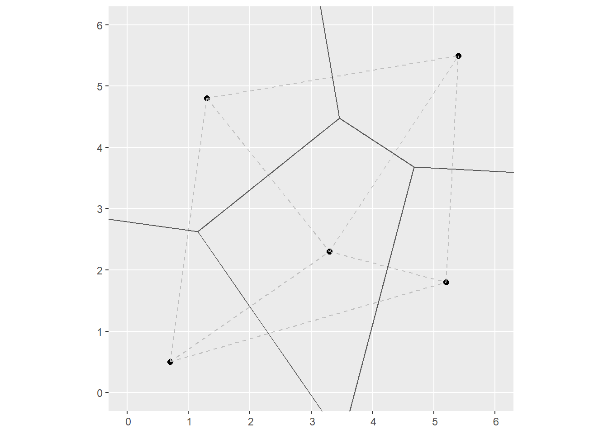
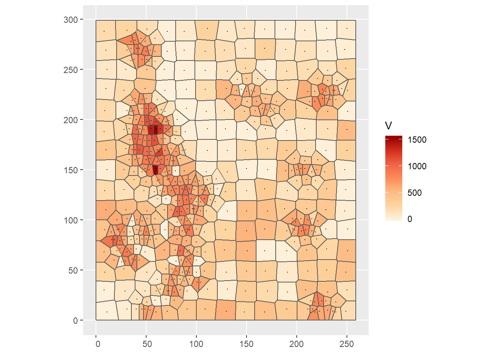
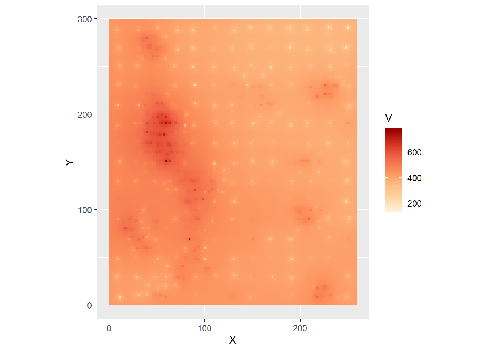
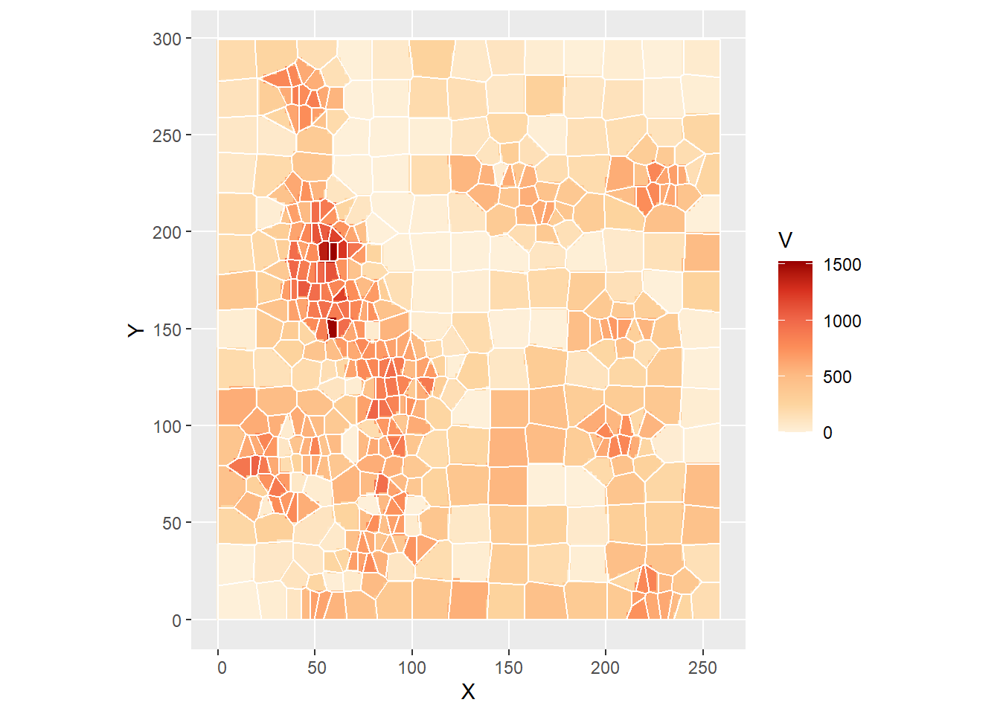

# Spatially Continuous Data I {#spatially-continuous-data-i}

*NOTE*: You can download the source files for this book from [here](https://github.com/paezha/Spatial-Statistics-Course). The source files are in the format of R Notebooks. Notebooks are pretty neat, because the allow you execute code within the notebook, so that you can work interactively with the notes.

If you wish to work interactively with this chapter you will need the following:

* An R markdown notebook version of this document (the source file).

* A package called `geog4ga3`.

You will also use a custom function that is included in the package `geog4ga3` as follows:

`kpointmeans(source_xy, z, target_xy, k, latlong)`

This is a function to calculate k-point means. It takes a set of source coordinates (`source_xy`), that is, the coordinates of observations to be used for interpolation; a variable `z` to interpolate; a set of target coordinates (`target_xy`), the points to interpolate `z`; the number of nearest neighbors `k`; and a logical value to indicate whether the coordinates are latitude-longitude (the default is `FALSE`).

## Learning objectives

Previously, you learned about the analysis of area data. Starting with this practice, you will be introduced to another type of spatial data: continuous data, also called fields. In this practice, you will learn:

1. About spatially continuous data/fields.
2. Exploratory visualization.
3. The purpose of spatial interpolation.
4. The use of tile-based approaches.
5. Inverse distance weighting.
6. K-point means.

## Suggested readings

- Bailey TC and Gatrell AC [-@Bailey1995] Interactive Spatial Data Analysis, Chapters 5 and 6. Longman: Essex.
- Bivand RS, Pebesma E, and Gomez-Rubio V [-@Bivand2008] Applied Spatial Data Analysis with R, Chapter 8. Springer: New York.
- Brunsdon C and Comber L [-@Brunsdon2015R] An Introduction to R for Spatial Analysis and Mapping, Chapter 6, Sections 6.7 and 6.8. Sage: Los Angeles.
- Isaaks EH and Srivastava RM  [-@Isaaks1989applied] An Introduction to Applied Geostatistics, **CHAPTERS**. Oxford University Press: Oxford.
- O'Sullivan D and Unwin D [-@Osullivan2010] Geographic Information Analysis, 2nd Edition, Chapters 9 and 10. John Wiley & Sons: New Jersey.

## Preliminaries

As usual, it is good practice to clear the working space to make sure that you do not have extraneous items there when you begin your work. The command in R to clear the workspace is `rm` (for "remove"), followed by a list of items to be removed. To clear the workspace from _all_ objects, do the following:

```r
rm(list = ls())
```

Note that `ls()` lists all objects currently on the worspace.

Load the libraries you will use in this activity:

```r
library(deldir)
library(geog4ga3)
library(plotly)
library(spatstat)
library(spdep)
library(tidyverse)
```

Begin by loading the data you will need for this Chapter:

```r
data("Walker_Lake")
```

You can verify the contents of the dataframe:

```r
summary(Walker_Lake)
```

```
##       ID                  X               Y               V         
##  Length:470         Min.   :  8.0   Min.   :  8.0   Min.   :   0.0  
##  Class :character   1st Qu.: 51.0   1st Qu.: 80.0   1st Qu.: 182.0  
##  Mode  :character   Median : 89.0   Median :139.5   Median : 425.2  
##                     Mean   :111.1   Mean   :141.3   Mean   : 435.4  
##                     3rd Qu.:170.0   3rd Qu.:208.0   3rd Qu.: 644.4  
##                     Max.   :251.0   Max.   :291.0   Max.   :1528.1  
##                                                                     
##        U           T      
##  Min.   :   0.00   1: 45  
##  1st Qu.:  83.95   2:425  
##  Median : 335.00          
##  Mean   : 613.27          
##  3rd Qu.: 883.20          
##  Max.   :5190.10          
##  NA's   :195
```

This dataframe includes a sample of of geocoded observations with false coordinates `X` and `Y`, of two quantitative variables `V`, `U`, and a factor variable `T`. The variables are generic, but you can think of them as measurements of pollutants. The Walker Lake dataset originally was used for teaching geostatistics in Isaaks and Srivastava's [-@Isaaks1989applied] book [An Introduction to Geostatistics](https://books.google.ca/books?id=vC2dcXFLI3YC&dq=introduction+to+applied+geostatistics+isaaks+and+srivastava&hl=en&sa=X&ved=0ahUKEwiKg6_iyrXZAhUjp1kKHd_jAVcQ6AEIKTAA).

## Spatially continuous (field) data

Previously in the book we discussed two types of data that are of interest in spatial analysis: points and events, and areas.

The last section of the course will deal with a third type of data that finds numerous applications in many disciplines.

We will begin by recalling that there are different _units of support_ for spatial data. The unit of support is the type of spatial object that is used to represent a spatial phenomenon, and that is useful to understand the kind of process and the types of analysis that can be applied.

In the case of point pattern analysis, the unit of support is the point. Depending on the scale of the analysis, the point could be anything from the centroid of cells, the location of trees, the addresses of businesses, or the centers of cities at a much larger scale. Obviously, none of these objects are actual points (the point is a theoretical object). However, points are a reasonable representation for events when their size is minuscule compared to the area of the region under analysis. The most basic attribute of an event is whether it is present (e.g., is there a tree at this location?). Other attributes are conditional on that one.

In the case of areas, the unit of support is a zone. Data in this type of analysis may or not be generated by a discontinuous process, but once it has been cast in the form of statistics for areas, this will usually involve discontinuities at the edges of the areas.

An important difference between point pattern analysis and analysis of data in areas is the source of the randomness.

In the case of point pattern analysis, the coordinates of the event are assumed to be the outcome of a random process. In area data, the locations of the data are exogenously given, and the source of randomness instead is in the values of the attributes.

This brings us to spatially continuous data.

Superficially, spatially continuous data looks like points. This is because of how a field is measured at discrete locations. The underlying process, however, is not discrete, and a field can in principle be measured at any location in the space where the underlying phenomenon is in operation. Some obvious examples of this include temperature and elevation. Temperature is measured at discrete locations, but the phenomenon itself is extensive. Same thing with elevation. 

The source of randomness in the case of fields is the inherent uncertainty of the outcome of the process at locations where it was not measured. Therefore, an essential task is to predict values at unmeasured locations. We call this task _spatial interpolation_. In addition, we often are interested in assessing the degree of uncertainty of predictions or interpolated values.

The study of continuous data has been heavily influenced by the work of South African mining engineer [D.G. Krige](https://en.wikipedia.org/wiki/Danie_G._Krige), who sought to estimate the distribution of minerals based on samples of boreholes. Since then, the study of fields has found applications in remote sensing, real estate appraisal, environmental science, hydrogeology, and many other disciplines.

We will define a field as a mixed spatial process that depends on the coordinates $u_i$ and $v_i$, in addition to a vector of covariates $\bf{x}_i$:
$$
z_i = f(u_i, v_i, \bf{x}_i) + \epsilon_i
$$
where $i$ is an arbitrary location in the region, and $\epsilon_i$ is the difference between the systematic description of the process (i.e., $f(u_i, v_i, \bf{x}_i)$) and the value of the field $z$.

More simply, a field could be the outcome of a purely spatial process as follows:
$$
z_i = f(u_i, v_i) + \epsilon_i
$$

The value of a field is known at the locations $i$ where it is measured. In locations where the field was not measured (we will call any such location $p$), there will be some uncertainty about the value of the field variable, which stems from our limited knowledge of the underlying process. As a consequence, there will be a random term associated with any prediction of the value of the field:
$$
\hat{z}_p = \hat{f}(u_p, v_p) + \hat{\epsilon}_p
$$
We use the hat notation to indicate that these are estimates of the true values.

A key task in the analysis of fields is to determine a suitable function for making predictions $\hat{z}_p$ and to estimate the uncertainty as well.

In this and upcoming sessions you will learn about methods to achieve this task. 

## Exploratory visualization

We will begin our discussion of fields with techniques for exploratory visualization. The methods are very similar to those used for marked point patterns in point pattern analysis. Like we did there, we can use dot or proportional symbol maps. For example, we can create a proportional symbol map of the variable `V` in the Walker Lake dataset (with alpha = 0.5 for some transparency to mitigate the overplotting):

```r
ps1 <- ggplot(data = Walker_Lake, 
              aes (x = X, y = Y, color = V, size = V)) +
  geom_point(alpha = 0.5) + # `alpha` is used to control the transparency of the objects, with 1 being completely opaque and 0 completely transparent.
  scale_color_distiller(palette = "OrRd", trans = "reverse") +
  coord_equal() #'Coord_equal' ensures that units in the x and y axis are displayed using the same lengths.

ps1
```


The proportional symbols indicate the location where a measurement was made. There is no randomness in these locations, as they were selected by design. In particular, notice how a regular grid seems to have been used for part of the sampling, and then possibly there was further infill sampling at those places where the field appeared to vary more.

Imagine that the observations are of a contaminant. The task could be to calculate the total amount of the contaminant over the region. This would require you to obtain estimates of the contaminant in all the region, not just those places where measurements were made. If, as is typically the case, making more observations is expensive, other approaches must be adopted.

Before proceeding, remember that the package `plotly` can be used to enhance exploratory analysis by allowing user interactivity. Below is the same plot as before, but now as an interactive 3D scatterplot:

```r
plot_ly(data = Walker_Lake, x = ~X, y = ~Y, z = ~V,
         marker = list(color = ~V, colorscale = c("Orange", "Red"), 
                       showscale = TRUE)) %>% 
  add_markers() #adding traces to a plotly visualization
```

<!--html_preserve--><div id="htmlwidget-bff575c7b2d91f93072c" style="width:672px;height:480px;" class="plotly html-widget"></div>
<script type="application/json" data-for="htmlwidget-bff575c7b2d91f93072c">{"x":{"visdat":{"55981eac6b1d":["function () ","plotlyVisDat"]},"cur_data":"55981eac6b1d","attrs":{"55981eac6b1d":{"x":{},"y":{},"z":{},"marker":{"color":{},"colorscale":["Orange","Red"],"showscale":true},"alpha_stroke":1,"sizes":[10,100],"spans":[1,20],"type":"scatter3d","mode":"markers","inherit":true}},"layout":{"margin":{"b":40,"l":60,"t":25,"r":10},"scene":{"xaxis":{"title":"X"},"yaxis":{"title":"Y"},"zaxis":{"title":"V"}},"hovermode":"closest","showlegend":false},"source":"A","config":{"showSendToCloud":false},"data":[{"x":[11,8,9,8,9,10,9,11,10,8,9,10,11,10,8,31,29,28,31,28,30,28,28,30,28,31,28,30,31,31,49,49,51,49,50,51,48,49,51,48,50,49,51,50,51,71,71,70,68,69,68,68,69,69,70,69,69,68,71,71,91,91,90,91,91,91,89,88,89,89,90,90,88,88,88,109,111,108,109,108,110,109,110,111,111,110,109,109,109,111,130,131,130,128,129,131,129,131,131,129,128,130,131,128,131,148,149,150,151,150,150,150,150,149,151,148,150,149,149,148,168,171,169,168,168,171,168,171,171,169,170,170,169,168,168,190,191,191,190,190,188,191,189,190,190,188,191,190,189,189,211,209,211,210,209,210,211,208,209,208,210,211,211,208,208,231,231,230,230,229,229,230,228,229,231,231,229,231,231,230,249,250,249,251,251,248,249,248,250,250,251,251,249,248,250,40,21,28,29,41,18,39,18,41,21,31,41,21,60,40,51,59,41,59,51,50,59,60,60,38,50,50,61,39,61,38,61,39,49,58,39,60,40,51,60,40,58,38,50,61,39,59,41,49,51,59,39,59,38,78,60,70,70,78,61,78,80,58,71,70,79,80,61,79,71,78,80,69,79,80,70,81,100,80,90,88,100,80,101,101,79,90,100,81,100,80,91,101,81,98,81,90,100,98,90,99,121,111,108,120,119,158,140,150,151,161,141,160,139,178,159,169,170,180,178,158,219,198,211,208,221,199,220,198,220,200,208,210,221,198,219,200,239,218,229,239,218,238,218,231,230,240,221,239,218,35,24,34,23,54,46,55,45,53,46,55,43,55,44,55,46,54,43,73,64,75,64,73,64,75,63,73,64,93,86,93,84,93,86,96,85,93,86,114,106,155,145,174,166,215,205,215,204,236,223,236,226,35,24,36,26,16,43,15,46,36,54,46,54,43,65,33,36,53,44,65,34,33,55,46,63,34,65,35,46,36,35,53,46,45,35,35,84,84,75,73,63,84,76,84,86,73,76,94,85,104,93,75,94,85,104,75,95,83,94,103,114,104,196,215,204,196,195,216,225,214,245,233,226,213],"y":[8,30,48,68,90,110,129,150,170,188,209,231,250,269,288,11,29,51,68,88,110,130,150,171,190,209,229,250,269,289,11,29,48,68,88,109,129,151,168,190,211,231,250,268,290,9,29,51,70,90,110,128,148,169,191,208,229,250,268,288,11,29,49,68,91,111,130,149,170,188,211,230,249,269,288,11,31,49,68,88,109,129,148,169,191,208,230,249,268,291,9,31,48,70,90,109,128,148,169,191,209,231,248,269,288,8,29,49,69,89,109,129,151,169,190,208,228,251,271,291,8,29,49,69,91,109,131,150,171,191,210,230,249,271,290,11,28,48,69,89,111,129,149,169,189,210,231,248,270,290,11,30,49,70,90,111,130,151,168,191,211,228,250,268,289,10,28,50,71,91,110,131,148,169,191,208,228,249,268,291,9,30,48,69,91,109,130,150,169,190,208,229,251,270,291,71,69,80,59,81,80,60,60,90,90,101,100,100,8,11,18,20,21,90,101,81,101,81,151,148,160,138,158,160,139,140,170,170,179,179,181,191,190,198,198,200,208,209,221,220,221,268,271,278,260,281,279,258,260,28,29,41,21,41,41,20,131,128,140,121,138,119,121,149,160,159,168,181,181,188,198,200,48,49,58,39,60,59,38,68,70,79,78,81,91,89,99,100,98,111,108,120,118,130,140,138,131,140,121,141,118,228,229,241,218,241,240,218,220,211,209,221,198,218,201,198,88,90,100,80,99,98,81,78,150,150,159,140,160,161,139,139,8,8,19,18,18,229,228,239,221,239,241,220,218,71,71,88,91,10,11,89,89,150,148,168,170,191,191,211,211,269,271,29,31,129,129,149,151,171,168,188,191,48,48,70,69,90,89,111,108,131,131,131,130,229,230,208,211,89,89,148,151,9,9,229,230,80,79,61,58,80,60,88,99,99,80,81,161,161,160,160,170,179,180,181,180,191,199,198,201,201,210,208,220,219,271,258,260,281,278,259,30,41,40,141,140,138,159,161,169,199,51,61,60,38,41,90,101,100,109,110,121,119,140,139,120,118,91,101,101,101,149,11,19,19,231,220,221,218],"z":[0,0,224.4,434.4,412.1,587.2,192.3,31.3,388.5,174.6,187.8,82.1,81.1,124.3,188,28.7,78.1,292.1,895.2,702.6,490.3,136.1,335,277,206.1,24.5,198.1,60.3,312.6,240.9,653.3,96.4,105,37.8,820.8,450.7,190.4,773.3,971.9,762.4,968.3,394.7,343,863.8,159.6,445.8,673.3,252.6,537.5,0,329.1,646.3,616.2,761.3,918,97.4,0,0,0,2.4,368.3,91.6,654.7,645.5,907.2,826.3,975.3,551.1,155.5,10.7,0,0,0,12.1,62.2,399.6,176.6,402,260.6,192,237.6,702,38.5,22.1,2.7,17.9,174.2,12.9,187.8,268.8,572.5,29.1,75.2,399.9,243.1,0,244.7,185.2,26,0,100.3,530.3,107.4,159.3,70.7,260.2,326,332.7,531.3,547.2,482.7,84.1,4.7,180.6,0,342.4,602.3,209.1,79.4,104.1,446,189.9,280.4,0,499.3,457.3,341.2,0,208.3,99.7,636.6,173.1,17,283.1,30.9,348.5,22.4,59.1,0,326,325.1,114.7,481.6,324.1,10.9,332.9,184.4,146.6,92,2.5,358.1,473.3,308.8,406.8,812.1,339.7,223.9,673.5,141,61.8,258.3,590.3,166.9,125.2,29.3,617.6,425.9,295.7,224.9,31.7,377.4,333.3,351,0,137.6,451.2,639.5,119.9,27.2,2.1,167.7,147.8,442.7,487.7,0,28.2,0,18.3,266.3,502.3,0,240.9,234.4,22.4,45.6,76.2,284.3,606.8,772.7,269.5,1036.7,783.8,519.4,414.9,601.4,579.2,601.4,594.6,550.1,99.4,233.6,14.4,115.9,506.2,502.4,608,363.9,385.6,1521.1,340.9,879.1,413.4,868.9,657.4,477,268.5,806.4,914.4,811.5,1113.6,1008,1528.1,970.9,1109,1203.9,641.3,720.6,665.3,543.3,101.1,615.9,543.1,868.8,583,670.7,148.8,798,194.9,635.2,781.6,238.6,472,58.1,600.3,64.9,505.9,801.6,158.8,606.3,30.7,730.1,421.2,104.8,44.1,801.1,742,689.1,424.6,184.3,245.2,630,0,48.7,757.4,739.8,520.7,0,0,730.5,383.1,508.8,573.3,372.4,585.8,397.2,614.5,734.9,599.3,181.2,744.8,1022.3,899.3,363.7,513.2,648.8,645.4,13,190.3,893,104.7,150.4,558.4,558,318.5,394.3,141.9,112.5,580.4,535.9,398.2,517.3,427.2,367.6,374.7,144.8,169.8,235.1,611.7,746.4,436.6,540.9,801,272.1,204.1,543.9,606.2,356,440.9,301.8,369.4,166.8,230.9,240.3,737.1,518.6,390.7,797.4,602.6,430.8,354.1,602.4,172.6,324.8,420.1,763.5,687.8,735.8,86.9,817,637.9,512.3,423.4,569.6,858,234,876,1082.8,1392.6,646.6,889.7,509.2,613.1,767.8,649.4,235.4,782.8,227.3,722.9,974.5,512.2,1215.8,687.1,1259.9,684.5,471.9,512.1,963.9,874,582.4,553.2,937.3,883.6,879,268.4,651.5,386.4,33.2,339.2,600.3,595.2,809.6,293.3,697.3,515.9,613.2,665.3,813.6,174.8,891.8,699.6,39.5,915.6,584,610,566.8,38.1,483,542.6,959.3,631.9,928.3,431,672.3,1003.4,876.4,734.1,366,296.5,1069.2,804.3,731.1,318.1,238.6,428.9,737.4,429.1,597.4,442.6,765.2,605.5,795.9,235,562,411.4,696.7,790.9,696.5,687.3,597.5,437.4,317.4,470.7,498.7,778.7,523.3,617.1,395.3,518.9,383.7,704.1,562.3,655.3,823.6,847.7,607.5,491.2,319.5,594,433.5,209.6,533.8,592.4,478.7,660.2,832.2,242.5,161.2,626,800.1,482.6],"marker":{"color":[0,0,224.4,434.4,412.1,587.2,192.3,31.3,388.5,174.6,187.8,82.1,81.1,124.3,188,28.7,78.1,292.1,895.2,702.6,490.3,136.1,335,277,206.1,24.5,198.1,60.3,312.6,240.9,653.3,96.4,105,37.8,820.8,450.7,190.4,773.3,971.9,762.4,968.3,394.7,343,863.8,159.6,445.8,673.3,252.6,537.5,0,329.1,646.3,616.2,761.3,918,97.4,0,0,0,2.4,368.3,91.6,654.7,645.5,907.2,826.3,975.3,551.1,155.5,10.7,0,0,0,12.1,62.2,399.6,176.6,402,260.6,192,237.6,702,38.5,22.1,2.7,17.9,174.2,12.9,187.8,268.8,572.5,29.1,75.2,399.9,243.1,0,244.7,185.2,26,0,100.3,530.3,107.4,159.3,70.7,260.2,326,332.7,531.3,547.2,482.7,84.1,4.7,180.6,0,342.4,602.3,209.1,79.4,104.1,446,189.9,280.4,0,499.3,457.3,341.2,0,208.3,99.7,636.6,173.1,17,283.1,30.9,348.5,22.4,59.1,0,326,325.1,114.7,481.6,324.1,10.9,332.9,184.4,146.6,92,2.5,358.1,473.3,308.8,406.8,812.1,339.7,223.9,673.5,141,61.8,258.3,590.3,166.9,125.2,29.3,617.6,425.9,295.7,224.9,31.7,377.4,333.3,351,0,137.6,451.2,639.5,119.9,27.2,2.1,167.7,147.8,442.7,487.7,0,28.2,0,18.3,266.3,502.3,0,240.9,234.4,22.4,45.6,76.2,284.3,606.8,772.7,269.5,1036.7,783.8,519.4,414.9,601.4,579.2,601.4,594.6,550.1,99.4,233.6,14.4,115.9,506.2,502.4,608,363.9,385.6,1521.1,340.9,879.1,413.4,868.9,657.4,477,268.5,806.4,914.4,811.5,1113.6,1008,1528.1,970.9,1109,1203.9,641.3,720.6,665.3,543.3,101.1,615.9,543.1,868.8,583,670.7,148.8,798,194.9,635.2,781.6,238.6,472,58.1,600.3,64.9,505.9,801.6,158.8,606.3,30.7,730.1,421.2,104.8,44.1,801.1,742,689.1,424.6,184.3,245.2,630,0,48.7,757.4,739.8,520.7,0,0,730.5,383.1,508.8,573.3,372.4,585.8,397.2,614.5,734.9,599.3,181.2,744.8,1022.3,899.3,363.7,513.2,648.8,645.4,13,190.3,893,104.7,150.4,558.4,558,318.5,394.3,141.9,112.5,580.4,535.9,398.2,517.3,427.2,367.6,374.7,144.8,169.8,235.1,611.7,746.4,436.6,540.9,801,272.1,204.1,543.9,606.2,356,440.9,301.8,369.4,166.8,230.9,240.3,737.1,518.6,390.7,797.4,602.6,430.8,354.1,602.4,172.6,324.8,420.1,763.5,687.8,735.8,86.9,817,637.9,512.3,423.4,569.6,858,234,876,1082.8,1392.6,646.6,889.7,509.2,613.1,767.8,649.4,235.4,782.8,227.3,722.9,974.5,512.2,1215.8,687.1,1259.9,684.5,471.9,512.1,963.9,874,582.4,553.2,937.3,883.6,879,268.4,651.5,386.4,33.2,339.2,600.3,595.2,809.6,293.3,697.3,515.9,613.2,665.3,813.6,174.8,891.8,699.6,39.5,915.6,584,610,566.8,38.1,483,542.6,959.3,631.9,928.3,431,672.3,1003.4,876.4,734.1,366,296.5,1069.2,804.3,731.1,318.1,238.6,428.9,737.4,429.1,597.4,442.6,765.2,605.5,795.9,235,562,411.4,696.7,790.9,696.5,687.3,597.5,437.4,317.4,470.7,498.7,778.7,523.3,617.1,395.3,518.9,383.7,704.1,562.3,655.3,823.6,847.7,607.5,491.2,319.5,594,433.5,209.6,533.8,592.4,478.7,660.2,832.2,242.5,161.2,626,800.1,482.6],"colorscale":["Orange","Red"],"showscale":true,"line":{"color":"rgba(31,119,180,1)"}},"type":"scatter3d","mode":"markers","error_y":{"color":"rgba(31,119,180,1)"},"error_x":{"color":"rgba(31,119,180,1)"},"line":{"color":"rgba(31,119,180,1)"},"frame":null}],"highlight":{"on":"plotly_click","persistent":false,"dynamic":false,"selectize":false,"opacityDim":0.2,"selected":{"opacity":1},"debounce":0},"shinyEvents":["plotly_hover","plotly_click","plotly_selected","plotly_relayout","plotly_brushed","plotly_brushing","plotly_clickannotation","plotly_doubleclick","plotly_deselect","plotly_afterplot","plotly_sunburstclick"],"base_url":"https://plot.ly"},"evals":[],"jsHooks":[]}</script><!--/html_preserve-->

## Tile-based methods

Another common approach to visualize fields is by means of tile-based methods. These methods take a set of points and convert them into a tesselation, thus giving them the aspect of "tiles". 

A widely used algorithm to convert points into tiles is called Voronoi polygons, after [Georgy Voronoi](https://en.wikipedia.org/wiki/Georgy_Voronoy), the mathematician that discovered it. To illustrate how Voronoi polygons are created, we will use a simple example.

1. Given a set of generating points $p_g$ with coordinates $(u_g, u_g)$ (for $g = 1,...,n$) and values of a variable $z_{p_g}$:

```r
# Create a set of coordinates for the example
uv_coords <- matrix(c(0.7, 5.2, 3.3, 1.3, 5.4, 0.5, 1.8, 2.3, 4.8, 5.5), c(5, 2)) %>% 
  st_multipoint("XY")

# Create a window for the points, this is similar to the windows used in `spatstat` for spatial point pattern analysis
box = st_polygon(list(rbind(c(0,0),c(6,0),c(6,6),c(0,6),c(0,0))))

# Create a plot of the coordinates and the window
p <- ggplot(data = uv_coords) + 
  geom_sf(size = 2) +
  geom_sf(data = box, fill = NA)
p
```


2. Each point is connected by means of straight lines to its two nearest neighbors to create a triangulation:

```r
# Create a triangulation that connect each point to its two nearest neighbors. The function `st_triangulate()` from the `sf` package does this. The output can be polygons (triangles) or lines only. We set bOnlyEdges = TRUE to obtain only the lines.
l2n <- st_triangulate(uv_coords, bOnlyEdges = TRUE)

# Plot the triangylation, i.e., the lines between nearest neighbors
ggplot(data = uv_coords) + 
  geom_sf(size = 2) +
  geom_sf(data = box, 
          fill = NA) +
  geom_sf(data = l2n, 
          color = "gray", 
          linetype = "dashed")
```


Notice that the plot above is already a tessellation, with the points at the vertices of the triangles. 

3. The perpendicular bisectors of each triangle are found and extended, until they intersect. The resulting tesselation is a set of Voronoi polygons:

```r
# The function `st_voronoi()` from the `sf` package is used to create Voronoi polygons
vor <- st_voronoi(uv_coords) #Calculates voronoi polygons based on a set of spatial points.

ggplot(data = uv_coords) +
  geom_sf(size = 2) + 
  geom_sf(data = l2n, 
          color = "gray", 
          linetype = "dashed") + 
  geom_sf(data = vor, fill = NA) + 
  coord_sf(xlim = c(0, 6), y = c(0, 6))
```



The triangulation was used to generate a second tesselation, i.e., the Voronoi polygons. These polygons have the property that any point $p_i$ inside the polygon with generating point $p_g$ in it, is closer to $p_g$ than to any other generating point $p_k$ on the plane. For this reason, Voronoi polygons are used to obtain areas of influence, among other applications.

There are other ways of obtaining Voronoi polygons, as Figure 1 below illustrates. Voronoi polygons in the figure are created by radial growth. The basic concept is the same, but implemented in a different way: find every point that is closest to $p_g$. When two circles touch, they become the boundary between all points that are closer to $p_g$ and $p_k$ respectively. Continue growing until the plane is fully covered.


The Voronoi polygons for the sample data set can be obtained in `R` as follows.

First, we will convert the `Walker_Lake` dataframe to a simple features object using as follows:

```r
# Function `st_as_sf()` takes a foreign object (foreign to the `sf` package) and converts it into a simple features object. If the foreign object is points, the coordinates can be named by means of the argument `coords`. 
Walker_Lake.sf <- Walker_Lake %>% 
  st_as_sf(coords = c("X", "Y"))
```

Once we have an `sf` object of the points, the geometry can be used to create the Voronoi polygons:

```r
# The function `do.call(what, arg)` applies a function `what` to the argument `arg`. In this case, we extract the geometry of the `sf` object (i.e., the coordinates of the points) and apply the function `c()` to concatenate the coordinates to obtain a MULTIPOINT object.   
vpolygons <- do.call(c, st_geometry(Walker_Lake.sf)) %>% # The pipe operator passes the MuLTIPOINT object to function `st_voronoi()`
  st_voronoi() %>% # The output of `st_voronoi()` is a collection of geometries, which we pass to the following function for extraction.
  st_collection_extract()
```

After the step above we already have the Voronoi polygons:

```r
ggplot(vpolygons) + 
  geom_sf(fill = NA)
```


However, these polygons are just the geometry and lack other attributes that we originally had for the points. See:

```r
head(vpolygons)
```

```
## Geometry set for 6 features 
## geometry type:  POLYGON
## dimension:      XY
## bbox:           xmin: -275 ymin: -19.79545 xmax: 39.35 ymax: 232.9318
## epsg (SRID):    NA
## proj4string:    NA
## First 5 geometries:
```

```
## POLYGON ((-275 91.88636, -275 109.5, -180.5 109...
```

```
## POLYGON ((-275 49, -275 91.88636, 4.207317 79.1...
```

```
## POLYGON ((-275 -19.79545, -275 49, -171.5 49, 1...
```

```
## POLYGON ((20.40385 52.61538, 18.36567 50.35075,...
```

```
## POLYGON ((18.36567 50.35075, 20.40385 52.61538,...
```

For this reason, we need to join the Voronoi polygons to the attributes of the points. To do this, we will first copy the `sf` object with the original points to a new dataframe, and then replace the geometry of the points with the geometry of the polygons:

```r
Walker_Lake.v <- Walker_Lake.sf
Walker_Lake.v$geometry <- vpolygons[unlist(st_intersects(Walker_Lake.sf, vpolygons))] 
```

The new `Walker_Lake.v` object now includes the attributes of the original points as well as the geometry of the polygons:

```r
head(Walker_Lake.v)
```

```
## Simple feature collection with 6 features and 4 fields
## geometry type:  POLYGON
## dimension:      XY
## bbox:           xmin: -275 ymin: -275 xmax: 35.5 ymax: 120
## epsg (SRID):    NA
## proj4string:    NA
## # A tibble: 6 x 5
##   ID        V     U T                                                   geometry
##   <chr> <dbl> <dbl> <fct>                                              <POLYGON>
## 1 1        0     NA 2     ((35.5 -275, -275 -275, -275 -19.79545, 18.05556 20.1~
## 2 2        0     NA 2     ((-275 -19.79545, -275 49, -171.5 49, 18.9248 38.4208~
## 3 3      224.    NA 2     ((-171.5 49, 8.1875 57.98438, 18.36567 50.35075, 20.0~
## 4 4      434.    NA 2     ((-275 49, -275 91.88636, 4.207317 79.19512, 14.18919~
## 5 5      412.    NA 2     ((-275 91.88636, -275 109.5, -180.5 109.5, 10.8913 99~
## 6 6      587.    NA 2     ((-180.5 109.5, 19 120, 20 119.1, 20 109.95, 10.8913 ~
```

We can now plot the attributes as the polygons. The value of $z$ for a tile is the same as the value of the variable for its corresponding generating point, or $z_{p_g}$. This is the plot for the current example:

```r
ggplot(Walker_Lake.v) + 
  geom_sf(aes(fill = V)) +
  scale_fill_distiller(palette = "OrRd", direction = 1)
```


We can see that the Voronoi polygons extend well beyond the extent of the original points, and in the plot add a large amount of unecessary area. We can improve the plot in two ways, by limiting the extent for plotting, or by clipping the polygons. Here we will try the latter, with a bounding box that covers the region of interest:

```r
# Function `st_polygon()` creates an `sf` object with a polygon or polygons. In this case, we create a single polygon, a rectangle with corners given by the coordinates in the function. 
W.bbox <- st_polygon(list(rbind(c(0,0),c(259,0),c(259, 299),c(0, 299),c(0,0))))
```

The intersection of the polygons with the box clips the polygons:

```r
Walker_Lake.v <- Walker_Lake.v %>%
  st_intersection(W.bbox)
```

```
## Warning: attribute variables are assumed to be spatially constant throughout all
## geometries
```

This is the plot after fixing this issue:

```r
ggplot(Walker_Lake.v) + 
  geom_sf(aes(fill = V)) + 
  geom_sf(data = Walker_Lake.sf, size = 0.1) +
  scale_fill_distiller(palette = "OrRd", direction = 1)
```



As you can see, the points in the sample have been converted to a surface from which the value of $z$ can be estimated at any point as desired, from the value of $z$ of the closest point used to generate the tiles. This can be expressed as follows:
$$
\hat{z}_p = z_{p_g}\text{ for } p_g\text{ with } d_{pp_g}<d_{pp_k}\forall{k}
$$

## Inverse distance weighting (IDW)

The tile-based approach above assumes that the field is flat within each polygon (see Figure 2). This is in most cases an unrealistic assumption. Other approaches to interpolate a spatial variable allow the estimated value of $z_p$ to vary with proximity to observations. Such is the case of IDW.


Inverse distance weighting takes the following form:
$$
\hat{z}_p = \frac{\sum_{i=1}^n{w_{pi}z_i}}{\sum_{i=1}^n{w_{pi}}}
$$

This will probably look familiar to you, because it is formally identical to the spatial moving average. The difference is in how the "spatial weights" $w_{pi}$ are defined. For IDW, the spatial weights are given by a function of the inverse power of distance, as follows:
$$
w_{pi} = \frac{1}{d_{pi}^\gamma}
$$
In the expression above, parameter $\gamma$ controls the steepness of the decay function, with smaller values giving greater weight to more distant locations. Large values of $\gamma$ converge to a 1-point average (so that the interpolated value is identical to the nearest observation; you can verify this).

We can see that inverse distance weighting is a weighted average of _all_ observations in the sample, but with greater weight given to more proximate observations. This approach is implemented in `R` in the package `spatstat` with the function `idw`. To use this function, the points must be converted into a `ppp` object. This necessitates that we define a window object, which we do based on the bounding box that we created for the Voronoi polygons:

```r
# Function `as.owin()` takes the polygon with the bounding box we created above and converts it into an `owin` object for use with the `spatstat` package. 
W.owin <- as.owin(W.bbox)

# We can create a `ppp` object with the coordinates of the points
Walker_Lake.ppp <- as.ppp(X = Walker_Lake[,2:4], W = W.owin)
```

The call to the function requires a `ppp` object and the argument for the power to use in the inverse distance function. In this call, the power is set to 1:

```r
z_p.idw1 <- idw(Walker_Lake.ppp, power = 1)
```

The value (output) of this function is an `im` object. Objects of this type are used by the package `spatstat` to work with raster data. It can be simply plotted as follows:

```r
plot(z_p.idw1)
```


Or the information can be extracted for greater control of the aspect of the plot in `ggplot2`:

```r
ggplot(data = data.frame(expand.grid(X= z_p.idw1$xcol, Y = z_p.idw1$yrow),
                         V = as.vector(t(z_p.idw1$v))), # transpose matrix
       aes(x = X, y = Y, fill = V)) + 
  geom_tile() +
  scale_fill_distiller(palette = "OrRd", direction = 1) +
  coord_equal()
```



Notice the dots where the observations are - the value of the field is known there. We can explore the effect of changing the parameter for the power, by using $\gamma = 0.5, 1, 2, \text{ and } 5$:

```r
z_p.idw05 <- idw(Walker_Lake.ppp, power = 0.5)
z_p.idw2 <- idw(Walker_Lake.ppp, power = 2)
z_p.idw5 <- idw(Walker_Lake.ppp, power = 5)

#Inverse distance weighting for walker lake using three different gamma variables 
```

For ease of comparison, we will collect the information into a single dataframe:

```r
z_p.idw05.df <- data.frame(expand.grid(X= z_p.idw05$xcol, Y = z_p.idw05$yrow),
                         V = as.vector(t(z_p.idw05$v)), Power = "P05")
z_p.idw1.df <- data.frame(expand.grid(X= z_p.idw1$xcol, Y = z_p.idw1$yrow),
                         V = as.vector(t(z_p.idw1$v)), Power = "P1")
z_p.idw2.df <- data.frame(expand.grid(X= z_p.idw2$xcol, Y = z_p.idw2$yrow),
                         V = as.vector(t(z_p.idw2$v)), Power = "P2")
z_p.idw5.df <- data.frame(expand.grid(X= z_p.idw5$xcol, Y = z_p.idw5$yrow),
                         V = as.vector(t(z_p.idw5$v)), Power = "P5")
idw_df <- rbind(z_p.idw05.df, z_p.idw1.df, z_p.idw2.df, z_p.idw5.df)
```

We can now plot using the `facet_wrap` function to compare the results side by side:

```r
ggplot(data = idw_df, aes(x = X, y = Y, fill = V)) + 
  geom_tile() +
  scale_fill_distiller(palette = "OrRd", direction = 1) +
  coord_equal() + 
  facet_wrap(~ Power, ncol = 2)
```


Notice how smaller values of $\gamma$ "flatten" the predictions, in the extreme tending towards to global average, as all observations are weighted equally. Larger values, on the other hand, tend to be the average of a single point, the closest one. In fact, this replicates the Voronoi polygons, as seen in the following plot that combines the Voronoi polygons (without filling!) and the predictions from the IDW algorithm with $\gamma = 5$:

```r
ggplot() + 
  geom_tile(data = subset(idw_df, Power = "P5"), aes(x = X, y = Y, fill = V)) +
  geom_sf(data = Walker_Lake.v, 
               color =  "white", fill = NA) +
  scale_fill_distiller(palette = "OrRd", direction =  1)
```


Clearly, selection of a value for $\gamma$ is an important modelling decision when using IDW.

## $k$-point means

Another interpolation technique that is based on the idea of moving averages is $k$-point means. Again, this will look familiar to you, because it is also formally identical to the spatial moving average:
$$
\hat{z}_p = \frac{\sum_{i=1}^n{w_{pi}z_i}}{\sum_{i=1}^n{w_{pi}}}
$$

The spatial weights in this case, however, are defined in terms of $k$-nearest neighbors:
$$
w_{pi} = \bigg\{\begin{array}{ll}
1 & \text{if } i \text{ is one of } k \text{th nearest neighbors of } p \text{ for a given }k \\
0 & otherwise \\
\end{array}
$$

Clearly, the above becomes:
$$
\hat{z}_p = \sum_{i=1}^n {w_{pi}^{st}z_i}
$$

If row-standardized spatial weights are used.

We can calculate $k$-point means using the example. For this, we need to define a set of "target" coordinates, that is, the points where we wish to interpolate. In addition, we create a matrix with the coordinates of the "source" points, the observations used for interpolation:

```r
target_xy = expand.grid(x = seq(0.5, 259.5, 2.2), y = seq(0.5, 299.5, 2.2))
source_xy = cbind(x = Walker_Lake$X, y = Walker_Lake$Y) #Combines columns or rows of matrix data
```

The value (output) of the function is a dataframe with the coordinates of the target points, as well as estimated values of $\hat{z_p}$ at those points. Using the three nearest neighbors:

```r
kpoint.3 <- kpointmean(source_xy = source_xy, z = Walker_Lake$V, target_xy = target_xy, k =3) %>% 
  rename(X=x, Y=y, V=z)
```

We can plot the interpolated field now:

```r
ggplot() +
  geom_tile(data = kpoint.3, aes(x = X, y = Y, fill = V)) +
  scale_fill_distiller(palette = "OrRd", direction = 1) +
  coord_equal()
```


As with other spatially moving averages, the crucial aspect of implementing $k$-point means is the selection of $k$. A large value will tend towards the global average, whereas a value of 1 will tend to replicate the Voronoi polygons (see below):

```r
# Calculate k-point means using only one point. Rename the variables to match 
kpoint.1 <- kpointmean(source_xy = source_xy, z = Walker_Lake$V, target_xy = target_xy, k = 1) %>% 
  rename(X=x, Y=y, V=z)
```

This is the plot with the Voronoi polygons:

```r
# Plot and overaly the Voronoi polygons
ggplot() + 
  geom_tile(data = kpoint.1, aes(x = X, y = Y, fill = V)) +
  geom_sf(data = Walker_Lake.v, 
               color =  "white", fill = NA) +
  scale_fill_distiller(palette = "OrRd", direction =  1)
```



This shows that Voronoi polygons can be seen as a special case of IDW or $k$-point means depending on the way these two techniques are implemented.
