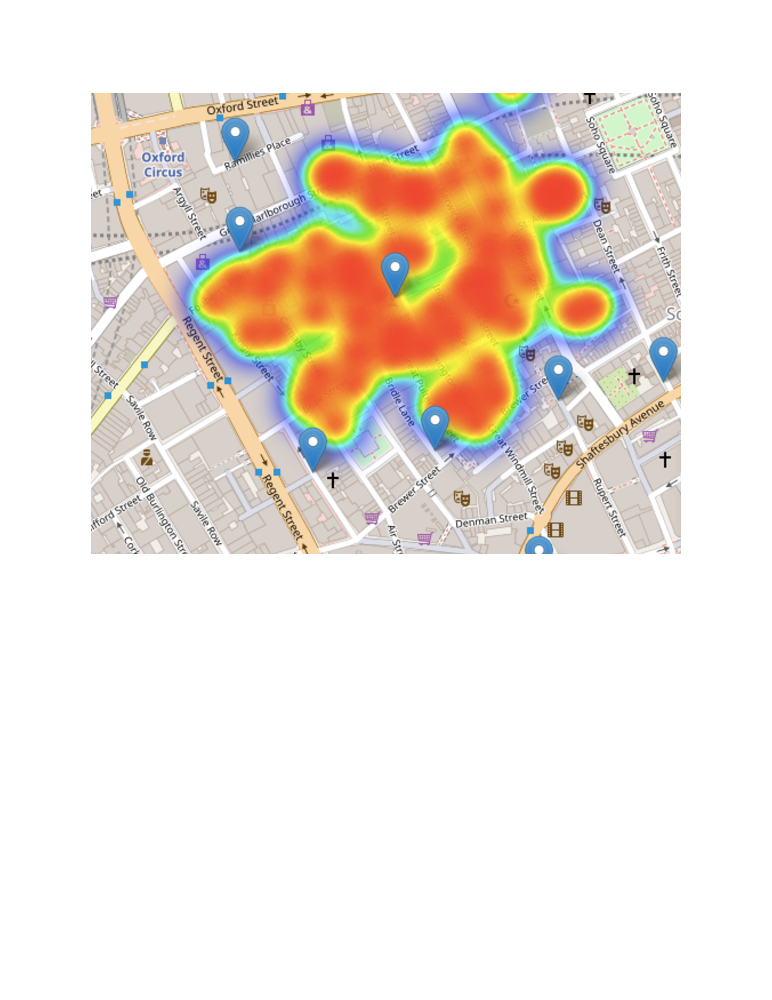

Introduction to Mapping in R 
========================================================
author: Megan Coad and Alexis Polidoro
date: 
autosize: true

Key Concepts
========================================================

- How do we Map in R? 
- Why do we Map? 
- Applications in R 


What is a Map? 
========================================================
- Representation of a parcel of land displaying physical features, roads, elevation, etc... 
- Earliest maps date back to 2300 B.C on Babylonian clay  tablets (Emporia State University, undated)
- Modern mapping techniques allow users to investigate statistical relationships 

Getting Started With R 
========================================================

Key Functions Necessary for Spatial Analysis 


```r
rm(list = ls())
```


```r
library(geog4ga3)
```


```r
data("snow_deaths")
```


Why Do We Map in R? 
========================================================

- Effective method for visualizing the contents of the dataframe
- Example of Broad Street Pumps 


Mapping in R
========================================================


***

- Identify different variables of interest
- Identify locations to look for a pattern
- Simple spatial analysis

Mapping in R Continued
========================================================
- Heat maps: More effective spatial analysis

***



Concluding Remarks
========================================================


- R offers an abundance of ways to analyze information 
- Maps communicate information about a topic 
- We use code in R to visualize problems 


