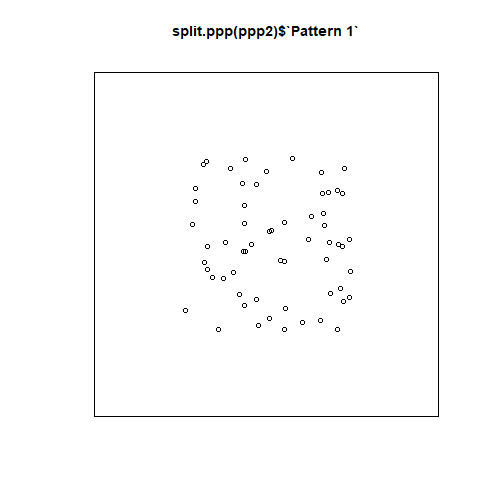
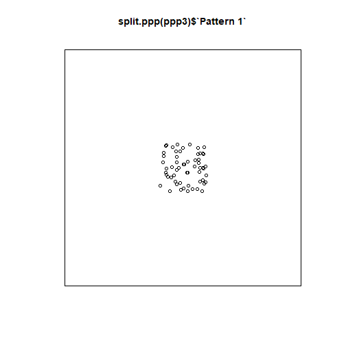

Point Pattern Analysis I
========================================================
author: Megan Coad and Alexis Polidoro
date: 
autosize: true

Key Points
========================================================
- understand what point pattern analysis is 
- intensity vs density 
- quadrats and density maps
- how to make a PPP object

Point Patterns
========================================================


- When only the coordinates are available for a set of data it is called a point pattern
- A point pattern is given by a set of events of interest that are observed in a region $R$
- A region has an infinite number of points (coordinates) on the plane 
- point patterns must be a complete _enumeration_ meaning every event that happened has been recorded

Processes and Point Patterns
========================================================
-  A key question of interest is whether the pattern is random
- Non-random patterns are likely the outcome of some meaningful process
- Deciding whether the pattern is random or not is the initial step towards developing hypotheses about the underlying process 

Faceting
========================================================
Faceting is a convenient way to simultaneously plot different parts of a dataframe.


Intensity and Density
========================================================
- The intensity of a spatial point process is the expected number of events per unit area denoted by $\lambda$
- Usually the process is unknown so intensity cannot be measured
- Instead the density is taken as the empirical estimate of the intensity
- Density is calculated as the number of events/the area of the region

Quadrats and Density Maps
========================================================
- Density can be mapped by means of the `geom_bin2d` function. This function divides two dimensional space into bins and reports the number of events in the bins
- Quadrats allow us to see how the density varies across the region by subdividing the region into a set of smaller subregions 


Quadrats and Density Contd. 
========================================================
- You can calculate the density for each quadrat


***
- You can also change the size of the quadrats

Creating a PPP object
========================================================
- `quadratcount` is a function that returns the number of events per quadrat
- To use this function you need to convert the point patterns to a `ppp`
1. Define the window by means of the `owin` function, and using the 0 to 1 interval for our region


```r
Wnd <- owin(c(0,1), c(0,1))
```

2. Create a `ppp` object


```r
ppp1 <- as.ppp(PointPatterns, Wnd)
```

Visualizing a PPP object 
========================================================

- Objects of the class `ppp` can be plotted using the `plot` function 




Visualizing a PPP Object Contd. 
========================================================
- You can split the different patterns using the function `split.ppp()` to plot each pattern separately




Visualizing a PPP Object Contd. 
========================================================

- `quadratcount` can be used to compute the counts of events
- To calculate the count separately for each pattern use`split.ppp()` 
  

```
List of spatial objects

Pattern 1:
            x
y            [0,0.25) [0.25,0.5) [0.5,0.75) [0.75,1]
  [0.75,1]          3          5          1        6
  [0.5,0.75)        2          3          4        6
  [0.25,0.5)        5          4          2        3
  [0,0.25)          2          4          4        6

Pattern 2:
            x
y            [0,0.25) [0.25,0.5) [0.5,0.75) [0.75,1]
  [0.75,1]         14          2          2        6
  [0.5,0.75)        0          0          4        6
  [0.25,0.5)        6          3          1        2
  [0,0.25)          4          6          2        2

Pattern 3:
            x
y            [0,0.25) [0.25,0.5) [0.5,0.75) [0.75,1]
  [0.75,1]          2         11          5        7
  [0.5,0.75)        1          1          6        4
  [0.25,0.5)        1         10          3        2
  [0,0.25)          2          1          2        2

Pattern 4:
            x
y            [0,0.25) [0.25,0.5) [0.5,0.75) [0.75,1]
  [0.75,1]          4          5          6        3
  [0.5,0.75)        3          3          4        2
  [0.25,0.5)        3          3          4        2
  [0,0.25)          5          4          6        3
```


Defining the Region for Analysis
========================================================
- When conducting analysis with point pattersn it is important to define a region for analysis that is consistent with the pattern of interest
- If the region is to big or to small the data will be harder to intrepret or could be misintrepreted
