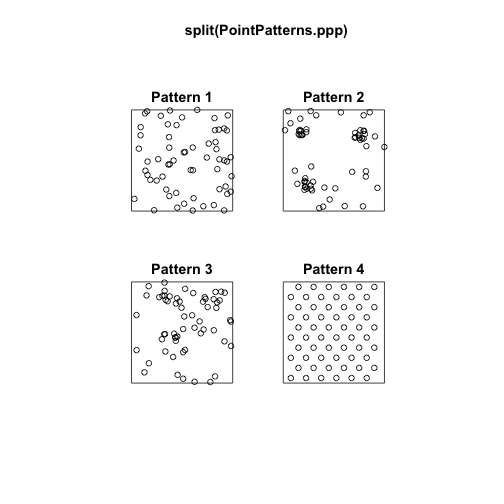
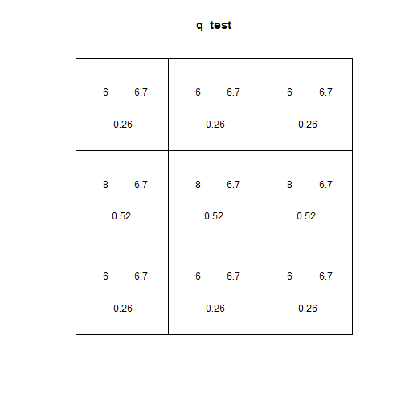
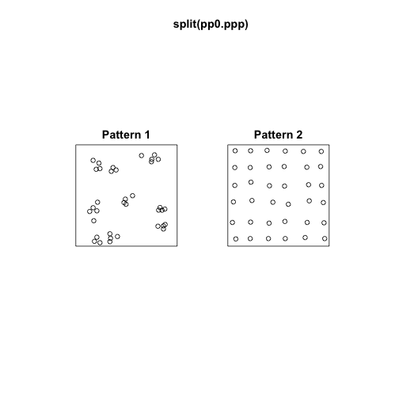
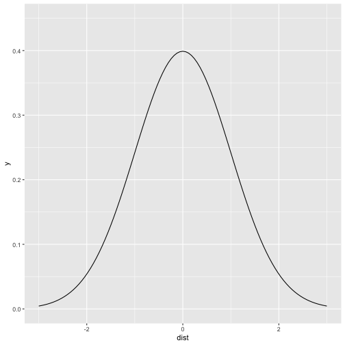
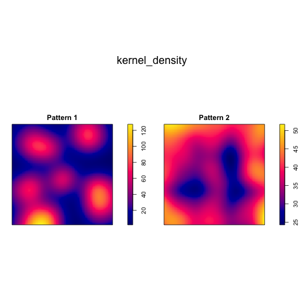

Point Pattern Analysis II
========================================================
author: Megan Coad and Alexis Polidoro
date: 
autosize: true

Key Concepts
========================================================

- Theory of Quadrat Test 
- Understanding the Residual Value
- Limitations of Quadrat Test 
- Kernel Density


Recall: PPP Objects and Quadrat Test  
========================================================



***
- PPP Represents two-dimensional point patterns
- Quadrat Test help us decide whether a pattern is random

Intuition: Calculating Quadrat Test  
========================================================
-Performs a test of Complete Spatial Randomness for a point pattern, based on quadrat counts

```

	Chi-squared test of CSR using quadrat counts
	Pearson X2 statistic

data:  split(PointPatterns.ppp)$"Pattern 4"
X2 = 1.2, df = 8, p-value = 0.006716
alternative hypothesis: two.sided

Quadrats: 3 by 3 grid of tiles
```

Intuition Continued: Plot Results of Quadrat Test  
========================================================

***
- Top left: Number of events in quadrat 
- Top Right: Expected number of events for null landscape
- Bottom: Residual; difference between observed and expected values. 


Calculating X2 (Quadrat Test Value)
========================================================
- Chi Square independence tests for a significant association between the categories of the two variables (events occurring and events expected)
- X2 is alculated using squared sum of the residuals
- The smaller this number, the more likely the event is random

Importance of the p-value
========================================================
- Determines if the point pattern is result of a random process
- When p is small, this indicates it is unlikely that the point pattern reflects the theoretical random pattern, resulting in a random landscape

Limitations: Size and Number of Quadrats 
========================================================
- Changing size of quadrat impacts the counts
- Events will not be properly accounted for if cell is too small
- General Rule: (Q=2A/N)

Limitations Continued: Relative Position of Event
========================================================
- Fails to distinguish between different even distributions


Kernel Density: A solution to Quadrat Test
========================================================
- Moving window over each grid cell
- Assigns highest "weight" to events closest to the centre of the bandwidth
- Accounts for relative position

***



Kernel Density: A solution to Quadrat Test 
========================================================

***


Concluding Remarks
========================================================
- Quadrat Test observes values as counts within a defined cell 
- Pearson residuals increase with difference in quantity of events
- Kernel density accounts for relative position of an event 

