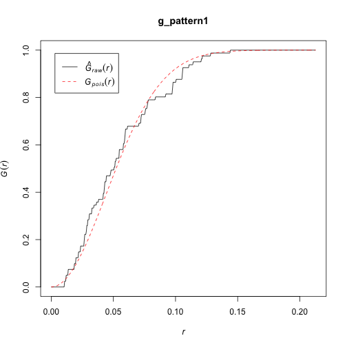
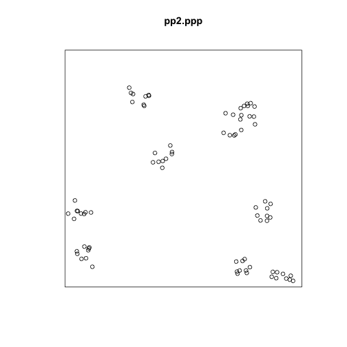
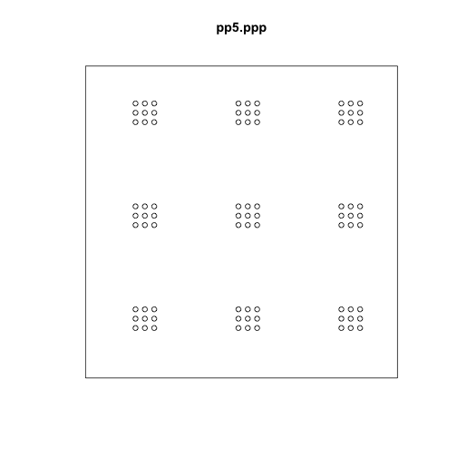
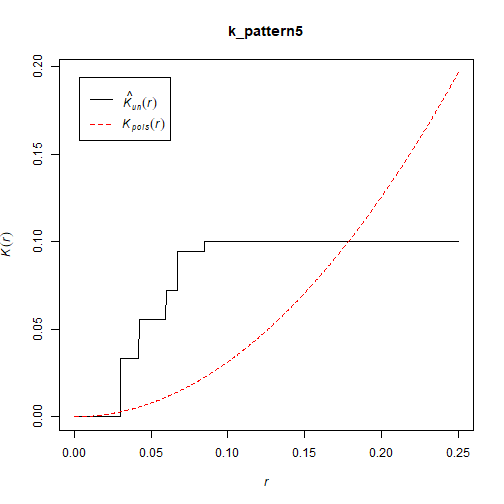

<!---
Reflection: I am happy with this weeks presentation delivery. Students seemed to grasp the differenence between the K and F-functions, and how K acts as a viable solution to the limitations of single-scale functions. However, after the mini lecture presentation and students were working on their activity, there was a great deal of confusion with students in terms of interpreting the difference between F, G, and K. (for exmample, G and K are the same interpretation, F is different). It would be great if an example from the activity could be added into the mini lecture presentation so students will have a better understanding of the functions prior to answering the questions with their peers. It should be clarified in the future that there are similarities between functions and differences as well.
Additionally, it should be clarified how F and G are different, through nearest neighbour or empty space analysis. 
--->

Point Pattern Analysis IV
========================================================
author: Alexis Polidoro and Megan Coad 
date: 
autosize: true

Key Concepts
========================================================

- $\hat{F}$-function
- Identifying Patterns at Multiple Scales
- $\hat{K}$-function 

Recall: G-Function
========================================================

- Cumulative distribution of events to their nearest event
- 40% of events have nearest neighbour at a distance less than X 

***

F-function
========================================================
- Another useful tool for point patterns
- Distribution of "point to nearest event" 
- Points are explained as a coordinate pair in space
- Single scale 

F-function Continued...
========================================================

***
- Empirical below theoretical = clustering

Limitations of the F and G Function
========================================================

- missing patterns at different scales: clustering at small scale, regularity at larger scales

***

K-function
========================================================
- Solution to the limitations of the  $\hat{G}$-function and $\hat{F}$-function 
- Interpreted as counting events in a given radius
- Detects patterns at multiple scales

K-function Continued
========================================================
- empirical>theoretical: clustering 

***

Concluding Remarks
========================================================
- $\hat{F}$-function determines point to their nearest event at a single scale 
- $\hat{G}$-function determines points as "events", to their nearest event at a single scale 
- Single scale does not detect all patterns in a null landscape 
- $\hat{K}$-function  is a useful tool to detemermine nearest events at multiple scales
