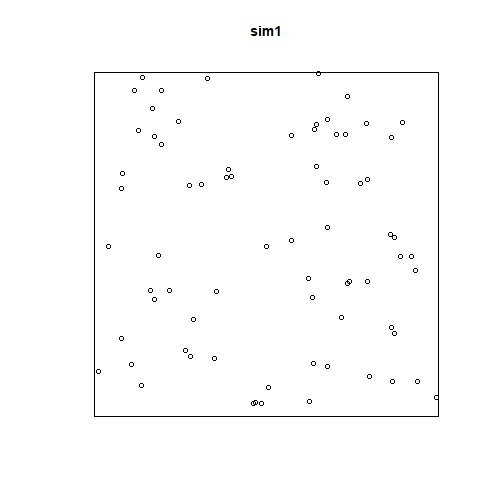
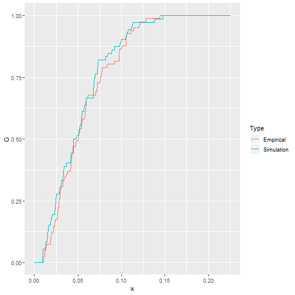
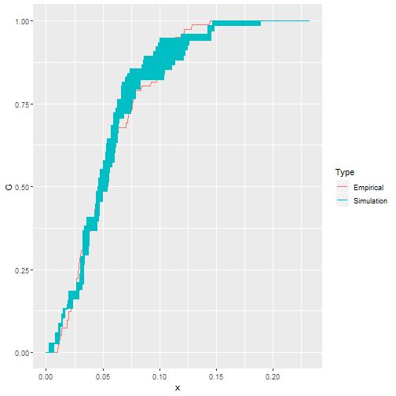
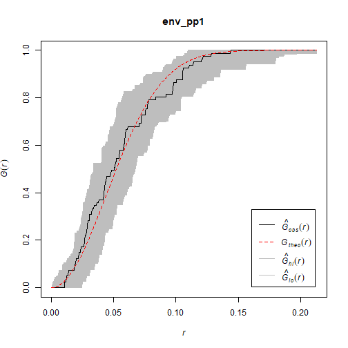
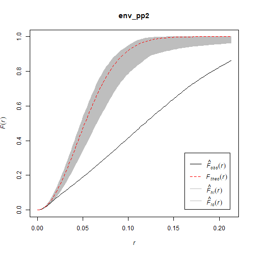
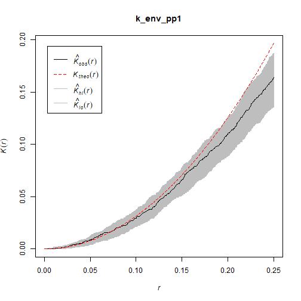

Point Pattern Analysis V
========================================================
author: Megan Coad and Alexis Polidoro
date: 
autosize: true

Key Points
========================================================
- Further understanding of null landscapes 
- understand what simulation envelopes are and why they are used 
- importance of defining a region 
- what edge effects are
- Issues with sample point patterns 


Motivation: Hypothesis Testing 
========================================================
- when making a decision whether the reject a null hypothesis, we determine the probability that we are making a mistake when doing so

Tests of hypothesis are developed following these general steps:

1. Identify a null hypothesis of interest, and if possible alternative hypotheses as well

2. Derive the expected value of the summary statistic of interest.

3. To make a decision whether to reject the null hypothesis, we need to know the _variance_ of the expected value under the null hypothesis.


Recall: Creating a Null Landscape 
========================================================
Create the window:


```r
W <- pp1.ppp$window
```

Generate a null landscape:

```r
sim1 <- rpoispp(lambda = 81, win = W)
```

***

The value of this function is a `ppp` object that can be analyzed:




Creating a Null Landscape Contd. 
========================================================


Lets plot the empirical functions.


- the empirical function is very  similar to the simulated null landscape, But is this purely a coincidence? 
- When we simulate a null landscape, there is the possibility, however improbable, that it will replicate some meaningful process purely by chance.


***




Null Landscape Contd. 
========================================================

To be sure, we can simulate and analyze a second null landscape:


Plot again:



Simulation Envelopes 
========================================================
- the area covered by the $\hat{G}$-functions of the simulated landscapes above are an estimate of the variance. The set of functions estimated on the null landscapes are called _simulation envelopes_.
- The simulation provides a _pseudo-p-value_. If you generate 99 null landscapes, and the empirical pattern is still different, the probability that you are mistaken by rejecting the null hypothesis is at most 1%


- the empirical function falls within the simulation envelopes, and thus it is very unlikely to be different from the null landscapes.

***




Simulation Envelopes Contd. 
========================================================
- Now the empirical function lies outside of the simulation envelopes, which makes it very unlikely that it is similar to the null landscapes.




Defining a Region: 
========================================================

- When defining the region (or window) for the analysis, care must be taken that it is reasonable from the perspective of the process under analysis
- Defining the region in an inappropriate way can easily lead to misleading results


- Based on this we would most likely conclude that the pattern is random.

***




Defining a Region Contd. 
========================================================

Lets now replace the unit-square window by a much larger window:


The point pattern now looks clustered

Edge Effects 
========================================================
- the region should be selected in such a way that it is consistent with the underlying process. This is not always possible. 
- When this is the case, it is necessary to define a boundary that does not correspond necessarily with the extent of the process of interest
- When the extent of the process exceeds the window used in the analysis, the point pattern is observed only partially, and it is possible that the information of the location of events beyond the boundary may introduce some bias

Edge Effects Contd. 
==========================================================
So far, we have used the argument `correction = "none"` when applying the functions. The following alternative corrections are implemented: "none", "rs", "km", "cs" and "best". Alternatively `correction = "all"` selects all options.

These corrections are variations of weighting schemes. In other words, the statistic is weighted to give an unbiased estimator.


Sample Point Patterns
========================================================
- A _sampled_ point pattern, on the other hand, is a pattern where not all events have been recorded
- The bias introduced by sampled point patterns can be extremely serious, because the findings depend heavily of the observations that were recorded as well as those that were not recorded
- Clustered events could easily give the impression of a dispersed pattern, depending on what was observed.
- There are no good solutions to bias introduced by sampled point patterns
