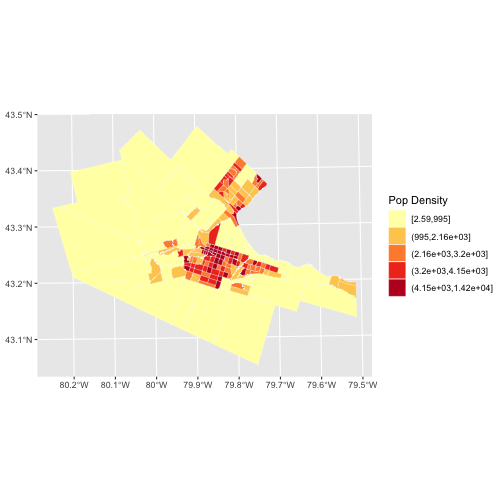

Area Data I
========================================================
author: Alexis Polidoro and Megan Coad 
date: 
autosize: true

Key Concepts
========================================================

- What is area data?
- Processes explained through area data
- Visualizing area data

What is Area Data? 
========================================================
- Data not being allocated to a defined point, but rather an area
- Allocate information by centroids, unique identifers/ attirbutes 
- Centroid: Mean of X and Y coordinates in an area 

Explaining Area Data
========================================================
- Can determine information about an area using points
- Why is income higher in East? (more isolation, escartment) 

***

Visualizing Area Data: Choropleth Maps
========================================================
- Map of the polygons that form the areas in the region, each colored in a way to represent the value of an underlying variable

Visualizing Area Data: Cartograms
========================================================
- Map where the size of the zones is adjusted so that it is proportional to some other variable of interest (population density)

Conclusions
========================================================

- Area data is comprised of a defined boundary of coordinates 
- We can use points to tell us information about an area 
- Choropleth Maps and Cartograms are examples of communicating area data 
