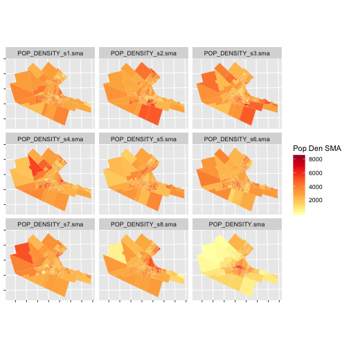
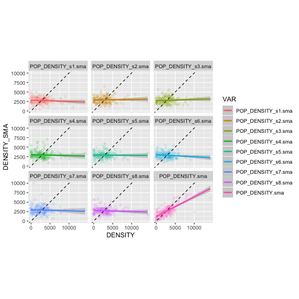
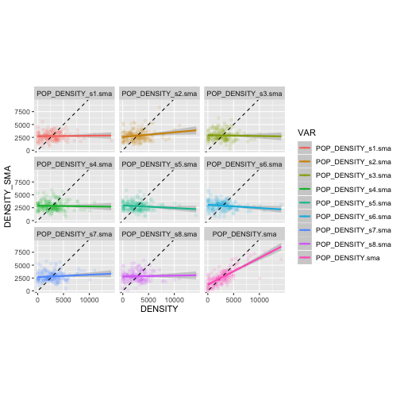
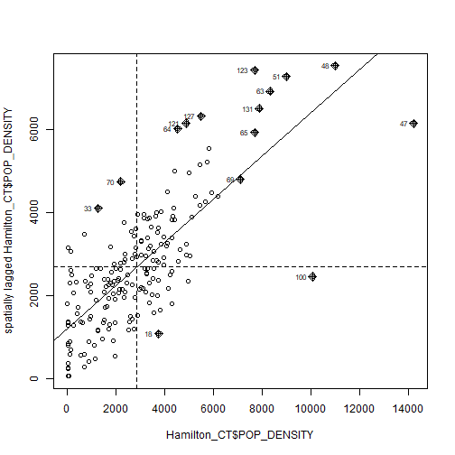

Area Data III
========================================================
author: Alexis Polidoro and Megan Coad 
date: 
autosize: true

Key Concepts
========================================================

- Spatial Moving Averages as a Smoother
- Spatial Moving Averages via Moran's scatterplot
- Hypothesis Testing for Spatial Autocorrelation 


Spatial Moving Averages as a Smoother
========================================================
- SMA can reduce variability in patterns 
- Randomize existing observations and reassign to random areas 
- Determined by calculating SMA of empirical observations, simulate for other landscapes


Spatial Moving Averages as a Smoother
========================================================
- Simulations do not mean similar results
- Bottom Right: Empirical observations are more clustered (orange) in the downtown
- All other observations: 8 null landscapes using data from empiricam observations; more orange throughout 

***



Spatial Moving Average Scatterplots 
========================================================
- First 8 plots: Simulated regression line is flat suggesting randomness
- Low possibility for non-random spatial pattern 
- Bottom Right: empirical observation is close to 45 degree line (Neighbors of an event are of similar or equal value)

***




Spatial Moving Average Scatterplots 
========================================================
- Empirical values of variable are dependent of their local means 
- Evidence for Spatial Autocorrelation: feature similarity with neighbours (variable is correlated to 45-degree line)

***



What is Moran's I?
========================================================
- Measure of spatial autocorrelation
- Looks at a set of features and associated attribute 
- Sum of products by its SMA divided by variance

***

$$
I = \frac{\sum_{i=1}^n{z_i\sum_{j=1}^n{w_{ij}^{st}z_j}}}{\sum_{i=1}^{n}{z_i^2}}
$$


Interpreting Moran's I: Moran Coefficient
========================================================
- Perfect Disperson (1), Randomness (0), Perfect Clustering (+1)
- Positive and relatively high value
- Suggest non-random spatial pattern of similar values 


```r
sum(df_mean_center_scatterplot$Density_z * df_mean_center_scatterplot$SMA_z) / sum(df_mean_center_scatterplot$Density_z^2)
```

```
[1] 0.5179736
```


Interpreting Moran's I: Moran's Scatterplot 
========================================================


***

- Non-random spatial pattern of similar values
- Follows 45-degree line
- Clustering 
- Supporting evidence from Moran's I coefficient


Hypothesis Testing for Spatial Autocorrelation
========================================================

- Determine if pattern is random 
- P-value is very small; reject null hypothesis with high level of confidence 


```

	Moran I test under randomisation

data:  Hamilton_CT$POP_DENSITY  
weights: Hamilton_CT.w    

Moran I statistic standard deviate = 12.722, p-value < 2.2e-16
alternative hypothesis: greater
sample estimates:
Moran I statistic       Expectation          Variance 
      0.517973553      -0.005347594       0.001691977 
```

Conclusions
========================================================
- We can simulate the empirical observation to test for randomness
- Moran's I is a coefficient determining spatial autocorrelation
- We can prove the Moran's I coefficient with a scatterplot 
- Hypothesis testing confirms randomness in the spatial pattern
