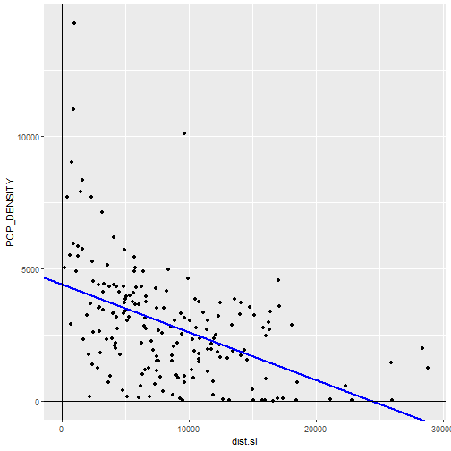
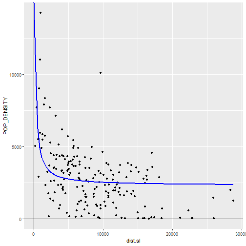
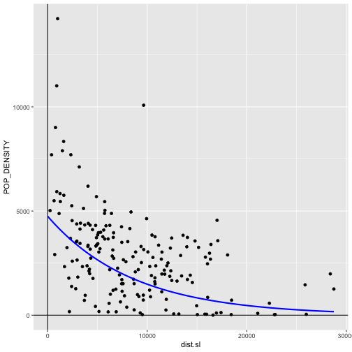
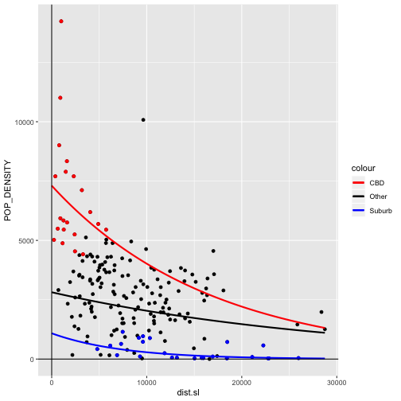

Area Data V
========================================================
author: Alexis Polidoro and Megan Coad
date: 
autosize: true

Key Concepts
========================================================

- Estimating Regression Models in R 
- Model Diagnostics for Autocorrelation
- Variable Transformations
- Autocorrelation Analysis to Improve Regression Models

Recall: Linear Regression Models
========================================================
- Hypothesizes relationships between an outcome (dependent variable), and one or more covariates (indepdendent variables)
- Capture statistical relationships (i.e Randomness)

Example: Population Density and CBD
========================================================
- Negative distance coefficent: population density declines with increasing distance

```

Call:
lm(formula = POP_DENSITY ~ dist.sl, data = Hamilton_CT)

Residuals:
    Min      1Q  Median      3Q     Max 
-3841.2 -1338.3  -177.1   950.9 10009.1 

Coefficients:
              Estimate Std. Error t value Pr(>|t|)    
(Intercept) 4405.15414  250.16355  17.609  < 2e-16 ***
dist.sl       -0.17989    0.02418  -7.439 3.63e-12 ***
---
Signif. codes:  0 '***' 0.001 '**' 0.01 '*' 0.05 '.' 0.1 ' ' 1

Residual standard error: 1892 on 186 degrees of freedom
Multiple R-squared:  0.2293,	Adjusted R-squared:  0.2251 
F-statistic: 55.33 on 1 and 186 DF,  p-value: 3.631e-12
```

Exploring the Fit of the Model
========================================================

- Noise around regression line
- Underestimating in high-density
- Overestimating in low-density


***



Recall: Residuals
========================================================

- Distance between point and regression line
- False/ Negative: Below regression line
- True/ Positive: Above regression line

*** 


Autocorrelation as a Model Diagnostic
========================================================
- Small p-value: reject null hypothesis


```

	Moran I test under randomisation

data:  Hamilton_CT$model1.e  
weights: Hamilton_CT.w    

Moran I statistic standard deviate = 9.7447, p-value < 2.2e-16
alternative hypothesis: greater
sample estimates:
Moran I statistic       Expectation          Variance 
      0.395382878      -0.005347594       0.001691092 
```

Autocorrelation Continued...
========================================================
- Autocorrelation violates the key assumption of linear regression (randomness)
- Could be due to functional form or mission covariates
- Explore these possibilities using variable transformations

Variable Transformations
========================================================
- Considers non-linear relationships of covariates
- Example: inverse-distance of population density and CBD

***



Variable Transformations Continued...
========================================================
- Logarithm of both sides of the equaiton will transform from exponential to linear


```r
Hamilton_CT <- mutate(Hamilton_CT, lnPOP_DEN = log(POP_DENSITY))
```


Variable Transformations Continued...
========================================================


***


Challenges of Using Spatial Autocorrelation
========================================================
- Fail to show large-scale changes between CBD and suburbs
- Could be due to regime change: underlying process operating differently in throughout Hamilton
- Need to use a more advanced model to explore this

Exploring Regime Changes
========================================================


***

- HH (CBD)
- LL (Suburbs)
- L/H, H/L (Other)

Regime Changes Continued...
========================================================
- Much more spatial variation 
- Further explored in Moran's I

***


Regime Changes Continued...
========================================================
- Based on the results, we fail to reject the null hypothesis, and can be confident that the residuals are likely random


```

	Moran I test under randomisation

data:  Hamilton_CT$model4.e  
weights: Hamilton_CT.w    

Moran I statistic standard deviate = 0.74498, p-value = 0.2281
alternative hypothesis: greater
sample estimates:
Moran I statistic       Expectation          Variance 
      0.024432414      -0.005347594       0.001597957 
```

Final Model
========================================================


Concluding Remarks
========================================================
- Linear regression models can be used for spatial analysis
- We can transform covariates to get better results (sometimes)
- A more advanced model gives representative results of randomness
