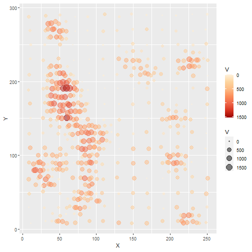
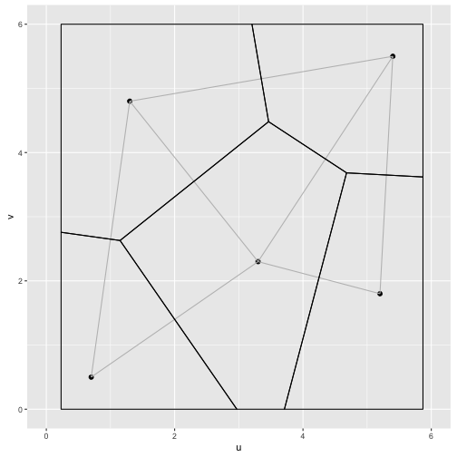
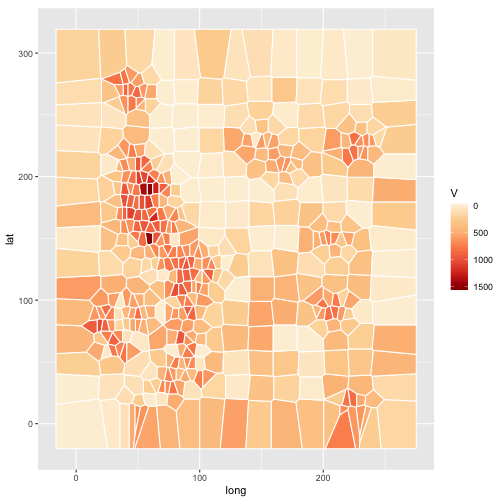
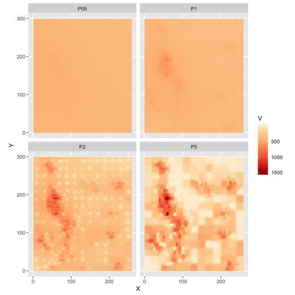
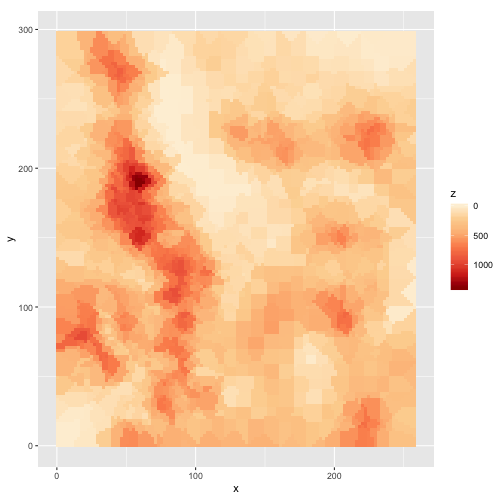
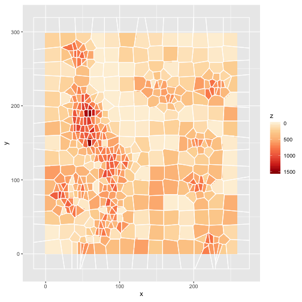

Spatially Continuous Data I
========================================================
author: Megan Coad and Alexis Polidoro 
date: 
autosize: true

Key Concepts
========================================================

- Exploring spatially continuous data
- Voronoi polygons
- Inverse distance weighting
- K-point means

Exploring Spatially Continuous Data
========================================================
- Think of points as an event 
- Data could be temperature, elevation
- Sampling method is not random, but the VALUE at the sampling site

***


Tile-Based Methods
========================================================
- Another method of gathering spatially continuous data
- Convert points into closely fitted arrangement of shapes
- Example: Voronoi polygons

***



Voronoi Polygons
========================================================
- Points closest to original point have the greatest influence
- Representative of the local average

***




Problem With Tile-based Approaches
========================================================
- Assume surface is flat --> highly unrealistic 
- Need spatial interpolation method that accounts for variation
- Solution: Inverse-distance weighting

Inverse-Distance Weighting
========================================================

- Assigned values to unknown points are calculated with a weighted average of the values available at the known points
- Gamma determines the value of the weight

***
$$
\hat{z}_p = \frac{\sum_{i=1}^n{w_{pi}z_i}}{\sum_{i=1}^n{w_{pi}}}
$$

$$
w_{pi} = \frac{1}{d_{pi}^\gamma}
$$


IDW Continued...
========================================================
- Smaller gamma flatten predictions, more global average
- Larger gamma shows more local averages

***



K-Point Means
========================================================
- Calculates spatial mean based on K-nearest neighbours of focal point
- Value of K determines the output


```r
kpoint.1 <- kpointmean(source_xy = source_xy, z = Walker_Lake$V, target_xy = target_xy, k = 1)
```


K-Point Means Continued...
========================================================


***



Concluding Remarks
========================================================
- There are multiple interpolation methods that use the nearest-neighbour approach 
- Tile-based methods are not ideal, but very accurate
- We can use other methods with a strong coefficient to represent the accuracy of voronoi polygons
