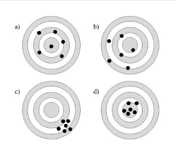

Spatially Continous Data II
========================================================
author: Megan Coad and Alexis Polidoro
date: 
autosize: true


Key Points
========================================================

- Understand how to calculate Local Standard Deviation
- Understand Trend surface Analysis
- Know how to explore spatial variability
- Precision vs Accuracy 


 Uncertainty in the predictions
========================================================


In a previous chapter we introduced three methods for obtaining point estimates; tile-based methods (Voronoi Polygons), inverse distance weighting, and $k$-point means 
- These methods do not provide an estimate for the random element, so it is not possible to assess uncertainty directly
- There are different ways in which some crude assessment of uncertainty could be attached to the point estimates
- a simple approach could be to use the sample variance to calculate intervals of confidence


Calculating Intervals of Confidence
========================================================
- A problem with using this approach is that the distribution of the variable is not normal, and the distribution of $\hat{\epsilon}_p$ is unknown
- the standard deviation is centered on the mean (meaning that it is a poor estimate for observations away from the mean)
- in any case the standard deviation of the sample is too large for local point estimates if there is spatial pattern (since we know that the local mean will vary systematically).


Local Standard Deviation Contd. 
========================================================
 plot the _local_ standard deviation:
 


***

- The local standard deviation indicates the typical deviation from the local mean
- The standard deviation locally is usually lower than the standard deviation of the sample, and it tends to be larger for the tails (locations where the values are rare)

- The local standard deviation is a crude estimator of the uncertainty because we do not know the underlying distribution


Trend surface analysis
========================================================
- a form of multivariate regression that uses the coordinates of the observations to fit a surface to the data


- Given a trend surface model, we can estimate the value of the variable $z$ at locations where it was not measured
- this is done by interpolating on a fine grid that can be used for vizualization or further analysis


Interpolating on a Fine Grid 
========================================================


-  This analysis provides an estimate of the underlying field, and a measure of uncertainty for our predictions, since our estimated values are bound, with 95% confidence, between the lower and upper surfaces.


Intrepretation of the Models
========================================================
- If the confidence inrerval is very wide the model is not very reliable 
- If they also include negative numbers in the lower bound it can indicate an unreliable model

- This can lead us to questions whether the point estimates are correct
- the trend surface does a mediocre job with the point estimates as well.

- A possible reason for this is that the model failed to capture the spatial variability. 

***


Exploring Spatial Variability 
========================================================
- plot the residuals of the model, after labeling them as "positive" or "negative":


- Visual inspection of the distribution of the residuals strongly suggests that they are not random
- We can check this by means of Moran's I coefficient


***


Checking Distribution with Moran's I 
========================================================


```

	Moran I test under randomisation

data:  WL.trend3$residuals  
weights: WL.listw    

Moran I statistic standard deviate = 17.199, p-value < 2.2e-16
alternative hypothesis: greater
sample estimates:
Moran I statistic       Expectation          Variance 
     0.4633803457     -0.0021321962      0.0007325452 
```

- Given the low $p$-value, we fail to reject the null hypothesis, and conclude, with a high level of confidence, that the residuals are not independent


Accuracy and precision
========================================================



***

Panel a) in the figure represents a set of accurate points

Panel b) is a set of inaccurate and imprecise points.

Panel c) is a set of precise but inaccurate points.

Finally, Panel d) is a set of accurate and precise points.
