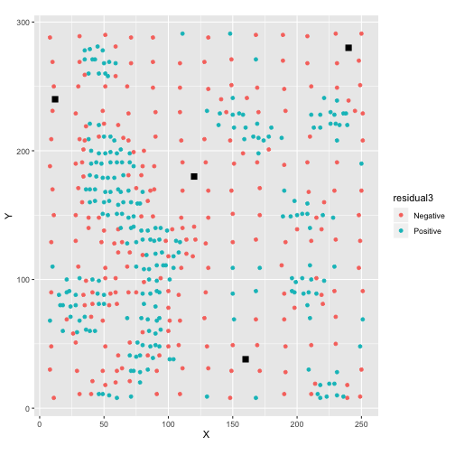
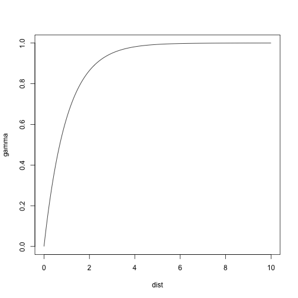

Spatially Continuous Data III
========================================================
author: Megan Coad and Alexis Polidoro 
date: 
autosize: true

Key Concepts
========================================================

- Measuring Spatial Dependence
- Semivarance, covariance
- Variographic Analysis

Recall: Residual Spatial Pattern
========================================================

- Trend surface analysis using Voronoi polygons, IDW, K-point means 
- Built-in mechanism for estimating unertainty of predictions
- ISSUE: We do not know the exact value at $p$ 

Interpolation and Randomness
========================================================

- Residuals are spatially dependent
- Allows us to make simple interpolations
- If residuals were random, it would be more difficult to interpolate

***



Measuring Spatial Dependence
========================================================
- Critical for investigating residual patterns (beyond positive + negative)
- We can measure spatial patterns using Moran's I
- Moran's I measures spatial dependence at a SINGLE SCALE - where the spatial weights are defined (i.e. adjacency)

Measuring Spatial Dependence: Correlograms
========================================================
- Sequence of Moran's I over different scales 
- Autocorrelation is stronger at a smaller scale
- Problem: does not account for distance, but number of observations

***


Autocovariance
========================================================
- Recall covariance: How 2 variables are related, either positively or inversely
- Autocovariance: Covariance of the process with itself at different locations
- Distances are spatially related if equal to a predefined spatial lag, $h$

***

$$
w_{ij}(h)=\bigg\{\begin{array}{l l}
1\text{ if } d_{ij} = h\\
0\text{ otherwise}\\
\end{array}
$$


The Spatial Lag, h
========================================================
- Changing the spatial lag $h$ allows us to calculate autocovariance at different scales 
- i.e.Covariogram & Semivariogram
- Pairs of are formed with observations at an appriximate lag $h$

Semivariograms
========================================================
- Numbers: pairs of observations used to calculate the semivariance at the corresponding lag

***


Covariograms
========================================================
- Estimate spatial dependence at any lag within the domain of the data
- Autocovariance is stronger at shorter spatial lags

***


Anatomy of a Semivariogram
========================================================
- Sill: point where there is no more or less similarity beween observations than would be implied by the variance of the sample
- Range: distance at which the sill is reached
- Nugget: Distance from origin to a discontinuity

***


Fitting a Model to a Semivariogram
========================================================
- A set of models can be passed as an argument to `fit.variogram`; output is the model that provides the best fit to the empirical semivariogram


```r
variogram_z.t <- fit.variogram(variogram_z, model = vgm("Exp", "Sph", "Gau"))
```

Exponential Semivariogram
========================================================



Spherical Semivariogram
========================================================


Gaussian Semivariogram
========================================================


Concluding Remarks
========================================================
- Single-scale attributes of Moran's I are further explored through autocovariance
- We use variograms to illustrate autocovariance of spatially continuous data
