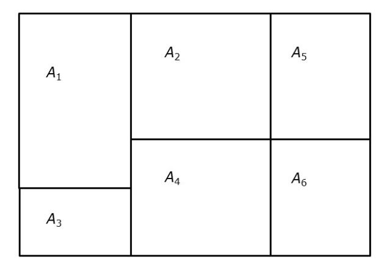

<!--- Reflection: No questions were aksed after the presentation. Eveyrone seemed to understand the concept of adjacency and the various ways that we can assess if two zones are adjacent to one another or not. It was expanded on that it is useful to know if zones of the same values are adjacent to one another or not to further assess underlying patterns. Compared this to the previous lecture slides where there was a red zone and a blue zone. You would want to know if the red and blue zones are adjacent to one another or not to know more about underlyng processes. 
--->


Area Data II
========================================================
author: Megan Coad and Alexis Polidoro
date: 
autosize: true

Key Points
========================================================

- Understand what a spatial weights matrix is and how to make one in R
- Understand what a Spatial Moving Average is
- expand more on different Distance-based Nearest Neighbors 


Proximity in Area Data 
========================================================


- an area contains an infinite number of points, and measuring distance between two areas leads to many possible results, depending on which pairs of points within two zones are used to measure the distance
- The criterion to define proximity is called _adjacency_. 
- Adjacency means that two zones share a common edge, This is  called the _rook_ criterion
- When this criterion is expanded to allow contact at a single point between zones the adjacency criterion is called _queen_

***



Spatial Weights Matrix 
========================================================
- A spatial weights matrix is an arrangement of values for all pairs of zones in a system.
- The weights are organized by rows, in such a way that each zone has a corresponding row of weights.
- The values of the weights depend on the adjacency criterion adopted. 
- The simplest coding scheme is when we assign a value of 1 to pairs of zones that are adjacent, and a value of 0 to pairs of zones that are not


Spatial Weights Matrix Contd. 
========================================================

$$
\textbf{W}=\left (\begin{array}{c c c c c c}
0 & 1 & 1 & 1 & 0 & 0\\
1 & 0 & 0 & 1 & 1 & 1\\
1 & 0 & 0 & 1 & 0 & 0\\
1 & 1 & 1 & 0 & 1 & 1\\
0 & 1 & 0 & 1 & 0 & 1\\
0 & 1 & 0 & 1 & 1 & 0\\
\end{array} \right).
$$
***

The spatial weights matrix has the following properties:

1. The main diagonal elements are all zeros (no area is its own neighbor).
2. Each zone has a row of weights in the matrix: row number one corresponds to $A_1$, row number two corresponds to $A_2$, and so on.
3. Likewise, each zone has a _column_ of weights.
4. The sum of all values in a row gives the _total_ number of neighbors for an area.


Row Standardized Weights 
========================================================
$$
\textbf{W}^{st}=\left (\begin{array}{c c c c c c}
0 & 1/3 & 1/3 & 1/3 & 0 & 0\\
1/4 & 0 & 0 & 1/4 & 1/4 & 1/4\\
1/2 & 0 & 0 & 1/2 & 0 & 0\\
1/5 & 1/5 & 1/5 & 0 & 1/5 & 1/5\\
0 & 1/3 & 0 & 1/3 & 0 & 1/3\\
0 & 1/3 & 0 & 1/3 & 1/3 & 0\\
\end{array} \right).
$$

***

The row-standardized spatial weights matrix has the following properties:

1. Each weight now represents the proportion of a neighbor out of the total of neighbors.

2. The sum of all weights over a row equals 1, or 100% of all neighbors for that zone.

Creating Spatial Weights Matrices in R
========================================================

  The first step to create a spatial weights matrix is to find the neighbors for each area. The input argument is a `SpatialPolygonDataFrame`. This means that our `sf` object needs to be converted into a `SpatialPolygonDataFrame. The value of the function is an object of class 'nb'. 

```r
Hamilton_CT.sp <- as(Hamilton_CT, "Spatial")
```


```r
Hamilton_CT.nb <- poly2nb(pl = Hamilton_CT.sp, queen = TRUE)
```

The 'nb' object can be converted into a list of entries in a spatial weights matrix W by means of the function `nb2list2`


Creating Spatial Weights Matrices in R Contd. 
========================================================
We can visualize the neighbors (adjacent) areas:


Spatial Moving Averages
========================================================

- The spatial weights matrix  is useful to calculate the _spatial moving average_.
- The spatial moving average is a variation on the mean statistic.
- A spatial moving average is calculated in the same way as a mean, but for each area, and based only on the values of proximate areas


EXAMPLE: The spatial moving average of $A_1$ for a variable $x$ would then be calculated as:

$$
\overline{x_1}=\frac{x_2 + x_3 + x_4}{3}
$$


Spatial Moving Averages Contd. 
========================================================

- The spatial moving average can also be calculated using the spatial weights matrix as


$$
\overline{x_1}=\frac{w_{11}x_1 + w_{12}x_2 + w_{13}x_3 + w_{14}x_4 + w_{15}x_5 + w_{12}x_6}{3}
$$


- Substituting the spatial weights:


$$
\overline{x_1}=\frac{0x_1 + 1x_2 + 1x_3 + 1x_4 + 0x_5 + 0x_6}{3} = \frac{x_2 + x_3 + x_4}{3}
$$

- the row-standardized weights have already been divided by the number of neighbors so we can use them to express the spatial moving average as well

$$
\overline{x_i}=0x_1 + \frac{1}{3}x_2 + \frac{1}{3}x_3 + \frac{1}{3}x_4 + 0x_5 + 0x_6
$$


Spatial Moving Averages Contd. 
========================================================

- Spatial moving averages can be calculated in a straighforward way by means of the function `lag.listw`. This function uses a spatial weights matrix and automatically selects the row-standardized weights.

EXAMPLE: calculate the spatial moving average of population density:

```r
POP_DENSITY.sma <- lag.listw(x = Hamilton_CT.w, Hamilton_CT$POP_DENSITY)
```


Other Criteria for Coding Proximity
========================================================

- the distance between areas is sometimes calculated by using the _centroids_ of the areas as their representative points.
- A centroid is  the mean of the coordinates of the edges of an area, and represent the "centre of gravity" of the area.

- The inter-centroid distance allows us to define additional criteria for proximity, including neighbors within a certain distance threshold, and k-nearest neighbors.


Distance-based Nearest Neighbors 
========================================================
1.obtain the coordinates of the centroids of the areas. These are the first two columns of the output of `st_coordinates` function:

```r
CT_centroids <- coordinates(Hamilton_CT.sp)
```

A nearest neighbors object `nb` is produced as follows (selecting a distance threshold between 0 and 5 km):

```r
Hamilton_CT.dnb <- dnearneigh(CT_centroids, d1 = 0, d2 = 5000)
```

We can visualize the neighbors (adjacent) areas using distance-based nearest neighbors analysis:

***


Distance Based Nearest Neighbors Contd. 
========================================================
- A potential disadvantage of using a distance-based criterion is that for zoning systems with areas of vastly different sizes, small areas will end up having many neighbors, whereas large areas will have few or none.

- The criterion of $k$-nearest neighbors allows for some adaptation to the size of the areas. Under this criterion, all areas have the exact same number of neighbors, but the geographical extent of the neighborhood may change.


Distance Based Nearest Neighbors Contd.
=======================================================
 $k$-nearest neighbors can be obtained as visualized aswell


Concluding Remarks: 
=========================================================
- spatial weights matrix helps you visualize neighbours based on defined adjacency 
- you use the spatial weights matrix to calculate the spatial moving average 
- you can also used distance based neighbors to visualize nearest neighbors using various distances 
